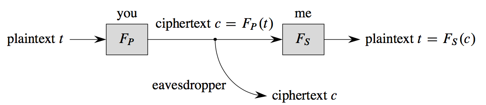

**Notes for Algorithms Unlocked**-02

# Chapter 8 Foundations of Cryptography

The processes of encryption and decryption form the foundation of the field of cryptography.

In this chapter, we'll examine some of the basic ideas underlying encryption and decryption. 

- Modern cryptography goes far, far beyond what I'm presenting here.
- Don't try to develop a secure system based solely on the material in this chapter; you would need to understand modern cryptography in much greater detail to create a system that is secure in both theory and practice.

In cryptography, we call the original information the **plaintext (明文)** and the encrypted version the **ciphertext (密文)**. 

The information needed to convert is known as the **cryptographic key (密钥)**.

### 8.1 Simple substitution ciphers

- Shift cipher(移位加密): a simple encryption.
- Simple substitution ciphers: You can make the cipher a little more secure by converting each character to some other, unique, character, but not necessarily the one that appears a fixed number of places later in the alphabet.
  - That is, you create a permutation of the characters and use that as your key. It’s still a simple substitution cipher, but it’s better than a shift cipher.
  - If you have n characters in your character set, then an eavesdropper who intercepts a message would have to discern which of the $n!$ (n-factorial) permutations you had used. The factorial function grows very quickly in n; in fact, it grows faster than an exponential function.
  - *to decrypt this, you can use letter frequencies and letter combinations to narrow down the choices.*

### 8.2 Symmetric-key cryptography

When the sender and receiver use the same key, they are practicing **symmetric-key cryptography (对称密钥加密)**. They must somehow agree in advance upon just what key they're using.

#### 8.2.1 One-time pads

Assuming for now that you’re fine with using symmetric-key cryptography, but that a simple substitution cipher is not sufficiently secure, another option is the **one-time pad (一次性密码本)**. 

*One-time pads work on bits.*

- Digital computers store information in sequences of bits. Some bit sequences represent numbers, some represent characters (using either the standard ASCII or Unicode character sets), and some even represent instructions that the computer executes.

*One-time pads apply the **exclusive-or**, or **XOR**, operations to bits.*

- *We use $\oplus$ to denote this operation*:

  - $0\oplus 0 = 0$
  - $0\oplus1=1$
  - $1\oplus0=1$
  - $1\oplus1=0$

- The simplest way to think of the XOR operation is that if $x$ is a bit, then:

  - *$x\oplus0=x$*
  - *$x\oplus1=the\ opposite\ of\ x$*

- Furthermore, if $x$ and $y$ are bits, then:

  - *$(x\oplus y)\oplus y=x$*

  **XORing $x$ with the same value twice gives $x$.**

If the plaintext required $b$ bits—perhaps it comprises ASCII or Unicode characters that total $b$ bits — then I could generate a random sequence of b bits as the key, let you know the b bits of the key, and then XOR, bit by bit, the plaintext with the key to form the ciphertext. 

Once you received the b-bit ciphertext, you could XOR it, bit by bit, with the key to recover the b-bit plaintext. This system is called a **one-time pad**, and the key is called the pad.

*As long as the bits of the key are randomly chosen, it's well nigh impossible for an eavesdropper to decrypt the ciphertext by guessing the key.* Even if the eavesdropper knows something about the plaintext.	

One-time pads give good security, but the keys require as many bits as the plaintext, these bits should be randomly chosen, and the keys need to be shared between the parties in advance.

As the name implies, you should use a one-time pad just one time. *If you use the same key $k$ for plaintexts $t_1$ and $t_2$, then $(t_1\oplus k)\oplus(t_2\oplus k)=t_1\oplus t_2$, which can reveal where the two plaintexts have the same bits.*

#### 8.2.2 Block ciphers and chaining

When the plaintext is long, the pad in a one-time pad has to be equally long, which can be rather unwieldy.

Instead, some symmetric-key systems combine two additional techniques: they use a shorter key, and they chop up the plaintext into several blocks, applying the key to each block in turn. That is, they consider the plaintext to be $l$ blocks
$t_1,t_2,t_3,…,t_l$, and they encrypt these plaintext blocks into l blocks $c_1, c_2, c_3, …, c_l$ of ciphertext. Such a system is known as a **block cipher (分组加密)**.

In practice, block ciphers encrypt using a system quite a bit more complicated than the simple XORing of the one-time pad. 

- One frequently used symmetric-key cryptosystem, **AES** (the Advanced Encryption Standard), incorporates a block cipher. It uses elaborate methods to slice and dice a plaintext block to produce ciphertext. AES uses a key size of 128, 192, or 256 bits and a block size of 128 bits.

There’s still a problem with block ciphers, however. If the same block appears twice in the plaintext, then the same encrypted block will appear twice in the ciphertext. One way to solve this problem uses the technique of **cipher block chaining (密码分组链接)**：

- Suppose that you want to send me an encrypted message. You chop up the plaintext $t$ into $l$ blocks $t_1,t_2,t_3,…,t_l$, and you create the l blocks $c_1, c_2, c_3, …, c_l$ of ciphertext as follows. 
  - Let’s say that you’ll encrypt a block by applying some function $E$ to it, and I’ll decrypt a block of ciphertext by applying some function $D$. 
  - You create the first block of ciphertext, $c_1$, as you’d expect:
    $c_1=E(t_1)$. 
  - But before encrypting the second block, you $XOR$ it, bit by bit, with $c_1$, so that $c_2=E(c_1\oplus t_2)$. 
  - For the third block, you first $XOR$ it with $c_2$: $c_3=E(c_2\oplus t_3)$. And so on.
  - so that in general, you compute the $i$th block of ciphertext based on the $(i-1)$th block of ciphertext and the $i$th block of plaintext: $c_i=E(c_{i-1}\oplus t_i)$. 
  - This formula even works for computing $c_1$ from $t_1$ if you start with $c_0$ being all $0$s. 
- To decrypt, I first compute $t_1=D(c_1)$. 
  - From $c_1$ and $c_2$, I can compute $t_2$ by first computing $D(c_2)$, which equals $c_1 \oplus t_2$, and then XORing the result with $c_1$. 
  - In general, I decrypt $c_i$ to determine $t_i$ by computing $t_i=D(c_i)\oplus c_{i-1}$; as with encryption, this scheme works even for computing $t_1$ if I start with $c_0$ being all 0s.

We are not quite out of the woods. *Even with cipher block chaining, if you send me the same message twice, you'll send the same sequence of ciphertext blocks each time.* An eavesdropper would know that you're sending me the same message twice, which could be valuable information for the eavesdropper to have.

- One solution is not start with $c_0$ being all 0s. Instead, you randomly generate $c_0$, we call this randomly generated $c_0$ an **initialization vector**.

#### 8.2.3 Agreeing on common information

In order for symmetric-key cryptography to work, both the sender and receiver need to agree on the key. 

In addition, if they’re using a block cipher with cipher block chaining, they might also need to agree on the initialization vector. 

As you can imagine, it’s rarely practical to agree on these values in advance. 

So how do the sender and receiver agree on the key and initialization vector? *We will see later in this chapter how a hybrid cryptosystem can transmit them securely*.

### 8.3 Public-key cryptography

In **public-key cryptography (公钥加密)**, each party has two keys: a **public key**
and a **secret key**. 

The public key('s function $F_P$) and secret key('s function $F_S$) have a special relationship:

- *$t=F_S(F_P(t))$*

Some other applications of public-key cryptography require that *$t=F_P(F_S(t))$*.

*Anyone should be able to compute my public-key function $F_P$ efficiently, but only I should be able to compute my secret-key function $F_S$ in any reasonable amount of time.* 

*The time required to successfully guess my $F_S$ without knowing my secret key should be prohibitively large for anyone else.*

The public-key function $F_P$ is efficiently computable, but only the holder of the secret key can reasonably compute the secret-key function $F_S$ .			

Here's how you can send me a message using public-key cryptography:

A problem arises, however: 

- The plaintext $t$ could take on an arbitrary number of possible values — in fact, it could be arbitrarily long — and the number of ciphertext values that $F_P$ could convert $t$ to has to be at least as many as the number of values that $t$ could take on. 
- How can we construct the functions $F_P$ and $F_S$ under the additional constraints that $F_P$ has to be easy to compute for everyone and $F_S$ has to be easy only for me? 
- *It’s hard, but it’s doable if we can limit the number of possible plaintext — that is, we use a block cipher.*

### 8.4 *The RSA cryptosystem???*

Public-key cryptography is a lovely concept, but it relies on being able to find functions $F_P$ and $F_S$ that work correctly together, $F_P$ is easy for anyone to compute, and $F_S$ is easy for only the holder of the secret key to compute. We call a scheme that fulfills these criteria a **public-key cryptosystem (公钥加密系统)**, and the **RSA cryptosystem**, or just **RSA**, is one such scheme.

RSA depends on several facets of number theory. 

Many of which relate to **modular arithmetic (模运算)**. 

- In modular arithmetic, we pick a positive integer, let’s say $n$, and whenever we get to $n$, we immediately wrap back around to 0. It’s like regular arithmetic with integers, but we always divide by $n$ and take the remainder.

- For example, if we’re working modulo 5, then the only possible values are 0,1,2,3,4.

- *What's particularly nice about modular arithmic is that we can take mod operations in the middle of expressions and not change the result*:

  - $(a+b)\mod n = ((a\mod n)+(b\mod n))\mod n$
  - $ab\mod n=((a\mod n)(b\mod n))\mod n$
  - $a^b\mod n=(a\mod n)^b\mod n$

  Furthermore, for any integer $x$, we have that $xn\mod n$ is 0.

  ​

In addition, in order for RSA to fulfill the criteria for a public-key crypto system, *two number-theoretic properties related to prime numbers* must hold:

1. *if you have a number that is the product of two larger secret prime numbers, then nobody else can determine these factors in any reasonable amount of time.*
2. *Even thought factoring a large prime is hard, it's not hard to determine whether a large number is prime.*
   - One way is the **AKS primality test**, the first algorithm to determine whether an $n-bit$ number is prime in time $O(n^c)$ for some constant $c$. 
     - Although the AKS primality test is considered theoretically efficient, it is not yet practical for large numbers.
   - Instead, we can use the **Miller-Rabin primality test**.
     - *The downside of the Miller-Rabin test is that it can make errors, declaring a number that is actually composite to be prime.* (If it declares a number to be composite, however, then the number is definitely composite.)
     - *The good news is that the error rate is $1$ in $2^s$, where we can pick any positive value of $s$ that we want.* 
     - Because the time to perform the Miller-Rabin test increases just linearly with the parameter $s$, and so increasing $s$ by 10, from 50 to 60, increases the running time by only 20%, but decreases the error rate by a factor of $2^{10}$, which equals 1024.

*Here's how I would set myself up to use the RSA cryptosystem.*

1. Pick at random two very large prime numbers, $p$ and $q$, that are notequal to each other. How large is very large? At least 1024 bits each,or at least 309 decimal digits. Even larger is better.

2. Compute *$n = pq$*. That’s a number with at least 2048 bits, or at least 618 decimal digits.

3. Compute *$r=(p-1)(q-1)$*, which is almost as large as $n$.

4. Select a small odd integer *$e$* that is **relatively prime(互质)** to $r$: the only common divisor of $e$ and $r$ should be 1. Any such small integer is fine here.

5. Compute *$d$* as the **multiplicative inverse** of $e$, modulo r. That is, $ed\mod r$ should equal 1.

6. Declare my RSA public key to be the pair *$P=(e,n)$*.

7. Keep the pair *$S=(d,n)$* as my RSA secret key, revealed to nobody.

8. Define the functions $F_P$ and $F_S$ by

   *$F_P(x)=x^e\mod n$*

   *$F_S(x)=x^d\mod n$*

   These functions can operate on either a block of plaintext or a block of cipher text, whose bits we interpret as representing large integers.

Let's take an example, but using small numbers so that we can understand what's going on:

1. Pick the prime numbers $p=17$ and $q=29$.

2. Compute $n=pq=493$.

3. Compute $r=(p-1)(q-1)=448$.

4. Select $e=5$, which is relatively prime to 448.

5. Compute $d=269$.

   To check: $ed=5\cdot 269=1345$, and so $ed \mod r=1345\mod 448=(3\cdot 448+1)\mod448=1$.

6. Declare my RSA public key to be $P=(5,493)$.

7. Keep $S=(269,493)$ as my RSA secret key.

8. As an example, let's compute $F_P(327)$:

   $F_P(327)=327^5\mod 493=259$

   If we compute $F_S(259)=259^{269}\mod 493$, we should get 327 back. (Because we're working with modular arithmetic, we don't need to compute the actual value of $259^{269}$)

*Here are the details I have to address in order to set up and use RSA:* (*这一部分是难点，原书p150-p155，目前不太理解???*)

- How do I work with numbers with hundreds of digits?

- Although testing whether a number is prime isn't an obstacle, how do I know that I can find large prime numbers in a reasonable amount of time?

- *How do I find $e$ so that $e$ and $r$ are relatively prime? ???*

- *How do I compute $d$ so that it's the multiplicative inverse of $e$, modulo $r$?*

- *If $d$ is large, how do I compute $x^d\mod n$ in a reasonable amount of time?*

- *How do I know that the functions $F_P$ and $F_S$ are inverses of each other?*

  …… 

### 8.5 Hybrid cryptosystems 

Although we can perform arithmetic with large numbers, in practice we do pay a price in speed. 

- Encrypting and decrypting a long message, containing hundreds or thousands of blocks of plaintext, could cause a noticeable delay.
- RSA is often used in a **hybrid system (混合加密)**, part public-key and part symmetric-key.

*Here is how you could send me an encrypted message in a hybrid system:* 

- We agree on which public-key system and symmetric-key system we’re using; let’s say RSA and AES. 
- You select a key $k$ for AES and encrypt it with my RSA public key, producing $F_P(k)$. 
- Using the key $k$, you then encrypt the sequence of plaintext blocks with AES to produce a sequence of ciphertext blocks. 
- You send me $F_P(k)$ and the sequence of ciphertext blocks. 
- I decrypt $F_P(k)$ by computing $F_S(F_P(k))$, which gives me the AES key $k$, and then I use $k$ to decrypt the ciphertext blocks with AES, thereby recovering the plaintext blocks.
- If we're using cipher block chaining and we need an initialization vector, then you can encrypt it either with RSA or AES.

### 8.6 Computing random numbers

Random bits can come only from random processes. How can a program running on a computer be a random process? 

- In many cases, it cannot, because a computer program that is built from well defined, deterministic instructions will always produce the same result given the same data to start with. 
- *To support cryptographic software, some modern processors provide an instruction that generates random bits based on a random process*, such as *thermal noise within circuits*. 
- *Designers of these processors face a threefold challenge:* 
  1. generate the bits at a fast enough rate for applications that demand random numbers
  2. ensure that the bits generated meet basic statistical tests for randomness
  3. and consume a reasonable amount of power while generating and testing the random bits.

​		

Cryptographic programs usually obtain bits from a **pseudorandom number generator (伪随机数产生器)**, or **PRNG**.

- A PRNG is a deterministic program thatproduces a sequence of values, based on an initial value, or seed, and a deterministic rule embodied in the program that says how to generate the next value in the sequence from the current value. 
- If you start a PRNG with the same seed each time, you’ll get out the same sequence of values each time. 
- This repeatable behavior is good for debugging, but bad for cryptography. 
- Recent standards for random number generators for cryptosystems require specific implementations of PRNGs.

If you’re using a PRNG to generate bits that look random, you want to start with a different seed each time, and that seed should be random.

- In particular, the seed should be based on bits that are unbiased (notfavoring either 0 or 1), independent (no matter what you know about the previous bits generated, anyone has only a 50% chance of correctly guessing the next bit), and unpredictable to an adversary who is trying to break your cryptosystem. 
- *If your processor has an instruction that generates random bits, that’s a good way to create the PRNG’s seed*.

# Chapter 9 Data Compression

# 

