**Notes for Algorithms Unlocked**-02

# Chapter 8 Foundations of Cryptography

The processes of encryption and decryption form the foundation of the field of cryptography.

In this chapter, we'll examine some of the basic ideas underlying encryption and decryption. 

- Modern cryptography goes far, far beyond what I'm presenting here.
- Don't try to develop a secure system based solely on the material in this chapter; you would need to understand modern cryptography in much greater detail to create a system that is secure in both theory and practice.

In cryptography, we call the original information the **plaintext (明文)** and the encrypted version the **ciphertext (密文)**. 

The information needed to convert is known as the **cryptographic key (密钥)**.

### 8.1 Simple substitution ciphers

- Shift cipher(移位加密): a simple encryption.
- Simple substitution ciphers: You can make the cipher a little more secure by converting each character to some other, unique, character, but not necessarily the one that appears a fixed number of places later in the alphabet.
  - That is, you create a permutation of the characters and use that as your key. It’s still a simple substitution cipher, but it’s better than a shift cipher.
  - If you have n characters in your character set, then an eavesdropper who intercepts a message would have to discern which of the $n!$ (n-factorial) permutations you had used. The factorial function grows very quickly in n; in fact, it grows faster than an exponential function.
  - *to decrypt this, you can use letter frequencies and letter combinations to narrow down the choices.*

### 8.2 Symmetric-key cryptography

When the sender and receiver use the same key, they are practicing **symmetric-key cryptography (对称密钥加密)**. They must somehow agree in advance upon just what key they're using.

#### 8.2.1 One-time pads

Assuming for now that you’re fine with using symmetric-key cryptography, but that a simple substitution cipher is not sufficiently secure, another option is the **one-time pad (一次性密码本)**. 

*One-time pads work on bits.*

- Digital computers store information in sequences of bits. Some bit sequences represent numbers, some represent characters (using either the standard ASCII or Unicode character sets), and some even represent instructions that the computer executes.

*One-time pads apply the **exclusive-or**, or **XOR**, operations to bits.*

- *We use $\oplus$ to denote this operation*:

  - $0\oplus 0 = 0$
  - $0\oplus1=1$
  - $1\oplus0=1$
  - $1\oplus1=0$

- The simplest way to think of the XOR operation is that if $x$ is a bit, then:

  - *$x\oplus0=x$*
  - *$x\oplus1=the\ opposite\ of\ x$*

- Furthermore, if $x$ and $y$ are bits, then:

  - *$(x\oplus y)\oplus y=x$*

  **XORing $x$ with the same value twice gives $x$.**

If the plaintext required $b$ bits—perhaps it comprises ASCII or Unicode characters that total $b$ bits — then I could generate a random sequence of b bits as the key, let you know the b bits of the key, and then XOR, bit by bit, the plaintext with the key to form the ciphertext. 

Once you received the b-bit ciphertext, you could XOR it, bit by bit, with the key to recover the b-bit plaintext. This system is called a **one-time pad**, and the key is called the pad.

*As long as the bits of the key are randomly chosen, it's well nigh impossible for an eavesdropper to decrypt the ciphertext by guessing the key.* Even if the eavesdropper knows something about the plaintext.	

One-time pads give good security, but the keys require as many bits as the plaintext, these bits should be randomly chosen, and the keys need to be shared between the parties in advance.

As the name implies, you should use a one-time pad just one time. *If you use the same key $k$ for plaintexts $t_1$ and $t_2$, then $(t_1\oplus k)\oplus(t_2\oplus k)=t_1\oplus t_2$, which can reveal where the two plaintexts have the same bits.*

#### 8.2.2 Block ciphers and chaining

When the plaintext is long, the pad in a one-time pad has to be equally long, which can be rather unwieldy.

Instead, some symmetric-key systems combine two additional techniques: they use a shorter key, and they chop up the plaintext into several blocks, applying the key to each block in turn. That is, they consider the plaintext to be $l$ blocks
$t_1,t_2,t_3,…,t_l$, and they encrypt these plaintext blocks into l blocks $c_1, c_2, c_3, …, c_l$ of ciphertext. Such a system is known as a **block cipher (分组加密)**.

In practice, block ciphers encrypt using a system quite a bit more complicated than the simple XORing of the one-time pad. 

- One frequently used symmetric-key cryptosystem, **AES** (the Advanced Encryption Standard), incorporates a block cipher. It uses elaborate methods to slice and dice a plaintext block to produce ciphertext. AES uses a key size of 128, 192, or 256 bits and a block size of 128 bits.

There’s still a problem with block ciphers, however. If the same block appears twice in the plaintext, then the same encrypted block will appear twice in the ciphertext. One way to solve this problem uses the technique of **cipher block chaining (密码分组链接)**：

- Suppose that you want to send me an encrypted message. You chop up the plaintext $t$ into $l$ blocks $t_1,t_2,t_3,…,t_l$, and you create the l blocks $c_1, c_2, c_3, …, c_l$ of ciphertext as follows. 
  - Let’s say that you’ll encrypt a block by applying some function $E$ to it, and I’ll decrypt a block of ciphertext by applying some function $D$. 
  - You create the first block of ciphertext, $c_1$, as you’d expect:
    $c_1=E(t_1)$. 
  - But before encrypting the second block, you $XOR$ it, bit by bit, with $c_1$, so that $c_2=E(c_1\oplus t_2)$. 
  - For the third block, you first $XOR$ it with $c_2$: $c_3=E(c_2\oplus t_3)$. And so on.
  - so that in general, you compute the $i$th block of ciphertext based on the $(i-1)$th block of ciphertext and the $i$th block of plaintext: $c_i=E(c_{i-1}\oplus t_i)$. 
  - This formula even works for computing $c_1$ from $t_1$ if you start with $c_0$ being all $0$s. 
- To decrypt, I first compute $t_1=D(c_1)$. 
  - From $c_1$ and $c_2$, I can compute $t_2$ by first computing $D(c_2)$, which equals $c_1 \oplus t_2$, and then XORing the result with $c_1$. 
  - In general, I decrypt $c_i$ to determine $t_i$ by computing $t_i=D(c_i)\oplus c_{i-1}$; as with encryption, this scheme works even for computing $t_1$ if I start with $c_0$ being all 0s.

We are not quite out of the woods. *Even with cipher block chaining, if you send me the same message twice, you'll send the same sequence of ciphertext blocks each time.* An eavesdropper would know that you're sending me the same message twice, which could be valuable information for the eavesdropper to have.

- One solution is not start with $c_0$ being all 0s. Instead, you randomly generate $c_0$, we call this randomly generated $c_0$ an **initialization vector**.

#### 8.2.3 Agreeing on common information

In order for symmetric-key cryptography to work, both the sender and receiver need to agree on the key. 

In addition, if they’re using a block cipher with cipher block chaining, they might also need to agree on the initialization vector. 

As you can imagine, it’s rarely practical to agree on these values in advance. 

So how do the sender and receiver agree on the key and initialization vector? *We will see later in this chapter how a hybrid cryptosystem can transmit them securely*.

### 8.3 Public-key cryptography

In **public-key cryptography (公钥加密)**, each party has two keys: a **public key**
and a **secret key**. 

The public key('s function $F_P$) and secret key('s function $F_S$) have a special relationship:

- *$t=F_S(F_P(t))$*

Some other applications of public-key cryptography require that *$t=F_P(F_S(t))$*.

*Anyone should be able to compute my public-key function $F_P$ efficiently, but only I should be able to compute my secret-key function $F_S$ in any reasonable amount of time.* 

*The time required to successfully guess my $F_S$ without knowing my secret key should be prohibitively large for anyone else.*

The public-key function $F_P$ is efficiently computable, but only the holder of the secret key can reasonably compute the secret-key function $F_S$ .			

Here's how you can send me a message using public-key cryptography:

A problem arises, however: 

- The plaintext $t$ could take on an arbitrary number of possible values — in fact, it could be arbitrarily long — and the number of ciphertext values that $F_P$ could convert $t$ to has to be at least as many as the number of values that $t$ could take on. 
- How can we construct the functions $F_P$ and $F_S$ under the additional constraints that $F_P$ has to be easy to compute for everyone and $F_S$ has to be easy only for me? 
- *It’s hard, but it’s doable if we can limit the number of possible plaintext — that is, we use a block cipher.*

### 8.4 *The RSA cryptosystem???*

Public-key cryptography is a lovely concept, but it relies on being able to find functions $F_P$ and $F_S$ that work correctly together, $F_P$ is easy for anyone to compute, and $F_S$ is easy for only the holder of the secret key to compute. We call a scheme that fulfills these criteria a **public-key cryptosystem (公钥加密系统)**, and the **RSA cryptosystem**, or just **RSA**, is one such scheme.

RSA depends on several facets of number theory. 

Many of which relate to **modular arithmetic (模运算)**. 

- In modular arithmetic, we pick a positive integer, let’s say $n$, and whenever we get to $n$, we immediately wrap back around to 0. It’s like regular arithmetic with integers, but we always divide by $n$ and take the remainder.

- For example, if we’re working modulo 5, then the only possible values are 0,1,2,3,4.

- *What's particularly nice about modular arithmic is that we can take mod operations in the middle of expressions and not change the result*:

  - $(a+b)\mod n = ((a\mod n)+(b\mod n))\mod n$
  - $ab\mod n=((a\mod n)(b\mod n))\mod n$
  - $a^b\mod n=(a\mod n)^b\mod n$

  Furthermore, for any integer $x$, we have that $xn\mod n$ is 0.

  ​

In addition, in order for RSA to fulfill the criteria for a public-key crypto system, *two number-theoretic properties related to prime numbers* must hold:

1. *if you have a number that is the product of two larger secret prime numbers, then nobody else can determine these factors in any reasonable amount of time.*
2. *Even thought factoring a large prime is hard, it's not hard to determine whether a large number is prime.*
   - One way is the **AKS primality test**, the first algorithm to determine whether an $n-bit$ number is prime in time $O(n^c)$ for some constant $c$. 
     - Although the AKS primality test is considered theoretically efficient, it is not yet practical for large numbers.
   - Instead, we can use the **Miller-Rabin primality test**.
     - *The downside of the Miller-Rabin test is that it can make errors, declaring a number that is actually composite to be prime.* (If it declares a number to be composite, however, then the number is definitely composite.)
     - *The good news is that the error rate is $1$ in $2^s$, where we can pick any positive value of $s$ that we want.* 
     - Because the time to perform the Miller-Rabin test increases just linearly with the parameter $s$, and so increasing $s$ by 10, from 50 to 60, increases the running time by only 20%, but decreases the error rate by a factor of $2^{10}$, which equals 1024.

*Here's how I would set myself up to **use the RSA cryptosystem**.*

1. Pick at random two very large prime numbers, $p$ and $q$, that are notequal to each other. How large is very large? At least 1024 bits each,or at least 309 decimal digits. Even larger is better.

2. Compute *$n = pq$*. That’s a number with at least 2048 bits, or at least 618 decimal digits.

3. Compute *$r=(p-1)(q-1)$*, which is almost as large as $n$.

4. Select a small odd integer *$e$* that is **relatively prime(互质)** to $r$: the only common divisor of $e$ and $r$ should be 1. Any such small integer is fine here.

5. Compute *$d$* as the **multiplicative inverse** of $e$, modulo r. That is, $ed\mod r$ should equal 1.

6. Declare my RSA public key to be the pair *$P=(e,n)$*.

7. Keep the pair *$S=(d,n)$* as my RSA secret key, revealed to nobody.

8. Define the functions $F_P$ and $F_S$ by

   *$F_P(x)=x^e\mod n$*

   *$F_S(x)=x^d\mod n$*

   These functions can operate on either a block of plaintext or a block of cipher text, whose bits we interpret as representing large integers.

Let's take an example, but using small numbers so that we can understand what's going on:

1. Pick the prime numbers $p=17$ and $q=29$.

2. Compute $n=pq=493$.

3. Compute $r=(p-1)(q-1)=448$.

4. Select $e=5$, which is relatively prime to 448.

5. Compute $d=269$.

   To check: $ed=5\cdot 269=1345$, and so $ed \mod r=1345\mod 448=(3\cdot 448+1)\mod448=1$.

6. Declare my RSA public key to be $P=(5,493)$.

7. Keep $S=(269,493)$ as my RSA secret key.

8. As an example, let's compute $F_P(327)$:

   $F_P(327)=327^5\mod 493=259$

   If we compute $F_S(259)=259^{269}\mod 493$, we should get 327 back. (Because we're working with modular arithmetic, we don't need to compute the actual value of $259^{269}$)

*Here are the details I have to address in order to set up and use RSA:* (*这一部分是难点，原书p150-p155，目前不太理解???*)

- How do I work with numbers with hundreds of digits?

- Although testing whether a number is prime isn't an obstacle, how do I know that I can find large prime numbers in a reasonable amount of time?

- *How do I find $e$ so that $e$ and $r$ are relatively prime? ???*

- *How do I compute $d$ so that it's the multiplicative inverse of $e$, modulo $r$?*

- *If $d$ is large, how do I compute $x^d\mod n$ in a reasonable amount of time?*

- *How do I know that the functions $F_P$ and $F_S$ are inverses of each other?*

  …… 

### 8.5 Hybrid cryptosystems 

Although we can perform arithmetic with large numbers, in practice we do pay a price in speed. 

- Encrypting and decrypting a long message, containing hundreds or thousands of blocks of plaintext, could cause a noticeable delay.
- RSA is often used in a **hybrid system (混合加密)**, part public-key and part symmetric-key.

*Here is how you could send me an encrypted message in a hybrid system:* 

- We agree on which public-key system and symmetric-key system we’re using; let’s say RSA and AES. 
- You select a key $k$ for AES and encrypt it with my RSA public key, producing $F_P(k)$. 
- Using the key $k$, you then encrypt the sequence of plaintext blocks with AES to produce a sequence of ciphertext blocks. 
- You send me $F_P(k)$ and the sequence of ciphertext blocks. 
- I decrypt $F_P(k)$ by computing $F_S(F_P(k))$, which gives me the AES key $k$, and then I use $k$ to decrypt the ciphertext blocks with AES, thereby recovering the plaintext blocks.
- If we're using cipher block chaining and we need an initialization vector, then you can encrypt it either with RSA or AES.

### 8.6 Computing random numbers

Random bits can come only from random processes. How can a program running on a computer be a random process? 

- In many cases, it cannot, because a computer program that is built from well defined, deterministic instructions will always produce the same result given the same data to start with. 
- *To support cryptographic software, some modern processors provide an instruction that generates random bits based on a random process*, such as *thermal noise within circuits*. 
- *Designers of these processors face a threefold challenge:* 
  1. generate the bits at a fast enough rate for applications that demand random numbers
  2. ensure that the bits generated meet basic statistical tests for randomness
  3. and consume a reasonable amount of power while generating and testing the random bits.

Cryptographic programs usually obtain bits from a **pseudorandom number generator (伪随机数产生器)**, or **PRNG**.

- A PRNG is a deterministic program thatproduces a sequence of values, based on an initial value, or seed, and a deterministic rule embodied in the program that says how to generate the next value in the sequence from the current value. 
- If you start a PRNG with the same seed each time, you’ll get out the same sequence of values each time. 
- This repeatable behavior is good for debugging, but bad for cryptography. 
- Recent standards for random number generators for cryptosystems require specific implementations of PRNGs.

If you’re using a PRNG to generate bits that look random, you want to start with a different seed each time, and that seed should be random.

- In particular, the seed should be based on bits that are unbiased (notfavoring either 0 or 1), independent (no matter what you know about the previous bits generated, anyone has only a 50% chance of correctly guessing the next bit), and unpredictable to an adversary who is trying to break your cryptosystem. 
- *If your processor has an instruction that generates random bits, that’s a good way to create the PRNG’s seed*.

# Chapter 9 Data Compression

This chapter is focus on lossless compression.

### 9.1 Huffman codes

Suppose that we had a strand of DNA represented by $n$ characters, where 45% of the characters are `A`, 5% are `C`, 5% are `G`, and 45% are `T`, but the characters appear in the strand in no particular order.

- If we used the ASCII character set to represent the strand, with each character occupying eight bits, it would take *$8n$* bits to represent the entire strand. 
- Of course, we can do better. Since we represent strands of DNA by drawing on only four characters, we really need only two bits to represent each character (00,01,10,11), and so we can reduce the space to *$2n$* bits.
- But we can do even better by *taking advantage of the relative frequencies of the characters*. Let’s encode the characters with the following bit sequences: *$A=0$, $C=100$, $G=101$, $T= 11$.* *The more frequent characters get the shorter bit sequences.*
  - Given the frequencies of the four characters, to encode the n-character strand, *we need only $0.45\cdot n\cdot 1 +0.05\cdot n\cdot 3+0.05\cdot n\cdot 3+0.45\cdot n\cdot 2 = 1.65n$ bits, It's even better than $2n$.*
  - *About the encodings: no code is a prefix of any other code. We call such a code a* **prefix-free code**.
    - The prime advantage of prefix-free codes emerges when we decompress. Because no code is a prefix of any other code, we can unambiguously match the compressed bits with their original characters as we decompress bits in order.

    ​
    If we measure the efficiency of compression methods according to the average length of the compressed information, then of the prefix-free codes, **Huffman codes** are the best.

- One disadvantage of traditional Huffman coding is that *it requires the frequencies of all the characters to be known in advance, and therefore compression often requires two passes over the uncompressed text*: one to determine character frequencies, and one to map each character to its code.
- We’ll see a little later how to avoid the first pass, at the expense of extra computation.

*Once we know the character frequencies, Huffman's method builds a binary tree.*

- This tree tells us how to form the codes, and it's also convenient to have when decompressing.

- For our DNA example, here’s how the process unfolds. We start with four nodes, each a leaf representing one character:

  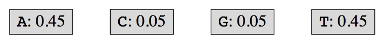

  - The nodes for `C` and `G` have the lowest frequencies, so we create a new node, make these two nodes its children, and give it their combined frequencies:

    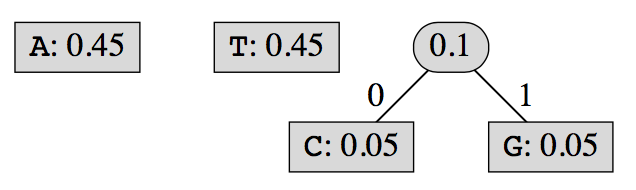

  - Of the three roots remaining, we continue to choose two lowest frequencie roots, and combine them:

    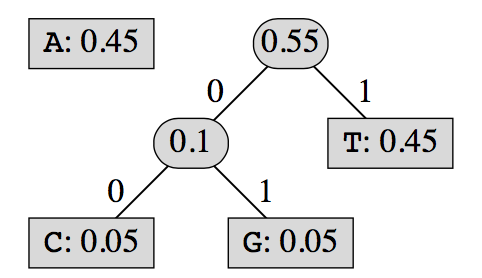

  - Only two roots remain, so let's combine them:

    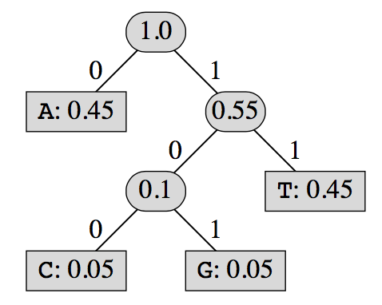

    Now that all the leaves are under this new root, we are done building the binary tree.

*To be a little more precise, let's define a procedure for building the binary tree.*

> **Procedure BUILD-HUFFMAN-TREE($char, freq, n$)**
>
> $Inputs:$
>
> - $char$ : an array of $n$ uncompressed characters.
> - $freq$ : an array of $n$ character frequencies.
> - $n$ : the sizes of the $char$ and $freq$ arrays.
>
> $Output:$ The root of the binary tree constructed for Huffman codes.
>
> 1. Let $Q$ be an empty priority queue.
>
> 2. For $i=1$ to $n$ :
>
>    A. Construct a new node $z$ containing $char[i]$ and whose frequency is $freq[i]$.
>
>    B. Call $INSERT(Q,z)$. 
>
> 3. For $i=1$ to $n-1$:
>
>    A. Call $EXTRACT-MIN(Q)$, and set $x$ to the node extracted.
>
>    B. Call $EXTRACT-MIN(Q)$, and set $y$ to the node extracted.
>
>    C. Construct a new node $z$ whose frequency is the sum of $x$'s frequency and $y$'s frequency.
>
>    D. Set $z$'s left child to be $x$ and right child to be $y$.
>
>    E. Call $INSERT(Q,z)$.
>
> 4. Call $EXTRACT-MIN(Q)$, and return the node extracted.

The running time of $BUILD-HUFFMAN-TREE$.

- *Assuming that the priority queue is immplemented by a binary heap, each $INSERT$ and $EXTRACT-MIN$ operation takes $O(\lg n)$ time.*
- The precedure calls each of these operations $2n-1$ times, for a total of $O(n\lg n)$ time.
- All other work takes a total of $\Theta(n)$ time, and so $BUILD-HUFFMAN-TREE$ runs in *$O(n\lg n)$ time.*

*When decompressing it's convenient to have the binary tree that $BUILD-HUFFMAN-TREE$ constructs.*

- Returning to our DNA example, when decompressing the bit sequence `11001111010100011111001101111011`.
- we strip off the first 1 and go right from the root, then strip off another 1 and go right again, arriving at the leaf for `T`. We emit `T` and resume searching at the root. 
- We strip off the next bit, 0, and go left from the root, arriving at the leaf for A, which we emit, and then we go back to the root. 
- Decompression continues in this way until all the bits of the compressed information have been processed.

If we have the binary tree already built before decompressing, then it takes constant time to precess each bit. 

*So how does the decompression process gain access to the binary tree?*

- One possibility is to include a representation of the binary tree with the compressed information.

- Another possibility is to include a decoding table with the processed information. 

  Each entry of the table would include the character, the number of bits in its code, and the code itself. From this table, it’s possible to build the binary tree in time linear in the total number of bits in all codes.

  ​

The $BUILD-HUFFMAN-TREE$ procedure serves as an example of a **greedy algorithm (贪心算法)**, wherein we make the decision that seems best at the moment.

- Because we want the least-frequently appearing characters far from the root of the binary tree, the greedy approach always selects the two roots with the lowest frequency to place under a new node, which can later become a child of some other node. 
- Dijkstra’s algorithm is another greedy algorithm, because it always relaxes edges from the vertex with the lowest shortest value of those remaining in its priority queue.

##### **Adaptive Huffman codes**

Practitioners often find that making two passes over the input, one to compute character frequencies and one to encode the characters, is too slow. 

Instead, the compression and decompression programs work adaptively, updating character frequencies and the binary tree as they compress or decompress in just one pass.

The compression program starts with an empty binary tree.

- Each character it reads from the input is either new or already in the binary tree. 
  - If the character is already in the binary tree, then the compression program emits the character’s code according to the current binary tree, increases the character’s frequency, and, if necessary, updates the binary tree to reflect the new frequency.
  - If the character is not already in the binary tree, then the compression program emits the character unencoded(as is), adds it to the binary tree, and updates the binary tree accordingly.

The decompression program mirrors what the compression programdoes. 

- It, too, maintains a binary tree as it processes the compressed information. 
- When it sees bits for a character in the binary tree, it goes down the tree to determine which character the bits encode, emits this character, increases the character’s frequency, and updates the binary tree.
- When it sees a character not yet in the tree, the decompression program emits the character, adds it to the binary tree, and updates the binary tree.

Something is amiss here, however. Bits are bits, whether they represent ASCII characters or bits in a Huffman code. 

*How can the decompression program determine whether the bits it’s looking at represent an encoded or an unencoded character?*

- Does the bit sequence 101 rep-resent the character currently encoded as 101, or is it the start of aneight-bit unencoded character? 
- *The answer is to precede each unencoded character with an **escape code**:* 
  - a special code indicating that the next set of bits represents an unencoded character. 
  - If the original text contains k different characters, then only k escape codes will appear in the compressed information, each one preceding the first occurrence of a character. 
  - Escape codes will usually appear infrequently, and so we don’t want to assign them short bit sequences at the expense of a more frequently occurring character. 
  - *A good way to ensure that escape codes are not short is to include an escape code character in the binary tree, but nail down its frequency to be 0 always.* 
  - As the binary tree is updated, the escape code’s bit sequence will change in both the compression and decompression programs, but its leaf will always be the farthest from the root.

### 9.2 Fax machines

Earlier, I mentioned that fax machines compress information to indicate the colors and lengths of runs of identical pels in the rows of the image being transmitted. 

This scheme is known as **run-length encoding (行程长度压缩算法) **. *Fax machines combine run-length encoding with Huffman codes*. 

- In the standard for fax machines that use regular phone lines, $104$ codes indicate runs of different lengths of white pels, and $104$ codes indicate runs of different lengths of black pels. 
- *The codes for white-pel runs are prefix-free, as are the codes for black-pel runs, though some of the codes for runs of white pels are prefixes of codes for runs of black pels and vice versa.*

To determine which codes to use for which runs, a standards committee took a set of eight representative documents and counted how often each run appeared. 

- They then constructed Huffman codes for these runs. 
- The most frequent runs, and hence the shortest codes, were for runs of two, three, and four black pels, with codes 11, 10, and 011, respectively. 
- Other common runs were one black pel (010), five and sixblack pels (0011 and 0010), two to seven white pels (all with four-bitcodes), and other relatively short runs. 
- One fairly frequent run consisted of 1664 white pels, representing an entire row of white pels. 
- Other short codes went to runs of white pels whose lengths are powers of 2 or sums of two powers of 2 (such as 192, which equals $2^7+2^6$). Runs can be encoded by concatenating encodings of shorter runs. 
- Earlier, I gave asan example the code for a run of 140 white pels, 10010001000. Thiscode is actually the concatenation of the codes for a run of 128 whitepels (10010) and a run of 12 white pels (001000).

In addition to compressing information only within each row of the image, some fax machines *compress in both dimensions of the image*.

- *Runs of same-color pels can occur vertically as well as horizontally,and so instead of treating each row as if it were encountered in isolation, a row is encoded according to where it differs from the preceding row.* 
- For most rows, the difference from the previous row is just a few pels.
- *This scheme entails the risk that errors propagate: an encoding or transmission error causes several consecutive rows to be incorrect.*
- For this reason, *fax machines that use this scheme and transmit over phone lines limit the number of consecutive rows that can use it, so that after a certain number of rows, they transmit a full row image using the Huffman coding scheme*, rather than transmitting just the differences from the previous row.

​			
​		
​	

### 9.3 LZW compression

​		
**LZW** makes a single pass over its input for compression and for decompression. 

- In both, *it builds a dictionary of character sequences that it has seen, and it uses indices into this dictionary to represent character sequences.* 
- Think of the dictionary as an array of character strings. We can index into this array, so that we can speak of its $i$th entry. 
- Toward the beginning of the input, the sequences tend to be short, and representing the sequences by indices could result in expansion, rather than compression. But as LZW progresses through its input, the sequences in the dictionary become longer, and representing them by an index can save quite a bit of space.

*Both the compressor and decompressor seed the dictionary with a one-character sequence for each character in the character set.*

- Using the full ASCII character set, the dictionary starts with 256 single-character sequences; the ith entry in the dictionary holds the character whose ASCII code is i.

> **Procedure $LZW-COMPRESSOR(text)$**
>
> $Input:$ $text:$A sequence of characters in the ASCII character set.
>
> $Output:$ A sequence of indices into a dictionary.
>
> 1. For each character $c$ in the ASCII character set:
>
>    A. Insert $c$ into the dictionary at the index equal to $c$'s numeric code in ASCII.
>
> 2. Set $s$ to the first character from $text$.
>
> 3. While $text$ is not exhausted, do the following:
>
>    A. Take the next character from $text$, and assign it to $c$.
>
>    B. If $sc$ is in the dictionary, then set $s$ to $sc$.
>
>    C. Otherwise, do the following:
>
>    ​	i. *Output the index of $s$ in the dictionary.*
>
>    ​	ii. Insert $sc$ into the next available entry in the dictionary.
>
>    ​	iii. Set $s$ to the single-character string $c$.
>
> 4. *Output the index of $s$ in the dictionary.*

Let's run through an example, compressing the text `TATTAGATCTTAATATA`.

- After step 1, the dictionary has one-character strings for each of the 256 ASCII characters in entries 0 through 255. Step 2 sets the string s to hold just the first input character, `T`.

- *The following table shows what happens upon each iteration of the loop in step 3.*

  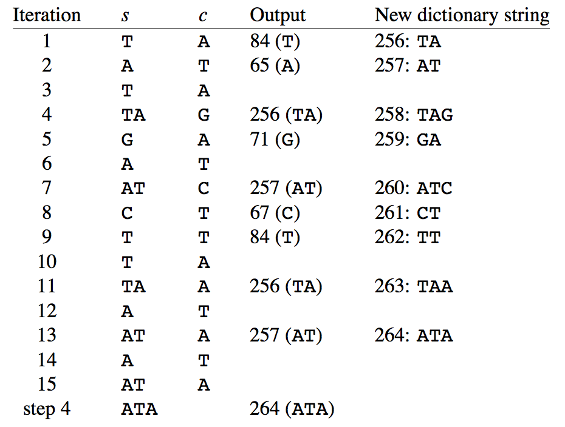

- This example is a little too small to show the real benefit of LZW compression. 

  - The input occupies 16 bytes, and the output consists of 10 dictionary indices. 
  - Each index requires more than one byte. Even if we use two bytes per index in the output, it occupies 20 bytes. If each index occupies four bytes, a common size for integer values, the output takes 40 bytes.

LZW compression helps only if we can decompress. *Fortunately, the dictionary does not have be stored with the compressed information.*

*Here is how LZW decompression works:*

- Like the compressor, the decompressor seeds the dictionary with the 256 single-character sequences corresponding to the ASCII character set. 
- It reads a sequence of indices into the dictionary as its input, and it mirrors what the compressor did to build the dictionary. Whenever it produces output, it’s from a string that it has added to the dictionary.
- *the decompressor needs to keep track of two consecutive strings that it outputs. If the decompressor outputs strings $X$ and $Y$, in that order, then it concatenates the first character of $Y$ onto $X$ and then inserts the resulting string into the dictionary.*

*On rare occasions, the next dictionary index in the decompressor’s input is for an entry not yet in the dictionary.*

- *It happens when the index output by the compressor is for the string most recently inserted into the dictionary.*
  - This situation occurs only when the string at this index starts and ends with the same character.
- *if the next dictionary index in the decompressor’s input is for an entry not yet in the dictionary, the decompressor can output the string it had most recently output, concatenated with the first character of this string, and insert this new string into the dictionary.*

> **Procedure $LZW-DECOMPRESSOR(indices)$**
>
> $Input:$ $indices:$ a sequence of indices into a dictionary, created by LZW-COMPRESSOR.
>
> $Output:$ The text that LZW-COMPRESSOR took as input.
>
> 1. For each character $c$ in the ASCII character set:
>
>    A. Insert $c$ into the dictionary at the index equal to $c$'s numeric code in ASCII.
>
> 2. Set $current$ to the first index in $indices$.
>
> 3. Output the string in the dictionary at index $current$.
>
> 4. While $indices$ is not exhausted, do the following:
>
>    A. Set $previous$ to $current$.
>
>    B. Take the number from $indices$ and assign it to $current$.
>
>    C. If the dictionary contains an entry indexed by $current$, then do the following:
>
>    ​	i. Set $s$ to be the string in the dictionary entry indexed by $current$.
>
>    ​	ii. Output the string $s$.
>
>    ​	iii. Insert, into the next available entry in the dictionary, the string at the dictionary entry indexed by $previous$, concatenated with the first character of $s$.
>
>    D. Otherwise (the dictionary does not yet contain an entry indexed by $current$), do the following:
>
>    ​	i. Set s to be the string at the dictionary entry indexed by $previous$, concatenated with the first character of this dictionary entry.
>
>    ​	ii. Output the string $s$.
>
>    ​	iii. Insert, into the next available entry in the dictionary, the string $s$.

The following table shows what happens in each iteration of the loop in step $4$:

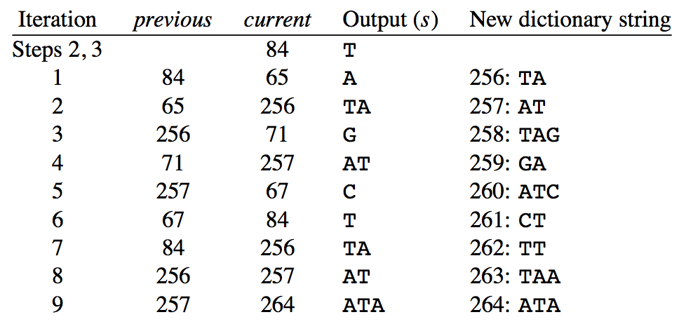

Except for the last iteration, the input index is already in the dictionary, so that step $4D$ runs only in the last iteration.

*Notice that the dictionary built by LZW-DECOMPRESSOR matches the one built by LZW-COMPRESSOR.*

​			
​		

##### How to look up information in the dictionary

*How to look up information in the dictionary in the LZW-COMPRESSOR and LZW-DECOMPRESSOR procedures:*

- The latter is easy: just keep track of the last dictionary index used, and if the index in current is less than or equal to the last-used index, then the string is in the dictionary.	

- The LZW-COMPRESSOR procedure has a more difficult task: given a string, determine whether it’s in the dictionary and, if it is, at what index.

  - Of course, we could just perform a linear search on the dictionary, but if the dictionary contains n items, each linear search takes $O(n)$ time. 
  - We can do better by using either one of a couple of data structures. 
    - One is called a **trie (字典树)**, and it’s like the binary tree we built for Huffman coding, except that each node can have many children, not just two, and each edge is labeled with an ASCII character. 
    - The other data structure is a **hash table (散列表)**, and it provides a simple way to find strings in the directory that is fast on average.

  ​		

#### LZW improvements		

1. *LZW + Huffman coding*

   We can observe a couple of properties of the indices that the LZW compressor produces.

   - First, many of them are low numbers, meaning that they have many leading zeros in their 32-bit representations. 
   - Second, some of the indices are going to occur much more frequently than others.

*When both of these properties hold, Huffman coding is likely to yield good results, which beats Huffman coding alone.*

2. *Other approaches to LZW compression focus on reducing the number of bits necessary to hold the indices that the compressor outputs.*

   Because many of the indices are small numbers, one approach is to use fewer bits for smaller numbers, but reserve, say, the first two bits to indicate how many bits the number requires.

   Here’s one scheme:

   - If the first two bits are `00`, then the index is in the range 0 to 63($2^6-1$), requiring another six bits, and hence one byte in all.
   - If the first two bits are `01`, then the index is in the range 64 ($2^6$)to 16,383 ($2^{14}-1$), requiring another 14 bits, and hence two bytes in all.
   - If the first two bits are `10`, then the index is in the range 16,384 ($2^{14}$)to 4,194,303 ($2^{22}-1$), requiring another 22 bits, and hence three bytes in all.
   - Finally, if the first two bits are `11`, then the index is in the range4,194,304 ($2^{22}$) to 1,073,741,823 ($2^{30}-1$), requiring another 30 bits,and hence four bytes in all.

3. In one approach, once the dictionary reaches a maximum size, no other entries are ever inserted. 
4. In another approach, once the dictionary reaches a maximum size, it is cleared out (except for the first 256 entries), and the process of filling the dictionary restarts from the point in the text where the dictionary filled. 

In all of these approaches, the decompressor must mirror the compressor’s action.

​			
​		
​	

# Chapter 10 Hard? Problems

### 10.1 Brown trucks

**Traveling-salesman problem (旅行商问题)**.

- a traveling salesman has to visit $n$ cities, starting and ending at the same city, and visit all the cities with the shortest possible tour.

*No algorithm that runs in time $O(n^c)$, for any constant $c$, has ever been found for the traveling-salesman problem.*

Many problems — thousands of them — share this characteristic: 

- for an input of size $n$, we know of no algorithm that runs in time $O(n^c)$ for any constant $c$, yet nobody has proven that no such algorithm could exist.
- These problems come from a wide variety of domains — logic, graphs, arithmetic, and scheduling among them.

*If there were an algorithm that ran in $O(n^c)$ time for any of these problems, where $c$ is a constant, them there would be an algorithm that ran in $O(n^c)$ for all of these problems.*

We call these problems **NP-complete (NP完全)**.

An algorithm that runs in time $O(n^c)$ on an input of size $n$, where $c$ is a constant, is a **polynomial-time algorithm (多项式-时间算法)**, so called because $n^c$ with some coefficient would be the most significant tern in the running time.

​		
*We know of no polynomial-time algorithm for any NP-complete problem, but nobody has proven that it’s impossible to solve some NP-complete problem in polynomial time.*

...

### 10.2 The classes P and NP and NP-completeness

Computer scientists generally regard problems solvable by polynomial-time algorithms as “tractable,” meaning “easy to deal with.” If a polynomial-time algorithm exists for a problem, then we say that this problem is in the **class P (P类)**.

If it is possible to verify a proposed solution to a problem in time polynomial in the size of the input to the problem, then we say that this problem is in the **class NP**.

- We call the proposed solution a **certificate (证书)**, and in order for the problem to be in NP, the time to verify the certificate needs to be polynomial in the size of the input to the problem and the size of the certificate.

If you can solve a problem in polynomial time, then you can certainly verify a certificate for that problem in polynomial time. In other words, *every problem in P is automatically in NP*.

The reverse — is every problem in NP also in P? — is the question that has perplexed computer scientists for all these years. We often call it the **"$P=NP?$ problem"**.

The NP-complete problems are the "hardest" in NP.

*Informally, a problem is **NP-complete** if it satisfies two conditions:*

1. it's in NP.
2. if a polynomial-time algorithm exists for the problem, then there is a way to convert every problem in NP into this problem in such a way as to solve then all in polynomial time.

If a polynomial-time algorithm exists for any NP-complete problem — that is, if any NP-complete problem is in P — then $P=NP$.

Because NP-complete problems are the hardest in NP, if it turns out that any problem in NP is not polynomial-time solvable, then none of the NP-complete problems are. 

A problem is **NP-hard** if it satisfies the second condition for NP-completeness but may or may not be in NP.

*Here’s a handy list of the pertinent definitions:*

- **P**: problems solvable in polynomial time.
  - i.e., we can solve the problem in time polynomial in the size of the input to the problem.
- **Certificate**: a proposed solution to a problem.
- **NP**: problems verifiable in polynomial time.
  - i.e., given a certificate,we can verify that the certificate is a solution the problem in timepolynomial in the size of the input to the problem and the size of thecertificate.
- **NP-hard**: a problem such that if there is a polynomial-time algorithm to solve this problem, then we can convert every problem in NP into this problem in such a way to solve every problem in NP in polynomial time.
- **NP-complete**: a problem that is NP-hard and also in NP.

### 10.3 Decision problems and reductions

*When we talk about the classes P and NP, or about the concept of NP-completeness, we restrict ourselves to **decision problems**:* 

- their output is a single bit, indicating "yes" or "no".
- For example:
  - Does the graph have an Euler tour?
  - Does the graph have a hamiltonian cycle?

Some problems, however, are optimization problems, where we want to find the best possible solutions, rather than decision problems. 

Fortunately, we can often bridge part of this gap by recasting an optimization problem as a decision problem. 

- For example, let’s consider the shortest-path problem. There, we used the Bellman-Ford algorithm to find shortest paths. 
  - How can we pose the shortest-path problem as a yes/no problem? 
  - We can ask “Does the graph contain a path between two specific vertices whose path weight is at most a given value $k$?”
  - We’re not asking for the vertices or edges on the path, but just whether such a path exists. 
  - Assuming that path weights are integers, we can find the actual weight of the shortest path between the two vertices by asking yes/no questions. 
  - How? Pose the question for $k=1$. If the answer is no, then try with $k=2$. If the answer is no, try with $k=4$. Keep doubling the value of $k$ until the answer is yes. 
  - If that last value of $k$ was $k'$, then the answer is somewhere between $k'/2$ and $k'$. 
  - Then find the true answer by using binary search with an initial interval of $k'/2$ to $k'$. 
  - This approach won’t tell us which vertices and edges a shortest path contains, but at least it will tell us the weight of a shortest path.

The second condition for a problem to be NP-complete requires that *if a polynomial-time algorithm exists for the problem, then there is a way to convert every problem in NP into this problem in such a way as to solve them all in polynomial time.*			

- Focusing on decision problems, let's see the general idea behind *converting one decision problem $X$ into another decision problem $Y$, such that if there's a polynomial-time algorithm for $Y$ then there's a polynomial-time algorithm for $X$.*

- We call such a conversion a **reduction (归约)** because we're “reducing” solving problem $X$ to solving problem $Y$.

- Here's the idea:

  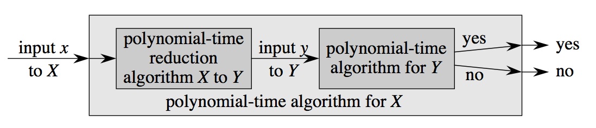

  We’re given some input $x$ of size $n$ to problem $X$. We transform this input into an input $y$ to problem $Y$, and we do so in time polynomial in $n$, say $O(n^c)$ for some constant $c$. The way we transform input $x$ into input $y$ has to obey an important property: if algorithm $Y$ decides “yes” on input $y$, then algorithm $X$ should decide “yes” on input $x$, and if $Y$ decides “no” on $y$, then $X$ should decide “no” on $x$. We call this transformation a **polynomial-time reduction algorithm (多项式-时间规约算法)**.

- *Let's see how long the entire algorithm for problem $X$ takes.*

  - First, we know that:
    - *The reduction algorithm $R$ is a polynomial-time algorithm, on a input of size $n$, it runs in $O(n^c)$ time for some constant $c$.*
    - *$Y$ is a polynomial-time algorithm, on an input of size $m$, it runs in time $O(m^d)$ for some constant $d$.* 
    - *We want to know the running time of $X$.*
  - Then, $R$ takes $O(n^c)$ time, and its output size cannot be longer than the time it took, so let's say *the size of $R$'s output* is $O(n^c)$.
  - This output is the input $y$ to the algorithm for problem $Y$. So the input size of $Y$ here is $O(n^c)$, Then the algorithm for $Y$ takes time $(O((n^c)^d))$, or $O(n^{cd})$. 
  - $cd$ is a constant, so in this situation, the algorithm for $Y$ is also a polynomial-time algorithm.
  - The total time for the algorithm for problem $X$ is $O(n^c+n^{cd})$, which is also a polynomial-time algorithm.
  - *This approach shows that if problem $Y$ is "easy" (solvable in polynomial time), the so is problem $X$.*

- *But actually we'll use polynomial-time reducitons to show not that problems are easy, but that they are hard:*

  **If problem $X$ is NP-hard and we can reduce it to problem $Y$ in polynomial time, then problem $Y$ is NP-hard as well.**

- Let's see why should this statement hold:

  - Suppose that:

    - problem $X$ is NP-hard
    - There is a polynomial-time reduction algorithm $R$ to convert inputs to $X$ into inputs to $Y$.

  - Because $X$ is NP-hard, there is a way to convert any problem (say $Z$) in NP into $X$ such that if $X$ has a polynomial-time algorithm, so does $Z$.

    - So, *we need to prove that*: there is a way to convert any problem (say $Z$) in NP into $Y$ such that if $Y$ has a polynomial-time algorithm, so does $Z$.

  - Here is the prove:

    1. We know: we can convert inputs to $Z$ into inputs to $X$ with a polynomial-time reduction:

       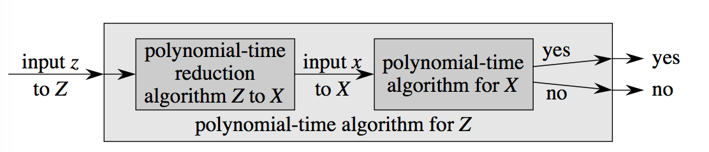

    2. And we can convert inputs to $X$ into inputs to $Y$ with a polynomial-time reduction, so we can expand $X$ as we did earlier:

       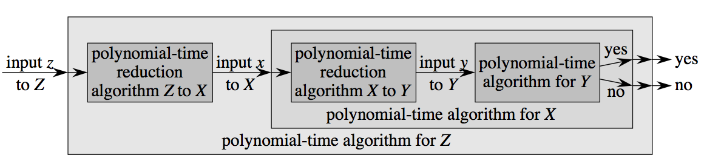

    3. Instead of grouping the polynomial-time reduction for $X$ to $Y$ and the algorithm for $Y$ together, let's group the two polynomial-time reductions together:

       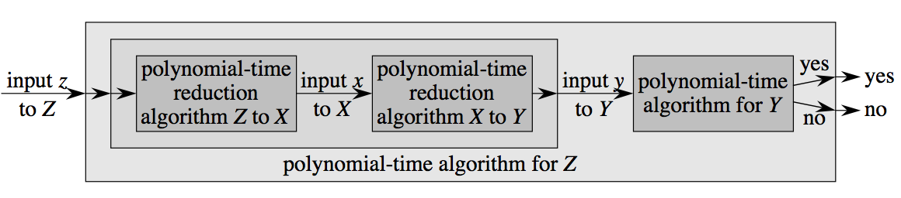

    4. Now we note that if we immediately follow the polynomial-time reduction for $Z$ to $X$ by the polynomial-time reduction from $X$ to $Y$, we have a polynomial-time reduction from $Z$ to $Y$:

       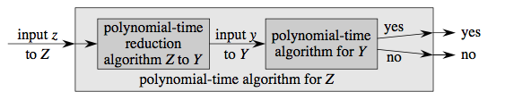

       This figure is the same as figure 1 

    5. so we can say  there is a way to convert any problem (say $Z$) in NP into $Y$ such that if $Y$ has a polynomial-time algorithm, so does $Z$. So $Y$ is a NP-hard problem.

- We just showed that if problem $X$ is NP-hard and there is a polynomial-time reduction algorithm that transforms an input $x$ to $X$ into an input $y$ to problem $Y$, then $Y$ is NP-hard, too.

  -  because $X$ being NP-hard means that every problem in NP reduces to it in polynomial time,  *we picked any problem $Z$ in NP that reduces to $X$ in polynomial time and showed that showed that it also reduces to $Y$ in polynomial time.*

Our ultimate goal is to show that problems are NP-complete. *So now all we have to do to show that a problem $Y$ is NP-complete is:*

- show that it's in NP, which we can do by showing that there's a way to verify a certificate for $Y$ in polynomial time, and
- take some other problem $X$ that we know to be NP-hard and give a polynomial-time reduction from $X$ to $Y$.

There is one more little detail that I've ignored so far: the Mother Problem.

- We need to start with some NP-complete problem $M$ (the **Mother Problem**)  that every problem in NP reduces to in polynomial time.
- Then we can reduce $M$ to some other problem in polynomial time to show that the other problem is NP-hard, reduce the other problem to yet some other problem to show that the latter is NP-hard, and so on.

Bear in mind, too, that there’s no limit on how many other problems we can reduce a single problem to, so that the family tree of NP-complete problems starts with the Mother Problem and then branches out.

### 10.4 A Mother Problem

Different books list different Mother Problems. That’s fine, since once you reduce one Mother Problem to some other problem, that other problem could also serve as the Mother Problem.

One Mother Problem often seen is **boolean formula satisfiability**.

Typical boolean operations:

- $AND$
- $OR$
- $NOT$
- $XOR$
- $IMPLIES$
- $IFF$

There are 16 possible boolean operators that take two operands, but these are the most common.

A **boolean formula** consists of boolean valued variables, boolean operators, and parentheses for grouping.

In the **boolean formula satisfiability problem**, *the input is a boolean formula, and we ask whether there is some way to assign the values 0 and 1 to the variables in the formula so that it evaluates to 1. If there is such a way, we say that the formula is satisfiable.* 

For example:

- the boolean formula:

  $((w\ IMPLIES\ x)\ OR\ NOT(((NOT\ w)IFF\ y)OR\ z))AND(NOT\ x)$

  is satisfiable: let $w=0,x=0,y=1,z=1$. Then the formula evaluates to 1.

- On the other hand, here's a simple formula that is not satisfiable:

  $x\ AND(NOT\ x)$

  No matter $x$ is 0 or 1, the result is always 0.

### 10.5 A sampler of NP-complete problems

With boolean formula satisfiability as our Mother Problem, let’s see some of the problems that we can show are NP-complete by using polynomial-time reductions. Here’s the family tree of reductions that we’ll see:

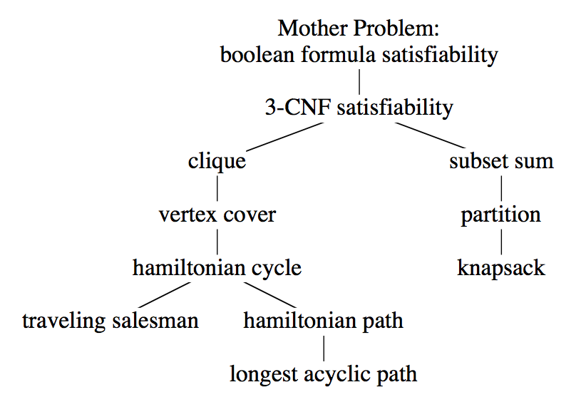

#### 10.5.1 3-CNF satisfiability

Because boolean formulas can contain any of the 16 two-operand boolean operators, and because they can be parenthesized in any number of ways, it’s difficult to reduce directly from the boolean formula satisfiability problem — the Mother Problem. 

Instead, *we will define a related problem that is also about satisfying boolean formulas, but that has some restrictions on the structure of the formula that is the input to the problem.* It will be much easier to reduce from this restricted problem. 

*Let’s require that the formula be $AND$s of clauses, where each clause is an $OR$ of three terms, and each term is a **literal**: either a variable or the negation of a variable (such as $NOT\ x$).* 

A boolean formula in this form is in **3-conjunctive normal form**, or **3-CNF**. 

For example, the boolean formula

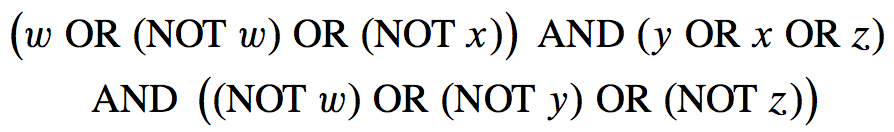

is in 3-CNF. Its first clause is $(w\ OR(NOT\ w)\ OR(NOT\ x))$.

Deciding whether a boolean formula in 3-CNF has a satisfying assignment to its variables — the **3-CNF satisfiability problem** — is NP-complete. 

- A certificate is a proposed assignment of the values `0` and `1` to the variables. Checking a certificate is easy: just plug in the proposed values for the variables, and verify that the expression evaluates to `1`.
- *To show that 3-CNF satisfiability is NP-hard, we reduce from (unrestricted) boolean formula satisfiability. (Here won't go into the details).*

Although it’s NP-complete, there is a polynomial-time algorithm to determine whether a 2-CNF formula is satisfiable.

- A 2-CNF formula is just like a 3-CNF formula except that it has two literals, not three, in each clause. 
- *A small change like that takes a problem from being as hard as the hardest problem in NP to being easy*!

#### 10.5.2 Clique	

Now we’re going to see an interesting reduction, for problems in different domains: 

- from 3-CNF satisfiability to a problem having to do with undirected graphs.

*A **clique (团（图论）)** in an undirected graph $G$ is a subset $S$ of vertices such that the graph has an edge between every pair of vertices in $S$. The **size of a clique** is the number of vertices it contains.*

*The **clique problem** takes two inputs:*

- *a graph $G$*
- *a positive integer $k​$*

*and asks thether $G$ has a k-clique: a clique of size $k$.*		
​	

For example: the graph below has a clique of size 4:

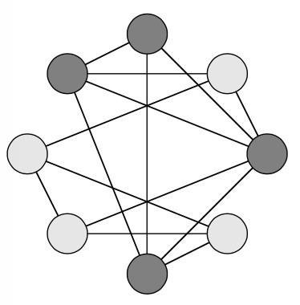

Verifying a certificate is easy. The certificate is the k vertices claimed to form a clique, and we just have to check that each of the k vertices has an edge to the other k-1. This check is easily performed in time polynomial in the size of the graph. Now we know that the *clique problem is in NP*.

*How can a problem in satisfying boolean formulas reduce to a graph problem?* 

- We start with a boolean formula in 3-CNF.

  - Suppose that the formula is $C_1\ AND\ C_2\ AND\ C_3\ … AND\ C_k$, where each $C_r$ is one of $k$ clauses.
  - From this formula, we will construct a graph in polynomial time, and this graph will have a $k$-clique if and only if the 3-CNF formula is satisfiable.

- *We need to see three things:* 

  - *the construction*
  - *an argument that the construction runs in time polynomial in the size of the 3-CNF formula*
  - *a proof that the graph has a $k$-clique if and only if there is some way to assign to the variables of the 3-CNF formula so that it evaluates to 1.*

- To construct a graph from a 3-CNF formula, let's focus on the $r$th clause, $C_r$. 

  - It has three literals, let's call them $l_1^r,l_2^r,and\ l_3^r$, so that $C_r$ is $l_1^r\ OR\ l_2^r\ OR\ l_3^r$. Each literal is either a variable or the negation of a variable.

  - We create one vertex for each literal, so that for clause $C_r$, we create a triple of vertices: $v_1^r,v_2^r,and\ v_3^r$.

  - We add an edge between vertices $v_i^r$ and $v_j^s$ if two conditions hold:

    - $v_i^r$ and $v_j^s$ are in different triples; that is, $r$ and $s$ are different clause numbers, and
    - Their corresponding literals are not negations of each other.

    For example:

    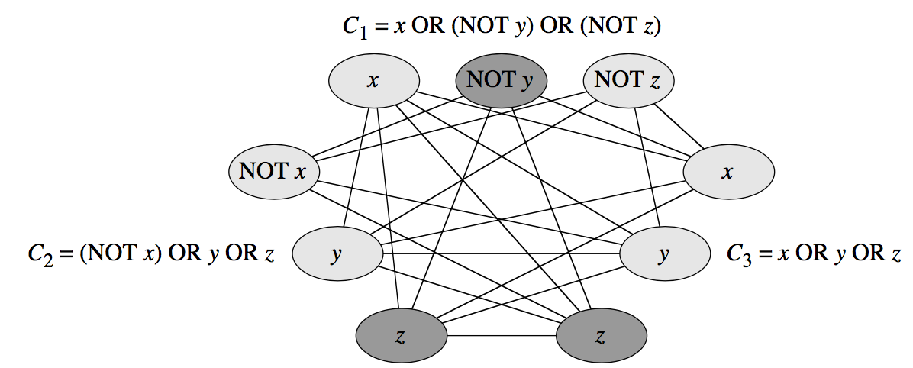

- It's easy enough to see that this reduction can be performed in polynomial time.

  - If the 3-CNF formula has $k$ clauses, then it has $3k$ literals, and so the graph has $3k$ vertices.
  - At most, *each vertex has an edge to all the other $3k-1$ vertices (??? have contradiction with previous paragraph)*, and so the number of edges is at most $3k(3k-1)$, which equals $9k^2-3k$.
  - *The size of the graph constructed is polynomial in the size of the 3-CNF input, and it's easy to determine which edges go into the graph.*

- Finally, we need to show that the constructed graph has a $k$-clique if and only if the 3-CNF formula is satisfiable.

  - We start by assuming that the formula is satisfiable, and we’ll show that the graph has a k-clique.

    - If there exists a satisfying assignment, each clause $C_r$ contains at least one literal $l_i^r$ that evaluates to 1, and each such literal corresponds to a vertex $v_i^r$ in the graph. 
    - If we select one such literal from each of the $k$ clauses, we get a corresponding set $S$ of $k$ vertices. I claim that $S$ is a $k$-clique. 
    - Consider any two vertices in $S$. They correspond to literals in different clauses that evaluate to 1 in the satisfying assignment.
    - These literals cannot be negations of each other, because if they were, then one of them would evaluate to 1 but the other would evaluate to 0.
    - Since these literals are not negations of each other, we created an edge between the two vertices when we constructed the graph. 
    - Because we can pick any two vertices in $S$ as this pair, we see that there are edges between all pairs of vertices in $S$. Hence, $S$, a set of $k$ vertices, is a $k$-clique.

  - Now we have to show the other direction: if the graph has a $k$-clique $S$, then the 3-CNF formula is satisfiable.

    - *No edges in the graph connect vertices in the same triple, and so $S$ contains exactly one vertex per triple,* and so $S$ contains exactly one vertex per triple. 

    - For each vertex $v_i^r$ in S, assign 1 to its corresponding literal $l_i^r$ in the 3-CNF formula.

    - *Since each clause has a literal that evaluates to 1, each clause is satisfied, and so the entire 3-CNF formula is satisfied.* 

    - If any variables don’t correspond to vertices in the clique, assign values to them arbitrarily; they won’t affect whether the
      formula is satisfied.

      ​

​		
*Thus, we have shown that there exists a polynomial-time reduction from the NP-complete problem of 3-CNF satisfiability to the problem of finding a $k$-clique.* 

- If you were given a boolean formula in 3-CNF with $k$ clauses, and you had to find a satisfying assignment for the formula, you could use the construction we just saw to convert the formula in polynomial time to an undirected graph, and determine whether the graph had a $k$-clique. 
- If you could determine in polynomial time whether the graph had a $k$-clique, then you would have determined in polynomial time whether the 3-CNF formula had a satisfying assignment. 
- Since 3-CNF satisfiability is NP-complete, so is determining whether a graph contains a $k$-clique. 
- As a bonus, if you could determine not only whether the graph had a $k$-clique, but which vertices constituted the k-clique, then you could use this information to find the values to assign to the variables of the 3-CNF formula in a satisfying assignment.

#### 10.5.3 Vertex cover

A **vertex cover (顶点覆盖)** in an undirected graph $G$ is a subset $S$ of the vertices such that every edge in $G$ is incident on at least one vertex in $S$. 

We say that each vertex in $S$ "covers" its incident edges.

The **size of a vertex cover** is the number of vertices it contains.

**Vertex-cover problem** takes as input an undirected graph $G$ and a positive integer $m$. It asks whether $G$ has a vertex cover of size $m$.

When you have a certificate, it's easy to verify in time polynomial in the size of the graph that the proposed vertex cover has size $m$ and really does cover all the edges, and *so we see that this problem is in NP*.

we can reduce the clique problem to the vertex-cover problem.

- Suppose that the input to the clique problem is an undirected graph $G$ with $n$ vertices and a positive integer $k$. 

- *In polynomial time, we’ll produce an input graph $\overline G$ to the vertex-cover problem such that $G$ has a clique of size $k$ if and only if $\overline G$ has a vertex cover of size $n-k$.* 

- This reduction is really easy:

  - *The graph $\overline G$ has the same vertices as $G$, and it has exactly the opposite edges as $G$.*

  - In other words, edge($u,v$) is in $\overline G$ if and only if $(u,v)$ is not in $G$. 

  - You might have guessed that *the vertex cover of size $n-k$ in $\overline G$ consists of the vertices not in the clique of $k$ vertices in $G$* — and you would be correct! 

  - Here are examples of graphs $G$ and $\overline G$, with eight vertices. The five vertices forming a clique in $G$ and the remaining three vertices forming a vertex cover in $\overline G$ are heavily shaded:

    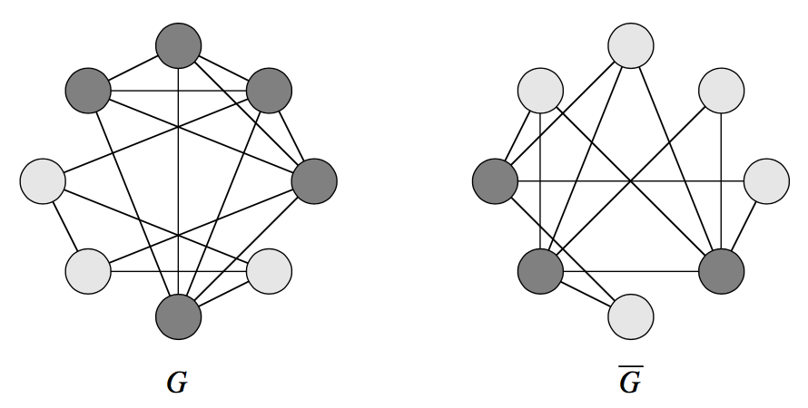

  - Note that every edge in $\overline G$ is incident on at least one heavily shaded vertex.

*We need to show that $G$ has a $k$-clique if and only if $\overline G$ has a vertex cover of size $n-k$.* 

- *First, suppose G has a k-clique:*
  - Start: 
    - supposing that $G$ has a $k$-clique $C$.
    - Let $S$ consist of the $n-k$ vertices not in $C$.
    - The graph $\overline G$ has the same vertices as $G$, and it has exactly the opposite edges as $G​$.
  - Let($u,v$) be any edge in $\overline G$, It's in $\overline G$ because it was not in $G$. Because ($u,v$) is not in $G$, at least one of the vertices $u$ and $v$ is not in the clique $C$ of $G$, because an edge connects every pair of vertices in $C$.
  - Since at least one of $u$ and $v$ is not in $C$, at least one of the vertices in $S$, which means that edge($u,v$) is incident on at least one of the vertices in $S$.
  - Since we chose ($u,v$) to be any edge in $\overline G$, we see that $S$ is a vertex cover for $\overline G$.
- *Now we go the other way, suppose $\overline G$ has a vertex cover of size $n-k$:*
  - Start:
    - Suppose that $\overline G$ has a vertex cover $S$ containing $n-k$ vertices, and let $C$ consist of the $k$ vertices not in $S$.
    - Every edge in $\overline G$ is incident on some vertex in $S$. In other words, if ($u,v$) is an edge in $\overline G$, then at least one of $u$ and $v$ is in $S$.
  - if neither $u$ nor $v$ is in $S$, then $(u,v)$ is not in $\overline G$, and therefore, $(u,v)$ is in $G$. In other words, if both $u$ and $v$ are in $C$, then the edge($u,v$) is present in $G$.
  - Since $u$ and $v$ are any pair of vertices in $C$, we see that there is an edge in $G$ between all pairs of vertices in $C$.
  - That is, $C$ is a $k$-clique.

Thus, we have shown that there exists a polynomial-time reduction from the NP-complete problem of determining whether an undirected graph contains a $k$-clique to the problem of determining whether an undirected graph contains a vertex cover of size $n-k$.

Since the clique problem is NP-complete, so is the vertex-cover problem. 

As a bonus, if you could determine not only whether G had a vertex cover of
$n-k$ vertices, but which vertices constituted the cover, then you could use this information to find the vertices in the $k$-clique.

#### 10.5.4 Hamiltonian cycle and Hamiltonian path 			

