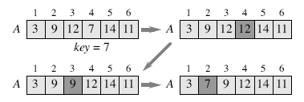
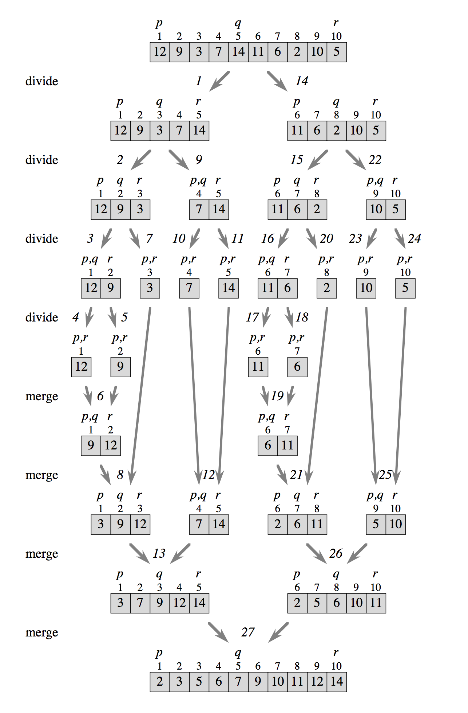
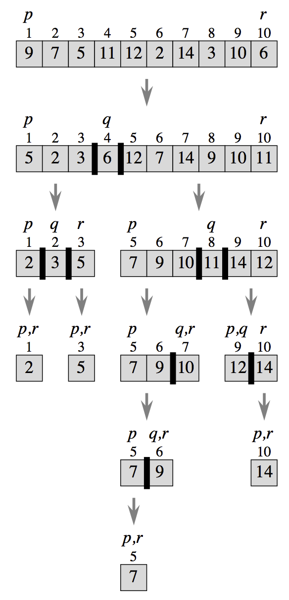
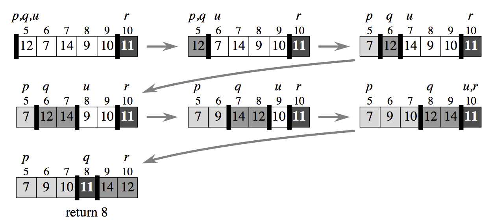
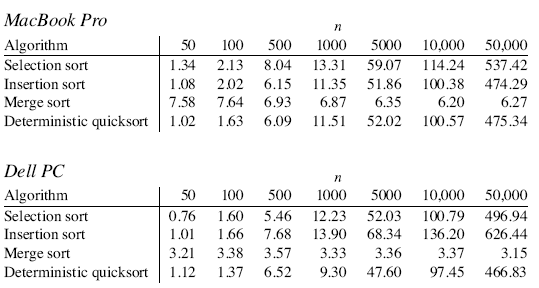

**Notes for Algorithms Unlocked**

# Chapter 1: What Are Algorithms and Why Should You Care?

*What is a computer algorithm?*

A computer algorithm is a set of steps to accomplish a task that is described precisely enough that a computer can run it.

*What do we want from a computer algorithm?*

Computer algorithms solve computational problems.

* Given an input to a problem, it should always produce a **correct** solution to the problem;
* It should use computational **resources** efficiently while doing so.

## Correctness

1. Sometimes, we can accept that a computer algorithm might produce an incorrect answer, as long as we can control how often it does so. For example: **Encryption**
2. Correctness is a tricky issue with another class of algorithms -- **approximation algorithms**.
   * For some problems, we have no algorithm that finds an optimal solution in any reasonable amount of time, but we know of an approximation algorithm that, in a reasonable amount of time, can find a solution that is almost optimal (the quantitative measure of the solution found by the approximation algorithm is within some known factor of the optimal solution's quantitative measure).
   * As long as we specify what the desired factor is, we can say that a correct solution from an approximation algorithm is any solution that is within that factor of the optimal solution.

## Resource usage

In this book, we focus on just one resource: **time**.

*How do we judge the time required by an algorithm?*

There are two factors：

1. **Input size**
2. **Order of growth of the running time**


# Chapter 2: Describe and Evaluate Computer Algorithms

**Example 1st: LINEAR-SEARCH**
```
Procedure LINEAR-SEARCH(A; n; x)

Inputs:
A: an array.
n: the number of elements in A to search through.
x: the value being searched for.

Output: Either an index i for which A[i]=x, or the special value NOT-FOUND, which could be any invalid index into the array, such as 0 or any negative integer.
------
1. Set answer to NOT-FOUND.
2. For each index i, going from 1 to n, in order:
    A. If A[i]=x, then set answer to the value of i.
3.Return the value of answer as the output.
```

## First: input-size
Input:
1. An array `A` of n elements
2. number `n`
3. value `x` we're searching for

The size of `n` and `x` are insignificant as the array `A` get large.


## Second: order of growth

> **Assumptions:**
> Each individual operation - whether it's an arithmetic operation, a comparison, assigning to a variable, indexing into an array, or calling or returning from a procedure - takes some fixed amount of time that is independent of the input size. Let's say that each execution of step $i$ takes $t^i$ time, where $t^i$ is some constant that does not depend on `n`.
>
> We need to take account that some steps execute multiple times.

In LINEAR-SEARCH, the running time is somewhere between:

$t_{1} + t'_{2}\cdot(n+1) + t''_{2}\cdot{n} + t'_{2A}\cdot{n} + t''_{2A}\cdot{0} + t_{3}$

and

$t_{1} + t'_{2}\cdot(n+1) + t''_{2}\cdot{n} + t'_{2A}\cdot{n} + t''_{2A}\cdot{n} + t_{3}$

*Note*:

1. $t'_{2} (n+1)$: the test of $i$ against $n$ happens $n+1$ times;
2. $t''_{2} n$: incrementing $i$ happens $n$ times;
3. $t'_{2A} n$: testing whether $A[i] = x$;
4. $t''_{2A}$: setting answer to $i$;

*Rewrite* these bounds, collecting terms that multiply by `n` together, and collecting the rest of the terms:
1. **lower bound**: $(t'_{2} + t''_{2} + t'_{2A})\cdot{n} + (t_{3} + t_{1} + t'_{2})$
2. **upper bound**: $(t'_2 + t''_2 + t'_{2A} + t''_{2A})\cdot{n} + (t_3 + t_1 + t'_2)$

Notice that both of these bounds are of the form `cn+d`, where `c` and `d` are constant that do not depend on `n`.

So, they are both linear functions of `n`.


### **θ-notation**
We use a special notation to indicate that a running time is *bounded from above* by some linear function of `n` *and from below* by some linear function of `n`. We write that running time is $θ(n)$ (theta of n).

*For $f(n)=θ(g(n))$, $θ(g(n))$ will discard the low-order term and the coefficients of $f(n)$.*

*Although we lose precision by characterizing the running time as $θ(g(n))$, we gain the advantages of highlighting the order if growth of the running time and suppressing tedious detail*.

*θ-notation can applies to functions in general, not just those that describe running times of algorithms, and it  applies to functions other than linear ones.*

For example, we can write: $n^2/4 + 100n + 50 = θ(n^2)$.

### O-notation and Ω-notation

Now let's look at BETTER-LINEAR-SEARCH:

**Example 2nd: BETTER-LINEAR-SEARCH**
```
Procedure BETTER-LINEAR-SEARCH(A,n,x)
Inputs and Output: Same as LINEAR-SEARCH.
------
1. For i = 1 to n:
    A. if A[i] = x, then return the value of i as the output.
2. Return NOT-FOUND as the output.
```

This one is a little trickier than LINEAR-SEARCH because *we don't know in advance how many times the loop will iterate*.

If `A[1]` equals `x`, then it will iterate just once; if `x` is not present in the array, then the loop will iterate all n times, which is the maximum possible. So in the worst case, BETTER-LINEAR-SEARCH takes $θ(n)$ time to search an array of n elements.

In the best case, when `A[1]` equals x, BETTER-LINEAR-SEARCH takes just a constant amount of time: it sets `i` to 1. This amount of time does not depend on `n`. So the  best-case running time of this is $θ(1)$.

So *we cannot use θ-notation for a blanket statement that covers all cases of the running time of BETTER-LINEAR-SEARCH*.

#### **O-notation**
Now, we use *$O(g(n))$ (big-oh of g(n)) to indicate that a running time is never worse than a constant times function $g(n)$*. For $f(n)=O(g(n))$ , once `n` becomes sufficiently large, $f(n)$ is *bounded from above* by some constant times $g(n)$.

For BETTER-LINEAR-SEARCH, we can say that its running time in all cases is $O(n)$; Although the running time might be better than a linear function of `n`, it's never worse.

#### **Ω-notation**
We use *$Ω(g(n))$ (big-omega of g(n)) to indicate that its running time is never better than a constant times function $g(n)$.* For $f(n)=Ω(g(n))$, once `n` becomes sufficiently large, $f(n)$ is *bounded from below* by some constant times $g(n)$.


θ-notation, O-notation and Ω-notation is **asymptotic notation**. They give us the luxury of dropping low-order terms and constant factors so that we can ignore tedious details and focus on what's important: how the function grows with `n`.

**Example 3rd: SENTINEL-LINEAR-SEARCH**
```
Procedure SENTINEL-LINEAR-SEARCH(A,n,x)
Input and Output: Same as LINEAR-SEARCH.
1. Save A[n] into last and then put x into A[n].
2. Set i to 1.
3. While A[i]≠x, do the following:
    A. increment i.
4. Restore A[n] from last.
5. If i<n or A[n]=x, then return the value of i as the output.
6. Otherwise, return NOT-FOUND as the output.
```

The time per iteration of SENTINEL-LINEAR-SEARCH is less than the time per iteration of BETTER-LINEAR-SEARCH. Both take a linear amount of time in the worst case, but the constant factor for SENTINEL-LINEAR-SEARCH is better.

Although we'd expect SENTINEL-LINEAR-SEARCH to be faster in practice, it would be by only a constant factor. If you use asymptotic notation, they are equivalent:
θ(n) in the worst case, θ(1) in the best case, and O(n) in all cases.


## 2.3 **Loop invariants**

Loop invariant: *a common method of showing correctness of an algorithm*.

An assertion that we demonstrate to be true each time we start a loop iteration.

For a loop invariant to help us argue correctness, we have to show three things about it:

1. **Initialization:** It is true before the first iteration of the loop.
2. **Maintenance:** If it is true before an iteration of the loop, it remains true before the next iteration.
3. **Termination:** The loop will terminates, and when it does, the loop invariant, along with the reason that the loop terminated, gives us a useful property.

*(可以类比数学归纳法)*


## 2.4 **Recursion**
With the technique of recursion, we solve a problem by solving smaller instances of the same problem.

*Example*: computing $n!$("n-factorial").

Predefine: `n!=1` if `n=0`, and `n! = n·(n-1)·(n-2)···3·2·1`.

```
Procedure FACTORIAL(n)

Input: A integer n;
Output: the value of n!;

1. If n=0, then return 1 as the output;
2. Otherwise, return n·FACTORIAL(n-1).
```

**For recursion to work, two properties must hold**:
1. There must be one or more **base cases**, where we compute the solution directly without recursion.
2. Each recursive call of the procedure must be on a **smaller instance of the same problem** that will eventually reach a base case.


We can often rewrite algorithms that use a loop in a recursive style. Here is linear search, without a sentinel, written recursively:
```
Procedure RECURSIVE-LINEAR-SEARCH(A,n,i,x)

Inputs: Same as LINEAR-SEARCH, but with an added parameter i;
Output: The index of an element equaling x in the subarray from A[i] through A[n], or NOT-FOUND if x does not appear in this subarray.

1. If i>n, then return NOT-FOUND;
2. Otherwise(i<=n), if A[i] = x, then return i;
3. Otherwise(i<=n and A[i]≠x), return RECURSIVE-LINEAR-SEARCH(A,n,i+1,x).
```

## 2.5 Further reading

1. Chapters 2 and 3 of CLRS [CLRS09] cover much of the material in
  this chapter.
2. An early algorithms textbook by Aho, Hopcroft, and Ullman
  [AHU74] influenced the field to use asymptotic notation to analyze
  algorithms.
3. There has been quite a bit of work in proving programs correct;
   if you would like to delve into this area, try the books by Gries
   [Gri81] and Mitchell [Mit96].


# Chapter 3: Algorithms for Sorting and Searching

If an array is sorted, then we can use a simple technique known as binary search to search an n-element array in only **$O(lgn)$** time.

So first, we need know how to get the array to be sorted.

**Four algorithms**:
1. selection sort （选择排序）
2. insertion sort （插入排序）
3. merge sort （归并排序）
4. quick sort （快速排序）

Each sorting algorithm will have its advantages and its disadvantages.

*All of the sorting algorithms that we'll see in this chapter take either **$θ(n^2)$** or **$θ(nlgn)$** time in the worst case.*

Therefore:
1. *If you were going to perform only a few searches, you'd better off just running linear search.*
2. *But if you were going to search many times, you might be better off first sorting the array and then searching by running binary search.*

Sorting is an important problem in its own right, not just as a preprocessing step for binary search.


**Key** and **Satellite data:**

In addition to the *key*(which we'll call a *sort key* when we're sorting), the elements that we sort usually include as well what we call *satellite data*. Satellite data is the information that is associated with the sort key and should travel with it when elements are moved around.


## 3.1 Binary search
*Binary search has the advantage that it takes only $O(lgn)$ time to search an n-element array.*


In a computer, we perform binary search on an array. At any point, we are considering only a subarray, that is, the portion of the array between and including two indices; let's call them `p` and `r`.

```
Procedure BINARY-SEARCH(A, n, x)
------
Inputs and Output: Same as LINEAR-SEARCH
------
1. Set p to 1, and set r to n;
2. While p<=r, do the following:
    A. Set q to Math.floor((p+r)/2);
    B. If A[q] = x, then return q;
    C. Otherwise, if A[q] < x, then set p to q+1;
    D. Otherwise, if A[q] > x, then set r to q-1;
3. Return NOT-FOUND.
```

We can also write binary search as a recursive procedure:

```
Procedure RECURSIVE-BINARY-SEARCH(A,p,r,x)
_______
Inputs and Outputs: Inputs A and x are the same as LINEAR-SEARCH, as is the output. The inputs p and r delineate the subarray A[p..r] under consideration.
_______
1. If p > r, then return NOT-FOUND.
2. Otherwise (p <= r), do the following:
	A. Set q to Math.floor((r+q)/2);
	B. If A[q] = x, then return q;
	C. Otherwise(A[q]≠x):
		C1. If A[q] > x, then return RECURSIVE-BINARY-SEARCH(A,p,q-1,x);
		C2. Otherwise A[q] < x, return RECURSIVE-BINARY-SEARCH(A,q+1,r,x);
```

The running time of binary search is *$O(lgn)$* :

- In the worst case, when the value `x` is not present in the array, we halved and halved until the subarray under consideration was empty, yielding a running time of $θ(lgn)$.
- In the best case, when `x` is found in the first iteration of the loop, the running time is  $θ(1)$.

*It is possible to beat $θ(lgn)$ worst-case time for searching*, but only if we organize data in more elaborate ways and make certain assumptions about the keys.

## 3.2 Selection sort

The simplest sorting algorithm, but far from the fastest.

```
Procedure SELECTION-SORT(A,n)

Inputs:
 - A: an array;
 - n: the number of elements in A to sort.
 
Result: The elements of A are sorted into nondecreasing order.

1. For i = 1 to n-1:
	A. Set `smallest` to `i`; 
	B. For j = i + 1 to n:
		i. If A[j]<A[smallest], then set `smallest` to j;
	C. Swap A[i] with A[smallest].
```

The running time of SELECTION-SORT is *$θ(n^2)$.*

The total number of inner-loop iterations is:

$$(n-1)+(n-2)+(n-3)+ \cdots +2+1 = \frac{n(n-1)}{2}$$

Notice that this running time  $θ(n^2)$ is a blanket statement that covers all cases. Regardless of the actual element values, the inner loop runs $θ(n^2)$ times.

Here's another way to see that the running time is  $θ(n^2)$, without using the arithmetic series. We'll show separately that the running time is both  $O(n^2)$ and  $Ω(n^2)$. (Page 35).

Two final thoughts about selection sort:

1. Its asymptotic running time of  $θ(n^2)$ is the worst of the sorting algorithms.

2. The  $θ(n^2)$ running time comes from the comparisons in step `1Bi`. But the number of times that it *moves* array elements is only $θ(n)$, because step `1C` runs on $n-1$ times. 

   *If moving array elements is particularly time-consuming* — perhaps because they are large or stored on a slow device such as a disk — *then selection sort might be a reasonable algorithm to use*.


## 3.3 Insertion sort

In selection sort, when we decided which book to put into the $i$th slot, the books in the first $i$ slots were the first $i$ books overall, sorted alphabetically by author name.

In insertion sort, the books in the first $i$ slots will be *the same books that were originally in the first $i$ slots, but now sorted by author name*.

```
Procedure INSERTION-SORT(A,n)

Inputs and Result: Same as SELECTION-SORT.

1. For i = 2 to n:
	A. Set `key` to `A[i]`, and set `j` to `i-1`;
	B. While j>0 and A[j]>key, do the following:
		i. Set A[j+1] to A[j].
		ii. Decrement j.
	C. Set A[j+1] to key.
```

Figure Example for `key` move:



The test in step `1B` relies on the `and` operator being *short circuiting*(短路): 

- If the expression on the left, `j>0` is false; then it does not evaluate the expression on the right `A[j]>key`.

For the INSERTION-SORT procedure, the number of times that the inner loop iterates depends on both the index `i` of the outer loop and the values in the array elements.

> (SELETION-SORT's running time depends only on the index `i` of the outer loop).

Running time of INSERTION-SORT is *$O(n^2)$*:

- The best case will be $θ(n)$ ;
- The worst case will be $θ(n^2)$; ($\frac {n(n-1)} {2}$) 

In the worst case, INSERTION-SORT and SELECTION-SORT have running times that are asymptotically the same.

**Compare INSERTION-SORT with  SELECTION-SORT**:

- *Insertion sort is an excellent choice when the array starts out as "almost sorted"*. 
  - Suppose that each array element starts out within `k` positions of where it ends up in the sorted array. If `k` is a constant, then the running time of insertion sort would be only $θ(n)$.
  - In fact, we can even tolerate some elements moving a long distance in the array, as long as there are not too many such elements. In particular, if `l` elements can move anywhere in the array, and the remaining `n-l` elements can move at most `k` position, then the total number of shifts is at most $l(n-l) + (n-l)k= (k+l) n - (k+l) l$, Which is *$θ(n)$* if both `k` and `l` are constants.
- *Selection sort moves elements $θ(n)$ times no matter what, but insertion sort could move elements up to  $θ(n^2)$ times*. So if moving an element is particularly time-consuming and you have no reason to expect that insertion sort's input approaches the best-case situation, then you might be better off running selection sort instead of insertion sort.

## 3.4 Merge sort

Merge sort has a running time of only  *$θ(nlg n)$* in all cases.

Merge sort does have some *disadvantages*:

1. the *constant factor* that we hide in the asymptotic notation *is higher* than for the other two algorithms above. Of course, once the array size `n` gets large enough, that doesn't really matter.
2. Merge sort *does not work in place*: It has to make complete copies of the entire input array. If space is at a premium, you might not want to use merge sort.

We employ a common algorithmic paradigm known as **divide-and-conquer** in merge sort.

*Divide-and-conquer algorithm:*

1. *Divide* the problem into a number of subproblems that are smaller instances of the same problem.
2. *Conquer* the subproblems by solving them recursively. If they are small enough, solve the subproblems as *base cases*.
3. *Combine* the solutions to the subproblems into the solution for the original problem.


Apply divide-and-conquer on bookshelf sorting problem:

1. Divide by finding the number `q` of the slot midway between `p` and `r`. We do so in the same way that we found the midpoint in binary search: add `p` and `q`, divide by 2, and take the floor.
2. Conquer by recursively sorting the books in each of the two subproblems created by the divide step:  recursively sort the books that are in slots `p` through `q`, and recursively sort the books that are in slots `q+1` through `r`.
3. Combine by merging the sorted book that are in slots `p` through `q` and slots `q+1` through `r`. so that all the books in slots `p` through `r` are sorted.

Base case: when fewer than two books need to be sorted(that is , when `p>=r`),since a set of books with no books or one book is already trivially sorted.

```
Procedure MERGE-SORT(A,p,r)

Inputs:
 - A: an array.
 - p,r: starting and ending indices of a subarray of A.
 
Result: The elements of the subarray A[p..r] are sorted into nondecreasing order.

1. If p>=r, then the subarray A[p..r] has at most one element, and so it is already sorted. Just return without doing anything.
2. Otherwise, do the following:
	A. Set q to Math.floor((p+r)/2).
	B. Recursively call MERGE-SORT(A,p,q).
	C. Recursively call MERGE-SORT(A,q+1,r).
	D. Call MERGE(A,p,q,r).
```

Figure Example:



Now we focus on MERGE procedure, *how efficient is this merge procedure*?

1. Copying the elements to be merged from array A into temporary arrays (and then merge them back into A).

   1. Let $n_1=q-p+1$ be the number of elements in A[p..q] and $n_2=r-q$ be the number of elements in A[q+1..r].
   2. We create temporary arrays B with $n_1$ elements and C with $n_2$ elements, and we copy the elements in A[p..q], in order, into B, and likewise the elemnts in A[q+1..r], inorder, into C. Now we can merge these elements back into A[p..q] without fear of overwriting our only copies of them.

2. Merge them back into A.

   1. Compare the smallest element in both B and C that not yet copied back to A. 

   2. Copying the smaller one of the two back into A.

   3. Update indices into the arrays.

      Note: In constant time, we can determine which element is smaller, copy it back into the correct position of A[p..r], and update indices into the arrays.

   *So, to merge `n` elements, we move elements `2n` times and compare pairs of elements at most `n` times.*

```
Procedure MERGE(A,p,q,r)

Inputs:
 - A: an array;
 - p,q,r: indices into A. Each of the subarrays A[p..q] and A[q+1..r] is assumed to be already sorted.
 
Result: The subarray A[p..r] contains the elements originally in A[p..q] and A[q+1..r], but now the entire subarray A[p..r] is sorted.

1. Set n1 = q-p+1, and set n2 = r-q.
2. Let B[1..n1+1] and C[1..n2+1] be new arrays.
3. Copy A[p..q] into B[1..n1] and copy A[q+1..r] into C[1..n2].
4. Set both B[n1+1] and C[n2+1] to ∞.
5. Set both i and j to 1.
6. For k = p to r:
	A. If B[i]<=C[j], then set A[k] to B[i] and increment i.
	B. Otherwise (B[i]>C[j]),set A[k] to C[j] and increment j.
	
```

> In practice, we represent ∞ by a value that compares as greater than any sort key.

If we are merging `n` elements altogether, it takes *$θ(n)$* time to copy the elements into arrays B and C, and constant time per element to copy it back into A[p..r], for a total merging time of only *$θ(n)$* .

**Here is how we analyze merge sort:**

- Let's say that sorting a subarray of n elements takes time $T(n)$, which is a function that increases with $n$ . 

- The time $T(n)$ comes from the three components of the divide-and-conquer paradigm, whose times we add together:

  1. Dividing takes constant time, because it amounts to just computing the index `q`.
  2. Conquering consists of the two recursive calls on subarrays, each with $n/2$ elements. By how we defined the time to sort a subarray, each of the two recursive calls takes time $T(n/2)$.
  3. Combinging the results of the two recursive calls by merging the sorted subarrays takes  $θ(n)$ time.

- Because the constant time for dividing is a low-order term compared with the $θ(n)$ time for combining, we can absorb the dividing time into the combinging time and say that dividing and combining , together, take $θ(n)$ time. The conquer step costs $T(n/2)+T(n/2)$, or $2 T (n/2)$.

- Now, we can write a equation for $T(n)$:

  - *$$T(n) = 2T (n/2) +  θ(n)$$*   (More accurately:$$T(n) = 2T (n/2) +  f(n)$$ )

  This is an **recurrence equation**(递归式), or just *recurrence*.

  The problem is that we want to express $T(n)$ in a non-recursive manner.

- It can be a real pain in the neck to convert a function expressed as a recurrence into non-recursive form, but for a broad class of recurrence equations we can apply a cookbook method known as the "**master method**". The master method applies to many (but not all) recurrences of the form $$T(n) = aT (n/b) +  f(n)$$ , where `a` and `b` are positive integer constants.

- Fortunately, it applies to our merge-sort recurrence, and it gives the result that *$T(n)$ is $θ(nlgn)$*. 

*This $θ(nlgn)$ running time applies to all cases of merge sort* — best case, worst case, and all cases in between. *Each element is copied  $θ(nlgn)$ times*. As you can see from examining the MERGE method, when it is called with $p=1$ and $r=n$, it makes copies of all `n` elements, and *so merge sort definitely does not run in place*.


## 3.5 Quicksort

Quicksort uses divide-and-conquer in a slightly different way than merge sort.

Differences from merge sort:

- *Quicksort works in place*.
- Quicksort's asymptotic running time differs between the worst case and the average case. In particular, *quicksort's worst-case running time is $θ(n^2)$, but its average-case running time is better: $θ(nlgn)$.*

Quicksort also *has good constant factors* (better than merge sort's), and it is often *a good sorting algorithm to use in practice*.  

How quicksort uses  divide-and-conquer:

```
Procedure QUICKSORT(A, p, r)

Inputs and Result: Same as MERGE-SORT.

1. If p>=r, then just return without doing anything.
2. Otherwise, do the following:
	A. Call PARTITION(A,p,r), and set q to its result.
	B. Recursively call QUICKSORT(A,p,q-1).
	C. Recursively call QUICKSORT(A,q+1,r).
```

Figure Example for QUICKSORT:



The key to quicksort is **partitioning**. Just as we were able to merge `n` elements in $θ(n)$ time, we can partition `n` elements in $θ(n)$ time.

*To partition a subarray A[p..r]:* 

1. first choose A[r] (the rightmost element) as the pivot.
2. go through the subarray from left to right, comparing each element with the pivot. We maintain indices `q` and `u` into the subarray that divide it up as follows:
   1. The subarray `A[p..q-1]` corresponds to group L: each element is less than or equal to the pivot;
   2. The subarray `A[q..u-1]` corresponds to group R: each element is greater than the pivot.
   3. The subarray `A[u..r-1]` corresponds to group U: we don't yet know how they compare with the pivot.
   4. The element `A[r]` corresponds to group P: it holds the pivot.
3. At  each step, we compare `A[u]`, the leftmost element in group U,  with the pivot.
   1. If `A[u]` is greater than the pivot, then we increment `u` to move the dividing line between groups R and U to the right.
   2. If instead `A[u]` is less than or equal to the pivot, then we swap the elements in `A[q]`(the leftmost element in group R) and `A[u]` and then increment both `q` and `u` to move the dividing lines between groups L and R and groups R and U to the right. 

```
Procedure PARTITION(A, p, r)

Inputs: Same as MERGE-SORT.

Result: Rearranges the elements of A[p..r] so that every element in A[p..q-1] is less than or equal to A[q] and every element in A[q+1..r] is greater than q. Returns the index q to the caller.

1. Set q to p.
2. For u = p to r-1 do:
	A. if A[u] <= A[r], then swap A[q] with A[u] and then increment q.
3. Swap the value in A[q] with the value in A[r] and then return q.
```

Figure Example for PARTITION:



*Running time for PARTITION:*

- since each comparison takes constant time and each swap takes constant time, the total time for PARTITION on an n-element subarray is *$θ(n)$.*

**Running time for QUICKSORT** :

- As with merge sort, let's say that sorting a subarray of `n` elements takes time $T(n)$, a function that increases with `n`.

- Dividing, done by the PARTITION procedure, takes $θ(n)$ time. 

- *But the time for QUICKSORT depends on how even the partitioning turns out to be*.

- *In worst case*, the partition sizes are really unbalanced. *If every element other than the pivot is less than it*, then Partition ends up leaving the pivot in `A[r]` and return the index `r` to QUICKSORT, which QUICKSORT stores in the variable `q`. In this case, we will need $T(n-1)$ time for A[p..q-1] partition. So:

  - *$$T(n) = T(n-1) + θ(n)$$*
  - We can't solve this recurrence using the master method, but it has the solution that *$T(n)$ is $θ(n^2)$*. That's no better than selection sort!
  - *How can we get such an uneven split?*
    - If every pivot is greater than all other elements, then the array must have started out already sorted.
    - It also turns out that we get an uneven split every time if the array starts out in reverse sorted order. 

- *In best case*, we got an even split every time, each of the subarrays would have at most $n/2$ elements. The recurrence would be the same as the recurrence for merge sort:

  - *$$T(n) = 2T(n/2) + θ(n)$$*
  - In this case, $T(n)$ is *$θ(nlgn)$*.

- *In average case*:

  If the elements of the input array come in a random order, then on average we get splits that are close enough to even that QUICKSORT takes *$θ(nlgn)$* time.

  ​

**Now, suppose that you have a worst enemy**:

Your enemy has already known that you always pick the last element in each subarray as the pivot, and has arranged the array so that you always get the worst-case split. How can you foil your enemy?

Solution: *Don't always pick the last element as the pivot.* 

- In this case, previous PARTITION procedure won't work.
- So, before running the PARTITION procedure, swap `A[r]` with a randomly chosen element in `A[p..r]`. Now you've chosen your pivot randomly and you can run the PARTITION procedure.
- In fact, you *can still improve your chance of getting a split that's close to even*. *Instead of choosing one element in `A[p..r]` at random, choose three elements at random and swap teh median of the three with `A[r]`.* 
  - By the median of the three, we mean the one whose value is between the other two. (If two or more of the randomly chosen elements are equal, break ties arbitrarily ????) .

*How many times does QUICKSORT swap elements?*

- That depends on whether you count "swapping" an element to the same position it started in as a swap. You could certainly check to see whether this is the case and avoid the swap if it is.
- So let’s call it a swap only when an element really moves in the array as a result of swapping, that is, when $q\ne u$ in step `2A` or when $q\ne r$ in step 3 of PARTITION. 
  - The best case for minimizing swaps is also one of the worst cases for asymptotic running time: when the array is already sorted. Then no swaps occur.
  - The most swaps occur when `n` is even and the input array looks like
    `n, n-2,n-4,…,4,2,1,3,5,…,n-3,n-1`.  Then $n^2=4$ swaps occur, and the asymptotic running time is still the worst case $θ(n^2)$.

    ​	
    ​

## 3.6 Recap

### Search algorithms

| Algorithm         | Worst-case running time | Best-case running time | Requires sorted array? |
| ----------------- | :---------------------: | :--------------------: | :--------------------: |
| **Linear search** |         $θ(n)$          |         $θ(1)$         |           no           |
| **Binary search** |        $θ(lgn)$         |         $θ(1)$         |          yes           |

### Sorting algorithms

| Algorithm          | Worst-case running time | Best-case running time | Worst-case swaps | In-place? |
| ------------------ | :---------------------: | :--------------------: | :--------------: | :-------: |
| **Selection sort** |        $θ(n^2)$         |        $θ(n^2)$        |      $θ(n)$      |    yes    |
| **Insertion sort** |        $θ(n^2)$         |         $θ(n)$         |     $θ(n^2)$     |    yes    |
| **Merge sort**     |        $θ(nlgn)$        |       $θ(nlgn)$        |    $θ(nlgn)$     |    no     |
| **Quicksort**      |        $θ(n^2)$         |       $θ(nlgn)$        |     $θ(n^2)$     |    yes    |

These tables do not show *average-case running times,* because with the notable exception of quicksort, they match the worst-case running time.


### Sorting algorithms compare in practice

*For these four sorting algorithms,* **Randomized quicksort** *was the champion for n>=64*. Here are the ratios of the running times of other algorithms to randomized quicksort's running times on various input size:



*Randomized quicksort looks pretty good, but we can beat it*.

Insertion sort works well when no element has to move very far in the array. So, once the sub-problem sizes in the recursive algorithms get down to some size `k`, no elements has to move more than `k-1` positions. Instead of continuing to recursively call randomized quicksort once the sub-problem sizes become small, what happens if we instead run insertion sort, suitably modified to sort a subarray rather than the entire array?

Indeed, *with such a hybrid method, we can sort even faster than randomized quicksort*.

In certain circumstance, a subarray size of 22 was the optimal crossover point on MacBook Pro; and a subarray size of 17 was the optimal crossover point on some PC. Here are ratios of running times of the **hybrid algorithm** to randomized quicksort on both machines, for the same problem sizes:


*Is it possible to beat $θ(nlgn)$ time for sorting?*

- It depends. 
- If the only way that we can determine where to place elements is by comparing elements, doing different things based on the results of the comparisons, then no, we cannot beat$θ(nlgn)$ time. 
- If we know something about the elements that we can take advantage of, we can do better.


# Chapter 4 A Lower Bound for Sorting and How to Beat It


