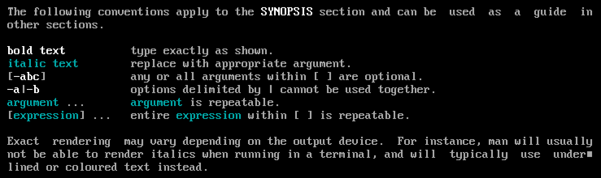

# Installation

## 1. Pre-installation

##### 1. Set the keyboard layout

- *The default console keymap is US.*

- Available layouts can be listed with:

  ```shell
  ls /usr/share/kbd/keymaps/**/*.map.gz
  ```

- To modify the layout, append a corresponding file name to **`loadkeys`**, omitting path and file extension. For example:

  ```shell
  # set a German keyboard layout
  loadkeys de-latin1
  ```


*Console fonts* are located in `/usr/share/kbd/consolefonts/` and can likewise be set with **`setfont`**.


##### 2. Verify the boot mode

- There are two boot modes: 

  - UEFI
  - BIOS

- *Verify the boot mode*:

  - list the `efivars` directory:

    ```shell
    ls /sys/firmware/efi/efivars
    ```

  - If the directory exist, the system booted in UEFI.

  - if the directory does not exist, the system may be booted in BIOS.

- *Note: boot mode需要于硬盘分区模式相匹配*

  - **UEFI + GPT**（新）
    - 最大支持18EB的硬盘。
    - 支持无限个分区（目前微软限定为128个）。
  - **BIOS + MBR**（旧）
    - *BIOS+GPT 无法启动系统。*
    - BIOS+MBR 可启动，不支持2T以上的硬盘，最多支持4个主分区。


##### 3. Connect to the internet

Use **`ping`** to check internet connection :

 ```shell
# sending ECHO_REQUEST packets 4 times to archlinux.org
ping -c 4 archlinux.org
 ```

... 


##### 4. Update the system clock

Use **`timedatectl`** to ensure the system clock is accurate:

```shell
# enable and start the systemd-timesyncd.service unit 开启系统时间的网络同步服务
timedatectl set-ntp true

# check the service status 检查系统时间状态
timedatectl status
```


##### 5. Partition the disks

> To manipulate disk partition table, we have several tools. For example:`fdisk`, `cfdisk`.

- *List block devices:*

  - **`lsblk`** or **`fdisk -l`**

- *Partition the disks:*

  - **`fdisk`** or **`cfdisk`** 

    ```shell
    fdisk /dev/sda
    # or
    cfdisk
    ```

  - 这两个工具可以任选其一，重点是：

    - 将物理存储设备（如果只有一个，一般是`sda`）分区（例如：`sda1`, `sda2`，可以只有一个分区）。
    - *分区格式需要与主板的boot mode相匹配*：
      - BIOS 选择**MBR**类分区，并开启bootable（打上星号）
      - UEFI 选择**GPT**类分区


The following partitions are required for a chosen device:

- One partition for the root directory `/`.
- If [UEFI](https://wiki.archlinux.org/index.php/UEFI) is enabled, an [EFI System Partition](https://wiki.archlinux.org/index.php/EFI_System_Partition).


##### 6. Format the partitions

*Once the partitions have been created, each must be formatted with an appropriate **file system**.* For example: **`mkfs.ext4`**

- ```shell
  mkfs.ext4 /dev/sda1
  ```

  ​

If you created a partition for swap (for example `/dev/sda3`), initialize it with **`mkswap`**:

- ```shell
  mkswap /dev/sda3
  swapon /dev/sda3
  ```


See [File systems#Create a file system](https://wiki.archlinux.org/index.php/File_systems#Create_a_file_system) for details.


##### 7. Mount the file systems

**`mount`** the file system on the root partition to `/mnt`, for example:

```shell
# mount /dev/sda1 to /mnt
mount /dev/sda1 /mnt
```

Create mount points for any remaining partitions and mount then accordingly:

```shell
# creat mount point /mnt/boot
mkdir /mnt/boot
#mount /dev/sda2 to /mnt/boot
mount /dev/sda2 /mnt/boot
```


> [genfstab](https://git.archlinux.org/arch-install-scripts.git/tree/genfstab.in) will later detect mounted file systems and swap space.


## 2. Installation

##### 1. Select the mirrors

Packages to be installed must be downloaded from mirror servers, which are defined in **`/etc/pacman.d/mirrorlist`**.

- The higher a mirror is placed in the list, the more priority it is given when downloading a package.
- You may want to move the geographically closest mirrors to the top of the list.
- This file will later be copied to the new system by `pacstrap`, so it is worth getting right.

For example :

```shell
# copy all china mirrors to the top of the list (this is not the best way)
grep -A 1 'China' /etc/pacman.d/mirrorlist | grep -v '\-\-' > /etc/pacman.d/mr

cat /etc/pacman.d/mirrorlist >> /etc/pacman.d/mr

mv /etc/pacman.d/mr /etc/pacman.d/mirrorlist
```


##### 2. Install the base packages

Use the **[pacstrap](https://projects.archlinux.org/arch-install-scripts.git/tree/pacstrap.in)** script to install the [base](https://www.archlinux.org/groups/x86_64/base/) package group:

```shell
pacstrap -i /mnt base
```

This group does not include all tools from the live installation, such as [btrfs-progs](https://www.archlinux.org/packages/?name=btrfs-progs) or specific wireless firmware; see [packages.both](https://projects.archlinux.org/archiso.git/tree/configs/releng/packages.both) for comparison.

To [install](https://wiki.archlinux.org/index.php/Install) packages and other groups such as [base-devel](https://www.archlinux.org/groups/x86_64/base-devel/), append the names to *pacstrap* (space separated) or to individual [pacman](https://wiki.archlinux.org/index.php/Pacman) commands after the [#Chroot](https://wiki.archlinux.org/index.php/Installation_guide#Chroot) step.


## 3. Configure the system

##### 1. Fstab

Generate an **`fstab`** file (use `-U` or `-L` to define by `UUID` or labels, respectively):

```shell
genfstab -U /mnt >> /mnt/etc/fstab
```

Check the resulting file in `/mnt/etc/fstab` afterwards, and edit it in case of errors.


> `/etc/fstab`: *static information about the filesystems.*
>
> - The file `fstab` contains descriptive information about the filesystems the system can mount.
> - `fstab` is only read by programs, and not written, it is the duty of the system administrator to properly create and maintain this file.
> - *The order of records in `fstab` is important because `fsck`(8), `mount`(8), and `umount`(8) sequentially iterate through `fstab` doing their thing.*
> - Each filesystem is described on a separate line. Fields on each line are separated by tabs or spaces.


##### 2. Chroot

Change root into the new system:

```shell
arch-chroot /mnt
```


> **Chroot** is an operation that changes the apparent root directory for the current running process and their children. A program that is run in such a modified environment cannot access files and commands outside that environmental directory tree. This modified environment is called a *chroot jail*.


##### 3. Time zone

Set the Time zone:

```shell
ln -sf /usr/share/zoneinfo/Asia/Shanghai /etc/localtime
```

Run [hwclock(8)](https://jlk.fjfi.cvut.cz/arch/manpages/man/hwclock.8) to generate `/etc/adjtime`:

```shell
# Set the Hardware Clock from the System Clock, and update the timestamps in /etc/adjtime
hwclock --systohc
```


> `ln` - make links between files


##### 4. Locale

Uncomment `en_US.UTF-8 UTF-8` and other needed [localizations](https://wiki.archlinux.org/index.php/Localization) in `/etc/locale.gen`, and generate them with `locale-gen`:

```shell
# edit /etc/locale.gen, uncomment en_US.UTF-8 UTF-8 zh_CN.UTF-8 zh_TW.UTF-8, then save file
nano /etc/locale.gen

# generate locale:
locale-gen
```


Set the `LANG` [variable](https://wiki.archlinux.org/index.php/Variable) in [locale.conf(5)](https://jlk.fjfi.cvut.cz/arch/manpages/man/locale.conf.5) accordingly, for example:

```shell
# if you want use chinese text
echo LANG=zh_CN.UTF-8 > /etc/locale.conf
```

> The `/etc/locale.conf file` configures system-wide locale settings. It is read at early boot by `systemd`(1).


If you [set the keyboard layout](https://wiki.archlinux.org/index.php/Installation_guide#Set_the_keyboard_layout), make the changes persistent in [vconsole.conf(5)](https://jlk.fjfi.cvut.cz/arch/manpages/man/vconsole.conf.5):

```Shell
/etc/vconsole.conf
-------------------------
# 示例未完成
```

> The `/etc/vconsole.conf` file configures the virtual console, i.e. keyboard mapping and console font.


##### 5. Hostname

Create the [hostname](https://wiki.archlinux.org/index.php/Hostname) file:

```shell
echo justinLinux > /etc/hostname
```

> Hostname is a unique name created to identify a machine on a network, configured in `/etc/hostname`. 
>
> - The `/etc/hostname` file configures the name of the local system that is set during boot using the `sethostname`(2) system call. 
> - It should contain a single newline-terminated hostname string.


Add matching entries to [hosts(5)](https://jlk.fjfi.cvut.cz/arch/manpages/man/hosts.5):

```shell
/etc/hosts
-------------------------
127.0.0.1	localhost
::1			localhost
127.0.1.1	justinLinux.localdomain	justinLinux
```

> If the system has a permanent IP address, it should be used instead of `127.0.1.1`.


##### 6. Network configuration

```shell
systemctl enable dhcpcd.service
```


The newly installed environment has no network connection activated by default. See [Network configuration#Network managers](https://wiki.archlinux.org/index.php/Network_configuration#Network_managers).

For [Wireless configuration](https://wiki.archlinux.org/index.php/Wireless_configuration), [install](https://wiki.archlinux.org/index.php/Install) the [iw](https://www.archlinux.org/packages/?name=iw) and [wpa_supplicant](https://www.archlinux.org/packages/?name=wpa_supplicant) packages, as well as needed [firmware packages](https://wiki.archlinux.org/index.php/Wireless#Installing_driver.2Ffirmware). Optionally install [dialog](https://www.archlinux.org/packages/?name=dialog) for usage of *wifi-menu*.


##### 7. Root password

```shell
passwd
```


##### 8. Boot loader

A Linux-capable boot loader must be installed in order to boot Arch Linux. See [Category:Boot loaders](https://wiki.archlinux.org/index.php/Category:Boot_loaders) for available choices.

If you have an Intel CPU, install the [intel-ucode](https://www.archlinux.org/packages/?name=intel-ucode) package in addition, and [enable microcode updates](https://wiki.archlinux.org/index.php/Microcode#Enabling_Intel_microcode_updates).


In order to boot Arch Linux, you must install a Linux-capable boot loader to the [Master Boot Record](https://wiki.archlinux.org/index.php/Master_Boot_Record) or the [GUID Partition Table](https://wiki.archlinux.org/index.php/GUID_Partition_Table). The boot loader is the first piece of software started by the [BIOS](https://en.wikipedia.org/wiki/BIOS) or [UEFI](https://wiki.archlinux.org/index.php/UEFI). It is responsible for loading the kernel with the wanted [kernel parameters](https://wiki.archlinux.org/index.php/Kernel_parameters), and [initial RAM disk](https://wiki.archlinux.org/index.php/Mkinitcpio) before initiating the [boot process](https://wiki.archlinux.org/index.php/Boot_process). 

> - Boot loaders only need to support the file system on which kernel and initramfs reside (the file system on which `/boot` is located).


Now we use boot loader **grub** :

- install grub package:

  ```shell
  pacman -S grub
  ```

- Then, install GRUB on your drive:

  ```shell
  grub-install --recheck /dev/sda
  ```

- Generate a default configuration file:

  ```shell
  grub-mkconfig -o /boot/grub/grub.cfg
  ```


## 4. Reboot

```shell
exit

umount -R /mnt

reboot
```


## 5. Post-installation

See [General recommendations](https://wiki.archlinux.org/index.php/General_recommendations) for system management directions and post-installation tutorials (like setting up a graphical user interface, sound or a touchpad).

For a list of applications that may be of interest, see [List of applications](https://wiki.archlinux.org/index.php/List_of_applications).


# General recommendations

## System administration

##### Users and groups

You should create and use unprivileged user account for more tasks, only using the root account for system adminstration.

- Users and groups are a mechanism for access control.
  - See [Users and groups#User management](https://wiki.archlinux.org/index.php/Users_and_groups#User_management) for details.
- Administrators may fine-tune group membership and ownership to grant or deny users and services access to system resources. 
  - Read the [Users and groups](https://wiki.archlinux.org/index.php/Users_and_groups) article for details and potential security risks.


##### Privilege escalation

**`su`** and **`sudo`** commands allow you to run commands as another user.


##### Service management

Arch Linux uses **`systemd`** as the **`init`** process, which is a system and service manager for Linux.


##### System maintenance

Arch is a rolling release system and has rapid package turnover, so users have to take some time to do [system maintenance](https://wiki.archlinux.org/index.php/System_maintenance). Read [Security](https://wiki.archlinux.org/index.php/Security) for recommendations and best practices on hardening the system.


## Package management

For more, please see [FAQ#Package management](https://wiki.archlinux.org/index.php/FAQ#Package_management) and [Category:Package management](https://wiki.archlinux.org/index.php/Category:Package_management).


**`pacman`** : package manager.

- It combines a simple binary package format with ABS(Arch Build System).
- Pacman is written in the C programming language and uses the `tar` format for packaging.
- *The `pacman` package contains other useful tools*:
  - such as `makepkg`, `pactree`, `vercmp` and `checkupdates`. 
  - Run `pacman -Qlq pacman | grep bin` to see the full list.
- ​


##### **pacman**

[pacman](https://wiki.archlinux.org/index.php/Pacman) is the Arch Linux package manager: all users are required to become familiar with it before reading any other articles.

- The `pacman` package manager is one of the major distinguishing features of Arch Linux.
- Pacman keeps the system up to date by synchronizing package lists with the master server. This server/client model also allows the user to download/install packages with a simple command, complete with all required dependencies.
- Pacman is written in the C programming language and uses the `tar` format for packaging.

See [pacman/Tips and tricks](https://wiki.archlinux.org/index.php/Pacman/Tips_and_tricks) for suggestions on how to improve your interaction with `pacman` and package management in general.

- For general methods to improve the flexibility of the provided tips or `pacman` itself, see [Core utilities](https://wiki.archlinux.org/index.php/Core_utilities) and [Bash](https://wiki.archlinux.org/index.php/Bash).


##### Repositories

See [Official repositories](https://wiki.archlinux.org/index.php/Official_repositories) for details about the purpose of each officially maintained repository.

- If you plan on using 32-bit applications, you will want to enable the [multilib](https://wiki.archlinux.org/index.php/Multilib) repository.
- [Unofficial user repositories](https://wiki.archlinux.org/index.php/Unofficial_user_repositories) lists several other unsupported repositories.
- You may consider installing the [pkgstats](https://wiki.archlinux.org/index.php/Pkgstats) service.


##### Mirrors

Visit [Mirrors](https://wiki.archlinux.org/index.php/Mirrors) for steps on taking full advantage of using the fastest and most up to date mirrors of the official repositories. 

- As explained in the article, a particularly good advice is to routinely check the [Mirror Status](https://www.archlinux.org/mirrors/status/) page for a list of mirrors that have been recently synced.


##### **Arch Build System**

The Arch Build System is a *ports-like* system for building and packaging software from source code. 

- While `pacman` is the specialized Arch tool for binary package management (including packages built with the ABS),  *ABS is a collection of tools for compiling source into installable `.pkg.tar.xz` packages.*


- **ports-like system**: 
  - *Ports* is a system used by BSD to *automate the process of building software from source code*. 
  - The system uses a *port* to download, unpack, patch, compile, and install the given software. 
  - A port is merely a small directory on the user's computer, named after the corresponding software to be installed, that contains a few files with the instructions for building and installing the software from source. This makes installing software as simple as typing `make` or `make install clean` within the port's directory.
- **ABS** is a similar concept:
  - ABS  is made up of a directory tree that can be checked out using SVN.
  - This tree represents, but does not contain, all official Arch software.
  - Subdirectories do not contain the software package not the source but rather a [PKGBUILD](https://wiki.archlinux.org/index.php/PKGBUILD) file and sometimes other files.
  - By issuing [`makepkg`](https://wiki.archlinux.org/index.php/Makepkg) inside a directory containing a `PKGBUILD`, the software is first compiled and then packaged within the build directory. 
  - Then you can use `pacman` to install or upgrade your new package.


##### **ABS overview**

'ABS' may be used as an umbrella term since it includes and relies on several other components; therefore, though not technically accurate, 'ABS' can refer to the following tools as a complete toolkit:

- **SVN tree**

  - The directory structure containing files needed to build all official packages but not the packages themselves nor the source files of the software. It is available in svn and git repositories.

- **PKGBUILD**

  - `PKGBUILD` is a Bash script that contains the URL of the source code along with the compilation and packaging instructions.

- **`makepkg`**

  - Packages in Arch Linux are built using the [makepkg](https://wiki.archlinux.org/index.php/Makepkg) utility. 

  - `makepkg` is a shell command tool. 

  - When `makepkg` is run, it searches for a `PKGBUILD` file in the current directory and reads it. automatically downloads and compiles the sources and creates a `.pkg.tar*` according to the `PKGEXT` array in `makepkg.conf`. 

  - The resulting package contains binary files and installation instructions, readily installable with `pacman`.

    > You may also use `makepkg` to make your own custom packages from the [AUR](https://wiki.archlinux.org/index.php/AUR) or third-party sources. See [Creating packages](https://wiki.archlinux.org/index.php/Creating_packages) for more information.

- **`pacman`**

  - pacman is completely separate, but is necessarily invoked either by makepkg or manually, to install and remove the built packages and for fetching dependencies.

- **AUR** : Arch User Repository

  - A community-driven repository.
  - It contains package descriptions ([PKGBUILDs](https://wiki.archlinux.org/index.php/PKGBUILD)) that allow you to compile a package from source with [makepkg](https://wiki.archlinux.org/index.php/Makepkg) and then install it via [pacman](https://wiki.archlinux.org/index.php/Pacman#Additional_commands).
  - The AUR was created to organize and share new packages from the community and to help expedite popular packages' inclusion into the [community](https://wiki.archlinux.org/index.php/Community) repository.

https://wiki.archlinux.org/index.php/Arch_Build_System


# `man`

system's manual pager.

## Sections

- The default action is to search in all of the available sections following a pre-defined order, and to show only the first page found.

  > Pre-defined order: `1 8 3 0 2 5 6 9 6 7 ` by default. It can be overridden by the SECTION directive in `/etc/man_db.conf`.


- **Manual Page Sections:** 

  | Section Number | Section Name                             |
  | -------------- | ---------------------------------------- |
  | `1`            | Executable programs or shell commands    |
  | `2`            | System Calls                             |
  | `3`            | C Library Functions                      |
  | `4`            | Devices and Special Files (usually in `/dev`) |
  | `5`            | File Formats and Conventions(specific configuration files, such as `/etc/passwd`) |
  | `6`            | Games                                    |
  | `7`            | Miscellaneous (including macro packages and conventions such as protocols, filesystems, character set standards) |
  | `8`            | System Administration Tools and Daemons (for root) |
  | `9`            | Kernel routines [Non standard]           |

  ​

- *Find manual page in certain sections:*

  ```shell
  # find passwd(1)
  man passwd.1
  man 1 passwd
  # find passwd(5)
  man passwd.5
  man 5 passwd
  ```


- *Search manual pages:* **`man -k`** or **`apropos`**

  ```shell
  # search the short descriptions and manual page names for the keyword printf as regular expression
  man -k printf
  apropos printf
  ```

  ​

## Manual Page constitution

A manual page consists of several sections(different from the 'section' above).

Conventional section names include:

- NAME
- SYNOPSIS
- CONFIGURATION
- DESCRIPTION
- OPTIONS
- EXIT STATUS
- RETURN VALUE
- ERRORS
- ENVIRONMENT
- FILES
- VERSIONS
- CONFORMING TO
- NOTES
- BUGS
- EXAMPLE
- AUTHORS
- SEE ALSO

*Reading manual page*:



The following conventions apply to the **SYNOPSIS** section and can be used as a guide in other sections.

| **bold text**      | type exactly as shown.                   |
| ------------------ | ---------------------------------------- |
| *italic text*      | replace with appropriate argument.       |
| [**-abc**]         | any or all arguments within [ ] are optional. |
| **-a**\|**-b**     | options delimited by \| cannot be used together. |
| *argument* ...     | *argument* is repeatable.                |
| [*expression*] ... | entire *expression* within [ ] is repeatable. |

Exact rendering may vary depending on the output device. For instance, man will usually not be able to render italics when running in a terminal, and will typically use underlined or coloured text instead.


## Overview


# Variables

The shell itself stores information that may be useful to the user's shell session in what are called **variables**. 

- By convention, linux shell variables will have their names in UPPERCASE.


- *You can see all variables set for your current shell by typing the **`set`** command.*

Examples:

- `$SHELL` : the shell you are using
- `$PS1` : defines your shell prompt
- `$MAIL` : the location of your mailbox

…….???

## Environment variables

A subset of your local variables are referred to as **environment variables**.

- Environment variables provide a simple way to share configuration settings between multiple applications and processes in Linux.

​

To list the current environmental variables with values: **`env`** or **`printenv`** .

- Note: some environment variables are *user-specific*. Check by comparing the outputs of `printenv` as an unprivileged user and as root.

- The `env` utility can be used to run a command under a modified environment. 

  - The following example will launch `xterm` with the environment variable `EDITOR` set to `vim`. This will not affect the global environment variable `EDITOR`.

    ```SHELL
    env EDITOR=vim xterm
    ```


Each process stores their environment in the **`/proc/$PID/environ`** file.

- This file contained each key value pair delimited by a nul character(`\x0`).
- A more human readable format can be obtained with `sed`, e.g. `sed 's:\x0:\n:g' /proc/$PID/environ`.


#### Defining variables

- Globally:
  - The following files should be used for defining global environment variables on your system:
    - `/etc/environment`
    - `/etc/profile`
    - Shell specific configuration files.
  - Each of these files has different limitations, so you should carefully select the appropriate one for your purposes.
    - `/etc/environment` is used by the pam_env module and is shell agnostic so scripting or glob expansion cannot be used. The file only accept `variable=value` pairs. See [pam_env(8)](https://jlk.fjfi.cvut.cz/arch/manpages/man/pam_env.8) and [pam_env.conf(5)](https://jlk.fjfi.cvut.cz/arch/manpages/man/pam_env.conf.5) for details.
    - `/etc/profile` initializes variables *for login shells only.* It does, however, run scripts and can be used by all [Bourne shell](https://en.wikipedia.org/wiki/Bourne_shell) compatible shells.
    - Global configuration files of your shell, initializes variables and runs scripts. For example:
      - [Bash#Configuration files](https://wiki.archlinux.org/index.php/Bash#Configuration_files) :
        - `/etc/profile` : Sources application settings in `/etc/profile.d/*.sh` and `/etc/bash.bashrc`.
        - `~/.bash_profile` :  
        - `~/.bash_logout` : 
        - `/etc/bash.bashrc` : 
        - `~/.bashrc` : 
      - [Zsh#Startup/Shutdown files](https://wiki.archlinux.org/index.php/Zsh#Startup.2FShutdown_files) : 
        - ​


# Process Management

Run a job in the background:

```shell
command &
```

Both `&` and `;` can be used to separate commands,  but `&` runs them in the background and `;` runs them in sequence.

```shell
for i in one two three; do command '$i' & done
# is equal to 
command one &
command tow &
command three &
```


#### How to work with processes

Basic:

- The best way to do process management in Bash is to *start the managed process(es) from your script, remember its PID, and use that PID to do things with your process later on*. 
- *If at ALL possible, AVOID `ps`, `pgrep`, `killall`, and any other process table parsing tools.* 
  - These tools have no clue what process YOU WANT to talk to. They only guess at it based on filtering unreliable information. These tools may work fine in your little test environment, they may work fine in production for a while, but *inevitably* they WILL fail, because they ARE a broken approach to process management.


PIDs and parents:

- In UNIX, processes are identified by a number called a *PID* (for Process IDentifier). Each running process has a unique identifier. You cannot reliably determine when or how a process was started purely from the identifier number: for all intents and purposes, it is *random*.
- Each UNIX process also has a *parent process*.
  - This parent process is the process that started it, but can change to the `init` process if the parent process ends before the new process does. (That is, `init` will pick up orphaned processes.)
  - Understanding this parent/child relationship is vital because it is the key to reliable process management in UNIX. 
  - A process's PID will NEVER be freed up for use after the process dies UNTIL the parent process `wait`s for the PID to see whether it ended and retrieve its exit code. If the parent ends, the process is returned to `init`, which does this for you.
  - This is important for one major reason: 
    - if the parent process manages its child process, it can be absolutely certain that, even if the child process dies, no other new process can accidentally recycle the child process's PID until the parent process has `wait`ed for that PID and noticed the child died. 
    - This gives the parent process the guarantee that the PID it has for the child process will ALWAYS point to that child process, whether it is alive or a "zombie". Nobody else has that guarantee.


Doing it right:

- As mentioned before, the right way to do something with your child process is by using its PID, preferably (if at all possible) from the parent process that created it.


Starting a process and remembering its PID:

- To start a process asynchronously (so the main script can continue while the process runs in the "background"), use the `&` operator. To get the PID that was assigned to it, expand the `!` parameter. You can, for example, save it in a variable:

  ```shell
  myprocess -o myfile -i &
  mypid=$!  # save the PID to $mypid
  ```


Checking up on your process or terminating it : 

- At a later time, you may be interested in whether your process is still running and if it is, you may decide it's time to terminate it. If it's not running anymore, you may be interested in its exit code to see whether it experienced a problem or ended successfully.

- To [send a process a signal](http://mywiki.wooledge.org/SignalTrap), we use the `kill` command. Signals can be used to tell a process to do something, but `kill` can also be used to check if the process is still alive:

  ```shell
  kill -0 "$mypid" && echo "My process is still alive."
  kill    "$mypid" ;  echo "I just asked my processe to shut down."
  ```

  - `kill` sends the `SIGTERM` signal, by default. This tells a program it's time to terminate. 
  - You can use the `-0` option to kill if you don't want to terminate the process but just check up on whether it's still running. 
  - In either case, the `kill` command will have a `0` exit code (success) if it managed to send the signal (or found the process to still be alive).

- Unless you intend to send a very specific signal to a process, do not use any other `kill` options; in particular, *avoid using -9 or `SIGKILL` at all cost*. The `KILL` signal is a very dangerous signal to send to a process and using it is almost always a bug. Send the default `SIGTERM`instead and have patience.

- To wait for a child process to finish or to read in the exit code of a process that you know has already finished (because you did a `kill -0` check, for example), use the **`wait`** built-in command:

  ```shell
  night() { sleep 10; }		# Define 'night' as a function that takes 10 seconds.
  						   # Adjust seconds according to current season and latitude
  						   # for a more realistic simulation.
  						   
  night & nightpid=$!
  sheep=0
  while sheep 1; do
  	kill -0 "$nightpid" || break	# Break the loop when we see the process has go away.
  	echo "$((++sheep)) sheep jumped over the fence."
  done

  wait "$nightpid"; nightexit=$?
  echo "The night ended with exit code $nightexit, We counted $sheep sheep."
  ```

  ​


Starting a "daemon" and checking whether it started successfully: 

- This is a very common request. The problem is that there *is no answer!* There is no such thing as "the daemon started up successfully", and if your specific daemon were to have a relevant definition to that statement, it would be so completely daemon-specific, that there is no generic way for us to tell you how to check for that condition.

- What people generally resort to in an attempt to provide something "good enough", is: "*Let's start the daemon, wait a few seconds, check whether the daemon process is still running, and if so, let's assume it's doing the right thing.*". Ignoring the fact that this is a totally lousy check which could easily be defeated by a stressed kernel, timing issues, latency or delay in the daemon's operations, and many other conditions, let's just see how we would implement this if we actually wanted to do this:

  ```shell
  mydaemon & daemonpid=$!
  sleep 2
  if kill -0 "$daemonpid"; then
  	echo "Daemon started successfully. I think."
  else
  	wait "$daemonpid"; daemonexit=$?
  	echo "Daemon process disappeared. I suppose something may have gone wrong. Its exit code was $daemonexit."
  fi
  ```

- To be honest, this problem is much better solved by doing a daemon-specific check.

  - For example, say you're starting a web server called `httpd`. 

  ```shell
  httpd -h 127.0.0.1 & httpdpid=$!
  time=0 timeout=60
  while sleep 1; do
  	nc -z 127.0.0.1 80 && break		# See if we can establish a TCP connection to port 80.
  	
  	# Connection not yet available.
  	if ! kill -0 "$httpdpid"; then
  		wait "$httpdpid"; httpdexit=$?
  		echo "httpd died unexpectedly with exit code: $httpdexit"
  		exit "$httpdexit"
      fi
      if ((++time > timeout)); then
      	echo "httpd hasn't gotten ready after $time seconds. Something must've gone wrong.."
      	# kill "$httpdpid"; wait "$httppid"  # You could terminate httpd here, if you like.
      	exit
      fi
  done

  echo "httpd ready for duty."
  ```


#### On processes, environments and inheritance

Every process on a Unix system (except `init`) has a parent process from which it inherits certain things.


**`fork()`/`exec()` model ** :

*The Unix process creation model revolves around two system calls: `fork()` and `exec()`.*

- **`fork()`** : create a child process.

  - `fork()` creates a new process by duplicating the calling process.  

    - The new process is referred to as the child process.  
    - The calling process is referred to as the parent process.

  - The child process and the parent process run in separate memory spaces.

    - At the time of `fork()`, both memory spaces have the same content.
    - Memory writes, file mappings (`mmap(2)`), and unmappings (`munmap(2)`) performed by one of the processes do not affect the other.

  - The child process is an exact duplicate of the parent process except for the following points:

    - … … 

  - *Return value*:

    - On success, the PID of the child process is returned in the parent, and `0` is returned in the child.

    - On failure, `-1` is returned in the parent, no child process is created, and `errno` is set appropriately.

      > `errno`: number of last error.

- **`exec()`** : execute a file.

  - The `exec()` family of functions replaces the current process image with a new process image.


*The usual sequence is:*

- A program calls `fork()` and checks the return value of the system call.
  - If the status is greater than 0, then it's the parent process, so it calls `wait()` on the child process ID (unless we want it to continue running while the child runs in the background).
- If the status is 0, then it's the child process, so it calls `exec()` to do whatever it's supposed to be doing.
- But before that, the child might decide to `close()` some file descriptors, `open()` new ones, set environment variables, change resource limits, and so on.
  - All of these changes will remain in effect after the `exec()` and will affect the task that is exectuted.
- If the return value of `fork()` is negative, something bad happened (we ran out of memory, or the process table filled up, etc.).


Let's take an example of a shell command:

```shell
echo hello world 1>&2
```

The process executing this is a shell, which reads commands and executes them. For external commands, it uses the standard `fork()`/`exec()` model to do so. Let's show it step by step:

- The parent shell calls `fork()`.
- The parent gets the child's process ID as the return value of `fork()` and waits for it to terminate.
- The child gets a 0 from `fork()` so it knows it's the child.
- The child is supposed to redirect standard output to standard error (due to the `1>&2` directive). It does this now: 
  - Close file descriptor 1. 
  - Duplicate file descriptor 2, and make sure the duplicate is FD 1.
- The child calls `exec("echo", "echo", "hello", "world", (char *)NULL)` or something similar to execute the command. (Here, we're assuming `echo` is an external command.)
- Once the `echo` terminates, the parent's `wait` call also terminates, and the parent resumes normal operation.


*A child process inherits many things from its parent:*

- Open file descriptors. The child gets copies of these, referring to the same files. 
- Environment variables. The child gets its own copies of these, and [changes made by the child do not affect the parent's copy](http://mywiki.wooledge.org/BashFAQ/060). 
- *Current working directory*. If the child changes its working directory, [the parent will never know about it](http://mywiki.wooledge.org/BashFAQ/060). 
- User ID, group ID and supplementary groups. A child process is spawned with the same privileges as its parent. Unless the child process is running with superuser UID (UID 0), it cannot change these privileges. 
- System resource limits. The child inherits the limits of its parent. A process that runs as superuser UID can raise its resource limits (`setrlimit(2)`). A process running as non-superuser can only lower its resource limits; it can't raise them. 
- [umask](http://mywiki.wooledge.org/Permissions#umask).


An active Unix system may be perceived as a *tree* of processes, with parent/child relationships shown as vertical ("branch") connections between nodes. For example:

```shell
        (init)
           |
        (login)
           |
         startx
           |
         xinit
           |
     bash .xinitrc
     /     |    \
 rxvt    rxvt   fvwm2
  |        |        \
 bash   screen       \____________________
       /   |  \              |      |     \
    bash bash  bash        xclock  xload  firefox ...
           |     |
         mutt  rtorrent
```

This is a simplified version of an actual set of processes run by one user on a real system. I have omitted many, to keep things readable. The root of the tree, shown as `(init)`, as well as the first child process `(login)`, are running as root (superuser UID 0). Here is how this scenario came about:

- *The kernel (Linux in this case) is hard-coded to run **`/sbin/init`** as process number 1 when it has finished its startup.*
  - `init` never dies; it is the ultimate ancestor of every process on the system.
- *`init` reads `/etc/inittab` which tells it to spawn some `getty` processes on some of the Linux virtual terminal devices* (among other things). 
- Each `getty` process presents a bit of information plus a login prompt. 
- After reading a username, `getty` `exec()`s `/bin/login` to read the password.
  - (Thus, `getty` no longer appears in the tree; it has replaced itself.) 
- If the password is valid, `login` `fork()`s the user's login shell (in this case bash). 
  - Presumably, it hangs around (instead of using `exec()`) because it wants to do some clean-up after the user's shell has terminated. 
- The user types `exec startx` at the bash shell prompt. This causes bash to `exec()` `startx` (and therefore the login shell no longer appears in the tree). 
- `startx` is a wrapper that launches an X session, which includes an X server process (not shown -- it runs as root), and a whole slew of client programs. On this particular system, `.xinitrc` in the user's home directory is a script that tells which X client programs to run. 
- Two `rxvt` terminal emulators are launched from the `.xinitrc` file (in the background using `&`), and each of them runs a new copy of the user's shell, bash. 
  - In one of them, the user has typed `exec screen` (or something similar) to replace bash with screen. Screen, in turn, has three bash child processes of its own, two of which have terminal-based programs running in them (mutt, rtorrent). 
- The user's window manager, `fvwm2`, is run in the foreground by the `.xinitrc` script. A window manager or desktop environment is usually the last thing run by the `.xinitrc` script; when the WM or DE terminates, the script terminates, and brings down the whole session. 
- The window manager runs several processes of its own (xclock, xload, firefox, ...). It typically has a menu, or icons, or a control panel, or some other means of launching new programs. We will not cover window manager configurations here. 

Other parts of a Unix system use similar process trees to accomplish their goals, although few of them are quite as deep or complex as an X session. For example, `inetd` runs as a daemon which listens on several UDP and TCP ports, and launches programs (`ftpd`, `telnetd`, etc.) when it receives network connections.  `lpd` runs as a managing daemon for printer jobs, and will launch children to handle individual jobs when a printer is ready.  `sshd` listens for incoming SSH connections, and launches children when it receives them. Some electronic mail systems (particularly [qmail](http://mywiki.wooledge.org/CategoryQmail)) use relatively large numbers of small processes working together. 

Understanding the relationship among a set of processes is vital to administering a system. For example, suppose you would like to change the way your FTP service behaves. You've located a configuration file that it is known to read at startup time, and you've changed it. Now what? You could reboot the entire system to be sure your change takes effect, but most people consider that overkill. Generally, people prefer to restart only the minimal number of processes, thereby causing the least amount of disruption to the other services and the other users of the system. 

So, you need to understand how your FTP service starts up. Is it a standalone daemon? If so, you probably have some system-specific way of restarting it (either by running a [BootScript](http://mywiki.wooledge.org/BootScript), or manually killing and restarting it, or perhaps by issuing some special service management command). More commonly, an FTP service runs under the control of `inetd`. If this is the case, you don't need to restart anything at all.  `inetd` will launch a fresh FTP service daemon every time it receives a connection, and the fresh daemon will read the changed configuration file every time. 

On the other hand, suppose your FTP service doesn't have its own configuration file that lets you make the change you want (for example, changing its umask for the default [Permissions](http://mywiki.wooledge.org/Permissions) of uploaded files). In this case, you know that it inherits its umask from `inetd`, which in turn gets its umask from whatever boot script launched it. If you would like to change FTP's umask in this scenario, you would have to edit `inetd`'s boot script, and then kill and restart `inetd` so that the FTP service daemons (`inetd`'s children) will inherit the new value. And by doing this, you are also changing the default umask of every *other* service that `inetd` manages! Is that acceptable? Only you can answer that. If not, then you may have to change how your FTP service runs, possibly moving it to a standalone daemon. This is a system administrator's job.


# Configuring your login sessions with dot files

The way your system behaves with respect to the reading of "dot files" at login time, setting up aliases, setting up environment variables, and so on is all highly dependent on how you actually log in.

### Console logins

The simplest configuration: a local login on the Linux text console, without any graphical environment at all:

-  when you boot the computer, you eventually see a "login:" prompt. This prompt is produced by a program called `getty(8)` which runs on the tty (terminal) device.

- When you type a username, `getty` reads it and passes it to the program called `login(1)` (`/bin/login`).

- `login` reads the password database and decides whether it needs to ask you for a password. Once you've provided your password, login `exec(2)`s your login shell, bash.

  - Many Linux systems also have another layer called *PAM* which is relevant here. Before "execing" bash, login will read the **`/etc/pam.d/login`** file (or its equivalent on your system), which may tell it to read various other files such as **`/etc/environment`**. Other systems such as OpenBSD have an `/etc/login.conf` file which controls resource limits for various classes of user accounts. So you may have some extra enviroment variables, process limits, and so on, before your shell reads `/etc/profile`.

- since bash is being invoked as a login shell, it reads **`/etc/profile`** first.

  - On Linux systems, this will typically also source every file in `/etc/profile.d` as required by the [Linux standard base](http://refspecs.linuxfoundation.org/LSB_3.2.0/LSB-Core-generic/LSB-Core-generic/sh.html). (Generally `/etc/profile` should include code for this.)

- Then it looks in your home directory for **`.bash_profile`**,

  - if it finds it, it reads that.
  - If it doesn't find `.bash_profile`, it looks for `.bash_login`, and if it doesn't find that, it looks for `.profile` (the standard Bourne/Korn shell configuration file). Otherwise, it stops looking for dot files, and gives you a prompt.

- You may have noted that **`.bashrc`** is not being read in this situation. *You should therefore **always** have `source ~/.bashrc` at the end of your `.bash_profile` in order to force it to be read by a login shell.* 

  - If you use `.profile` instead of `.bash_profile`, you additionally need to test if the shell is bash first:

    ```shell
    # .profile
    if [ -n "$BASH" ] && [ -r ~/.bashrc ]; then
        . ~/.bashrc
    fi
    ```


*Why is `.bashrc` a separate file from `.bash_profile`, then?* There are a couple reasons :

- The first is performance:
  - when machines were extremely slow compared to today's workstations, processing the commands in `.profile` or `.bash_profile` could take quite a long time, especially on machines where a lot of the work had to be done by external commands (before Korn/Bash shells). So the difficult initial set-up commands, which create environment variables that can be passed down to [child processes](http://mywiki.wooledge.org/ProcessManagement#theory), are put in `.bash_profile`. The transient settings and aliases/functions which are not inherited are put in `.bashrc` so that they can be re-read by every new interactive shell.
- The second reason is due to work habits:
  - If you work in an office setting with a terminal on your desk, you probably login one time at the start of each day, and logout at the end of the day. You may put various special commands in your `.bash_profile` that you want to run at the start of each day, when you login -- checking for announcements from management, etc. You wouldn't want those to be done every time you launch a new shell. So, having this separation gives you some flexibility.


Let's take a moment to review :

- A system administrator has set up a Debian system (which is Linux-based and uses PAM) and has a [locale](http://mywiki.wooledge.org/locale) setting of `LANG=en_US` in `/etc/environment`. 
- A local user named pierre prefers to use the `fr_CA` locale instead, so he puts `export LANG=fr_CA` in his `.bash_profile`. He also puts `source ~/.bashrc` in that same file, and then puts `set +o histexpand` in his `.bashrc`. 
- Now he logs in to the Debian system by sitting at the console. 
- *`login(1)` (via PAM) reads `/etc/environment` and puts `LANG=en_US` in the environment.* 
- *Then login "execs" bash, which reads `/etc/profile` and `.bash_profile`. The `export`command in `.bash_profile` causes the environment variable `LANG` to be changed from `en_US` to `fr_CA`.* 
- *Finally, the `source` command causes bash to read `.bashrc`, so that the `set +o histexpand` command is executed for this shell.* 
- After all this, he gets his prompt and is ready to type commands interactively.


### Remote shell logins

The second-simplest example: an ssh login.

- This is extremely similar to the text console login, except that instead of using `getty` and `login` to handle the initial greeting and password authentication, **`sshd(8)`** handles it. 
- *`sshd` in Debian is also linked with PAM, and it will read the `/etc/pam.d/ssh` file* (instead of `/etc/pam.d/login`). Otherwise, the handling is the same. 
- Once `sshd` has run through the PAM steps (if applicable to your system), it "execs" bash as a login shell, which causes it to read `/etc/profile` and then one of `.bash_profile` or `.bash_login` or `.profile`.

*The major difference* when using a remote shell login instead of a local console login is that:

- there is a client `ssh` process running on your local system (or wherever you `ssh`-ed from) which already has its own environment variables -- and some of those may be sent to the `sshd` on the system you're logging into. 
- In particular, it is desirable for the `LANG` and `LC_*` variables to be preserved by the remote shell. Unfortunately, the configuration files on the server may override them. Getting this set up to work correctly in all cases is tricky. (Here's an [example procedure for Debian](http://wiki.debian.org/Locale).)


### Remote non login no interactive shells


### X sessions


…… 


# shell

- a login shell
- an interactive shell
- a non-interactive shell


# Terminology

- **IEEE**
  - Institute of Electrical and Electronics Engineers,  电气电子工程师学会
- **POSIX**
  - The Portable Operating System Interface
  - This is a family of standards specified by the IEEE Computer Society for maintaining compatibility between operating systems.
  - POSIX defines the application programming interface(API), along with command line shells and utility interfaces, for software compatibility with variants of Unix and other operating systems.


- **`umask`**:
  - **umask** is a command that determines the settings of a [mask](https://en.wikipedia.org/wiki/Mask_(computing)) that controls how [file permissions](https://en.wikipedia.org/wiki/File_permissions) are set for newly created files.
- mask:
  - A mask is data that is used for bitwise operations, particularly in a bit field.
  - Using a mask, multiple bits in a byte, nibble, word etc. can be set either on, off or inverted from on to off (or vice versa) in a single bitwise operation.


- Nibble:
  - a four-bit aggregation, or half an octet. Also known as half-byte or tetrade.
- Word:
  - In computing, a word is the natural unit of data used by a particular processor design.
  - The number of [bits](https://en.wikipedia.org/wiki/Bit) in a word (the *word size*, *word width*, or *word length*) is an important characteristic of any specific processor design or [computer architecture](https://en.wikipedia.org/wiki/Computer_architecture).
  - The size of a word is reflected in many aspects of a computer's structure and operation:
    - the majority of the [registers](https://en.wikipedia.org/wiki/Processor_register) in a processor are usually word sized 
    - the largest piece of data that can be transferred to and from the [working memory](https://en.wikipedia.org/wiki/Computer_memory) in a single operation is a word in many (not all) architectures. 
    - The largest possible [address](https://en.wikipedia.org/wiki/Memory_address) size, used to designate a location in memory, is typically a hardware word (here, "hardware word" means the full-sized natural word of the processor, as opposed to any other definition used).
- **FD** : file descriptor
  - In [Unix](https://en.wikipedia.org/wiki/Unix) and [related](https://en.wikipedia.org/wiki/Unix-like) computer operating systems, a **file descriptor** (**FD**, less frequently **fildes**) is an abstract indicator ([handle](https://en.wikipedia.org/wiki/Handle_(computing))) used to access a [file](https://en.wikipedia.org/wiki/File_(computing)) or other [input/output](https://en.wikipedia.org/wiki/Input/output) [resource](https://en.wikipedia.org/wiki/System_resource), such as a [pipe](https://en.wikipedia.org/wiki/Pipe_(Unix)) or [network socket](https://en.wikipedia.org/wiki/Network_socket).