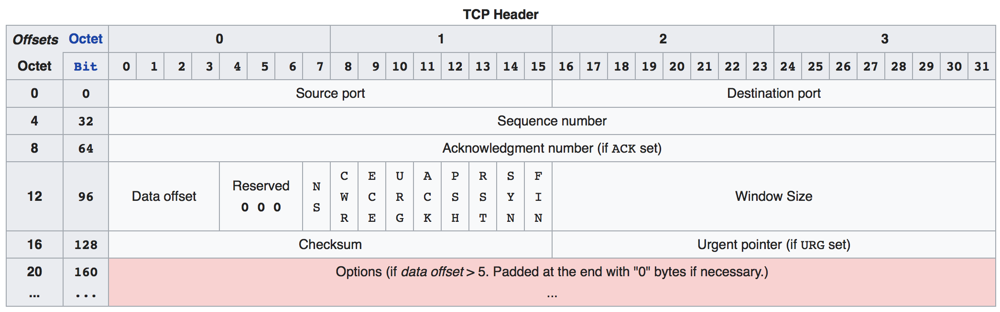
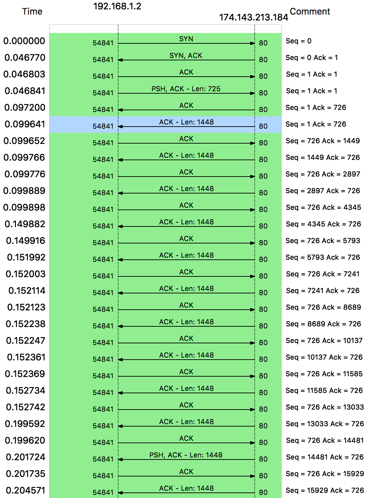
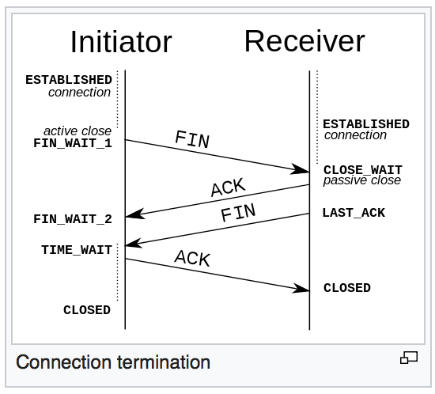

# Installation

## 1. Pre-installation

##### 1. Set the keyboard layout

- *The default console keymap is US.*

- Available layouts can be listed with:

  ```shell
  ls /usr/share/kbd/keymaps/**/*.map.gz
  ```

- To modify the layout, append a corresponding file name to **`loadkeys`**, omitting path and file extension. For example:

  ```shell
  # set a German keyboard layout
  loadkeys de-latin1
  ```


*Console fonts* are located in `/usr/share/kbd/consolefonts/` and can likewise be set with **`setfont`**.


##### 2. Verify the boot mode

- There are two boot modes: 

  - UEFI
  - BIOS

- *Verify the boot mode*:

  - list the `efivars` directory:

    ```shell
    ls /sys/firmware/efi/efivars
    ```

  - If the directory exist, the system booted in UEFI.

  - if the directory does not exist, the system may be booted in BIOS.

- *Note: boot mode需要于硬盘分区模式相匹配*

  - **UEFI + GPT**（新）
    - 最大支持18EB的硬盘。
    - 支持无限个分区（目前微软限定为128个）。
  - **BIOS + MBR**（旧）
    - *BIOS+GPT 无法启动系统。*
    - BIOS+MBR 可启动，不支持2T以上的硬盘，最多支持4个主分区。


##### 3. Connect to the internet

Use **`ping`** to check internet connection :

 ```shell
# sending ECHO_REQUEST packets 4 times to archlinux.org
ping -c 4 archlinux.org
 ```

... 


##### 4. Update the system clock

Use **`timedatectl`** to ensure the system clock is accurate:

```shell
# enable and start the systemd-timesyncd.service unit 开启系统时间的网络同步服务
timedatectl set-ntp true

# check the service status 检查系统时间状态
timedatectl status
```


##### 5. Partition the disks

> To manipulate disk partition table, we have several tools. For example:`fdisk`, `cfdisk`.

- *List block devices:*

  - **`lsblk`** or **`fdisk -l`**

- *Partition the disks:*

  - **`fdisk`** or **`cfdisk`** 

    ```shell
    fdisk /dev/sda
    # or
    cfdisk
    ```

  - 这两个工具可以任选其一，重点是：

    - 将物理存储设备（如果只有一个，一般是`sda`）分区（例如：`sda1`, `sda2`，可以只有一个分区）。
    - *分区格式需要与主板的boot mode相匹配*：
      - BIOS 选择**MBR**类分区，并开启bootable（打上星号）
      - UEFI 选择**GPT**类分区


The following partitions are required for a chosen device:

- One partition for the root directory `/`.
- If [UEFI](https://wiki.archlinux.org/index.php/UEFI) is enabled, an [EFI System Partition](https://wiki.archlinux.org/index.php/EFI_System_Partition).


##### 6. Format the partitions

*Once the partitions have been created, each must be formatted with an appropriate **file system**.* For example: **`mkfs.ext4`**

- ```shell
  mkfs.ext4 /dev/sda1
  ```

  ​

If you created a partition for swap (for example `/dev/sda3`), initialize it with **`mkswap`**:

- ```shell
  mkswap /dev/sda3
  swapon /dev/sda3
  ```


See [File systems#Create a file system](https://wiki.archlinux.org/index.php/File_systems#Create_a_file_system) for details.


##### 7. Mount the file systems

**`mount`** the file system on the root partition to `/mnt`, for example:

```shell
# mount /dev/sda1 to /mnt
mount /dev/sda1 /mnt
```

Create mount points for any remaining partitions and mount then accordingly:

```shell
# creat mount point /mnt/boot
mkdir /mnt/boot
#mount /dev/sda2 to /mnt/boot
mount /dev/sda2 /mnt/boot
```


> [genfstab](https://git.archlinux.org/arch-install-scripts.git/tree/genfstab.in) will later detect mounted file systems and swap space.


## 2. Installation

##### 1. Select the mirrors

Packages to be installed must be downloaded from mirror servers, which are defined in **`/etc/pacman.d/mirrorlist`**.

- The higher a mirror is placed in the list, the more priority it is given when downloading a package.
- You may want to move the geographically closest mirrors to the top of the list.
- This file will later be copied to the new system by `pacstrap`, so it is worth getting right.

For example :

```shell
# copy all china mirrors to the top of the list (this is not the best way)
grep -A 1 'China' /etc/pacman.d/mirrorlist | grep -v '\-\-' > /etc/pacman.d/mr

cat /etc/pacman.d/mirrorlist >> /etc/pacman.d/mr

mv /etc/pacman.d/mr /etc/pacman.d/mirrorlist
```


##### 2. Install the base packages

Use the **[pacstrap](https://projects.archlinux.org/arch-install-scripts.git/tree/pacstrap.in)** script to install the [base](https://www.archlinux.org/groups/x86_64/base/) package group:

```shell
pacstrap -i /mnt base
```

This group does not include all tools from the live installation, such as [btrfs-progs](https://www.archlinux.org/packages/?name=btrfs-progs) or specific wireless firmware; see [packages.both](https://projects.archlinux.org/archiso.git/tree/configs/releng/packages.both) for comparison.

To [install](https://wiki.archlinux.org/index.php/Install) packages and other groups such as [base-devel](https://www.archlinux.org/groups/x86_64/base-devel/), append the names to *pacstrap* (space separated) or to individual [pacman](https://wiki.archlinux.org/index.php/Pacman) commands after the [#Chroot](https://wiki.archlinux.org/index.php/Installation_guide#Chroot) step.


## 3. Configure the system

##### 1. Fstab

Generate an **`fstab`** file (use `-U` or `-L` to define by `UUID` or labels, respectively):

```shell
genfstab -U /mnt >> /mnt/etc/fstab
```

Check the resulting file in `/mnt/etc/fstab` afterwards, and edit it in case of errors.


> `/etc/fstab`: *static information about the filesystems.*
>
> - The file `fstab` contains descriptive information about the filesystems the system can mount.
> - `fstab` is only read by programs, and not written, it is the duty of the system administrator to properly create and maintain this file.
> - *The order of records in `fstab` is important because `fsck`(8), `mount`(8), and `umount`(8) sequentially iterate through `fstab` doing their thing.*
> - Each filesystem is described on a separate line. Fields on each line are separated by tabs or spaces.


##### 2. Chroot

Change root into the new system:

```shell
arch-chroot /mnt
```


> **Chroot** is an operation that changes the apparent root directory for the current running process and their children. A program that is run in such a modified environment cannot access files and commands outside that environmental directory tree. This modified environment is called a *chroot jail*.


##### 3. Time zone

Set the Time zone:

```shell
ln -sf /usr/share/zoneinfo/Asia/Shanghai /etc/localtime
```

Run [hwclock(8)](https://jlk.fjfi.cvut.cz/arch/manpages/man/hwclock.8) to generate `/etc/adjtime`:

```shell
# Set the Hardware Clock from the System Clock, and update the timestamps in /etc/adjtime
hwclock --systohc
```


> `ln` - make links between files


##### 4. Locale

Uncomment `en_US.UTF-8 UTF-8` and other needed [localizations](https://wiki.archlinux.org/index.php/Localization) in `/etc/locale.gen`, and generate them with `locale-gen`:

```shell
# edit /etc/locale.gen, uncomment en_US.UTF-8 UTF-8 zh_CN.UTF-8 zh_TW.UTF-8, then save file
nano /etc/locale.gen

# generate locale:
locale-gen
```


Set the `LANG` [variable](https://wiki.archlinux.org/index.php/Variable) in [locale.conf(5)](https://jlk.fjfi.cvut.cz/arch/manpages/man/locale.conf.5) accordingly, for example:

```shell
# if you want use chinese text
echo LANG=zh_CN.UTF-8 > /etc/locale.conf
```

> The `/etc/locale.conf file` configures system-wide locale settings. It is read at early boot by `systemd`(1).


If you [set the keyboard layout](https://wiki.archlinux.org/index.php/Installation_guide#Set_the_keyboard_layout), make the changes persistent in [vconsole.conf(5)](https://jlk.fjfi.cvut.cz/arch/manpages/man/vconsole.conf.5):

```Shell
/etc/vconsole.conf
-------------------------
# 示例未完成
```

> The `/etc/vconsole.conf` file configures the virtual console, i.e. keyboard mapping and console font.


##### 5. Hostname

Create the [hostname](https://wiki.archlinux.org/index.php/Hostname) file:

```shell
echo justinLinux > /etc/hostname
```

> Hostname is a unique name created to identify a machine on a network, configured in `/etc/hostname`. 
>
> - The `/etc/hostname` file configures the name of the local system that is set during boot using the `sethostname`(2) system call. 
> - It should contain a single newline-terminated hostname string.


Add matching entries to [hosts(5)](https://jlk.fjfi.cvut.cz/arch/manpages/man/hosts.5):

```shell
/etc/hosts
-------------------------
127.0.0.1	localhost
::1			localhost
127.0.1.1	justinLinux.localdomain	justinLinux
```

> If the system has a permanent IP address, it should be used instead of `127.0.1.1`.


##### 6. Network configuration

```shell
systemctl enable dhcpcd.service
```


The newly installed environment has no network connection activated by default. See [Network configuration#Network managers](https://wiki.archlinux.org/index.php/Network_configuration#Network_managers).

For [Wireless configuration](https://wiki.archlinux.org/index.php/Wireless_configuration), [install](https://wiki.archlinux.org/index.php/Install) the [iw](https://www.archlinux.org/packages/?name=iw) and [wpa_supplicant](https://www.archlinux.org/packages/?name=wpa_supplicant) packages, as well as needed [firmware packages](https://wiki.archlinux.org/index.php/Wireless#Installing_driver.2Ffirmware). Optionally install [dialog](https://www.archlinux.org/packages/?name=dialog) for usage of *wifi-menu*.


##### 7. Root password

```shell
passwd
```


##### 8. Boot loader

A Linux-capable boot loader must be installed in order to boot Arch Linux. See [Category:Boot loaders](https://wiki.archlinux.org/index.php/Category:Boot_loaders) for available choices.

If you have an Intel CPU, install the [intel-ucode](https://www.archlinux.org/packages/?name=intel-ucode) package in addition, and [enable microcode updates](https://wiki.archlinux.org/index.php/Microcode#Enabling_Intel_microcode_updates).


In order to boot Arch Linux, you must install a Linux-capable boot loader to the [Master Boot Record](https://wiki.archlinux.org/index.php/Master_Boot_Record) or the [GUID Partition Table](https://wiki.archlinux.org/index.php/GUID_Partition_Table). The boot loader is the first piece of software started by the [BIOS](https://en.wikipedia.org/wiki/BIOS) or [UEFI](https://wiki.archlinux.org/index.php/UEFI). It is responsible for loading the kernel with the wanted [kernel parameters](https://wiki.archlinux.org/index.php/Kernel_parameters), and [initial RAM disk](https://wiki.archlinux.org/index.php/Mkinitcpio) before initiating the [boot process](https://wiki.archlinux.org/index.php/Boot_process). 

> - Boot loaders only need to support the file system on which kernel and initramfs reside (the file system on which `/boot` is located).


Now we use boot loader **grub** :

- install grub package:

  ```shell
  pacman -S grub
  ```

- Then, install GRUB on your drive:

  ```shell
  grub-install --recheck /dev/sda
  ```

- Generate a default configuration file:

  ```shell
  grub-mkconfig -o /boot/grub/grub.cfg
  ```


## 4. Reboot

```shell
exit

umount -R /mnt

reboot
```


## 5. Post-installation

See [General recommendations](https://wiki.archlinux.org/index.php/General_recommendations) for system management directions and post-installation tutorials (like setting up a graphical user interface, sound or a touchpad).

For a list of applications that may be of interest, see [List of applications](https://wiki.archlinux.org/index.php/List_of_applications).


# General recommendations

## System administration

##### Users and groups

You should create and use unprivileged user account for more tasks, only using the root account for system adminstration.

- Users and groups are a mechanism for access control.
  - See [Users and groups#User management](https://wiki.archlinux.org/index.php/Users_and_groups#User_management) for details.
- Administrators may fine-tune group membership and ownership to grant or deny users and services access to system resources. 
  - Read the [Users and groups](https://wiki.archlinux.org/index.php/Users_and_groups) article for details and potential security risks.


##### Privilege escalation

**`su`** and **`sudo`** commands allow you to run commands as another user.


##### Service management

Arch Linux uses **`systemd`** as the **`init`** process, which is a system and service manager for Linux.


##### System maintenance

Arch is a rolling release system and has rapid package turnover, so users have to take some time to do [system maintenance](https://wiki.archlinux.org/index.php/System_maintenance). Read [Security](https://wiki.archlinux.org/index.php/Security) for recommendations and best practices on hardening the system.


## Package management

For more, please see [FAQ#Package management](https://wiki.archlinux.org/index.php/FAQ#Package_management) and [Category:Package management](https://wiki.archlinux.org/index.php/Category:Package_management).


**`pacman`** : package manager.

- It combines a simple binary package format with ABS(Arch Build System).
- Pacman is written in the C programming language and uses the `tar` format for packaging.
- *The `pacman` package contains other useful tools*:
  - such as `makepkg`, `pactree`, `vercmp` and `checkupdates`. 
  - Run `pacman -Qlq pacman | grep bin` to see the full list.
- ​


##### **pacman**

[pacman](https://wiki.archlinux.org/index.php/Pacman) is the Arch Linux package manager: all users are required to become familiar with it before reading any other articles.

- The `pacman` package manager is one of the major distinguishing features of Arch Linux.
- Pacman keeps the system up to date by synchronizing package lists with the master server. This server/client model also allows the user to download/install packages with a simple command, complete with all required dependencies.
- Pacman is written in the C programming language and uses the `tar` format for packaging.

See [pacman/Tips and tricks](https://wiki.archlinux.org/index.php/Pacman/Tips_and_tricks) for suggestions on how to improve your interaction with `pacman` and package management in general.

- For general methods to improve the flexibility of the provided tips or `pacman` itself, see [Core utilities](https://wiki.archlinux.org/index.php/Core_utilities) and [Bash](https://wiki.archlinux.org/index.php/Bash).


##### Repositories

See [Official repositories](https://wiki.archlinux.org/index.php/Official_repositories) for details about the purpose of each officially maintained repository.

- If you plan on using 32-bit applications, you will want to enable the [multilib](https://wiki.archlinux.org/index.php/Multilib) repository.
- [Unofficial user repositories](https://wiki.archlinux.org/index.php/Unofficial_user_repositories) lists several other unsupported repositories.
- You may consider installing the [pkgstats](https://wiki.archlinux.org/index.php/Pkgstats) service.


##### Mirrors

Visit [Mirrors](https://wiki.archlinux.org/index.php/Mirrors) for steps on taking full advantage of using the fastest and most up to date mirrors of the official repositories. 

- As explained in the article, a particularly good advice is to routinely check the [Mirror Status](https://www.archlinux.org/mirrors/status/) page for a list of mirrors that have been recently synced.


##### **Arch Build System**

The Arch Build System is a *ports-like* system for building and packaging software from source code. 

- While `pacman` is the specialized Arch tool for binary package management (including packages built with the ABS),  *ABS is a collection of tools for compiling source into installable `.pkg.tar.xz` packages.*


- **ports-like system**: 
  - *Ports* is a system used by BSD to *automate the process of building software from source code*. 
  - The system uses a *port* to download, unpack, patch, compile, and install the given software. 
  - A port is merely a small directory on the user's computer, named after the corresponding software to be installed, that contains a few files with the instructions for building and installing the software from source. This makes installing software as simple as typing `make` or `make install clean` within the port's directory.
- **ABS** is a similar concept:
  - ABS  is made up of a directory tree that can be checked out using SVN.
  - This tree represents, but does not contain, all official Arch software.
  - Subdirectories do not contain the software package not the source but rather a [PKGBUILD](https://wiki.archlinux.org/index.php/PKGBUILD) file and sometimes other files.
  - By issuing [`makepkg`](https://wiki.archlinux.org/index.php/Makepkg) inside a directory containing a `PKGBUILD`, the software is first compiled and then packaged within the build directory. 
  - Then you can use `pacman` to install or upgrade your new package.


##### **ABS overview**

'ABS' may be used as an umbrella term since it includes and relies on several other components; therefore, though not technically accurate, 'ABS' can refer to the following tools as a complete toolkit:

- **SVN tree**

  - The directory structure containing files needed to build all official packages but not the packages themselves nor the source files of the software. It is available in svn and git repositories.

- **PKGBUILD**

  - `PKGBUILD` is a Bash script that contains the URL of the source code along with the compilation and packaging instructions.

- **`makepkg`**

  - Packages in Arch Linux are built using the [makepkg](https://wiki.archlinux.org/index.php/Makepkg) utility. 

  - `makepkg` is a shell command tool. 

  - When `makepkg` is run, it searches for a `PKGBUILD` file in the current directory and reads it. automatically downloads and compiles the sources and creates a `.pkg.tar*` according to the `PKGEXT` array in `makepkg.conf`. 

  - The resulting package contains binary files and installation instructions, readily installable with `pacman`.

    > You may also use `makepkg` to make your own custom packages from the [AUR](https://wiki.archlinux.org/index.php/AUR) or third-party sources. See [Creating packages](https://wiki.archlinux.org/index.php/Creating_packages) for more information.

- **`pacman`**

  - pacman is completely separate, but is necessarily invoked either by makepkg or manually, to install and remove the built packages and for fetching dependencies.

- **AUR** : Arch User Repository

  - A community-driven repository.
  - It contains package descriptions ([PKGBUILDs](https://wiki.archlinux.org/index.php/PKGBUILD)) that allow you to compile a package from source with [makepkg](https://wiki.archlinux.org/index.php/Makepkg) and then install it via [pacman](https://wiki.archlinux.org/index.php/Pacman#Additional_commands).
  - The AUR was created to organize and share new packages from the community and to help expedite popular packages' inclusion into the [community](https://wiki.archlinux.org/index.php/Community) repository.

https://wiki.archlinux.org/index.php/Arch_Build_System


# `man`

system's manual pager.

## Sections

- The default action is to search in all of the available sections following a pre-defined order, and to show only the first page found.

  > Pre-defined order: `1 8 3 0 2 5 6 9 6 7 ` by default. It can be overridden by the SECTION directive in `/etc/man_db.conf`.


- **Manual Page Sections:** 

  | Section Number | Section Name                             |
  | -------------- | ---------------------------------------- |
  | `1`            | Executable programs or shell commands    |
  | `2`            | System Calls                             |
  | `3`            | C Library Functions                      |
  | `4`            | Devices and Special Files (usually in `/dev`) |
  | `5`            | File Formats and Conventions(specific configuration files, such as `/etc/passwd`) |
  | `6`            | Games                                    |
  | `7`            | Miscellaneous (including macro packages and conventions such as protocols, filesystems, character set standards) |
  | `8`            | System Administration Tools and Daemons (for root) |
  | `9`            | Kernel routines [Non standard]           |

  ​

- *Find manual page in certain sections:*

  ```shell
  # find passwd(1)
  man passwd.1
  man 1 passwd
  # find passwd(5)
  man passwd.5
  man 5 passwd
  ```


- *Search manual pages:* **`man -k`** or **`apropos`**

  ```shell
  # search the short descriptions and manual page names for the keyword printf as regular expression
  man -k printf
  apropos printf
  ```

  ​

## Manual Page constitution

A manual page consists of several sections(different from the 'section' above).

Conventional section names include:

- NAME
- SYNOPSIS
- CONFIGURATION
- DESCRIPTION
- OPTIONS
- EXIT STATUS
- RETURN VALUE
- ERRORS
- ENVIRONMENT
- FILES
- VERSIONS
- CONFORMING TO
- NOTES
- BUGS
- EXAMPLE
- AUTHORS
- SEE ALSO

*Reading manual page*:


The following conventions apply to the **SYNOPSIS** section and can be used as a guide in other sections.

| **bold text**      | type exactly as shown.                   |
| ------------------ | ---------------------------------------- |
| *italic text*      | replace with appropriate argument.       |
| [**-abc**]         | any or all arguments within [ ] are optional. |
| **-a**\|**-b**     | options delimited by \| cannot be used together. |
| *argument* ...     | *argument* is repeatable.                |
| [*expression*] ... | entire *expression* within [ ] is repeatable. |

Exact rendering may vary depending on the output device. For instance, man will usually not be able to render italics when running in a terminal, and will typically use underlined or coloured text instead.


## Overview

???


# Variables

The shell itself stores information that may be useful to the user's shell session in what are called **variables**. 

- By convention, linux shell variables will have their names in UPPERCASE.


- *You can see all variables set for your current shell by typing the **`set`** command.*

Examples:

- `$SHELL` : the shell you are using
- `$PS1` : defines your shell prompt
- `$MAIL` : the location of your mailbox

???

## Environment variables

An environment variable is a named object that contains data used by one or more applications.

- In simple terms, it is a variable with a name and a value. 
- The value of an environmental variable can for example be:
  - the location of all executable files in the file system,
  - the default editor that should be used, 
  - the system locale settings. 
- environment variables provide a simple way to share configuration settings between multiple applications and processes in Linux.

#### Utilities

The [coreutils](https://www.archlinux.org/packages/?name=coreutils) package contains the programs **`printenv`** and **`env`**. To list the current environmental variables with values.

- Note: some environment variables are *user-specific*. Check by comparing the outputs of `printenv` as an unprivileged user and as root.

- The `env` utility can be used to run a command under a modified environment. 

  - The following example will launch `xterm` with the environment variable `EDITOR` set to `vim`. This will not affect the global environment variable `EDITOR`.

    ```SHELL
    env EDITOR=vim xterm
    ```


The [Bash](https://wiki.archlinux.org/index.php/Bash) builtin `set` allows you to change the values of shell options and set the positional parameters, or to display the names and values of shell variables. For more information, see [the set builtin documentation](http://www.gnu.org/software/bash/manual/bash.html#The-Set-Builtin).


Each process stores their environment in the **`/proc/$PID/environ`** file.

- This file contained each key value pair delimited by a nul character(`\x0`).
- A more human readable format can be obtained with **`sed`**, e.g. `sed 's:\x0:\n:g' /proc/$PID/environ`.


#### Defining variables

- Globally:
  - The following files should be used for defining global environment variables on your system:
    - `/etc/environment`
    - `/etc/profile`
    - Shell specific configuration files.
  - Each of these files has different limitations, so you should carefully select the appropriate one for your purposes.
    - `/etc/environment` is used by the pam_env module and is shell agnostic so scripting or glob expansion cannot be used. The file only accept `variable=value` pairs. See [pam_env(8)](https://jlk.fjfi.cvut.cz/arch/manpages/man/pam_env.8) and [pam_env.conf(5)](https://jlk.fjfi.cvut.cz/arch/manpages/man/pam_env.conf.5) for details.
    - `/etc/profile` initializes variables *for login shells only.* It does, however, run scripts and can be used by all [Bourne shell](https://en.wikipedia.org/wiki/Bourne_shell) compatible shells.
    - Global configuration files of your shell, initializes variables and runs scripts. For example:
      - [Bash#Configuration files](https://wiki.archlinux.org/index.php/Bash#Configuration_files) :
        - `/etc/profile` : Sources application settings in `/etc/profile.d/*.sh` and `/etc/bash.bashrc`.
        - `~/.bash_profile` :  
        - `~/.bash_logout` : 
        - `/etc/bash.bashrc` : 
        - `~/.bashrc` : 
      - [Zsh#Startup/Shutdown files](https://wiki.archlinux.org/index.php/Zsh#Startup.2FShutdown_files) : 
        - ​


# Process Management

Run a job in the background:

```shell
command &
```

Both `&` and `;` can be used to separate commands,  but `&` runs them in the background and `;` runs them in sequence.

```shell
for i in one two three; do command '$i' & done
# is equal to 
command one &
command tow &
command three &
```


#### How to work with processes

Basic:

- The best way to do process management in Bash is to *start the managed process(es) from your script, remember its PID, and use that PID to do things with your process later on*. 
- *If at ALL possible, AVOID `ps`, `pgrep`, `killall`, and any other process table parsing tools.* 
  - These tools have no clue what process YOU WANT to talk to. They only guess at it based on filtering unreliable information. These tools may work fine in your little test environment, they may work fine in production for a while, but *inevitably* they WILL fail, because they ARE a broken approach to process management.


PIDs and parents:

- In UNIX, processes are identified by a number called a *PID* (for Process IDentifier). Each running process has a unique identifier. You cannot reliably determine when or how a process was started purely from the identifier number: for all intents and purposes, it is *random*.
- Each UNIX process also has a *parent process*.
  - This parent process is the process that started it, but can change to the `init` process if the parent process ends before the new process does. (That is, `init` will pick up orphaned processes.)
  - Understanding this parent/child relationship is vital because it is the key to reliable process management in UNIX. 
  - A process's PID will NEVER be freed up for use after the process dies UNTIL the parent process `wait`s for the PID to see whether it ended and retrieve its exit code. If the parent ends, the process is returned to `init`, which does this for you.
  - This is important for one major reason: 
    - if the parent process manages its child process, it can be absolutely certain that, even if the child process dies, no other new process can accidentally recycle the child process's PID until the parent process has `wait`ed for that PID and noticed the child died. 
    - This gives the parent process the guarantee that the PID it has for the child process will ALWAYS point to that child process, whether it is alive or a "zombie". Nobody else has that guarantee.


Doing it right:

- As mentioned before, the right way to do something with your child process is by using its PID, preferably (if at all possible) from the parent process that created it.


Starting a process and remembering its PID:

- To start a process asynchronously (so the main script can continue while the process runs in the "background"), use the `&` operator. To get the PID that was assigned to it, expand the `!` parameter. You can, for example, save it in a variable:

  ```shell
  myprocess -o myfile -i &
  mypid=$!  # save the PID to $mypid
  ```


Checking up on your process or terminating it : 

- At a later time, you may be interested in whether your process is still running and if it is, you may decide it's time to terminate it. If it's not running anymore, you may be interested in its exit code to see whether it experienced a problem or ended successfully.

- To [send a process a signal](http://mywiki.wooledge.org/SignalTrap), we use the `kill` command. Signals can be used to tell a process to do something, but `kill` can also be used to check if the process is still alive:

  ```shell
  kill -0 "$mypid" && echo "My process is still alive."
  kill    "$mypid" ;  echo "I just asked my processe to shut down."
  ```

  - `kill` sends the `SIGTERM` signal, by default. This tells a program it's time to terminate. 
  - You can use the `-0` option to kill if you don't want to terminate the process but just check up on whether it's still running. 
  - In either case, the `kill` command will have a `0` exit code (success) if it managed to send the signal (or found the process to still be alive).

- Unless you intend to send a very specific signal to a process, do not use any other `kill` options; in particular, *avoid using -9 or `SIGKILL` at all cost*. The `KILL` signal is a very dangerous signal to send to a process and using it is almost always a bug. Send the default `SIGTERM`instead and have patience.

- To wait for a child process to finish or to read in the exit code of a process that you know has already finished (because you did a `kill -0` check, for example), use the **`wait`** built-in command:

  ```shell
  night() { sleep 10; }		# Define 'night' as a function that takes 10 seconds.
  						   # Adjust seconds according to current season and latitude
  						   # for a more realistic simulation.
  						   
  night & nightpid=$!
  sheep=0
  while sheep 1; do
  	kill -0 "$nightpid" || break	# Break the loop when we see the process has go away.
  	echo "$((++sheep)) sheep jumped over the fence."
  done

  wait "$nightpid"; nightexit=$?
  echo "The night ended with exit code $nightexit, We counted $sheep sheep."
  ```

  ​


Starting a "daemon" and checking whether it started successfully: 

- This is a very common request. The problem is that there *is no answer!* There is no such thing as "the daemon started up successfully", and if your specific daemon were to have a relevant definition to that statement, it would be so completely daemon-specific, that there is no generic way for us to tell you how to check for that condition.

- What people generally resort to in an attempt to provide something "good enough", is: "*Let's start the daemon, wait a few seconds, check whether the daemon process is still running, and if so, let's assume it's doing the right thing.*". Ignoring the fact that this is a totally lousy check which could easily be defeated by a stressed kernel, timing issues, latency or delay in the daemon's operations, and many other conditions, let's just see how we would implement this if we actually wanted to do this:

  ```shell
  mydaemon & daemonpid=$!
  sleep 2
  if kill -0 "$daemonpid"; then
  	echo "Daemon started successfully. I think."
  else
  	wait "$daemonpid"; daemonexit=$?
  	echo "Daemon process disappeared. I suppose something may have gone wrong. Its exit code was $daemonexit."
  fi
  ```

- To be honest, this problem is much better solved by doing a daemon-specific check.

  - For example, say you're starting a web server called `httpd`. 

  ```shell
  httpd -h 127.0.0.1 & httpdpid=$!
  time=0 timeout=60
  while sleep 1; do
  	nc -z 127.0.0.1 80 && break		# See if we can establish a TCP connection to port 80.
  	
  	# Connection not yet available.
  	if ! kill -0 "$httpdpid"; then
  		wait "$httpdpid"; httpdexit=$?
  		echo "httpd died unexpectedly with exit code: $httpdexit"
  		exit "$httpdexit"
      fi
      if ((++time > timeout)); then
      	echo "httpd hasn't gotten ready after $time seconds. Something must've gone wrong.."
      	# kill "$httpdpid"; wait "$httppid"  # You could terminate httpd here, if you like.
      	exit
      fi
  done

  echo "httpd ready for duty."
  ```


#### On processes, environments and inheritance

Every process on a Unix system (except `init`) has a parent process from which it inherits certain things.

**`fork()`/`exec()` model ** :

*The Unix process creation model revolves around two system calls: `fork()` and `exec()`.*

- **`fork()`** : create a child process.

  - `fork()` creates a new process by duplicating the calling process.  

    - The new process is referred to as the child process.  
    - The calling process is referred to as the parent process.

  - The child process and the parent process run in separate memory spaces.

    - At the time of `fork()`, both memory spaces have the same content.
    - Memory writes, file mappings (`mmap(2)`), and unmappings (`munmap(2)`) performed by one of the processes do not affect the other.

  - The child process is an exact duplicate of the parent process except for the following points:

    - … … 

  - *Return value*:

    - On success, the PID of the child process is returned in the parent, and `0` is returned in the child.

    - On failure, `-1` is returned in the parent, no child process is created, and `errno` is set appropriately.

      > `errno`: number of last error.

- **`exec()`** : execute a file.

  - The `exec()` family of functions replaces the current process image with a new process image.


*The usual sequence is:*

- A program calls `fork()` and checks the return value of the system call.
  - If the status is greater than 0, then it's the parent process, so it calls `wait()` on the child process ID (unless we want it to continue running while the child runs in the background).
- If the status is 0, then it's the child process, so it calls `exec()` to do whatever it's supposed to be doing.
- But before that, the child might decide to `close()` some file descriptors, `open()` new ones, set environment variables, change resource limits, and so on.
  - All of these changes will remain in effect after the `exec()` and will affect the task that is exectuted.
- If the return value of `fork()` is negative, something bad happened (we ran out of memory, or the process table filled up, etc.).


Let's take an example of a shell command:

```shell
echo hello world 1>&2
```

The process executing this is a shell, which reads commands and executes them. For external commands, it uses the standard `fork()`/`exec()` model to do so. Let's show it step by step:

- The parent shell calls `fork()`.
- The parent gets the child's process ID as the return value of `fork()` and waits for it to terminate.
- The child gets a 0 from `fork()` so it knows it's the child.
- The child is supposed to redirect standard output to standard error (due to the `1>&2` directive). It does this now: 
  - Close file descriptor 1. 
  - Duplicate file descriptor 2, and make sure the duplicate is FD 1.
- The child calls `exec("echo", "echo", "hello", "world", (char *)NULL)` or something similar to execute the command. (Here, we're assuming `echo` is an external command.)
- Once the `echo` terminates, the parent's `wait` call also terminates, and the parent resumes normal operation.


*A child process inherits many things from its parent:*

- Open file descriptors. The child gets copies of these, referring to the same files. 
- Environment variables. The child gets its own copies of these, and [changes made by the child do not affect the parent's copy](http://mywiki.wooledge.org/BashFAQ/060). 
- *Current working directory*. If the child changes its working directory, [the parent will never know about it](http://mywiki.wooledge.org/BashFAQ/060). 
- User ID, group ID and supplementary groups. A child process is spawned with the same privileges as its parent. Unless the child process is running with superuser UID (UID 0), it cannot change these privileges. 
- System resource limits. The child inherits the limits of its parent. A process that runs as superuser UID can raise its resource limits (`setrlimit(2)`). A process running as non-superuser can only lower its resource limits; it can't raise them. 
- [umask](http://mywiki.wooledge.org/Permissions#umask).


An active Unix system may be perceived as a *tree* of processes, with parent/child relationships shown as vertical ("branch") connections between nodes. For example:

```shell
        (init)
           |
        (login)
           |
         startx
           |
         xinit
           |
     bash .xinitrc
     /     |    \
 rxvt    rxvt   fvwm2
  |        |        \
 bash   screen       \____________________
       /   |  \              |      |     \
    bash bash  bash        xclock  xload  firefox ...
           |     |
         mutt  rtorrent
```

This is a simplified version of an actual set of processes run by one user on a real system. I have omitted many, to keep things readable. The root of the tree, shown as `(init)`, as well as the first child process `(login)`, are running as root (superuser UID 0). Here is how this scenario came about:

- *The kernel (Linux in this case) is hard-coded to run **`/sbin/init`** as process number 1 when it has finished its startup.*
  - `init` never dies; it is the ultimate ancestor of every process on the system.
- *`init` reads `/etc/inittab` which tells it to spawn some `getty` processes on some of the Linux virtual terminal devices* (among other things). 
- Each `getty` process presents a bit of information plus a login prompt. 
- After reading a username, `getty` `exec()`s `/bin/login` to read the password.
  - (Thus, `getty` no longer appears in the tree; it has replaced itself.) 
- If the password is valid, `login` `fork()`s the user's login shell (in this case bash). 
  - Presumably, it hangs around (instead of using `exec()`) because it wants to do some clean-up after the user's shell has terminated. 
- The user types `exec startx` at the bash shell prompt. This causes bash to `exec()` `startx` (and therefore the login shell no longer appears in the tree). 
- `startx` is a wrapper that launches an X session, which includes an X server process (not shown -- it runs as root), and a whole slew of client programs. On this particular system, `.xinitrc` in the user's home directory is a script that tells which X client programs to run. 
- Two `rxvt` terminal emulators are launched from the `.xinitrc` file (in the background using `&`), and each of them runs a new copy of the user's shell, bash. 
  - In one of them, the user has typed `exec screen` (or something similar) to replace bash with screen. Screen, in turn, has three bash child processes of its own, two of which have terminal-based programs running in them (mutt, rtorrent). 
- The user's window manager, `fvwm2`, is run in the foreground by the `.xinitrc` script. A window manager or desktop environment is usually the last thing run by the `.xinitrc` script; when the WM or DE terminates, the script terminates, and brings down the whole session. 
- The window manager runs several processes of its own (xclock, xload, firefox, ...). It typically has a menu, or icons, or a control panel, or some other means of launching new programs. We will not cover window manager configurations here. 


Other parts of a Unix system use similar process trees to accomplish their goals, although few of them are quite as deep or complex as an X session. 

- For example, `inetd` runs as a daemon which listens on several UDP and TCP ports, and launches programs (`ftpd`, `telnetd`, etc.) when it receives network connections.  `lpd` runs as a managing daemon for printer jobs, and will launch children to handle individual jobs when a printer is ready.  `sshd` listens for incoming SSH connections, and launches children when it receives them. Some electronic mail systems (particularly [qmail](http://mywiki.wooledge.org/CategoryQmail)) use relatively large numbers of small processes working together. 

*Understanding the relationship among a set of processes is vital to administering a system:*

- For example, suppose you would like to change the way your FTP service behaves. You've located a configuration file that it is known to read at startup time, and you've changed it. Now what? You could reboot the entire system to be sure your change takes effect, but most people consider that overkill. Generally, people prefer to restart only the minimal number of processes, thereby causing the least amount of disruption to the other services and the other users of the system. 
- So, you need to understand how your FTP service starts up. Is it a standalone daemon? If so, you probably have some system-specific way of restarting it (either by running a [BootScript](http://mywiki.wooledge.org/BootScript), or manually killing and restarting it, or perhaps by issuing some special service management command). More commonly, an FTP service runs under the control of `inetd`. If this is the case, you don't need to restart anything at all.  `inetd` will launch a fresh FTP service daemon every time it receives a connection, and the fresh daemon will read the changed configuration file every time. 
- On the other hand, suppose your FTP service doesn't have its own configuration file that lets you make the change you want (for example, changing its umask for the default [Permissions](http://mywiki.wooledge.org/Permissions) of uploaded files). In this case, you know that it inherits its umask from `inetd`, which in turn gets its umask from whatever boot script launched it. If you would like to change FTP's umask in this scenario, you would have to edit `inetd`'s boot script, and then kill and restart `inetd` so that the FTP service daemons (`inetd`'s children) will inherit the new value. And by doing this, you are also changing the default umask of every *other* service that `inetd` manages! Is that acceptable? Only you can answer that. If not, then you may have to change how your FTP service runs, possibly moving it to a standalone daemon. This is a system administrator's job.


# Configuring your login sessions with dot files

The way your system behaves with respect to the reading of "dot files" at login time, setting up aliases, setting up environment variables, and so on is all highly dependent on how you actually log in.

### Console logins

The simplest configuration: a local login on the Linux text console, without any graphical environment at all:

-  when you boot the computer, you eventually see a "login:" prompt. This prompt is produced by a program called `getty(8)` which runs on the tty (terminal) device.

- When you type a username, `getty` reads it and passes it to the program called `login(1)` (`/bin/login`).

- `login` reads the password database and decides whether it needs to ask you for a password. Once you've provided your password, login `exec(2)`s your login shell, bash.

  - Many Linux systems also have another layer called *PAM* which is relevant here. Before "execing" bash, login will read the **`/etc/pam.d/login`** file (or its equivalent on your system), which may tell it to read various other files such as **`/etc/environment`**. Other systems such as OpenBSD have an `/etc/login.conf` file which controls resource limits for various classes of user accounts. So you may have some extra enviroment variables, process limits, and so on, before your shell reads `/etc/profile`.

- since bash is being invoked as a login shell, it reads **`/etc/profile`** first.

  - On Linux systems, this will typically also source every file in **`/etc/profile.d`** as required by the [Linux standard base](http://refspecs.linuxfoundation.org/LSB_3.2.0/LSB-Core-generic/LSB-Core-generic/sh.html). (Generally `/etc/profile` should include code for this.)

- Then it looks in *your home directory* for **`.bash_profile`**,

  - if it finds it, it reads that.
  - If it doesn't find `.bash_profile`, it looks for `.bash_login`, and if it doesn't find that, it looks for `.profile` (the standard Bourne/Korn shell configuration file). Otherwise, it stops looking for dot files, and gives you a prompt.

- You may have noted that **`~/.bashrc`** is not being read in this situation. *You should therefore **always** have `source ~/.bashrc` at the end of your `.bash_profile` in order to force it to be read by a login shell.* 

  - If you use `.profile` instead of `.bash_profile`, you additionally need to test if the shell is bash first:

    ```shell
    # .profile
    if [ -n "$BASH" ] && [ -r ~/.bashrc ]; then
        . ~/.bashrc
    fi
    ```


*Why is `.bashrc` a separate file from `.bash_profile`, then?* There are a couple reasons :

- The first is performance:
  - when machines were extremely slow compared to today's workstations, processing the commands in `.profile` or `.bash_profile` could take quite a long time, especially on machines where a lot of the work had to be done by external commands (before Korn/Bash shells). So the difficult initial set-up commands, which create environment variables that can be passed down to [child processes](http://mywiki.wooledge.org/ProcessManagement#theory), are put in `.bash_profile`. The transient settings and aliases/functions which are not inherited are put in `.bashrc` so that they can be re-read by every new interactive shell.
- The second reason is due to work habits:
  - If you work in an office setting with a terminal on your desk, you probably login one time at the start of each day, and logout at the end of the day. You may put various special commands in your `.bash_profile` that you want to run at the start of each day, when you login -- checking for announcements from management, etc. You wouldn't want those to be done every time you launch a new shell. So, having this separation gives you some flexibility.


Let's take a moment to review :

- A system administrator has set up a Debian system (which is Linux-based and uses PAM) and has a [locale](http://mywiki.wooledge.org/locale) setting of `LANG=en_US` in `/etc/environment`. 
- A local user named pierre prefers to use the `fr_CA` locale instead, so he puts `export LANG=fr_CA` in his `.bash_profile`. He also puts `source ~/.bashrc` in that same file, and then puts `set +o histexpand` in his `.bashrc`. 
- Now he logs in to the Debian system by sitting at the console. 
- *`login(1)` (via PAM) reads `/etc/environment` and puts `LANG=en_US` in the environment.* 
- *Then login "execs" bash, which reads `/etc/profile` and `.bash_profile`. The `export`command in `.bash_profile` causes the environment variable `LANG` to be changed from `en_US` to `fr_CA`.* 
- *Finally, the `source` command causes bash to read `.bashrc`, so that the `set +o histexpand` command is executed for this shell.* 
- After all this, he gets his prompt and is ready to type commands interactively.


### Remote shell logins

The second-simplest example: an ssh login.

- This is extremely similar to the text console login, except that instead of using `getty` and `login` to handle the initial greeting and password authentication, **`sshd(8)`** handles it. 
- *`sshd` in Debian is also linked with PAM, and it will read the `/etc/pam.d/ssh` file* (instead of `/etc/pam.d/login`). Otherwise, the handling is the same. 
- Once `sshd` has run through the PAM steps (if applicable to your system), it "execs" bash as a login shell, which causes it to read `/etc/profile` and then one of `.bash_profile` or `.bash_login` or `.profile`.

*The major difference* when using a remote shell login instead of a local console login is that:

- there is a client `ssh` process running on your local system (or wherever you `ssh`-ed from) which already has its own environment variables -- and some of those may be sent to the `sshd` on the system you're logging into. 
- In particular, it is desirable for the `LANG` and `LC_*` variables to be preserved by the remote shell. Unfortunately, the configuration files on the server may override them. Getting this set up to work correctly in all cases is tricky. (Here's an [example procedure for Debian](http://wiki.debian.org/Locale).)


### Remote non login no interactive shells

Bash has a special compile time option that will cause it to source the `.bashrc` file on non-login, non-interactive ssh sessions.

If this feature is enabled on your system, Bash detects that SSH_CLIENT or SSH_CLIENT2 is in the environment and in this case source `.bashrc`. 

- eg suppose you have `var=foo` in your remote `.bashrc` and you do `ssh remotehost echo \$var` it will print `foo`.

This shell is non-interactive so you can test `$-` or `$PS1`, if you don't want things to be executed this way in your `.bashrc`.

### X sessions

**Run X session after login:**

Let's suppose pierre (our console user) decides he wants to run X for a while (now, after login):

- He types `startx`, which invokes whichever set of X clients he prefers. 
- `startx` is a wrapper around `xinit`, which runs the X server ("X"), and then runs through pierre's `.xinitrc` or `.xsession` file (if either one exists), or the system-wide default Xsession otherwise. 
- Let's suppose pierre has the command `exec fluxbox` (and nothing else) in his `.xsession` file. 
- When the smoke clears, he'll have an X server process running (as root), and a fluxbox process running (as pierre). 
- fluxbox was created as a child of xinit, which was a child of startx, which was a child of bash, so it inherited pierre's `LANG` and other environment variables. 
- When pierre launches something from the window manager's menu, that new command will be a child of fluxbox, so it inherits `LANG`, `PATH`, `MAIL`, etc. as well. 
- In addition to all of that, fluxbox inherits the `DISPLAY` environment variable which tells it what X server to contact (in this case, probably `:0`).

```
init -> login -> startx -> xinit -> .xinitrc/.xsession(bash script) -> exec fluxbox
		init
		 |
		login
		 |
		startx
		 |
		xinit
		 |  \
		 |   \_______
		 |           \
		fluxbox		X server
```


So what happens when Pierre runs an xterm? 

- fluxbox "forks" and "execs" an xterm process, which inherits `DISPLAY`, and so on.
- xterm contacts the X server, authenticates if necessary, and then draws itself on the display.
- In addition to `DISPLAY`, it inherited pierre's `SHELL` variable, which probably contains `/bin/bash`, so it sets up a pseudo-terminal, then spawns a `/bin/bash` process to run in it.
  - Since `/bin/bash` doesn't start with a `-`, this one will not be a login shell. It will be a normal shell, which doesn't read `/etc/profile` or `.bash_profile` or `.profile`. 
  - Instead, it reads `.bashrc` which in our example contains the line `set +o histexpand`. 
  - So his new xterm is running a bash shell, with all of his environment variables set (remember, they were inherited from his initial text console login shell), and his shell option of choice has been enabled (from `.bashrc`).

If you want to change something, you know precisely what file to edit to make it happen:

- aliases and transient shell options go in `.bashrc`, 
- environment variables, process limits, and so on go in `.bash_profile`. 
- If you want to run various X client commands before your window manager or desktop environment is invoked (for example, `xterm &` or `xmodmap -e 'keysym Super_R = Multi_key'`), you can put them in `.xsession` before the `exec YourWindowManager` line.


**Run X session before login:**

However, some people like to have a graphical login (display manager), and that changes pretty much everything we've seen so far:

- Instead of getty and login, there's an `xdm` (or `gdm` or `kdm` or `wdm` or ...) process handling the authentication.
- And the biggest difference of all is that when our `*dm` process finishes authenticating the user, it doesn't "exec" a login shell. Instead, it "execs" an X session directly. 
- Therefore, none of the "normal" user configuration files are read in at all -- no `/etc/profile`, no `.bash_profile` and no `.profile`. (But `/etc/environment` is still read in by PAM, assuming `/etc/pam.d/*dm` is configured to use pam_limits, as is the case on Debian.)

Let's take xdm as an example:

- Pierre comes back from vacation one day and discovers that his system administrator has installed `xdm` on the Debian system. He logs in just fine, and xdm reads his `.xsession` file and runs fluxbox. Everything seems to be OK until he gets an error message in the wrong locale! Since he overrides the `LANG` variable in his `.bash_profile`, and since xdm never reads `.bash_profile`, his `LANG` variable is now set to `en_US` instead of `fr_CA`.

- Now, the naive solution to this problem is that instead of launching `xterm`, he could configure his window manager to launch `xterm -ls`. 

  - This flag tells `xterm` that instead of launching a normal shell, it should launch a login shell. 
  - Under this setup, xterm spawns `/bin/bash` but it puts `-/bin/bash` (or maybe `-bash`) in the argument vector, so bash acts like a login shell. 
  - This means that every time he opens up a new xterm, it will read `/etc/profile` and `.bash_profile` (built-in bash behavior), and then `.bashrc` (because his `.bash_profile` says to do that). 
  - This may seem to work fine at first -- his dot files aren't heavy, so he doesn't even notice the delay -- but there's a more subtle problem. He also launches a web browser directly from his fluxbox menu, and the web browser inherits the `LANG` variable from fluxbox, which is still set to the wrong locale. So while his xterms may be fine, and anything launched from his xterms may be fine, his web browser is still giving him pages in the wrong locale.

- So, what's the best solution to this problem? There really isn't a universal one. One approach is to modify the `.xsession` file to look something like this:

  ```Shell
  [ -r /etc/profile ] && source /etc/profile
  [ -r ~/.bash_profile ] && source ~/.bash_profile
  xmodmap -e 'keysym Super_R = Multi_key'
  xterm &
  exec fluxbox
  ```

  - This causes the shell that's interpreting the `.xsession` script to read in `/etc/profile` and `.bash_profile` if they exist and are readable, before running xmodmap or xterm or "execing" the window manager. 
  - However, there's one potential drawback to this approach: under xdm, the shell that reads `.xsession` runs without a controlling terminal. If either `/etc/profile` or `.bash_profile`uses any commands that assume the presence of a terminal (such as `fortune` or `stty`), those commands may fail. This is the primary reason why xdm doesn't read those files by default. 
  - *If you're going to use this approach, you must make sure that all of the commands in your "dot files" are safe to run when there's no terminal.*


  - One way to do that, but still retain those commands for use when you login with `ssh`, is to protect the relevant block of code with an `if` statement. For example:

    ```Shell
    ## Sample .bash_profile
    export PATH=$HOME/bin:$PATH
    export MAIL=$HOME/Maildir/
    export LESS=-X
    export EDITOR=vim VISUAL=vim
    export LANG=fr_CA
    # Begin protected block
    if [ -t 0 ]; then       # check for a terminal
      [ x"$TERM" = x"wy30" ] && stty erase ^h       # sample legacy environment
      echo "Welcome to Debian, $LOGNAME"
      /usr/games/fortune
    fi
    # End protected block
    [ -r ~/.bashrc ] && source ~/.bashrc
    ```

  - Unfortunately, the other display manager programs (kdm, gdm, etc.) do not all use the same configuration files that xdm uses. So this approach may not work for them. 

  - You may need to consult the documentation for your display manager program to find out which file(s) you should use for controlling your sessions.


# shell

In [computing](https://en.wikipedia.org/wiki/Computing), a **shell** is a [user interface](https://en.wikipedia.org/wiki/User_interface) for access to an [operating system](https://en.wikipedia.org/wiki/Operating_system)'s services. 

- In general, operating system shells use either a [command-line interface](https://en.wikipedia.org/wiki/Command-line_interface) (CLI) or [graphical user interface](https://en.wikipedia.org/wiki/Graphical_user_interface) (GUI), depending on a computer's role and particular operation. 
  - CLI shells require the user to be familiar with commands and their calling [syntax](https://en.wikipedia.org/wiki/Syntax), and to understand concepts about the shell-specific scripting language (for example [bash script](https://en.wikipedia.org/wiki/Bash_script)).
- It is named a shell because it is the outermost layer around the operating system [kernel](https://en.wikipedia.org/wiki/Kernel_(operating_system)).


A shell is the generic name for any program that gives you a text-interface to interact with the computer. You type a command and the output is shown on screen.

Many shells *have scripting abilities*: 

- Put multiple commands in a script and the shell executes them as if they were typed from the keyboard. Most shells offer additional programming constructs that extend the scripting feature into a programming language.

On most Unix/Linux systems multiple shells are available: **bash**, **csh**, **ksh**, **sh**, **tcsh**, **zsh** just to name a few. 

- They differ in the various options they give the user to manipulate the commands and in the complexity and capabilities of the scripting language.


*Four mode of shell:*

- **Interactive:** As the term implies: Interactive means that the commands are run with user-interaction from keyboard. E.g. the shell can prompt the user to enter input.
- **Non-interactive:** the shell is probably run from an automated process so it can't assume if can request input or that someone will see the output. E.g Maybe it is best to write output to a log-file.
- **Login:** Means that the shell is run as part of the login of the user to the system. Typically used to do any configuration that a user needs/wants to establish his work-environment.
- **Non-login:** Any other shell run by the user after logging on, or which is run by any automated process which is not coupled to a logged in user.


## Bash

[Bash](https://www.gnu.org/software/bash/) (Bourne-again Shell) is a [command-line shell](https://wiki.archlinux.org/index.php/Command-line_shell)/programming language by the [GNU Project](https://wiki.archlinux.org/index.php/GNU_Project).

- Its name is a homaging reference to its predecessor, the long-deprecated Bourne shell.

#### Invocation

Bash behaviour can be altered depending on how it is invoked:

- If Bash is spawned by `login` in a TTY, by an [SSH](https://wiki.archlinux.org/index.php/SSH) daemon, or similar means, it is considered a **login shell**.
  - This mode can also be engaged using the `-l`/`--login` command line option.
- Bash is considered an **interactive shell** when its standard input and error are connected to a terminal (for example, when run in a terminal emulator), and it is not started with the `-c` option or [non-option](http://unix.stackexchange.com/a/96805) arguments (for example, `bash script`). 
- *All interactive shells source `/etc/bash.bashrc` and `~/.bashrc`, while interactive login shells also source `/etc/profile`and `~/.bash_profile`.*

> **Note:** In Arch `/bin/sh` (which used to be the Bourne shell executable) is symlinked to `/bin/bash`. If Bash is invoked with the name `sh`, it tries to mimic the startup behavior of historical versions of `sh`, including POSIX compability.

##### Configuration files

See "6.2 Bash Startup Files" in `/usr/share/doc/bash/bashref.html` ([online link](https://www.gnu.org/software/bash/manual/bash.html#Bash-Startup-Files)) and [DotFiles](http://mywiki.wooledge.org/DotFiles) for a complete description.

| File               | Description                              | Login shells (see note) | Interactive, *non-login*shells |
| ------------------ | ---------------------------------------- | ----------------------- | ------------------------------ |
| `/etc/profile`     | [Sources](https://wiki.archlinux.org/index.php/Source) application settings in `/etc/profile.d/*.sh` and `/etc/bash.bashrc`. | Yes                     | No                             |
| `~/.bash_profile`  | *Per-user*, after `/etc/profile`. If this file does not exist, `~/.bash_login` and `~/.profile` are checked in that order. The skeleton file `/etc/skel/.bash_profile` also sources `~/.bashrc`. | Yes                     | No                             |
| `~/.bash_logout`   | After exit of a login shell.             | Yes                     | No                             |
| `/etc/bash.bashrc` | Depends on the `-DSYS_BASHRC="/etc/bash.bashrc"` compilation flag. Sources `/usr/share/bash-completion/bash_completion`. | No                      | Yes                            |
| `~/.bashrc`        | *Per-user*, after `/etc/bash.bashrc`.    | No                      | Yes                            |

> Note:
>
> - Login shells can be non-interactive when called with the `--login` argument.
> - While interactive, *non-login* shells do **not** source `~/.bash_profile`, they still inherit the environment from their parent process (which may be a login shell). See [On processes, environments and inheritance](http://mywiki.wooledge.org/ProcessManagement#On_processes.2C_environments_and_inheritance) for details.

##### Shell and environment variables

The behavior of Bash and programs run by it can be influenced by a number of environment variables.

-  [Environment variables](https://wiki.archlinux.org/index.php/Environment_variables) are used to store useful values such as command search directories, or which browser to use. When a new shell or script is launched it inherits its parent's variables, thus starting with an internal set of shell variables

These shell variables in Bash can be exported in order to become environment variables:

```shell
VARIABLE=content
export VARIABLE
```

Or with a shortcut:

```shell
export VARIABLE=content
```

Environment variables are conventionally placed in `~/.profile` or `/etc/profile` so that all bourne-compatible shells can use them.

See [Environment variables](https://wiki.archlinux.org/index.php/Environment_variables) for more general information.


#### Command line

Bash command line is managed by the separate library called [Readline](https://wiki.archlinux.org/index.php/Readline). 

- Readline provides [emacs](https://wiki.archlinux.org/index.php/Emacs) and [vi](https://wiki.archlinux.org/index.php/Vi) styles of shortcuts for interacting with the command line, i.e. moving back and forth on the word basis, deleting words etc. It is also Readline's responsibility to manage [history](https://wiki.archlinux.org/index.php/Readline#History) of input commands. Last, but not least, it allows you to create [macros](https://wiki.archlinux.org/index.php/Readline#Macros).

1. `Tab` completion
2. History
3. Mimic Zsh run-help ability

For using or editing these shortcut key, *see more on [Readline](https://wiki.archlinux.org/index.php/Readline).* 


#### Aliases

[alias](https://en.wikipedia.org/wiki/Alias_(command)) is a command, which enables a replacement of a word with another string. 

- It is often used for abbreviating a system command, or for adding default arguments to a regularly used command.

*Personal aliases are preferably stored in `~/.bashrc`, and system-wide aliases (which affect all users) belong in `/etc/bash.bashrc`.*

For functions, see [Bash/Functions](https://wiki.archlinux.org/index.php/Bash/Functions).


#### Tips and tricks

- *Prompt customization*

  - See [Bash/Prompt customization](https://wiki.archlinux.org/index.php/Bash/Prompt_customization).

- *Command not found*

  - [pkgfile](https://wiki.archlinux.org/index.php/Pkgfile) includes a "command not found" hook that will automatically search the official repositories, when entering an unrecognized command.

  - You need to [source](https://wiki.archlinux.org/index.php/Source) the hook to enable it, for example:

    ```shell
    ~/.bashrc
    -------------------------
    source /usr/share/doc/pkgfile/command-not-found.bash
    ```

    Then attempting to run an unavailable command will show the following info:

    ```shell
    abiword
    --------------------------
    abiword may be found in the following packages:
      extra/abiword 3.0.1-2	/usr/bin/abiword
    ```

    > **Note**: *if your shell can't show this, maybe your `~/.bashrc` is not executed when you log in.* Then you should check whether you have `source ~/.bashrc` at the end of your `.bash_profile` in order to force it to be read by a login shell. (See section: *Configuring your login sessions with dot files*)

- Disable Ctrl+z in terminal

  - You can disable the `Ctrl+z` feature (pauses/closes your application) by wrapping your command like this:

    ```shell
    #!/bin/bash
    trap "" 20
    adom#can change
    ```

    Now when you accidentally press `Ctrl+z` in [adom](https://aur.archlinux.org/packages/adom/)AUR instead of `Shift+z` nothing will happen because `Ctrl+z` will be ignored.

- Clear the screen after logging out

  - To clear the screen after logging out on a virtual terminal:

    ```shell
    ~/.bash_logout
    ----------------------------------
    clear
    reset
    ```

- *Auto `cd` when entering just a path*

  - adding one line into `.bashrc` file:

    ```Shell
    ~/.bashrc
    ------------------------------------
    ...
    shopt -s autocd
    ...
    ```

- *Autojump*

  - [autojump](https://www.archlinux.org/packages/?name=autojump) allows navigating the file system by searching for strings in a database with the user's most-visited paths.
  - After installation, `/etc/profile.d/autojump.bash` must be [sourced](https://wiki.archlinux.org/index.php/Source) in order to start using the application.

- *Prevent overwrite of files*

  - For the current session, to disallow existing regular files to be overwritten by redirection of shell output:

    ```Shell
    set -o noclobber
    ```

    This is identical to `set -C`.

  - To make the changes persistent for your user:

    ```Shell
    ~/.bashrc
    ------------------------------------
    ...
    set -o noclobber
    ```

  - *To manually overwrite a file while `noclobber` is set:*

    ```Shell
    echo "output" >| file.txt
    ```


#### Troubleshooting

- Line wrap on window resize

  - When resizing a [terminal emulator](https://wiki.archlinux.org/index.php/Terminal_emulator), Bash may not receive the resize signal. This will cause typed text to not wrap correctly and overlap the prompt. The `checkwinsize` shell option checks the window size after each command and, if necessary, updates the values of `LINES` and `COLUMNS`.

    ```shell
    ~/.bashrc
    ------------------------------------
    shopt -s checkwinsize
    ```

- Shell exits even if `ignoreeof` set

  - If you have set the `ignoreeof` option and you find that repeatedly hitting `ctrl-d` causes the shell to exit, it is because this option only allows 10 consecutive invocations of this keybinding (or 10 consecutive EOF characters, to be precise), before exiting the shell.

    To allow higher values, you have to use the `IGNOREEOF` variable.

    For example:

    ```
    export IGNOREEOF=100
    ```


#### See also

- [Wikipedia:Bash (Unix shell)](https://en.wikipedia.org/wiki/Bash_(Unix_shell))
- [Bash Reference Manual](https://www.gnu.org/software/bash/manual/bashref.html), or `/usr/share/doc/bash/bashref.html`
- [Readline Init File Syntax](https://www.gnu.org/software/bash/manual/html_node/Readline-Init-File-Syntax.html)
- [The Bourne-Again Shell](http://www.aosabook.org/en/bash.html) - The third chapter of *The Architecture of Open Source Applications*
- [Shellcheck](http://shellcheck.net/) - Check bash scripts for common errors (based on [shellcheck](https://github.com/koalaman/shellcheck))
- [PS1 generator](http://bashrcgenerator.com/.bashrc) - generate your .bashrc/PS1 bash prompt with a drag and drop interface
- [Even more useful .bashrc commands](https://serverfault.com/questions/3743/what-useful-things-can-one-add-to-ones-bashrc)

Tutorials:

- [Greg's Wiki](http://mywiki.wooledge.org/)
- [Greg's Wiki: BashGuide](http://mywiki.wooledge.org/BashGuide)
- [Greg's Wiki: BashFAQ](http://mywiki.wooledge.org/BashFAQ)
- [Bash Hackers Wiki](http://wiki.bash-hackers.org/doku.php)
- [Bash Hackers Wiki: List of Bash online tutorials](http://wiki.bash-hackers.org/scripting/tutoriallist)
- [Quote Tutorial](http://www.grymoire.com/Unix/Quote.html)

Community:

- [An active and friendly IRC channel for Bash](irc://irc.freenode.net#bash)
- [Bashscripts.org](http://bashscripts.org/)

Examples:

- [How to change the title of an xterm](http://tldp.org/HOWTO/Xterm-Title-4.html)


# SSH (Secure Shell)

Secure Shell is a network protocol that allows data to be exchanged over a secure channel between two computers.

- Encryption provides confidentiality and integrity of data. SSH uses public-key cryptography to authenticate the remote computer and allow the remote computer to authenticate the user, if necessary.
- SSH is typically used to log into a remote machine and execute commands, but it also supports tunneling, forwarding arbitrary TCP ports and X11 connections; file transfer can be accomplished using the associated SFTP or SCP protocols.


An SSH server, by default, listens on the standard TCP port `22`.

An SSH client program is typically used for establishing connections to an `sshd` daemon accepting remote connections.

Both are commonly present on most modern operating systems.

## OpenSSH


???


# Terminology

- **IEEE**
  - Institute of Electrical and Electronics Engineers,  电气电子工程师学会
- **POSIX**
  - The Portable Operating System Interface
  - This is a family of standards specified by the IEEE Computer Society for maintaining compatibility between operating systems.
  - POSIX defines the application programming interface(API), along with command line shells and utility interfaces, for software compatibility with variants of Unix and other operating systems.
- **GNU Project**
  - The aim of the GNU Project is to produce a totally free operating system. 
  - While the GNU kernel has not reached a stable version, the project has resulted in the creation of many tools that power most Unix-like operating system distributions. 
  - [Arch Linux](https://wiki.archlinux.org/index.php/Arch_Linux) is such a distribution, using GNU software like the [GRUB](https://wiki.archlinux.org/index.php/GRUB) bootloader, [Bash](https://wiki.archlinux.org/index.php/Bash) shell, and numerous other utilities and libraries.
- **`umask`**:
  - **umask** is a command that determines the settings of a [mask](https://en.wikipedia.org/wiki/Mask_(computing)) that controls how [file permissions](https://en.wikipedia.org/wiki/File_permissions) are set for newly created files.
- mask:
  - A mask is data that is used for bitwise operations, particularly in a bit field.
  - Using a mask, multiple bits in a byte, nibble, word etc. can be set either on, off or inverted from on to off (or vice versa) in a single bitwise operation.


- Nibble:

  - a four-bit aggregation, or half an octet. Also known as half-byte or tetrade.
- Word:
  - In computing, a word is the natural unit of data used by a particular processor design.
  - The number of [bits](https://en.wikipedia.org/wiki/Bit) in a word (the *word size*, *word width*, or *word length*) is an important characteristic of any specific processor design or [computer architecture](https://en.wikipedia.org/wiki/Computer_architecture).
  - The size of a word is reflected in many aspects of a computer's structure and operation:
    - the majority of the [registers](https://en.wikipedia.org/wiki/Processor_register) in a processor are usually word sized 
    - the largest piece of data that can be transferred to and from the [working memory](https://en.wikipedia.org/wiki/Computer_memory) in a single operation is a word in many (not all) architectures. 
    - The largest possible [address](https://en.wikipedia.org/wiki/Memory_address) size, used to designate a location in memory, is typically a hardware word (here, "hardware word" means the full-sized natural word of the processor, as opposed to any other definition used).
- **FD** : file descriptor
  - In [Unix](https://en.wikipedia.org/wiki/Unix) and [related](https://en.wikipedia.org/wiki/Unix-like) computer operating systems, a **file descriptor** (**FD**, less frequently **fildes**) is an abstract indicator ([handle](https://en.wikipedia.org/wiki/Handle_(computing))) used to access a [file](https://en.wikipedia.org/wiki/File_(computing)) or other [input/output](https://en.wikipedia.org/wiki/Input/output) [resource](https://en.wikipedia.org/wiki/System_resource), such as a [pipe](https://en.wikipedia.org/wiki/Pipe_(Unix)) or [network socket](https://en.wikipedia.org/wiki/Network_socket).


- **Kernel** :

  - The kernel is a computer program that is the core of a computer's operatig system, with complete control over everything in the system.

  - On most systems, it is one of the first programs loaded on start-up (after the [bootloader](https://en.wikipedia.org/wiki/Bootloader)).

  - It handles the rest of start-up as well as input/output requests from software, translating them into data-processing instructions for the CPU. It handles memory and peripherals like keyboards, monitors, printers, and speakers.

    

- `getty`: 

  - short for 'get tty', is a Unix program running on a [host computer](https://en.wikipedia.org/wiki/Host_computer) that manages physical or virtual [terminals](https://en.wikipedia.org/wiki/Computer_terminal) (TTYs).
  - When it detects a connection, it prompts for a username and runs `login` program to authenticate the user.
  - Originally, on traditional Unix systems, getty handled connections to serial terminals (often Teletype machines) connected to a host computer. The *tty* part of the name stands for *Teletype*, but has come to mean any type of [text terminal](https://en.wikipedia.org/wiki/Text_terminal). 
  - One *getty* process serves one terminal. In some systems.

- Host computer: (network host)

  - A network host is a computer or other device connected to a computer network.
  - A network host may offer information resources, services, and applications to users or other nodes on the network.
  - A network host is a network node that is assigned a network address.


- **xterm**:
  - xterm is the standard terminal emulator for the X Window System.
  - A user can have many different invocations of xterm running at once on the same display, each of which provides independent input/output for the process running in it (normally the process is a Unix shell).
- **checksum**:
  - A checksum is a small-sized [datum](https://en.wikipedia.org/wiki/Datum) derived from a block of [digital data](https://en.wikipedia.org/wiki/Digital_data) for the purpose of [detecting errors](https://en.wikipedia.org/wiki/Error_detection) which may have been introduced during its [transmission](https://en.wikipedia.org/wiki/Telecommunication) or [storage](https://en.wikipedia.org/wiki/Computer_storage). 
  - The actual [procedure](https://en.wikipedia.org/wiki/Algorithm) which yields the checksum from a data input is called a **checksum function** or **checksum algorithm**. 
    - Depending on its design goals, a good checksum algorithm will usually output a significantly different value, even for small changes made to the input. 
    - This is especially true of [cryptographic hash functions](https://en.wikipedia.org/wiki/Cryptographic_hash_function), which may be used to detect many data corruption errors and verify overall [data integrity](https://en.wikipedia.org/wiki/Data_integrity); if the computed checksum for the current data input matches the stored value of a previously computed checksum, there is a very high probability the data has not been accidentally altered or corrupted.
  - For more, see wikipedia
- Cryptographic hash function
  - ???


- **ARPANET**: (Advanced Research Projects Agency Network)
  - an early [packet switching](https://en.wikipedia.org/wiki/Packet_switching) network and the first network to implement the protocol suite [TCP/IP](https://en.wikipedia.org/wiki/TCP/IP). Both technologies became the technical foundation of the [Internet](https://en.wikipedia.org/wiki/Internet).
  - ???


- **CYCLADES** ([siklad])

  - The CYCLADES computer network was a French research network created in the early 1970s.
  - It was one of the pioneering networks experimenting with the concept of [packet switching](https://en.wikipedia.org/wiki/Packet_switching), and was developed to explore alternatives to the [ARPANET](https://en.wikipedia.org/wiki/ARPANET) design. The network supported general local network research.
  - *The CYCLADES network was the first to make the [hosts](https://en.wikipedia.org/wiki/Host_(network)) responsible for the reliable delivery of data*, rather than this being a centralized service of the network itself.
  - [Datagrams](https://en.wikipedia.org/wiki/Datagrams) were exchanged on the network using transport protocols that do not guarantee reliable delivery, but only attempt best-effort. 
  - To empower the network leaves, the hosts, to perform error-correction, the network ensured end-to-end protocol transparency, a concept later to be known as the [end-to-end principle](https://en.wikipedia.org/wiki/End-to-end_principle). This simplified network design, reduced network latency, and reduced the opportunities for single point failures.
  - The experience with these concepts led to the design of key features of the [Internet protocol](https://en.wikipedia.org/wiki/Internet_protocol) in the ARPANET project.

- **Datagram**: (数据报)

  - A datagram is a basic transfer unit associated with a [packet-switched network](https://en.wikipedia.org/wiki/Packet-switched_network). 
  - Datagrams are typically structured in [header](https://en.wikipedia.org/wiki/Header_(computing))and [payload](https://en.wikipedia.org/wiki/Payload_(computing)) sections. The header contains all the information sufficient for routing from the originating equipment to the destination without relying on prior exchanges between the equipment and the network. Headers may include source and destination addresses as well as a type field. The payload is the data to be transported. This process of nesting data payloads in a tagged header is called [encapsulation](https://en.wikipedia.org/wiki/Encapsulation_(networking)).
  - Datagrams provide a [connectionless communication](https://en.wikipedia.org/wiki/Connectionless_communication) service across a packet-switched network. The delivery, arrival time, and order of arrival of datagrams need not be guaranteed by the network.

- **End-to-end Principle**

  - The end-to-end principle is a design framework in [computer networking](https://en.wikipedia.org/wiki/Computer_network). In [networks designed](https://en.wikipedia.org/wiki/Network_planning_and_design) according to this principle, application-specific features reside in the communicating [end nodes](https://en.wikipedia.org/wiki/End_node) of the network, rather than in intermediary nodes, such as [gateways](https://en.wikipedia.org/wiki/Gateway_(telecommunications)) and [routers](https://en.wikipedia.org/wiki/Router_(computing)), that exist to establish the network.

- **Packet switching** (分组交换)

  - Packet switching is a method of grouping data which is transmitted over a digital network into *packets* which are made of a [header](https://en.wikipedia.org/wiki/Header_(computing)) and a [payload](https://en.wikipedia.org/wiki/Payload_(computing)).
  - Data in the header is used by networking hardware to direct the packet to its destination where the payload is extracted and used by [application software](https://en.wikipedia.org/wiki/Application_software). 
  - Packet switching is the primary basis for data communications in [computer networks](https://en.wikipedia.org/wiki/Computer_networks) worldwide.

- **Reliability** (computer networking)

  - In computer networking, a *reliable* protocol provides notifications to the sender as to the delivery of transmitted data, as opposed to an *unreliable* protocol, which does not provide assurance of the delivery of [data](https://en.wikipedia.org/wiki/Data) to the intended recipient(s). 
  - Reliable protocols typically incur more overhead than unreliable protocols, and as a result, function more slowly and with less scalability. This often is not an issue for [unicast](https://en.wikipedia.org/wiki/Unicast) protocols, but it may become a problem for [reliable multicast](https://en.wikipedia.org/wiki/Reliable_multicast) protocols.
  - Example:
    - [TCP](https://en.wikipedia.org/wiki/Transmission_Control_Protocol), the main protocol used on the [Internet](https://en.wikipedia.org/wiki/Internet), is a reliable unicast protocol. 
    - [UDP](https://en.wikipedia.org/wiki/User_Datagram_Protocol), often used in [computer games](https://en.wikipedia.org/wiki/Computer_games) or in other situations where speed is an issue and the loss of a little data is not as important because of the transitory nature of the data, is an unreliable protocol.
  - Often, a reliable unicast protocol is also [connection-oriented](https://en.wikipedia.org/wiki/Connection-oriented). For example, TCP is connection-oriented, with the [virtual-circuit](https://en.wikipedia.org/wiki/Virtual_circuit)ID consisting of source and destination [IP addresses](https://en.wikipedia.org/wiki/IP_address) and port numbers.

- **unicast**

  - unicast refers to a one-to-one transmission from one point in the network to another point; that is, one sender and one receiver, each identified by a [network address](https://en.wikipedia.org/wiki/Network_address).

- **Addressing methods**

  The [Internet Protocol](https://en.wikipedia.org/wiki/Internet_Protocol) and other network addressing systems recognize five main addressing methods:

  - **Unicast** addressing uses a *one-to-one* association between a sender and destination: each destination address uniquely identifies a single receiver endpoint.
  - [Broadcast](https://en.wikipedia.org/wiki/Broadcast_(networking)) uses a *one-to-all* association; a single datagram from one sender is routed to all of the possibly multiple endpoints associated with the broadcast address. The network automatically replicates datagrams as needed to reach all the recipients within the scope of the broadcast, which is generally an entire network subnet.
  - [Multicast](https://en.wikipedia.org/wiki/Multicast) addressing uses a *one-to-many-of-many* or *many-to-many-of-many* association; datagrams are routed simultaneously in a single transmission to many recipients. It differs from broadcast in that the destination address designates a subset, not necessarily all, of the accessible nodes.
  - [Anycast](https://en.wikipedia.org/wiki/Anycast) addressing is a *one-to-one-of-many* association where datagrams are routed to any single member of a group of potential receivers that are all identified by the same destination address. The routing algorithm selects the single receiver from the group based on which is the nearest according to some distance measure.
  - [Geocast](https://en.wikipedia.org/wiki/Geocast) refers to the delivery of information to a group of destinations in a network identified by their geographical locations. It is a specialized form of multicast addressing used by some routing protocols for mobile ad hoc networks.

  ​

- **Connection-oriented communication**

  - a network communication mode in telecommunications and computer networking, where a *communication session*(会话) or a semi-permanent connection is established before any useful data can be transferred, and where a stream of data is delivered in the same order as it was sent.
  - The alternative to connection-oriented transmission is [connectionless communication](https://en.wikipedia.org/wiki/Connectionless_communication), for example the [datagram](https://en.wikipedia.org/wiki/Datagram) mode communication used by the IP and UDP protocols, where data may be delivered out of order, since different packets are routed independently, and may be delivered over different paths.
  - Connection-oriented communication may be a [circuit switched](https://en.wikipedia.org/wiki/Circuit_switched) connection, or a packet-mode [virtual circuit](https://en.wikipedia.org/wiki/Virtual_circuit) connection.
    - In the latter case, it may use either a transport layer [virtual circuit](https://en.wikipedia.org/wiki/Virtual_circuit) protocol such as the [TCP](https://en.wikipedia.org/wiki/Transmission_Control_Protocol) protocol, allowing data to be delivered in order although the lower layer switching is connectionless, or it may be a [data link layer](https://en.wikipedia.org/wiki/Data_link_layer) or [network layer](https://en.wikipedia.org/wiki/Network_layer) switching mode, where all data packets belonging to the same traffic stream are delivered over the same path, and traffic flows are identified by some *connection identifier* rather than by complete routing information, allowing fast hardware based switching
  - Connection-oriented protocol services are often, but not always, *reliable* network services, that provide acknowledgment after successful delivery, and [automatic repeat request](https://en.wikipedia.org/wiki/Automatic_repeat_request) functions in case of missing data or detected bit-errors.
    -  [ATM](https://en.wikipedia.org/wiki/Asynchronous_Transfer_Mode), [Frame Relay](https://en.wikipedia.org/wiki/Frame_Relay)and [MPLS](https://en.wikipedia.org/wiki/Multiprotocol_Label_Switching) are examples of a connection-oriented, [unreliable](https://en.wikipedia.org/wiki/Reliability_(computer_networking)) protocol.

- **Communication session**

  - In computer science, in particular networking, a session is a semi-permanent interactive information interchange between two or more communicating devices, or between a computer and user  (see [login session](https://en.wikipedia.org/wiki/Login_session)). 
  - An established communication session may involve more than one message in each direction. A session is typically [stateful](https://en.wikipedia.org/wiki/Stateful), meaning that at least one of the communicating parts needs to save information about the session history in order to be able to communicate, as opposed to [stateless](https://en.wikipedia.org/wiki/Stateless_server) communication, where the communication consists of independent requests with responses.

- **Connectionless communication**

  - often referred to as **CL-mode** communication, is a data [transmission](https://en.wikipedia.org/wiki/Transmission_(telecommunications)) method used in [packet switching](https://en.wikipedia.org/wiki/Packet_switching) networks in which each data unit is individually addressed and routed based on information carried in each unit, rather than in the setup information of a prearranged, fixed data channel as in [connection-oriented communication](https://en.wikipedia.org/wiki/Connection-oriented_communication).
  - Under connectionless communication between two network end points, a message can be sent from one end point to another without prior arrangement. The device at one end of the communication transmits data addressed to the other, without first ensuring that the recipient is available and ready to receive the data. Some protocols allow for error correction by requested retransmission.
  - *[Internet Protocol](https://en.wikipedia.org/wiki/Internet_Protocol) (IP) and [User Datagram Protocol](https://en.wikipedia.org/wiki/User_Datagram_Protocol) (UDP) are connectionless protocols.*
  - A packet transmitted in a connectionless mode is frequently called a [datagram](https://en.wikipedia.org/wiki/Datagram).
  - Connectionless protocols are usually described as [stateless protocols](https://en.wikipedia.org/wiki/Stateless_protocol) because the end points have no protocol-defined way to remember where they are in a "conversation" of message exchanges.
  - A connectionless communication has an advantage over a [connection-oriented communication](https://en.wikipedia.org/wiki/Connection-oriented_communication), in that it has low [overhead](https://en.wikipedia.org/wiki/Overhead_information). It also allows for [multicast](https://en.wikipedia.org/wiki/Multicast) and [broadcast](https://en.wikipedia.org/wiki/Broadcasting_(computing)) operations in which the same data are transmitted to several recipients in a single transmission.
  - In connectionless transmissions the service provider usually cannot guarantee that there will be no loss, [error](https://en.wikipedia.org/wiki/Error) insertion, misdelivery, duplication, or out-of-[sequence](https://en.wikipedia.org/wiki/Sequence) delivery of the packet. However, *the effect of errors may be reduced by implementing error correction within an application protocol*.

- **OSI model**

  - The Open Systems Interconnection model (OSI model) is a conceptual model that characterizes and standardizes the communication functions of a telecommunication or computing system without regard to its underlying internal structure and technology.

    - Its goal is the interoperability of diverse communication systems with standard protocols.
    - The model partitions a communication system into [abstraction layers](https://en.wikipedia.org/wiki/Abstraction_layer). The original version of the model defined seven layers.
    - A layer serves the layer above it and is served by the layer below it.
    - The model is a product of the [Open Systems Interconnection](https://en.wikipedia.org/wiki/Open_Systems_Interconnection) project at the [International Organization for Standardization](https://en.wikipedia.org/wiki/International_Organization_for_Standardization)(ISO), maintained by the identification ISO/IEC 7498-1.

  - Description of OSI layers

    

  - ???


- *Separation of concerns(SoC)*
  -  a design principle for separating a [computer program](https://en.wikipedia.org/wiki/Computer_program) into distinct sections, such that each section addresses a separate [concern](https://en.wikipedia.org/wiki/Concern_(computer_science)).
  -  A program that embodies SoC well is called a [modular](https://en.wikipedia.org/wiki/Modularity_(programming))[[1\]](https://en.wikipedia.org/wiki/Separation_of_concerns#cite_note-laplante-1) program. Modularity, and hence separation of concerns, is achieved by [encapsulating](https://en.wikipedia.org/wiki/Encapsulation_(computer_science)) information inside a section of code that has a well-defined interface.

- **ECN** : Explicit Congestion Notification

  - an extension to the [Internet Protocol](https://en.wikipedia.org/wiki/Internet_Protocol) and to the [Transmission Control Protocol](https://en.wikipedia.org/wiki/Transmission_Control_Protocol) and is defined in [RFC 3168](https://tools.ietf.org/html/rfc3168) (2001). 
  - ECN allows end-to-end notification of [network congestion](https://en.wikipedia.org/wiki/Network_congestion) without dropping packets. 
  - ECN is an optional feature that may be used between two ECN-enabled endpoints when the underlying network infrastructure also supports it.

- **PDU (Protocol data unit)**


    - Physical layer PDU is the bit/symbol/stream.

    - Data link layer PDU is the *frame*.

    - Network layer PDU is the *packet*.

    - Transport layer PDU is the *segment* for TCP or the *datagram* for UDP.

  ​

- **Port**:


    - Port is an endpoint of communication in an operating system, which identifies a specific process or a type of network service running on that system.
    - A port is always associated with an IP address of a host and the protocol type of the communication.

      - to transfer a file to a remote computer, one must specify the computer itself by an [IP address](https://en.wikipedia.org/wiki/IP_address), the information type by the [correct protocol](https://en.wikipedia.org/wiki/File_transfer_protocol), and the software or service on that computer by the correct *port*.
    - Ports are defined by 16-bit unsigned numbers, commonly known as the **port number**. 

      - Specific port numbers are commonly reserved to identify specific services - in the example above, the file 	transfer software will usually be "listening" for connections coming through the port number traditionally reserved for such services. 
      - The lowest numbered 1024 port numbers are called the [well-known port numbers](https://en.wikipedia.org/wiki/Well-known_port_numbers), and identify the historically most commonly used services.
    - In modern networks, ports provide a [multiplexing](https://en.wikipedia.org/wiki/Multiplexing) service, so that multiple simultaneous communication sessions may be initiated through each port. After an initial service request connects to the well-known port number, the port is freed by switching the servicing of the request to a dedicated, connection-specific port number. The protocols that primarily use ports are the [transport layer](https://en.wikipedia.org/wiki/Transport_layer) protocols, such as the [Transmission Control Protocol](https://en.wikipedia.org/wiki/Transmission_Control_Protocol) (TCP) and the [User Datagram Protocol](https://en.wikipedia.org/wiki/User_Datagram_Protocol) (UDP).
    - [Transport layer](https://en.wikipedia.org/wiki/Transport_layer) protocols, such as the [Transmission Control Protocol](https://en.wikipedia.org/wiki/Transmission_Control_Protocol) (TCP) and the [User Datagram Protocol](https://en.wikipedia.org/wiki/User_Datagram_Protocol) (UDP), transfer data using [protocol data units](https://en.wikipedia.org/wiki/Protocol_data_unit) (PDUs). For TCP, the PDU is a [segment](https://en.wikipedia.org/wiki/Transmission_Control_Protocol#TCP_segment_structure), and a [datagram](https://en.wikipedia.org/wiki/Datagram) for UDP. Both protocols use a [header](https://en.wikipedia.org/wiki/Header_(computing)) field for recording the source and destination port number.

      - A port number is a 16-bit unsigned integer, thus ranging from 0 to 65535.

        - For TCP, port number 0 is reserved and cannot be used, while for UDP, the source port is optional and a value of zero means no port.
      - A [process](https://en.wikipedia.org/wiki/Process_(computing)) associates its input or output channels via an [Internet socket](https://en.wikipedia.org/wiki/Internet_socket), which is a type of [file descriptor](https://en.wikipedia.org/wiki/File_descriptor), with a [transport protocol](https://en.wikipedia.org/wiki/Transport_protocol), an [IP address](https://en.wikipedia.org/wiki/IP_address), and a port number.

        - This is known as *binding*, and enables the process to send and receive data via the network.
      - The operating system's networking software has the task of transmitting outgoing data from all application ports onto the network, and forwarding arriving [network packets](https://en.wikipedia.org/wiki/Network_packet) to processes by matching the packet's IP address and port number.

        - For TCP, only one process may bind to a specific IP address and port combination. 
        - Common application failures, sometimes called *port conflicts*, occur when multiple programs attempt to use to the same port numbers on the same IP address with the same protocol.
      - Applications implementing common services often use specifically reserved [well-known port numbers](https://en.wikipedia.org/wiki/Well-known_port_numbers) for receiving service requests from clients. 

        - This process is known as *listening*, and involves the receipt of a request on the well-known port and establishing a one-to-one server-client dialog, using the same local port number.
        - Other clients may continue to connect to the listening port; this works because a TCP connection is identified by a tuple consisting of the local address, the local port, the remote address, and the remote port.
      - The well-known ports are defined by convention overseen by the [Internet Assigned Numbers Authority](https://en.wikipedia.org/wiki/Internet_Assigned_Numbers_Authority) (IANA). 

        - The core network services, such as the [World-Wide Web](https://en.wikipedia.org/wiki/World-Wide_Web), typically use well-known port numbers. 
        - In many operating systems special privileges are required for applications to bind to these ports, because these are often deemed critical to the operation of IP networks. 
        - Conversely, the client end of a connection typically uses a high port number allocated for short term use, therefore called an [ephemeral port](https://en.wikipedia.org/wiki/Ephemeral_port).
      - The port numbers are encoded in the transport protocol [packet header](https://en.wikipedia.org/wiki/Packet_header), and they can be readily interpreted not only by the sending and receiving computers, but also by other components of the networking infrastructure.

        - In particular, [firewalls](https://en.wikipedia.org/wiki/Firewall_(networking)) are commonly configured to differentiate between packets based on their source or destination port numbers. [Port forwarding](https://en.wikipedia.org/wiki/Port_forwarding) is an example application of this.
      - The practice of attempting to connect to a range of ports in sequence on a single computer is commonly known as [port scanning](https://en.wikipedia.org/wiki/Port_scanning).

        - This is usually associated either with malicious [cracking](https://en.wikipedia.org/wiki/Security_cracking) attempts or with network administrators looking for possible vulnerabilities to help prevent such attacks.
        - Port connection attempts are frequently monitored and logged by computers. 
        - The technique of [port knocking](https://en.wikipedia.org/wiki/Port_knocking) uses a series of port connections (knocks) from a client computer to enable a server connection.
    - *Example*: An example for the use of ports is the [Internet mail system](https://en.wikipedia.org/wiki/E-mail). 

      - A server used for sending and receiving email generally needs two services. 

        - The first service is used to transport email to and from other servers. This is accomplished with the [Simple Mail Transfer Protocol](https://en.wikipedia.org/wiki/Simple_Mail_Transfer_Protocol) (SMTP). The SMTP service application usually listens on TCP port 25 for incoming requests.
        - The second service is usually either the [Post Office Protocol](https://en.wikipedia.org/wiki/Post_Office_Protocol)(POP) or the [Internet Message Access Protocol](https://en.wikipedia.org/wiki/Internet_Message_Access_Protocol) (IMAP) which is used by [e-mail client](https://en.wikipedia.org/wiki/E-mail_client) applications on users' personal computers to fetch email messages from the server.  The POP service listens on TCP port number 110.
      - Both services may be running on the same host computer, in which case the port number distinguishes the service that was requested by a remote computer, be it a user's computer or another mail server.
      - While the listening port number of a server is well defined ([IANA](https://en.wikipedia.org/wiki/Internet_Assigned_Numbers_Authority) calls these the well-known ports), the client's port number is often chosen from the dynamic port range (see below). 
      - In some applications, the clients and the server each use specific port numbers assigned by the IANA. A good example of this is [DHCP](https://en.wikipedia.org/wiki/DHCP) in which the client always uses UDP port 68 and the server always uses UDP port 67.
    - *Use in URLs*

      - Port numbers are sometimes seen in web or other [uniform resource locators](https://en.wikipedia.org/wiki/Uniform_resource_locator) (URLs). 
      - By default, HTTP uses port 80 and HTTPS uses port 443, but a URL like `http://www.example.com:8080/path/` specifies that the [web browser](https://en.wikipedia.org/wiki/Web_browser) connects instead to port 8080 of the HTTP server.
  - *Common port numbers*

    - The [Internet Assigned Numbers Authority](https://en.wikipedia.org/wiki/Internet_Assigned_Numbers_Authority) (IANA) is responsible for the global coordination of the DNS Root, IP addressing, and other Internet protocol resources. This includes the registration of commonly used port numbers for well-known Internet services.

    - The port numbers are divided into three ranges: the *well-known ports*, the *registered ports*, and the *dynamic* or *private ports*.

      - *The well-known ports (also known as system ports) are those from `0` through `1023`.* The requirements for new assignments in this range are stricter than for other registrations,[[2\]](https://en.wikipedia.org/wiki/Port_(computer_networking)#cite_note-2) examples include:

        - `20`: [File Transfer Protocol](https://en.wikipedia.org/wiki/File_Transfer_Protocol) (FTP) Data Transfer
        - `21`: [File Transfer Protocol](https://en.wikipedia.org/wiki/File_Transfer_Protocol) (FTP) Command Control
        - `22`: [Secure Shell](https://en.wikipedia.org/wiki/Secure_Shell) (SSH) Secure Login
        - `23`: [Telnet](https://en.wikipedia.org/wiki/Telnet) remote login service, unencrypted text messages
        - `25`: [Simple Mail Transfer Protocol](https://en.wikipedia.org/wiki/Simple_Mail_Transfer_Protocol) (SMTP) E-mail routing
        - `53`: [Domain Name System](https://en.wikipedia.org/wiki/Domain_Name_System) (DNS) service
        - `80`: [Hypertext Transfer Protocol](https://en.wikipedia.org/wiki/Hypertext_Transfer_Protocol) (HTTP) used in the [World Wide Web](https://en.wikipedia.org/wiki/World_Wide_Web)
        - `110`: [Post Office Protocol](https://en.wikipedia.org/wiki/Post_Office_Protocol) (POP3)
        - `119`: [Network News Transfer Protocol](https://en.wikipedia.org/wiki/Network_News_Transfer_Protocol) (NNTP)
        - `123`: [Network Time Protocol](https://en.wikipedia.org/wiki/Network_Time_Protocol) (NTP)
        - `143`: [Internet Message Access Protocol](https://en.wikipedia.org/wiki/Internet_Message_Access_Protocol) (IMAP) Management of digital mail
        - `161`: [Simple Network Management Protocol](https://en.wikipedia.org/wiki/Simple_Network_Management_Protocol) (SNMP)
        - `194`: [Internet Relay Chat](https://en.wikipedia.org/wiki/Internet_Relay_Chat) (IRC)
        - `443`: [HTTP Secure](https://en.wikipedia.org/wiki/HTTP_Secure) (HTTPS) HTTP over TLS/SSL

      - *The registered ports are those from `1024` through `49151`.* IANA maintains the official list of well-known and registered ranges.

      - *The dynamic or private ports are those from `49152` through `65535`.* One common use for this range is for [ephemeral ports](https://en.wikipedia.org/wiki/Ephemeral_port).

        ​

- **Port forwarding** (端口映射)


    - **port forwarding** or **port mapping** is an application of [network address translation](https://en.wikipedia.org/wiki/Network_address_translation) (NAT) that redirects a communication request from one [address](https://en.wikipedia.org/wiki/IP_address) and [port number](https://en.wikipedia.org/wiki/Port_number) combination to another while the [packets](https://en.wikipedia.org/wiki/Network_packet) are traversing a network gateway, such as a [router](https://en.wikipedia.org/wiki/Router_(computing)) or [firewall](https://en.wikipedia.org/wiki/Firewall_(computing)). 
    - ???

- **Network socket** :

  - ???

- **DHCP** (Dynamic Host Configuration Protocol)

    - a [network management protocol](https://en.wikipedia.org/wiki/Network_protocol)
    - A DHCP server enables computers to request IP addresses and networking parameters automatically from the [Internet service provider](https://en.wikipedia.org/wiki/Internet_service_provider) (ISP), reducing the need for a [network administrator](https://en.wikipedia.org/wiki/Network_administrator) or a user to manually assign IP addresses to all network devices.
    - In the absence of a DHCP server, a computer or other device on the network needs to be manually assigned an IP address, or to assign itself an APIPA address, which will not enable it to communicate outside its local subnet.


# TCP/IP

## TCP

The Transmission Control Protocol (TCP) is one of the main protocols of the internet protocol suite. 

- It originated in the initial network implementation in which it complemented the Internet Protocol(IP).
  - Therefore, the entire suite is commonly referred to as [TCP/IP](https://en.wikipedia.org/wiki/TCP/IP).


*TCP provides [reliable](https://en.wikipedia.org/wiki/Reliability_(computer_networking)), ordered, and [error-checked](https://en.wikipedia.org/wiki/Error_detection_and_correction) delivery of a stream of [octets](https://en.wikipedia.org/wiki/Octet_(computing)) (bytes) between applications running on hosts communicating via an IP network*.

- Major internet applications such as the [World Wide Web](https://en.wikipedia.org/wiki/World_Wide_Web), [email](https://en.wikipedia.org/wiki/Email), [remote administration](https://en.wikipedia.org/wiki/Remote_administration), and [file transfer](https://en.wikipedia.org/wiki/File_transfer) rely on TCP.
- Applications that do not require reliable data stream service may use the [User Datagram Protocol](https://en.wikipedia.org/wiki/User_Datagram_Protocol) (UDP), which provides a [connectionless](https://en.wikipedia.org/wiki/Connectionless_communication) [datagram](https://en.wikipedia.org/wiki/Datagram) service that emphasizes reduced [latency](https://en.wikipedia.org/wiki/Latency_(engineering)) over reliability.

#### function

The Transmission Control Protocol provides a communication service at an intermediate level between an application program and the Internet Protocol. 

- It provides host-to-host connectivity at the [Transport Layer](https://en.wikipedia.org/wiki/Transport_Layer) of the Internet model. 
- An application does not need to know the particular mechanisms for sending data via a link to another host, such as the required packet fragmentation on the transmission medium. 
- At the transport layer, the protocol handles all handshaking and transmission details and presents an abstraction of the network connection to the application.

At the lower levels of the protocol stack, due to network congestion, traffic load balancing, or other unpredictable network behaviour, IP packets may be [lost](https://en.wikipedia.org/wiki/Packet_loss), duplicated, or [delivered out of order](https://en.wikipedia.org/wiki/Out-of-order_delivery). TCP detects these problems, requests [re-transmission](https://en.wikipedia.org/wiki/Retransmission_(data_networks)) of lost data, rearranges out-of-order data and even helps minimize network congestion to reduce the occurrence of the other problems. If the data still remains undelivered, the source is notified of this failure.

Once the TCP receiver has reassembled the sequence of octets originally transmitted, it passes them to the receiving application.

Thus, TCP abstracts the application's communication from the underlying networking details.


Applications:

- TCP is used extensively by many applications available by internet, including the [World Wide Web](https://en.wikipedia.org/wiki/World_Wide_Web) (WWW), [E-mail](https://en.wikipedia.org/wiki/E-mail), [File Transfer Protocol](https://en.wikipedia.org/wiki/File_Transfer_Protocol), [Secure Shell](https://en.wikipedia.org/wiki/Secure_Shell), [peer-to-peer](https://en.wikipedia.org/wiki/Peer-to-peer) [file sharing](https://en.wikipedia.org/wiki/File_sharing), and [streaming media](https://en.wikipedia.org/wiki/Streaming_media) applications.

Delays:

- TCP is optimized for accurate delivery rather than timely delivery and can incur relatively long delays (on the order of seconds) while waiting for out-of-order messages or re-transmissions of lost messages.
- Therefore, it is not particularly suitable for real-time applications such as [Voice over IP](https://en.wikipedia.org/wiki/Voice_over_IP).
- For such applications, protocols like the [Real-time Transport Protocol](https://en.wikipedia.org/wiki/Real-time_Transport_Protocol) (RTP) operating over the [User Datagram Protocol](https://en.wikipedia.org/wiki/User_Datagram_Protocol) (UDP) are usually recommended instead.


Positive acknowledgement with re-transmission:

- TCP is a reliable stream delivery service which guarantees that all bytes received will be identical with bytes sent and in the correct order. Since packet transfer by many networks is not reliable, a technique known as *positive acknowledgement with re-transmission* is used to guarantee reliability. 
- This fundamental technique requires the receiver to respond with an acknowledgement message as it receives the data. The sender keeps a record of each packet it sends and maintains a timer from when the packet was sent. The sender re-transmits a packet if the timer expires before receiving the message acknowledgement. The timer is needed in case a packet gets lost or corrupted.


*Segments:*

- While IP handles actual delivery of the data, TCP keeps track of 'segments' - the individual units of data transmission that a message is divided into for efficient routing through the network. 
- For example, when an HTML file is sent from a web server, the TCP software layer of that server divides the sequence of file octets into segments and forwards them individually to the IP software layer ([Internet Layer](https://en.wikipedia.org/wiki/Internet_Layer)). 
- The Internet Layer encapsulates each TCP segment into an IP packet by adding a header that includes (among other data) the destination [IP address](https://en.wikipedia.org/wiki/IP_address). 
- When the client program on the destination computer receives them, the TCP layer ([Transport Layer](https://en.wikipedia.org/wiki/Transport_Layer)) re-assembles the individual segments and ensures they are correctly ordered and error-free as it streams them to an application.


#### TCP segment structure

*Transmission Control Protocol accepts data from a data stream, divides it into chunks, and adds a TCP header creating a TCP segment.* The TCP segment is then [encapsulated](https://en.wikipedia.org/wiki/Encapsulation_(networking)) into an Internet Protocol (IP) datagram, and exchanged with peers.

The term *TCP packet* appears in both informal and formal usage, whereas in more precise terminology *segment* refers to the TCP [protocol data unit](https://en.wikipedia.org/wiki/Protocol_data_unit) (PDU), *datagram*[[5\]](https://en.wikipedia.org/wiki/Transmission_Control_Protocol#cite_note-5) to the IP PDU, and *frame* to the data link layer PDU:

- Processes transmit data by calling on the TCP and passing buffers of data as arguments. The TCP packages the data from these buffers into segments and calls on the internet module [e.g. IP] to transmit each segment to the destination TCP.


A TCP segment consists of a segment *header* and a *data* section.

- The TCP header contains 10 mandatory fields, and an optional extension field (*Options*, pink background in table).
- The data section follows the header. Its contents are the payload data carried for the application. 
- The length of the data section is not specified in the TCP segment header. It can be calculated by subtracting the combined length of the TCP header and the encapsulating IP header from the total IP datagram length (specified in the IP header).



TCP Header:

- Source port (16 bits)

- Destination port (16 bits)

- *Sequence number* (32 bits)

  Has a dual role:

  - If the `SYN` flag is set (1), then this is the initial sequence number. 
    - The sequence number of the actual first data byte and the acknowledged number in the corresponding ACK are then this sequence number plus 1.
  - If the `SYN` flag is clear (0), then this is the accumulated sequence number of the first data byte of this segment for the current session.

- *Acknowledgment number* (32 bits)

  - If the ACK flag is set then the value of this field is the next sequence number that the sender of the ACK is expecting. This acknowledges receipt of all prior bytes (if any). The first ACK sent by each end acknowledges the other end's initial sequence number itself, but no data.

- *Data offset* (4 bits)

  - Specifies the size of the TCP header in 32-bit words. 
  - The minimum size header is 5 words and the maximum is 15 words thus giving the minimum size of 20 bytes and maximum of 60 bytes, allowing for up to 40 bytes of options in the header. 
  - This field gets its name from the fact that it is also the offset from the start of the TCP segment to the actual data.

- *Reserved* (3 bits)

  - For future use and should be set to zero.

- *Flags* (9 bits) (aka Control bits)

  Contains 9 1-bit flags

  - `NS` (1 bit): ECN-nonce - concealment protection (experimental: see [RFC 3540](https://tools.ietf.org/html/rfc3540)).
  - `CWR` (1 bit): Congestion Window Reduced (CWR) flag is set by the sending host to indicate that it received a TCP segment with the `ECE` flag set and had responded in congestion control mechanism (added to header by [RFC 3168](https://tools.ietf.org/html/rfc3168)).
  - `ECE` (1 bit): ECN-Echo has a dual role, depending on the value of the SYN flag. It indicates:
    - If the `SYN` flag is set (1), that the TCP peer is [ECN](https://en.wikipedia.org/wiki/Explicit_Congestion_Notification) capable.
    - If the `SYN` flag is clear (0), that a packet with Congestion Experienced flag set (ECN=11) in the IP header was received during normal transmission (added to header by [RFC 3168](https://tools.ietf.org/html/rfc3168)). This serves as an indication of network congestion (or impending congestion) to the TCP sender.
  - `URG` (1 bit): indicates that the Urgent pointer field is significant
  - **`ACK`** (1 bit): *indicates that the Acknowledgment field is significant*. All packets after the initial `SYN` packet sent by the client should have this flag set.
  - `PSH` (1 bit): Push function. Asks to push the buffered data to the receiving application.
  - `RST` (1 bit): Reset the connection
  - **`SYN`** (1 bit): *Synchronize sequence numbers.* Only the first packet sent from each end should have this flag set. 
    - Some other flags and fields change meaning based on this flag, and some are only valid when it is set, and others when it is clear.
  - **`FIN`** (1 bit): *Last packet* from sender.

- *Window size* (16 bits)

  - The size of the *receive window*, which specifies the number of window size units (by default, bytes) (beyond the segment identified by the sequence number in the acknowledgment field) that the sender of this segment is currently willing to receive (see Flow control and Window Scaling).

- *Checksum* (16 bits)

  - The 16-bit [checksum](https://en.wikipedia.org/wiki/Checksum) field is used for *error-checking of the header, the Payload and a Pseudo-Header.* 
  - The Pseudo-Header consists of the [Source IP Address](https://en.wikipedia.org/wiki/IPv4#Source_address), the [Destination IP Address](https://en.wikipedia.org/wiki/IPv4#Destination_address), the [protocol number](https://en.wikipedia.org/wiki/List_of_IP_protocol_numbers) for the TCP-Protocol (0x0006) and the length of the TCP-Headers including Payload (in Bytes).

- *Urgent pointer* (16 bits)

  - if the `URG` flag is set, then this 16-bit field is an offset from the sequence number indicating the last urgent data byte.

- *Options* (Variable 0-320 bits, divisible by 32)

  - The length of this field is determined by the data offset field.
  - Options have up to three fields:
    - Option-Kind (1 byte)
    - Option-Length (1 byte)
    - Option-Data (variable)
  - The Option-Kind field indicates the type of option, and is the only field that is not optional. Depending on what kind of option we are dealing with, the next two fields may be set: the Option-Length field indicates the total length of the option, and the Option-Data field contains the value of the option, if applicable.

- *Padding* 

  - The TCP header padding is used to ensure that the TCP header ends, and data begins, on a 32 bit boundary. The padding is composed of zeros.


#### The Three-Way Handshake

TCP utilizes a number of flags, or 1-bit boolean fields, in its header to control the state of a connection. The three we're most interested in here are:

- **SYN** - (Synchronize) Initiates a connection
- **FIN** - (Final) Cleanly terminates a connection
- **ACK** - Acknowledges received data

???


#### Sequence and Acknowledgment Numbers

The client on either side of a TCP session maintains a 32-bit *sequence number* it uses to keep track of how much data it has sent.

- This sequence number is included on each transmitted packet, and acknowledged by the opposite host as an *acknowledgment number* to inform the sending host that the transmitted data was received successfully.

When a host initiates a TCP session, its initial sequence number is effectively random; it may be any value between 0 and 4,294,967,295, inclusive. 

- However, protocol analyzers like Wireshark will typically display *relative*sequence and acknowledgement numbers in place of the actual values. 
- These numbers are relative to the initial sequence number of that stream. This is handy, as it is much easier to keep track of relatively small, predictable numbers rather than the actual numbers sent on the wire.



For more, see http://packetlife.net/blog/2010/jun/7/understanding-tcp-sequence-acknowledgment-numbers/


#### Protocol operation

TCP protocol operations may be divided into three phases. 

- Connections must be properly established in a multi-step handshake process (*connection establishment*) before entering the *data transfer* phase. 
- After data transmission is completed, the *connection termination* closes established virtual circuits and releases all allocated resources.

###### Connection establishment

To establish a connection, TCP uses a three-way [handshake](https://en.wikipedia.org/wiki/Handshaking). Before a client attempts to connect with a server, the server must first bind to and listen at a port to open it up for connections: this is called a passive open. Once the passive open is established, a client may initiate an active open. To establish a connection, the three-way (or 3-step) handshake occurs:

1. **SYN**: The active open is performed by the client sending a SYN to the server. The client sets the segment's sequence number to a random value A.
2. **SYN-ACK**: In response, the server replies with a SYN-ACK. The acknowledgment number is set to one more than the received sequence number i.e. A+1, and the sequence number that the server chooses for the packet is another random number, B.
3. **ACK**: Finally, the client sends an ACK back to the server. The sequence number is set to the received acknowledgement value i.e. A+1, and the acknowledgement number is set to one more than the received sequence number i.e. B+1.

###### Connection termination

The connection termination phase uses a *four-way handshake*, with each side of the connection terminating independently.



When an endpoint wishes to stop its half of the connection, it transmits a FIN packet, which the other end acknowledges with an ACK. Therefore, a typical tear-down requires a pair of FIN and ACK segments from each TCP endpoint. After the side that sent the first FIN has responded with the final ACK, it waits for a timeout before finally closing the connection, during which time the local port is unavailable for new connections; this prevents confusion due to delayed packets being delivered during subsequent connections.

A connection can be ["half-open"](https://en.wikipedia.org/wiki/TCP_half-open), in which case one side has terminated its end, but the other has not. The side that has terminated can no longer send any data into the connection, but the other side can. The terminating side should continue reading the data until the other side terminates as well.

It is also possible to terminate the connection by a 3-way handshake, when host A sends a FIN and host B replies with a FIN & ACK (merely combines 2 steps into one) and host A replies with an ACK.[[14\]](https://en.wikipedia.org/wiki/Transmission_Control_Protocol#cite_note-14)

Some host TCP stacks may implement a half-duplex close sequence, as [Linux](https://en.wikipedia.org/wiki/Linux) or [HP-UX](https://en.wikipedia.org/wiki/HP-UX) do. If such a host actively closes a connection but still has not read all the incoming data the stack already received from the link, this host sends a RST instead of a FIN (Section 4.2.2.13 in [RFC 1122](https://tools.ietf.org/html/rfc1122)). This allows a TCP application to be sure the remote application has read all the data the former sent—waiting the FIN from the remote side, when it actively closes the connection. But the remote TCP stack cannot distinguish between a *Connection Aborting RST* and *Data Loss RST*. Both cause the remote stack to lose all the data received.

Some application protocols using the TCP open/close handshaking for the application protocol open/close handshaking may find the RST problem on active close. As an example:

```
s = connect(remote);
send(s, data);
close(s);

```

For a program flow like above, a TCP/IP stack like that described above does not guarantee that all the data arrives to the other application if unread data has arrived at this end.


###### Resource usage

Most implementations allocate an entry in a table that maps a session to a running operating system process. Because TCP packets do not include a session identifier, both endpoints identify the session using the client's address and port. Whenever a packet is received, the TCP implementation must perform a lookup on this table to find the destination process. Each entry in the table is known as a Transmission Control Block or TCB. It contains information about the endpoints (IP and port), status of the connection, running data about the packets that are being exchanged and buffers for sending and receiving data.

The number of sessions in the server side is limited only by memory and can grow as new connections arrive, but the client must allocate a random port before sending the first SYN to the server. This port remains allocated during the whole conversation, and effectively limits the number of outgoing connections from each of the client's IP addresses. If an application fails to properly close unrequired connections, a client can run out of resources and become unable to establish new TCP connections, even from other applications.

Both endpoints must also allocate space for unacknowledged packets and received (but unread) data.

###### Data transfer

There are a few key features that set TCP apart from [User Datagram Protocol](https://en.wikipedia.org/wiki/User_Datagram_Protocol):

- Ordered data transfer: *the destination host rearranges according to sequence number*[[3\]](https://en.wikipedia.org/wiki/Transmission_Control_Protocol#cite_note-comer-3)
- Retransmission of lost packets: any cumulative stream not acknowledged is retransmitted[[3\]](https://en.wikipedia.org/wiki/Transmission_Control_Protocol#cite_note-comer-3)
- Error-free data transfer[[15\]](https://en.wikipedia.org/wiki/Transmission_Control_Protocol#cite_note-15)
- Flow control: limits the rate a sender transfers data to guarantee reliable delivery. The receiver continually hints the sender on how much data can be received (controlled by the sliding window). When the receiving host's buffer fills, the next acknowledgment contains a 0 in the window size, to stop transfer and allow the data in the buffer to be processed.[[3\]](https://en.wikipedia.org/wiki/Transmission_Control_Protocol#cite_note-comer-3)
- Congestion control[[3\]](https://en.wikipedia.org/wiki/Transmission_Control_Protocol#cite_note-comer-3)

*Reliable transmission*:

- TCP uses a *sequence number* to identify each byte of data. 


- The sequence number identifies the order of the bytes sent from each computer so that the data can be reconstructed in order, regardless of any [packet reordering](https://en.wikipedia.org/wiki/Packet_reordering), or [packet loss](https://en.wikipedia.org/wiki/Packet_loss) that may occur during transmission. 
- The sequence number of the first byte is chosen by the transmitter for the first packet, which is flagged SYN. This number can be *arbitrary*, and should in fact be unpredictable to defend against [TCP sequence prediction attacks](https://en.wikipedia.org/wiki/TCP_sequence_prediction_attack).
- Acknowledgements (Acks) are sent with a sequence number by the receiver of data to tell the sender that data has been received to the specified byte. Acks do not imply that the data has been delivered to the application. They merely signify that it is now the receiver's responsibility to deliver the data.
- Reliability is achieved by the sender detecting lost data and retransmitting it. TCP uses two primary techniques to identify loss. Retransmission timeout (abbreviated as RTO) and duplicate cumulative acknowledgements (DupAcks).

*Dupack-based retransmission*:

- If a single packet (say packet 100) in a stream is lost, then the receiver cannot acknowledge packets above 100 because it uses cumulative acks. Hence the receiver acknowledges packet 99 again on the receipt of another data packet. This duplicate acknowledgement is used as a signal for packet loss. 
- That is, *if the sender receives three duplicate acknowledgements, it retransmits the last unacknowledged packet*. 
- A threshold of three is used because the network may reorder packets causing duplicate acknowledgements. This threshold has been demonstrated to avoid spurious retransmissions due to reordering.[[16\]](https://en.wikipedia.org/wiki/Transmission_Control_Protocol#cite_note-16) 
- Sometimes [selective acknowledgements](https://en.wikipedia.org/wiki/Selective_acknowledgement) (SACKs) are used to give more explicit feedback on which packets have been received. This greatly improves TCP's ability to retransmit the right packets.

*Timeout-based retransmission*:

- Whenever a packet is sent, the sender sets a timer that is a conservative estimate of when that packet will be acked. If the sender does not receive an ack by then, it transmits that packet again. 
- The timer is reset every time the sender receives an acknowledgement. This means that the retransmit timer fires only when the sender has received *no*acknowledgement for a long time. 
- Typically the timer value is set to smoothed RTT+max(G,4×RTT variation) where $G$ is the clock granularity.[[17\]](https://en.wikipedia.org/wiki/Transmission_Control_Protocol#cite_note-17) 
- Further, in case a retransmit timer has fired and still no acknowledgement is received, the next timer is set to twice the previous value (up to a certain threshold). Among other things, this helps defend against a [man-in-the-middle](https://en.wikipedia.org/wiki/Man-in-the-middle_attack) [denial of service attack](https://en.wikipedia.org/wiki/Denial_of_service_attack)that tries to fool the sender into making so many retransmissions that the receiver is overwhelmed.

If the sender infers that data has been lost in the network using one of the two techniques described above, it [retransmits](https://en.wikipedia.org/wiki/Retransmission_(data_networks)) the data.

*Error detection*:

- Sequence numbers allow receivers to discard duplicate packets and properly sequence reordered packets. Acknowledgments allow senders to determine when to retransmit lost packets.
- To assure correctness a *checksum* field is included; see [checksum computation](https://en.wikipedia.org/wiki/Transmission_Control_Protocol#Checksum_computation) section for details on checksumming. 
- The TCP checksum is *a weak check* by modern standards.
-  Data Link Layers with high bit error rates may require additional link error correction/detection capabilities. 
- The weak checksum is partially compensated for by the common use of a [CRC](https://en.wikipedia.org/wiki/Cyclic_redundancy_check) or better integrity check at [layer 2](https://en.wikipedia.org/wiki/Layer_2), below both TCP and IP, such as is used in [PPP](https://en.wikipedia.org/wiki/Point-to-Point_Protocol) or the [Ethernet](https://en.wikipedia.org/wiki/Ethernet) frame. 
- However, this does not mean that the 16-bit TCP checksum is redundant: remarkably, introduction of errors in packets between CRC-protected hops is common, but the [end-to-end](https://en.wikipedia.org/wiki/End-to-end_principle) 16-bit TCP checksum catches most of these simple errors.[[18\]](https://en.wikipedia.org/wiki/Transmission_Control_Protocol#cite_note-18) This is the [end-to-end principle](https://en.wikipedia.org/wiki/End-to-end_principle) at work.

*Flow control*:

- TCP uses an end-to-end [flow control](https://en.wikipedia.org/wiki/Flow_control_(data)) protocol to avoid having the sender send data too fast for the TCP receiver to receive and process it reliably.
  - *Having a mechanism for flow control is essential in an environment where machines of diverse network speeds communicate.*
  - For example, if a PC sends data to a smartphone that is slowly processing received data, the smartphone must regulate the data flow so as not to be overwhelmed.
- TCP uses a [sliding window](https://en.wikipedia.org/wiki/Sliding_Window_Protocol) flow control protocol. 
  - In each TCP segment, the receiver specifies in the *receive window*field the amount of additionally received data (in bytes) that it is willing to buffer for the connection. 
  - The sending host can send only up to that amount of data before it must wait for an acknowledgement and window update from the receiving host.
- When a receiver advertises a window size of 0, the sender stops sending data and starts the *persist timer*. 
  - The persist timer is used to protect TCP from a [deadlock](https://en.wikipedia.org/wiki/Deadlock) situation that could arise if a subsequent window size update from the receiver is lost, and the sender cannot send more data until receiving a new window size update from the receiver. 
  - When the persist timer expires, the TCP sender attempts recovery by sending a small packet so that the receiver responds by sending another acknowledgement containing the new window size.
- If a receiver is processing incoming data in small increments, it may repeatedly advertise a small receive window. This is referred to as the [silly window syndrome](https://en.wikipedia.org/wiki/Silly_window_syndrome), since it is inefficient to send only a few bytes of data in a TCP segment, given the relatively large overhead of the TCP header.

*Congestion control*:


???


#### TCP ports

TCP and UDP use [port numbers](https://en.wikipedia.org/wiki/Port_(computer_networking)) to identify sending and receiving application end-points on a host, often called [Internet sockets](https://en.wikipedia.org/wiki/Internet_socket). 

- Each side of a TCP connection has an associated 16-bit unsigned port number (0-65535) reserved by the sending or receiving application. 
- Arriving TCP packets are identified as belonging to a specific TCP connection by its sockets, that is, the combination of source host address, source port, destination host address, and destination port. 
- This means that a server computer can provide several clients with several services simultaneously, as long as a client takes care of initiating any simultaneous connections to one destination port from different source ports.

Port numbers are categorized into three basic categories: well-known, registered, and dynamic/private. 

- The well-known ports are assigned by the [Internet Assigned Numbers Authority](https://en.wikipedia.org/wiki/Internet_Assigned_Numbers_Authority) (IANA) and are typically used by system-level or root processes. Well-known applications running as servers and passively listening for connections typically use these ports. Some examples include: [FTP](https://en.wikipedia.org/wiki/File_Transfer_Protocol) (20 and 21), [SSH](https://en.wikipedia.org/wiki/Secure_Shell) (22), [TELNET](https://en.wikipedia.org/wiki/TELNET) (23), [SMTP](https://en.wikipedia.org/wiki/SMTP) (25), [HTTP over SSL/TLS](https://en.wikipedia.org/wiki/HTTPS) (443), and [HTTP](https://en.wikipedia.org/wiki/HTTP) (80). 
- Registered ports are typically used by end user applications as [ephemeral](https://en.wikipedia.org/wiki/Ephemeral_port) source ports when contacting servers, but they can also identify named services that have been registered by a third party. 
- Dynamic/private ports can also be used by end user applications, but are less commonly so. Dynamic/private ports do not contain any meaning outside of any particular TCP connection.

[Network Address Translation](https://en.wikipedia.org/wiki/Network_Address_Translation) (NAT), typically uses dynamic port numbers, on the ("Internet-facing") public side, to [disambiguate](https://en.wikipedia.org/wiki/Disambiguation) the flow of traffic that is passing between a public network and a private [subnetwork](https://en.wikipedia.org/wiki/Subnetwork), thereby allowing many IP addresses (and their ports) on the subnet to be serviced by a single public-facing address.


???


## IP

*The Internet Protocol is responsible for addressing hosts, encapsulating data into datagrams (including fragmentation and reassembly) and routing datagrams from a source host to a destination host across one or more IP networks.*

For these purposes, the Internet Protocol defines the format of packets and provides an addressing system.

- *encapsulation (封装)*:
  - Each datagram has two components:
    - a header
      - IP header includes source IP address, destination IP address, and other metadata needed to route and deliver th datagram.
    - a payload
      - the data that is transported.
  - This method of nesting the data payload in a packet with a header is called encapsulation.
- *addressing system:*
  - IP addressing entails the assignment of IP addresses and associated parameters to host interfaces. 
    - The address space is divided into subnetworks, involving the designation of network prefixes.
  - IP routing is performed by all hosts, as well as routers, whose main function is to transport packets across network boundaries.
    - Routers communicate with one another via specially designed [routing protocols](https://en.wikipedia.org/wiki/Routing_protocol), either [interior gateway protocols](https://en.wikipedia.org/wiki/Interior_gateway_protocol) or [exterior gateway protocols](https://en.wikipedia.org/wiki/Exterior_gateway_protocol), as needed for the topology of the network.


#### Reliability

The design of the Internet protocol suite adheres to the [end-to-end principle](https://en.wikipedia.org/wiki/End-to-end_principle), a concept adapted from the [CYCLADES](https://en.wikipedia.org/wiki/CYCLADES) project. 

- Under the end-to-end principle, the network infrastructure is considered inherently *unreliable at any single network element or transmission medium* and is *dynamic in terms of availability of links and nodes*. 
- No central monitoring or performance measurement facility exists that tracks or maintains the state of the network. For the benefit of reducing [network complexity](https://en.wikipedia.org/wiki/Network_complexity), the intelligence in the network is purposely located in the [end nodes](https://en.wikipedia.org/wiki/End_node).

As a consequence of this design, the Internet Protocol only provides [best-effort delivery](https://en.wikipedia.org/wiki/Best-effort_delivery) and its service is characterized as [unreliable](https://en.wikipedia.org/wiki/Reliability_(computer_networking)). In network architectural language, it is a [connectionless protocol](https://en.wikipedia.org/wiki/Connectionless_protocol), in contrast to [connection-oriented communication](https://en.wikipedia.org/wiki/Connection-oriented_communication). 

- Various error conditions may occur, such as [data corruption](https://en.wikipedia.org/wiki/Data_corruption), [packet loss](https://en.wikipedia.org/wiki/Packet_loss) and duplication. 
- Because routing is dynamic, meaning every packet is treated independently, and because the network maintains no state based on the path of prior packets, different packets may be routed to the same destination via different paths, resulting in [out-of-order delivery](https://en.wikipedia.org/wiki/Out-of-order_delivery) to the receiver.

All error conditions in the network must be detected and compensated by the participating end nodes.

- The [upper layer protocols](https://en.wikipedia.org/wiki/Upper_layer_protocol) of the Internet protocol suite are responsible for resolving reliability issues. 
- For example, a host may [buffer](https://en.wikipedia.org/wiki/Data_buffer) network data to ensure correct ordering before the data is delivered to an application.

IPv4 provides safeguards to ensure that the IP packet header is error-free. A routing node calculates a [checksum](https://en.wikipedia.org/wiki/Checksum) for a packet. If the checksum is bad, the routing node discards the packet. Although the [Internet Control Message Protocol](https://en.wikipedia.org/wiki/Internet_Control_Message_Protocol) (ICMP) allows such notification, the routing node is not required to notify either end node of these errors. By contrast, in order to increase performance, and since current [link layer](https://en.wikipedia.org/wiki/Link_layer) technology is assumed to provide sufficient error detection,[[8\]](https://en.wikipedia.org/wiki/#cite_note-8) the IPv6 header has no [checksum](https://en.wikipedia.org/wiki/Checksum) to protect it.[[9\]](https://en.wikipedia.org/wiki/#cite_note-9)


#### Link capacity and capability

The dynamic nature of the Internet and the diversity of its components provide no guarantee that any particular path is actually capable of, or suitable for, performing the data transmission requested. 

- One of the technical constraints is the size of data packets allowed on a given link.  Facilities exist to examine the [maximum transmission unit](https://en.wikipedia.org/wiki/Maximum_transmission_unit) (MTU) size of the local link and [Path MTU Discovery](https://en.wikipedia.org/wiki/Path_MTU_Discovery) can be used for the entire intended path to the destination.
- The IPv4 internetworking layer has the ability to automatically [fragment](https://en.wikipedia.org/wiki/IP_fragmentation) the original datagram into smaller units for transmission. In this case, IP provides re-ordering of fragments delivered out of order.[[10\]](https://en.wikipedia.org/wiki/#cite_note-10) 
- An IPv6 network does not perform fragmentation or reassembly, and as per the [end-to-end principle](https://en.wikipedia.org/wiki/End-to-end_principle), requires end stations and higher-layer protocols to avoid exceeding the network's MTU.
- The *TCP* is an example of a protocol that adjusts its segment size to be smaller than the MTU.
- The *UDP* and *ICMP* disregard MTU size, thereby forcing IP to fragment oversized datagrams.

#### Security

During the design phase of the ARPANET and the early Internet, the security aspects and needs of a public, international network could not be adequately anticipated. Consequently, many Internet protocols exhibited vulnerabilities highlighted by network attacks and later security assessments. In 2008, a thorough security assessment and proposed mitigation of problems was published.[[13\]](https://en.wikipedia.org/wiki/#cite_note-13) The IETF has been pursuing further studies.[[14\]](https://en.wikipedia.org/wiki/#cite_note-RFC_6274-14)


## See also

- [List of IP protocol numbers](https://en.wikipedia.org/wiki/List_of_IP_protocol_numbers)
- [Next-generation network](https://en.wikipedia.org/wiki/Next-generation_network)
- [IP forwarding algorithm](https://en.wikipedia.org/wiki/IP_forwarding_algorithm)

???


# HTTP


