# Chapter 18 From Abaci to Chips


### Mid-1970s

Now, let's pause our time machine in the mid-1970s.

Several different technologies were used to fabricate the components that make up integrated circuits. Each of these technologies is sometimes called a *family* of ICs.

By the mid-1970s, two families were prevalent:

- **TTL** (transistor-transistor logic) 晶体管晶体管逻辑电路 ([tee  tee  ell])
- **CMOS** (Complementary Metal-Oxide-Semiconductor Transistor) 互补金属氧化物半导体 ([see moss])


#### TTL

[*The TTL Data Book for Design Engineers*]:

This is *a complete reference* to the 7400 series of TTL integrated circuits. (*You could actually build the computer in Chapter 17 out of TTL chips*.)

For example, first IC in the 7400 series is number 7400: `Quadruple 2-Input Positive-NAND Gates`, means that this particular integrated circuit contains four 2-input NAND gate, they are called `positive` NAND gates because a voltage corresponds to 1 and no voltage corresponds to 0. This is a 14-pin chip:


- Pin 14 is labeled $V_{cc}$ and is equivalent to the V symbol to indicate a voltage.
- Pin 7 is labeled $GND$ for ground.
- Every integrated circuit that you use in a particular circuit must be connected to a power supply and a common ground.
- For 7400 series TTL, $V_{cc}$ must be between 4.75 and 5.25 volts. Even if you were to find a 5-volt battery, the voltage wouldn't be exact enough to be adequate for these chips. So, TTL usually requires a power supply that you plug into the wall.
- The output of a TTL gate is typically about 0.2V for a logical 0, and 3.4V for a logical 1. Because these voltages can vary somewhat, inputs and outputs to integrated circuits are sometimes referred to as `low` and `high` rather than 0 and 1.
- Moreover, sometimes a low voltage can mean a logical 1 and a high voltage can mean a logical 0. This configuration is referred to as `negative logic`.(7400IC is `positive logic`).


**Propagation time**: 

- the time a particular integrated circuit takes for the change in the inputs to be reflected in the output. (most important fact for an IC)
- generally measured in nanoseconds, abbreviated nsec.
  - For example, the propagation time for the NAND gates in the 7400 chip is guaranteed to be less than 22 nanoseconds.


#### CMOS

[*CMOS Databook*] : This book contains information about the 4000 series of CMOS ICs.

**TTL vs CMOS**:

- The power supply requirement for TTL is 4.75 to 5.25 volts. For CMOS, it's anything
  *from 3 volts to 18 volts*. That's quite a leeway!

- CMOS requires *much less power* than TTL, which makes it feasible to run small CMOS circuits from batteries.

- The drawback of CMOS: *lack of speed*.

- (But today, there are *low-power versions of TTL* and *high-speed versions of CMOS*.)

  ​

#### Microprocessor

By the early 1970s, it became possible to use ICs to create an entire computer processor on a single circuit board.

In November 1971, *Intel 4004*, the *first* *microprocessor* became available. 4004 contained 2300 transistors.

Beside the number of its transistors, there are three other important characteristics of the 4004. These three measures are often used as **standard for comparison among microprocessors**:

1. *Wide of the data paths*
   - the 4004 was a 4-bit microprocessor.
2. *Clock speed*
   - Clock speed is the maximum speed of an oscillator that you can connect to the microprocessor to make it go.
   - the 4004 had a maximum clock speed of 108KHz.
3. *Addressable memory*
   - the addressable memory of the 4004 was 640 bytes.

These three numbers *don't affect the **capability** of a computer*, but *affect the **speed** of a computer*. The speed of a processor ultimately affects the over-all usefulness of a computer system.

And, speed is a big reason why we're using computers to begin with.

These three numbers indicate only roughly how fast the microprocessor operates. These number tell you nothing about the internal architecture of the microprocessor or about the efficiency and capability of the machine-code instructions.


4004 was a start. By April 1972, Intel had released the *8008*—an 8-bit microprocessor running at 200 kHz that could address 16 KB of memory. 

And then, in a five-month period in 1974, both Intel and Motorola came out with microprocessors that were intended to improve on the 8008. These two chips are *8080* and *6800*, and they change the world.


# Chapter 19. Two Classic Microprocessors

The *microprocessor — a consolidation of all the components of a central processing unit (CPU) of a computer on a single chip of silicon* — was born in1971 (Intel 4004).

To obtain the clearest view of what a microprocessor does, let's look at the first *ready-for-prime-time microprocessors*. These microprocessors appeared in 1974:

- **8080**: Intel, April 1974;
  - 8-bit, 6000 transistors, 2MHz clock speed, addresses 64 kilobytes of memory.
- **6800**: Motorola, August 1974;
  - 8-bit, 4000 transistors, 1MHz, addresses 64KB of memory.
  - in 1977 version, clock speed increased to 1.5MHz and 2MHz.

In chapter 17, we learned what inside the microprocessor. In this chapter, Let's focus on *how it interacts with the outside world*.

Both the 8080 and 6800 are 40-pin integrated circuits.


This packaging protects the silicon chip and also provides access to all of the chip's input and output points through pins.

### The function of 40 pins of the 8080


> Arrow signs:
>
> - An arrow from the chip indicates an *output* signal, controlled by the microprocessor that other chips in the computer respond to. 
> - An arrow into the chip indicates an *input* signal. This is a signal that comes from another chip in the computer that the mrcroprocessor respond to.
> - some pins are both inputs and outputs.

1. *Power supply* pins:

   - In this picture, 8080 requires three power supply voltages: pin-20, pin-11, pin-28. (In 1976, Intel release 8085 chip, simplified these power requirement.)

2. *Oscillator signals* pins:

   - The 8080 requires two different synchronized 2-MHz clock inputs labeled *$Ø_1$* and *$Ø_2$* on pins 22 and 15.
   - These signals are most conveniently supplied by another chip made by Intel known as the *8224 Clock Signal Generator*, and you can connect an 18-MHz quartz crystal to this chip, and it basically does the rest.

3. *Address memory* pins:

   - A micorporcessor always has multiple output signals that address memory. The number of signals it has for this purpose is directly related to the amount of memory the microprocessor can address.
   - The 8080 has 16 signals labeled *A~0~* through *A~15~*, which give it the ability to address 2^16^, or 65536 bytes of memory.

4. *8-bit*:

   - The 8080 can reads data from memory and writes data to memory 8 bits at a time. The chip include eight signals labeled *D~0~* through *D~7~*.
   - These signals are the only ones on the chip that are *both inputs and outputs*. 

5. *Control signals* pins: 

   - For Example:
     - $RESET$ : used to reset the microprocessor.
     - $\overline{WR}$ :indicates that the microprocessor needs to write a byte of memory into RAM.


   - Other signals appear on the D~0~ through D~7~ pins at a particular time while the chip reads instructions.
   - 8080 generally use the *8228 System Controller* chip to latch these additional control signals.


After the 8080 chip is reset, it reads the byte located at memory address `0000h` into the microprocessor. It does this by outputing 16 zeros on the address signals A~0~ through A~15~. The byte it reads should be an 8080 instruction, and the processof reading this byte is known as an *instruction fetch*.

In the computer we built in Chapter 17, all instructions(except HLT) were 3 bytes in length, consisting of an *opcode* and a *2-byte address*. In the 8080, instructions can be 1 byte, 2 bytes, or 3 bytes in length.

After processing the first instruction, the 8080 accesses the second instruction in memory, and so forth.

Together, these instructions constitute a computer program that can do something interesting.


When the 8080 is running at its maximum speed of 2MHz, each clock cycle is 500 nanoseconds. The instruction in the Chapter 17 computer all required 4 clock cycles. Each 8080 instruction requires anywhere from 4 to 18 clock cycles. This means that each instruction is exectued in 2 to 9 microseconds.


*Probably the best way to understand what a particular microprocessor is capable of doing is to examine its complete instruction set in a systematic manner.*

### The Instruction Set of 8080

The final computer in Chapter 17 had only 12 instructions. 

An 8-bit microprocessor could easily have as many as 256 instructions, each **opcode** corresponding to particular 8-bit value. (It could actually have more if some instructions have 2-byte opcodes).

The 8080 have 244 opcodes, that might seem like a lot, but all in all, the 8080 doesn't really do all that much more than the computer in Chapter 17. For example, if you need to do multiplication or division using an 8080, you still need to write your own little program to do it.

#### 1. `LDA` and `STA`

The Chapter 17 computer had two important instructions that we initially called *Load* and *Store*. Each of these instructions occupied 3 bytes of memory.

- The first byte of a `Load` instruction was the opcode, and the 2 bytes that followed the opcode indicated a 16-bit address. The processor loaded the byte at that address into the accumulator.
- Similarly, the `Store` instruction saved the contents of the accumulator in the address indicated in the instruction.

Later on, we discovered that we could abbreviate these two opcodes using mnemonics:

```
LOD A,[aaaa]
STO [aaaa],A
```

In this example, `A` stands for the accumulator and `aaaa` indicates a 16-bit memory address, usually written as 4 hexadecimal digits. *The 8-bit **accumulator** in the 8080 is also called `A`*. 

And the 8080 includes two instructions that do exactly the same thing as the `Load` and `Store` instructions. 

*The 8080 opcodes for these two instructions are `3Ah` and `32h`, and each opcode is follow by a 16-bit address*. The 8080 mnemonics are  `LDA`( Load Accumulator) and `STA`(stand for Store Accumulator ):

| Opcode |  Instruction   | mnemonics |
| :----: | :------------: | :-------: |
| `3Ah`  | `LDA A,[aaaa]` |   `LDA`   |
| `32h`  | `STA [aaaa],A` |   `STA`   |

In addition to the accumulator, the *8080 contains six **registers** that can also hold 8-bit values inside the microprocessor*. These registers are very similar to the accumulator; indeed, *the accumulator is considered to be a special type of register*. 

Like the accumulator, the other six registers are latches; the processor can move bytes from memory into registers, and from registers back into memory. The other registers, however, aren't as versatile as the accumulator. When you add two 8-bit numbers, for example, the result always goes into the accumulator rather than into one of the other registers.

*The six additional registers in the 8080 are named `B`, `C`, `D`, `E`, `H` and `L`.* 

> Why `H` and `L`?
>
> - very often the 8-bit quantities in `H` and `L` are treated in tandem as a 16-bit register pair name `HL`, *`H` being the high-order byte and `L` being the low-order byte*. 
> - *This 16-bit value is often used to address memory*. 

Registers are very useful. The fewer times a program needs to access memory, generally the faster it will run.

#### 2. `MOV`

No fewer than 63 opcodes are devoted to a single 8080 instruction called `MOV`, which is short for *Move*. 

This instruction is just *a single byte*. The instruction usually moves the contents of one register into another(or the same) register. 

The large number of `MOV` instructions is a normal consequence of designing a microprocessor with seven registers(including the accumulator).

The first 32 `MOV` instructions:

| Opcode | Instruction  | Opcode | Instruction  |
| :----: | :----------: | :----: | :----------: |
| `40h`  |  `MOV B,B`   | `50h`  |  `MOV D,B`   |
| `41h`  |  `MOV B,C`   | `51h`  |  `MOV D,C`   |
| `42h`  |  `MOV B,D`   | `52h`  |  `MOV D,D`   |
| `43h`  |  `MOV B,E`   | `53h`  |  `MOV D,E`   |
| `44h`  |  `MOV B,H`   | `54h`  |  `MOV D,H`   |
| `45h`  |  `MOV B,L`   | `55h`  |  `MOV D,L`   |
| `46h`  | `MOV B,[HL]` | `56h`  | `MOV D,[HL]` |
| `47h`  |  `MOV B,A`   | `57h`  |  `MOV D,A`   |
| `48h`  |  `MOV C,B`   | `58h`  |  `MOV E,B`   |
| `49h`  |  `MOV C,C`   | `59h`  |  `MOV E,C`   |
| `4Ah`  |  `MOV C,D`   | `5Ah`  |  `MOV E,D`   |
| `4Bh`  |  `MOV C,E`   | `5Bh`  |  `MOV E,E`   |
| `4Ch`  |  `MOV C,H`   | `5Ch`  |  `MOV E,H`   |
| `4Dh`  |  `MOV C,L`   | `5Dh`  |  `MOV E,L`   |
| `4Eh`  | `MOV C,[HL]` | `5Eh`  | `MOV E,[HL]` |
| `4Fh`  |  `MOV C,A`   | `5Fh`  |  `MOV E,A`   |

These are handy instructions to have. 	Whenever you have a value in one register, you know you can move it to another register.

##### Direct addressing and indexed addressing

Notice also the four instructions that use the `HL` registers pair, such as: `MOV B,[HL]`.

The `LDA` instruction shown earlier transfers a byte from memory into the accumulator; the 16-bit address of the byte directly follows the `LDA` opcode. *This `MOV` instruction transfers a byte from memory into register `B`*. But *the address of the byte to be loaded into the register is stored in the register pair `HL` registers*.

> *How did `HL` come to hold a 16-bit memory address?*

To summarize, these two instructions :

```
LDA A,[aaaa]
MOV B,[HL]
```

*Both load a byte from memory into the microprocessor, but they use two different methods to address memory*. The first method is called **direct addressing** and the second method is called **indexed addressing**.


The second batch of 32 `MOV` instructions shows that the memory location addressed by `HL` can also be a destination:

| Opcode | Instruction  | Opcode | Instruction  |
| :----: | :----------: | :----: | :----------: |
| `40h`  |  `MOV B,B`   | `50h`  |  `MOV D,B`   |
| `60h`  |  `MOV H,B`   | `70h`  | `MOV [HL],B` |
| `61h`  |  `MOV H,C`   | `71h`  | `MOV [HL],C` |
| `62h`  |  `MOV H,D`   | `72h`  | `MOV [HL],D` |
| `63h`  |  `MOV H,E`   | `73h`  | `MOV [HL],E` |
| `64h`  |  `MOV H,H`   | `74h`  | `MOV [HL],H` |
| `65h`  |  `MOV H,L`   | `75h`  | `MOV [HL],L` |
| `66h`  | `MOV H,[HL]` | `76h`  |    `HLT`     |
| `67h`  |  `MOV H,A`   | `77h`  | `MOV [HL],A` |
| `68h`  |  `MOV L,B`   | `78h`  |  `MOV A,B`   |
| `69h`  |  `MOV L,C`   | `79h`  |  `MOV A,C`   |
| `6Ah`  |  `MOV L,D`   | `7Ah`  |  `MOV A,D`   |
| `6Bh`  |  `MOV L,E`   | `7Bh`  |  `MOV A,E`   |
| `6Ch`  |  `MOV L,H`   | `7Ch`  |  `MOV A,H`   |
| `6Dh`  |  `MOV L,L`   | `7Dh`  |  `MOV A,L`   |
| `6Eh`  | `MOV L,[HL]` | `7Eh`  | `MOV A,[HL]` |
| `6Fh`  |  `MOV L,A`   | `7Fh`  |  `MOV A,A`   |

Several of these instructions, such as `MOV A,A` don't do anything useful.

*But the instruction `MOV [HL],[HL]` doesn't exist*. The opcode that would otherwise correspond to that instruction is actually a `HLT`(Halt) instruction.

##### Bit pattern of the `MOV` opcodes

*The `MOV` opcode consists of the 8 bits*:

```
01dddsss
```

in which *the letters `ddd` represent a 3-bit code that refers to a destination, and `sss` is a 3-bit code that refers to a source.*

These 3-bit codes are:

- 000 = Register `B`
- 001 = Register `C`
- 010 = Register `D`
- 011 = Register `E`
- 100 = Register `H`
- 101 = Register ` L`
- 110 = *Contents of memory at address `HL`*
- 111 = Accumulator


*For example, the instruction `MOV L,E` is associated with opcode `01101011` or `6Bh`.* You can check the preceding table to verify that.

So probably somewhere inside the 8080, the 3 bits labeled `sss` are used in a 8-Line-to-1-Line Data Selector, and the 3 bits labeled `ddd` are used to control a 3-Line-to-8-Line Decoder that determines which register latches a value.

#### 3. `STAX` and `LDAX`

It's also possible to use registers `B` and `C` as a 16-bit register pair `BC`, and registers `D` and `E` as a 16-bit register pair `DE`. If either register pair contains the address of memory location that you want to use to load or store a byte, you can use the following instructions:

| Opcode |  Instruction  | Opcode |  Instruction  |
| :----: | :-----------: | :----: | :-----------: |
| `02h`  | `STAX [BC],A` | `0Ah`  | `LDAX A,[BC]` |
| `12h`  | `STAX [DE],A` | `1Ah`  | `LDAX A,[DE]` |

#### 4. `MVI`

`MVI` is another type of Move, called *Move Immediate*. 

Move Immediate instruction is composed of 2 bytes:

- the first is the *opcode*;
- the second is *a byte of data*; that byte is transferred from memory into one of the registers or to the memory location addressed by the `HL` register pair:

| Opcode | Instruction | Opcode |  Instruction  |
| :----: | :---------: | :----: | :-----------: |
| `06h`  | `MVI B,xx`  | `26h`  |  `MVI H,xx`   |
| `0Eh`  | `MVI C,xx`  | `2Eh`  |  `MVI L,xx`   |
| `16h`  | `MVI D,xx`  | `36h`  | `MVI [HL],xx` |
| `1Eh`  | `MVI E,xx`  | `3Eh`  |  `MVI A,xx`   |

For example, after the instruction `MVI E,37h`, the register `E` contains the byte `37h`. This is considered to be a third method of addressing memory, called **immediate addressing**.

> Three methods of addressing memory:
>
> 1. direct addressing: `MOV A,[aaaa]`
> 2. indexed addressing: `MOV B,[HL]`
> 3. immediate addressing: `MVI E,37h`

#### 5. `ADD`, `ADC`, `SUB`, `SBB`

A collection of 32 opcodes do the four basic arithmetical operations we're familiar with from the processor we developed in Chapter 17. These are:

- `ADD`: addition
- `ADC`: addition with carry
- `SUB`: subtraction
- `SBB`: subtraction with borrow

In all cases, the accumulator is one of the two operands and is also the destination for the result:

| Opcode | Instruction  | Opcode | Instruction  |
| :----: | :----------: | :----: | :----------: |
| `80h`  |  `ADD A,B`   | `90h`  |  `SUB A,B`   |
| `81h`  |  `ADD A,C`   | `91h`  |  `SUB A,C`   |
| `82h`  |  `ADD A,D`   | `92h`  |  `SUB A,D`   |
| `83h`  |  `ADD A,E`   | `93h`  |  `SUB A,E`   |
| `84h`  |  `ADD A,H`   | `94h`  |  `SUB A,H`   |
| `85h`  |  `ADD A,L`   | `95h`  |  `SUB A,L`   |
| `86h`  | `ADD A,[HL]` | `96h`  | `SUB A,[HL]` |
| `87h`  |  `ADD A,A`   | `97h`  |  `SUB A,A`   |
| `88h`  |  `ADC A,B`   | `98h`  |  `SBB A,B`   |
| `89h`  |  `ADC A,C`   | `99h`  |  `SBB A,C`   |
| `8Ah`  |  `ADC A,D`   | `9Ah`  |  `SBB A,D`   |
| `8Bh`  |  `ADC A,E`   | `9Bh`  |  `SBB A,E`   |
| `8Ch`  |  `ADC A,H`   | `9Ch`  |  `SBB A,H`   |
| `8Dh`  |  `ADC A,L`   | `9Dh`  |  `SBB A,L`   |
| `8Eh`  | `ADC A,[HL]` | `9Eh`  | `SBB A,[HL]` |
| `8Fh`  |  `ADC A,A`   | `9Fh`  |  `SBB A,A`   |

If `A` contains the byte `35h`, and register `H` contains the byte `10h`, and `L` contains the byte `7Ch`, and the memory location `107Ch` contains the byte `4Ah`, the instruction

```
ADD A,[HL]
```

adds the byte in the accumulator(`35h`) and the byte addressed by the register pair `HL`(`4Ah`) and stores the result `7Fh` in the accumulator.

*The `ADC` and `SBB` instruction allow the 8080 to add and subtract 16-bit, 24-bit, 32-bit, and larger numbers.*

For example, suppose the register pairs `BC` and `DE` both contain 16-bit numbers. You want to add them and put the result in `BC`. Here's how to do it:

```
MOV A,C  ;Low-order byte
ADD A,E
MOV C,A
MOV A,B  ;High-order byte
ADC A,D
MOV B,A
```

*The two addition instructions are `ADD` for the low-order byte and `ADC` for the high-order byte. Any carry bit that results from the first addition is included in the second addition.* 

But because you can add only with the accumulator, this little snippet of code requires no fewer than 4 `MOV` instructions. Lots of `MOV` instructions usually show up in 8080 code.


#### 6. **8080 flags** : `STC`, `CMC`

In our processor in Chapter 17, we had a *Carry flag* and a *Zero flag*.

The 8080 has three more: *Sign*, *Parity*, and *Auxiliary Carry*.

All the flags are stored in yet another 8-bit register called the **Program Status Word (PSW)**. 

Instructions such as `LDA`, `STA` or `MOV` don't affect the flags at all. The `ADD`, `SUB` `ADC`, and `SBB` instructions do affect the flags, however,  in the following way:

- The Sign flag is set to `1` if the most significant bit of the result is `1`, meaning that the result is negative.
- The Zero flag is set to `1` if the result is `0`.
- The Parity flag is set to `1` if the result has even parity, which means that the number of `1` bits in the result is even.
  - *Parity is sometimes used as a crude form of error checking.*
- The Carry flag is set to `1` if an `ADD` or `ADC` operation results in a carry or if a `SUB` and `SBB` does not result in a carry. (this is different from the implementation of the Carry flag in the Chapter 17 computer.)
- The Auxiliary Carry flag is `1` if the operation results in a carry from the low nibble into the high nibble. This flag is used only for the DAA(Decimal Adjust Accumulator) instruction.


Two instructions affect the carry flag directly:

| Opcode | Instruction | Meaning               |
| ------ | ----------- | --------------------- |
| `37h`  | `STC`       | Set Carry flag to 1   |
| `3Fh`  | `CMC`       | Complement Carry flag |


#### 7. `AND`, `OR`, `XOR`, `CMP`

The computer in Chapter 17 performed `ADD`, `ADC`, `SUB`, `SBB`, but the 8080 does *Boolean `AND`, `OR`, and `XOR` operations* as well.

*Both arithmetic and logical operations are performed by the processor's Arithmetic Logic Unit(**ALU**).*

| Opcode | Instruction  | Opcode | Instruction  |
| :----: | :----------: | :----: | :----------: |
| `A0h`  |  `AND A,B`   | `B0h`  |   `OR A,B`   |
| `A1h`  |  `AND A,C`   | `B1h`  |   `OR A,C`   |
| `A2h`  |  `AND A,D`   | `B2h`  |   `OR A,D`   |
| `A3h`  |  `AND A,E`   | `B3h`  |   `OR A,E`   |
| `A4h`  |  `AND A,H`   | `B4h`  |   `OR A,H`   |
| `A5h`  |  `AND A,L`   | `B5h`  |   `OR A,L`   |
| `A6h`  | `AND A,[HL]` | `B6h`  | `OR A,[HL]`  |
| `A7h`  |  `AND A,A`   | `B7h`  |   `OR A,A`   |
| `A8h`  |  `XOR A,B`   | `B8h`  |  `CMP A,B`   |
| `A9h`  |  `XOR A,C`   | `B9h`  |  `CMP A,C`   |
| `AAh`  |  `XOR A,D`   | `BAh`  |  `CMP A,D`   |
| `ABh`  |  `XOR A,E`   | `BBh`  |  `CMP A,E`   |
| `ACh`  |  `XOR A,H`   | `BCh`  |  `CMP A,H`   |
| `ADh`  |  `XOR A,L`   | `BDh`  |  `CMP A,L`   |
| `AEh`  | `XOR A,[HL]` | `BEh`  | `CMP A,[HL]` |
| `AFh`  |  `XOR A,A`   | `BFh`  |  `CMP A,A`   |


The `AND`, `XOR`, and `OR` instructions perform *bitwise operations*. This means that the logical operation is performed on each pair of bits separately. For example:

```
MVI A,0Fh
MVI B,55h
AND A,B
```

The value in the accumulator will be `05h`, If the third instruction were an `OR`, the result would be `5Fh`. If the instruction were `XOR`, the result would be `5Ah`.


*The `CMP`(Compare) instruction is just like the `SUB` instruction except that the result isn't stored in the accumulator*.

In other words, the `CMP` performs a subtraction and then throws away the result. What's the point? The flags! *The flags tell you the relationship between the 2 bytes that you compared*. For example:

```
MVI B,25h
CMP A,B
```

*After this instruction, the contents of `A` remain unchanged. However, the Zero flag is set if the value in `A` equals `25h`. The Carry flag is set if the value in `A` is less than `25h`*.


#### 8. `ADI`, `ACI`, `SUI`, `SBI`, `ANI`, `XRI`, `ORI`, `CPI`

*The eight arithmetic and logic operations also have versions that operate on an immediate byte*:

| Opcode | Instruction | Opcode | Instruction |
| :----: | :---------: | :----: | :---------: |
| `C6h`  | `ADI A,xxh` | `E6h`  | `ANI A,xxh` |
| `CEh`  | `ACI A,xxh` | `EEh`  | `XRI A,xxh` |
| `D6h`  | `SUI A,xxh` | `F6h`  | `ORI A,xxh` |
| `DEh`  | `SBI A,xxh` | `FEh`  | `CPI A,xxh` |

For example, the two lines shown above can be replaced with:

```
CPI A,25h
```


#### 9. `DAA`, `CMA`

| Opcode | Instruction | Opcode | Instruction |
| ------ | ----------- | ------ | ----------- |
| `27h`  | `DAA`       | `2Fh`  | `CMA`       |

1. `CMA` stands for *Complement Accumulator*. It performs a one's complement of the value in the accumulator. Every `0` becomes a `1` and every `1` becomes a `0`. *You can also complement the accumulator using the instruction: `XRI A,FFh`.* 

2. `DAA` stands for *Decimal Adjust Accumulator*. It is probably the most sophisticated single instruction in the 8080. A whole little section of the microprocessor is dedicated specifically to performing this instruction.

   The `DAA` instruction helps a programmer implement decimal arithmetic using a method of representing numbers known as **binary-coded decimal**, or **BCD**. In BCD, *each nibble of data may range only from `0000` through `1001`, corresponding to decimal digits `0` through `9`.* The 8 bits of a byte can store two decimal digits in BCD format.

   *Example*:

   - Suppose the accumulator contains the BCD value `27h`, it actually refers to the decimal value `27`. (Normally, the hexadecimal value `27h` has the decimal equivalent `39`). 

   - Suppose also that register `B` contains the BCD value `94h`.

   - If you execute the instruction:

     ```
     MVI A,27h
     MVI B,94h
     ADD A,B
     ```

     The accumulator will contain the value `BBh`, which, of course, isn't a BCD value because the nibbles of BCD bytes never exceed `9`.

   - But now, execute the instruction:

     ```
     DAA
     ```

   - Now the accumulator contains `21h`, and the Carry flag is set. That's because the decimal sum of 27 and 94 equals 121. This can be handy if you need to do BCD arithmetic.


#### 10. `INR`, `DCR`

We often need to add `1` to a particular value or subtract `1` from a value .

In Chapter 17, when we need to subtract 1 from a value, we did it by adding `FFh`, which is the two's complement value of `-1`. 

The 8080 includes special instructions for increasing a register or memory location by `1`(`INR`) or decreasing by `1`(`DCR`).

| Opcode | Instruction | Opcode | Instruction |
| :----: | :---------: | :----: | :---------: |
| `04h`  |   `INR B`   | `05h`  |   `DCR B`   |
| `0Ch`  |   `INR C`   | `0Dh`  |   `DCR C`   |
| `14h`  |   `INR D`   | `15h`  |   `DCR D`   |
| `1Ch`  |   `INR E`   | `1Dh`  |   `DCR E`   |
| `24h`  |   `INR H`   | `25h`  |   `DCR H`   |
| `2Ch`  |   `INR L`   | `2Dh`  |   `DCR L`   |
| `34h`  | `INR [HL]`  | `35h`  | `DCR [HL]`  |
| `3Ch`  |   `INR A`   | `3Dh`  |   `DCR A`   |

*The single-byte `INR` and `DCR` instructions affect all flags except the Carry flag*.


#### 11. Rotate instructions: `RLC`, `RRC`, `RAL`, `RAR`

The 8080 also includes four *Rotate instrucitons*. These instructions shift the contents of the accumulator 1 bit to the left or right:

| Opcode | Instruciton | Meaning                                |
| ------ | ----------- | -------------------------------------- |
| `07h`  | `RLC`       | Rotate accumulator left                |
| `0Fh`  | `RRC`       | Rotate accumulator right               |
| `17h`  | `RAL`       | Rotate accumulator left through carry  |
| `1Fh`  | `RAR`       | Rotate accumulator right through carry |

*Only the Carry flag is affected by these instructions.*

Example:

Suppose the accumulator contains the value `A7h`, or `10100111` in binary.

- `RLC` and `RRC`:
  - The `RLC` instruction will get the `01001111`, and the Carry flag is `1`.
  - The `RRC` will get `11010011` and the Carry flag is `1`.

- `RAL` and `RAR`:

  The `RAL` instruction sets the Carry flag to the lowest bit of the accumulator when shifting left but sets the highest bit to the previous contents of the Carry flag.

  - if the accumulator contains `10100111` and the Carry flag is `0`. `RAL` causes the accumulator to become `01001110` and the Carry flag to be `1`.


  - Similarly, under teh same initial conditions `RAR` cause the accumulator to become `01010011` and the Carry flag to be `1` 

*The shift instructions come in handy when you're multiplying a number by `2` or dividing a number by `2`.*


#### **Stack**

#####  1. Storage Forms

-  *random access memory* (RAM): The memory that the microprocessor addresses is called random access memory (RAM) for a reason: The microprocessor can access any pariticular memory location simply by supplying an address of that location.
-  *Sequential access*: microfilm or tape storage can't be random access, the term for them is sequential access.
-  **Stack**: You are stacking things from the bottom up and removing them form the top down. It's also called **last-in-first-out storage**, or *LIFO*. The last thing put on the stack is the first thing taken off the stack, The first thing put on the stack is the last thing taken off the stack.


Computers also can use a stack for storing numbers, and it's something that turns out to be quite convenient.

Putting something on the stack is called a **push**, and taking something off the stack is called a **pop**.


##### 2. **Stack Pointer**

what is particularly nice about the stack mechanism is that lots of different sections of a program can use the stack without causing problems.

How is the stack implemented? *The stack is first of all, just a section of normal RAM that isn't being used for anything else. The 8080 microprocessor contains a special 16-bit register that addresses this section of memory. That 16-bit register is called the* **Stack Pointer**. 

The 8080 PUSH instruction actually stores 16-bit values on the stack, and POP instruction retrieves them.

| Opcode | Instruction | Opcode | Instruction |
| :----: | :---------: | :----: | :---------: |
| `C5h`  |  `PUSH BC`  | `C1h`  |  `POP BC`   |
| `D5h`  |  `PUSH DE`  | `D1h`  |  `POP DE`   |
| `E5h`  |  `PUSH HL`  | `E1h`  |  `POP HL`   |
| `F5h`  | `PUSH PSW`  | `F1h`  |  `POP PSW`  |

- The `PUSH BC` instruction stores registers `B` and `C` on the stack, and `POP BC` retrieves them.
- The abbreviation `PSW` in the last row refers to the *Program Status Word*, which, as you'll recall, *is the 8-bit register that contains the flags*. 
- The two instructions in the bottom row actually push and pop both accumulator and the `PSW`. 

For example:

- If you want to save the contents of all the registers and flags, you can use:

  ```
  PUSH PSW
  PUSH BC
  PUSH DE
  PUSH HL
  ```

  When you later need to restore the contents of these registers, use the POP instructions in reverse order:

  ```
  POP HL
  POP DE
  POP BC
  POP PSW
  ```

  Let's assume the Stack Pointer is `8000h`. The `PUSH BC` instruction causes *the following to occur*:

  - The Stack Pointer is decremented to `7FFFh`.
  - The contents of register `B` are stored at the Stack Pointer address, or `7FFFh`.
  - The Stack Pointer is decremented to `7FFEh`.
  - The contents of register `C` are stored at the Stack Pointer address, or `7FFEh`.

  A `POP BC` instruction executed when the Stack Pointer is still `7FFEh` undoes everything:

  - The contents of register `C` are loaded from the Stack Pointer address, or `7FFEh`.
  - The Stack Pointer is incremented to `7FFFh`.
  - The contents of register `B` are loaded from the Stack Pointer address, or `7FFFh`.
  - The Stack Pointer is incremented to `8000h`.

For every `PUSH` instruction, the stack increases 2 bytes in size. It's possible that the stack will get so big that it will begin to overwrite some code or data needed by a program. This is a problem known as **stack overflow**. Similarly, too many `POP` instructions can prematurely exhaust the contents of the stack, a condition known as **stack underflow**.

If you have 64KB of memory connected to your 8080, you might want to initially set the Stack Pointer to `0000h`. The first `PUSH` instruction decrements that address to `FFFFh`. The stack then occupies the area of memory with the very highest addresses, quite a distance from your programs, which will probably be in the area of memory starting at address `0000h`. 

*The instruction to set the value of register pairs and the stack register is `LXI`,* which stands for `Load Extended Immediate`. These instructions also load 16-bit register pairs with the two bytes that follow the opcode:

| Opcode |  Instruction   | Opcode |  Instruction   |
| :----: | :------------: | :----: | :------------: |
| `01h`  | `LXI BC,xxxxh` | `21h`  | `LXI HL,xxxxh` |
| `11h`  | `LXI DE,xxxxh` | `31h`  | `LXI SP,xxxxh` |

The instruction:

```
LXI BC,527Ah
```

is equivalent to

```
MVI B,52h
MVI C,7Ah
```

The LXI instruction saves a byte. In addition, the last LXI instruction in the preceding table *`LXI SP,xxxxh` is used to set the Stack Pointer to a particular value. It's not uncommon for this instruction to be one of the first instructions that a microprocessor executes after being restarted*:

```
0000h:  LXI SP,0000h
```

*It's also possible to increment and decrement register pairs and the Stack Pointer as if they were 16-bit registers*:

| Opcode | Instruction | Opcode | Instruction |
| :----: | :---------: | :----: | :---------: |
| `03h`  |  `INX BC`   | `0Bh`  |  `DCX BC`   |
| `13h`  |  `INX DE`   | `1Bh`  |  `DCX DE`   |
| `23h`  |  `INX HL`   | `2Bh`  |  `DCX HL`   |
| `33h`  |  `INX SP`   | `3Bh`  |  `DCX SP`   |


While I'm on the subject of 16-bit instructions, let's look at a few more. *The following instructions add contents of 16-bit register pairs to the register pair `HL`:*

| Opcode | Instruction | Opcode | Instruction |
| :----: | :---------: | :----: | :---------: |
| `09h`  | `DAD HL,BC` | `29h`  | `DAD HL,HL` |
| `19h`  | `DAD HL,DE` | `39h`  | `DAD HL,SP` |

These instructions could save a few bytes.  For example*, the first of these instructions would normally require 6 bytes:*

```
MOV A,L
ADD A,C
MOV L,A
MOV A,H
ADC A,B
MOV H,A
```

The `DAD` instruction is normally used for calculating memory addresses. The only flag that the instruction affects is the Carry flag.


Next let's look at some miscellaneous instructions. 

1. These two opcodes are followed by a 2-byte address and store and load the contents of the register pair `HL` at that address:

   | Opcode |   Instruction    |     Meaning     |
   | :----: | :--------------: | :-------------: |
   |  `2h`  | `SHLD [aaaa],HL` | Store HL Direct |
   | `2Ah`  | `LHLD HL,[aaaa]` | Load HL Direct  |

   The L register is stored at address `aaaa`, and the H register is stored at address `aaaa+1`.

2. These two instructions load the Program Counter or the Stack Pointer from the register pair HL:

   | Opcode | Instruction  |           Meaning            |
   | :----: | :----------: | :--------------------------: |
   | `E9h`  | `PCHL PC,HL` | Load Program Counter from HL |
   | `F9h`  | `SPHL SP,HL` |  Load Stack Pointer from HL  |

   The PCHL instruction is actually a type of **Jump**. The next instruction that the 8080 executes is the one located at the address store in the HL register pair. SPHL is another method to set the Stack Pointer.

3. These two instructions exchange the contents of HL first with the two bytes located on top of the stack and second with the register pair DE:

   | Opcode |  Instruction   |            Meaning            |
   | :----: | :------------: | :---------------------------: |
   | `E3h`  | `XTHL HL,[SP]` | Exchange top of stack with HL |
   | `EBh`  |  `XCHG HL,DE`  |      Exchange DE and HL       |


##### 3. **Jump Instruction**

As you'll recall from Chapter 17, a processor includes a register called the Program Counter that contains the memory address the processor uses to retrieve the instructions that it executes.

Normally the Program Counter causes the processor to execute instructions that are located sequentially in memory. But some instructions — usually named **Jump** or **Branch** or **Goto** — cause the processor to deviate from this steady course. Such instruction cause the Program Counter to be loaded with another value. The next instruction that the processor fetches is somewhere else in memory.

While a plain old ordinary Jump instruction is certainly useful, **conditional jumps** are even better. *These instructions cause the processor to jump to another address based on the setting of a particular flag, such as the Carry flag or the Zero flag*. The presence of a conditional Jump instruction is what turned the Chapter 17 automated adding machine into a general-purpose digital computer.

The 8080 has five flags, four of which are used for conditional jumps. The 8080 supports nine different Jump instructions, including the unconditional Jump and conditional jumps based on whether the Zero, Carry, Parity, and Sign flags are 1 or 0.


Two other types of instructions that are related to the Jump:

- **Call** instruction: A Call is similar to a Jump except that prior to loading the Program Counter with a new address, *the processor saves the previous address on the stack*.

  This strategy means that the Call instruction effectively saves a reminder of where it jumped from. The saved address allows the processor to eventually return to the original location. The returning instruction is called **Return**. *The Return instruction pops 2 bytes from the stack and loads the Program Counter with that value.*

  The Call and Return instructions are extremely important features of any processor. *They allow a programmer to implement subroutines*, which are snippets of frequently used code.(By frequently I generally mean more than once). Subroutines are the primary organizational elements of assembly-language programs.


*For example, a group of instructions that multiply 2 bytes is an ideal candidate for a subroutine*. Let's take a look:

- In Chapter 17, the bytes to be multiplied (and the result) were stored in particular locations in memory. 

- This 8080 subroutine instead multiplied the byte in register `B` by the byte in register `C` and puts the 16-bit product in register `HL`, *Here is a multiply subroutine :*

  ```
  Multiply:	PUSH PSW		;Save registers being altered
  			PUSH BC
  			
  			SUB H,H			;Set HL(result) to 0000h
  			SUB L,L
  			
  			MOV A,B			;The multiplier goes in A
  			CPI A,00h		;If it's 0, we're finished
  			JZ AllDone
  			
  			MVI B,00h		;Set high byte of BC to 0
  			
  MultLoop:	DAD HL,BC		;Add BC to HL
  			DEC A			;Decrement multiplier
  			JNZ MultLoop	;Loop if it's not 0
  			
  AllDone:	POP BC			;Restore saved registers
  			POP PSW
  			RET				;Return
  ```

  Notice that the first line of the subroutine begins with a label, which is the word `Multiply`. This label, of course, actually corresponds to a memory address where the subroutine is located. 

  - The subroutine begins with two `PUSH` instructions. *Usually a subroutine should attempt to save (and later restore) any registers that it might need to use*.

  - The subroutine then sets the contents of the `H` and777 `L` registers to `0`. It could have use the `MVI` instructions rather than `SUB` instructions for this job, *but that would have required 4 instruction bytes rather than 2 (???why?)*.

  - The register pair `HL` will hold the result of the multiplication when the subroutine is completed.

  - Next the subroutine moves the contents of register `B` into `A` and checks if it's `0`. If it's `0`, the multiplication subroutine is complete because the product is `0`. Since registers `H` and `L` are already `0`, the subroutine can just use the `JZ`(Jump If Zero) instruction to skip to the two `POP` instructions at the end.

  - Otherwise, the subroutine sets register `B` to `0`. Now the register pair `BC` contain a 16-bit multiplicand and `A` contains the multiplier. The DAD instruction adds `BC` to `HL`. The multiplier in `A` is decremented and, as long as it's not `0`, the `JNZ` (Jump If Not Zero) instruction causes `BC` to be added to `HL` again. This little loop will continue until `BC` is added to `HL` an number of times equal to the multiplier. (*It's possible to write a more efficient multiplication subroutine using the 8080 shift instructions.*)

  - A program that wishes to make use of this subroutine to multiply, for example, `25h` by `12h` uses the following code:

    ```
    MVI B,25h
    MVI C,12h
    CALL Multiply
    ```

    The `CALL` instruction saves the value of the Program Counter on the stack. The value saved on the stack is the address of the next instruction *after* the `CALL` instruction. Then the `CALL` instruction causes a jump to the instruction identified by the label `Multiply`. That's the beginning of the subroutine. When the subroutine has calculated the product, it executes a `RET`(**Return**) instruction, which cause the Program Counter to be popped from the stack. The program continues with the next statement after the `CALL` instruction.


The 8080 instruction set includes conditional `Call` instructions and conditional `Return` instructions, but these are used much less than the conditional `Jump` instructions.

The complete array of these instructions is shown in the following table:

| Condition   | Opcode | Instruction | Opcode | Instruction | Opcode | Instruction |
| ----------- | :----: | :---------: | :----: | :---------: | :----: | :---------: |
| None        |        |             |        |             |        |             |
| Z not set   |        |             |        |             |        |             |
| Z set       |        |             |        |             |        |             |
| C not set   |        |             |        |             |        |             |
| C set       |        |             |        |             |        |             |
| Odd parity  |        |             |        |             |        |             |
| Even parity |        |             |        |             |        |             |
| S not set   |        |             |        |             |        |             |
| S set       |        |             |        |             |        |             |


#### Peripherals

Memory isn't the only thing connected to a microprocessor.

How does the microprocessor communicate with peripherals(such as keyboard and video display)?

Peripherals are built so that they have an interface similar to memory. A microprocessor can write into and read from a peripheral by specifying certain addresses that the peripheral responds to.  In some microprocessors, peripherals actually replace some addresses that would normally be used to address memory. This configuration is known as **memory-mapped I/O**. In the 8080, however, 256 additional addresses beyond the normal 65,536 are specifically reserved for input and output devices. These are known as **I/O ports**. The I/O address signals are *$A_0$ through $A_7$ , but I/O accesses are distinguished from memory accesses through signals latched by the 8228 System Controller chip*.

*The `OUT` instruction writes the contents of the accumulator to a port addressed by the byte that follows the instruction.* *The `IN` instruction reads a byte into the accumulator.* 

| Opcode | Instruction |
| ------ | ----------- |
| `D3`   | OUT ~pp~    |
| `DB`   | IN ~pp~     |

Peripherals sometimes need to get the attention of the microprocessor.

For example, when you press a key on a keyboard, it's usually helpful if the microprocessor knows about this event right away. This is a accomplished by a mechanism called an **interrupt**, which is a signal connected from the peripheral to the `INT` input of the 8080.

When the 8080 is reset, however, it doesn't respond to interrupts. A program must execute the `EI`(Enable Interrupts) instruction to enable interrupts and can later execute `DI`(Disable Interrupts) to disable them:

| Opcode | Instruction |
| ------ | ----------- |
| `F3`   | DI          |
| `FB`   | EI          |

The `INTE` output signal from the 8080 indicates when interrupts have been enabled.

When a peripheral needs to interrupt the microprocessor, it sets the `INT` input if the 8080 to `1`. The 8080 responds to that by fetching an instruction form memory, but control signals indicate that an interrupt is occurring. The peripheral usually responds by supplying one of the following instructions to the 8080:

| Opcode | Instruction | Opcode | Instruction |
| ------ | ----------- | ------ | ----------- |
| `C7`   | RST 0       | `E7`   | RST 4       |
| `CF`   | RST 1       | `EF`   | RST 5       |
| `D7`   | RST 2       | `F7`   | RST 6       |
| `DF`   | RST 3       | `FF`   | RST 7       |

These are called `Restart` instructions, and they're similar to Call instructions in that the current Program Counter is saved on the stack. But the Restart instructions then jump to specific locations: RST 0 jumps to address 0000h, RST 1 to address 0008h, and so forth, up to RST 7, which jumps to address 0038h. Located at these addresses are sections of code that deal with the interrupt. For example, an interrupt from the keyboard might cause a RST 4 instruction to be executed. At address 0020h begins some code to read a byte from the keyboard.(See chapter 21)


#### NOP

So far I've described 243 opcodes. The 12 bytes that aren't associated with any
opcodes are 08h, 10h, 18h, 20h, 28h, 30h, 38h, CBh, D9h, DDh, EDh, and FDh. That
brings the total to 255. There's one more opcode I need to mention, and that's this one:

| Opcode | Instruction |
| ------ | ----------- |
| `00h`  | NOP         |

*`NOP` stands for no operation*. The NOP causes the processor to do absolutely nothing. What's it good for? Filling space.


### 6800

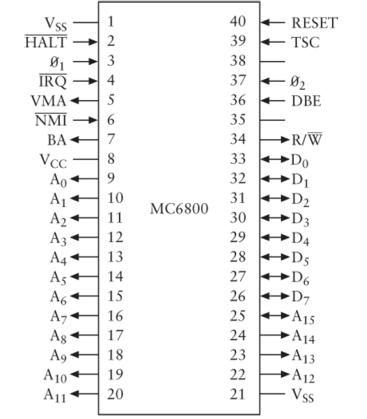

Many of the aspects of 6800's design and functionality are quite similar to those of the 8080.

- $V_{ss}$ indicates Ground, and $V_{cc}$ is 5 volts.
- Like the 8080, the 6800 has 16 output Address signals and 8 Data signals used for both input and output.
- There's a $RESET$ signal and a $R/\overline{W}$ (read/write) signal.
- The $\overline{IRQ}$ signal stands for interrupt request.
- The signal timing of the 6800 is considered to be much simpler than that of the 8080.
- *What 6800 doesn't have is the concept of I/O ports. All input and output devices must be part of the 6800 memory address space.*
- The 6800 has a 16-bit Program Counter, a 16-bit Stack Pointer, an 8-bit Status Register (for flags), and *two 8-bit accumulators called `A` and `B`.*  These are both considered accumulators (rather than `B` being considered just a register) because there is nothing that you can do with `A` that you can't also do with `B`. There are no additional 8-bit registers, however.
- The 6800 instead has a 16-bit **index register** that can be used to hold a 16-bit address, much like the register pair `HL` is used in the 8080. For many instructions, an address can be formed from the sum of the index register and the byte that follows the opcode.
- While the 6800 does just about the same operations as the 8080— loading, storing, adding, subtracting, shifting, jumping, calling — it should be obvious that *the opcodes and the mnemonics are completely different*.
- The 6800 doesn't have a Parity flag like the 8080, but it does have a flag teh 8080 doesn't have — an *Overflow flag*.


### 8800 vs 6800

Of course the 8080 and 6800 instructions sets are different. The two chips were designed about the same time by two different groups of engineers at two different companies.

- What this incompatibility means is that neither chip can execute the other chip's machine codes. Nor can a assembly-language program written for one chip be translated into opcodes that run on the other chip.
- *Writing computer programs that run on more than one processor is the subject of Chapter 24.*


Here's another interesting difference between the 8080 and the 6800:

- In both microprocessors, the instruction `LDA` lands the accumulator from a specified memory address.

  - In the 8080, for example, the following sequence of bytes:

    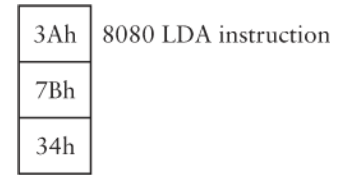

    will load the accumulator with the byte stored at memory address `347Bh`.

  - Now compare that with the 6800 `LDA` instruction using the so-called 6800 extended addressing mode:

    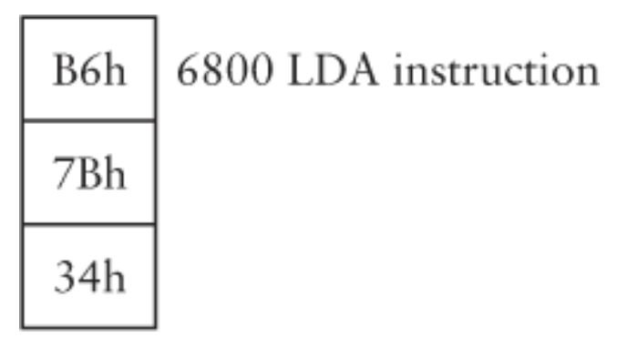

    This sequence of bytes loads accumulator `A` with the byte stored at memory address `7B34h`.

- *The 8080 assumes that the low-order byte comes first, followed by the high-order byte. The 6800 assumes that the high-order byte comes first!*

- *This fundamental difference in how Intel and Motorola microprocessors store multibyte values have never been resolved.* 

- *To this very day, Intel microprocessors continue to store multibyte values with the least-significant byte first, and Motorola microprocessors store multibyte values with the most-significant byte first.*

These two methods are known as **little-endian** (the Intel way) and **big-endian** (the Motorola way). 

Despite neither method being intrinsically "right", the difference does create an *additional incompatibility problem when sharing information between systems based on little-endian and big-endian machines*.


### After 8080 and 6800

- *MITS Altair 8800* (use 8080 chip): The first home computer, 1975(1974?)

- *Intel 8085 chip*.

- *Z-80* *chip*, by Zilog. 

  - In 1977, the  Z-80 was used in the *Radio Shack TRS-80 Model 1*.

- *Apple II*

  - In 1977, the Apple Computer Company.
  - Use MOS Technology's less expensive *6502 chip* (an enhancement of the 6800).

- **Intel 8086 chip**.

  - A 16-bit microprocessor that could access 1 megabyte of memory.
  - *The 8086 opcodes weren't compatible with the 8080, but included instructions to multiply and divide*.

-  *Intel 8088 chip.*

  - Internally was identical to teh 8086 but externally accessed memory in bytes, thus allowing the microprocessor to use the more-prevalent 8-bit support chips designed for the 8080.
  - *5150 Personal Computer* — commonly called the IBM PC — introduced in the fall of 1981.

- **x86 family**:

  - Include 8086, 8088
  - *186, 286 chip*: In 1982
  - *386 chip*: 32-bit, in 1985
  - *486 chip*: in 1989
  - Beginning in 1993: *Intel Pentium line of microprocessors*
  - And so on

  *While these Intel microprocessors have ever-increasing instruction sets, they continue to support the opcodes of all earlier processors starting with the 8086.*

- *The Apple Macintosh*, first introduced in 1984, used the *Motorola 68000*, a 16-bit microprocessor that's a direct descendant of the 6800. The 68000 and its descendants (often called the 68K series)  are some of the most beloved microprocessors ever made.

- Since 1994, Macintosh computers have used the **PowerPC microprocessor** that was developed in a coalition of Motorola, IBM, and Apple.

  - The PowerPC was designed with a type of microprocessor architecture known as **RISC**(Reduced Instruction Set Computing精简指令集计算机), which attempts to increase the speed of the processor by simplifying it in some respects.
  - *In a RISC computer, generally each instruction is the same length (32 bits on the PowerPC), memory accesses are restricted to just load and store instructions, and instructions do simple operations rather than complex ones. RISC processors usually have plenty of registers to avoid frequent accesses of memory.*
  - *PowerPC can't execute 68K code because it has a whole different instruction set.* But the PowerPC microprocessors currently used in the Apple Macintoshes can emulate the 68K. An emulator program running on the PowerPC examines each opcode of a 68K program, one by one, and performs an appropriate action. It's not as fast as native PowerPC code, but it works.


### With more transistors

Additional transistors: 

- Some of the transistors accommodate the *increase in processor data width*, from 4 bits to 8 bits to 16 bits to 32 bits to 64 bits.

- Another part of the increase is due to *new instructions*.  For example:

  - Most microprocessors these days have instructions to do floating-point arithmetic;
  - New instructions have also been added to microprocessors to do some of the repetitive calculations required to display pictures or movies on computer screens.

- Improve processor speed. Modern processors use several techniques to help improve their speed:
  - **Pipelining** :
    - When the processor is executing one instruction, it's reading in the next instructions, even to a certain extent anticipating how jump instructions will alter the execution flow.
  - **Cache** : (pronounced cash)
    - a array of very fast RAM inside the processor that is used to store recently executed instructions.
    - Because computer programs often execute small loops of instructions, the cache prevents these instructions from being repetitively reloaded.

  All these speed-improving features require more logic and more transistors in the microprocessor.

  ​

Before build a complete computer system, we need to *learn how to encode something else in memory besides opcodes and numbers*.


# Chapter 20. ASCII and a Cast of Characters

Digital computer memory stores only bits.

Don't think about text as formatted into two-dimensional columns on the printed page. *Think of text instead as a one-dimensional stream of letters, numbers, and punctuation marks, with perhaps an additional code to indicate the end of one paragraph and the start of another.*

In our earlier studies of Morse code and Braille, we've already seen how the letters of the alphabet can be represented in a binary form. Although these systems are fine for their specific purposes, both have their failings when it comes to computers. — *We need each code is a certain number of bits.*

### Baudot / Murray code

- Perhaps the most economical code for text is a *5-bit code* that originated in an 1874 printing telegraph developed by Emile Baudot. This code was later modified by Donald Murray and standardized in 1931. This code often be called **Baudot** or **Murray code**.

- In the twentieth century, Baudot was often *used in teletypewriters*. 

  - Teletypewriter keys are actually switches that cause a binary code to be generated and sent down the teletypewriter's output cable, one bit after the other.
  - Teletypewriter also contains a printing mechanism. Codes coming through the teletypewriter's input cable trigger electromagnets that print characters on paper.

- Like Morse code, this 5-bit code doesn't differentiate between uppercase and lowercase.

- *Problem*: Because Baudot need to use `shift code` to change from letter to figure or vice versa, this will cause some problems. Such as:

  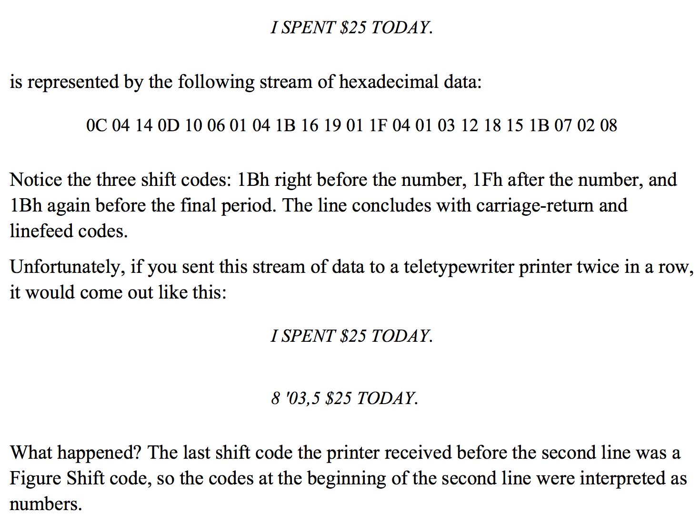

  Problems like this are typical nasty results of using shift codes. Although Baudot is certainly an economical code, it's probably preferable to use unique codes for numbers and punctuation, as well as separate codes for lowercase and uppercase letters.

  ​

### ASCII

We need 7 bits to represent the characters of English text if we want uppercase and lowercase with no shifting.

In 1967, ASCII (American Standard Code for Information Interchange ) was formalized. 

ASCII is a 7-bit code using binary codes `0000000` through `1111111`, which are hexadecimal codes `00h` through `7Fh`. 
​		

> A particular uppercase letter in ASCII differs from its lowercase counterpart by 20h.	
>
> **Two ways to capitalizes a string of text.**(See the book *code*)
>
> 1. ```
>    Capitalize: MOV A,C 	; C = number of characters left
>    			CPI A,00h 	; Compare with 0
>    			JZ AllDone 	; If C is 0, we're finished
>    			MOV A,[HL] 	; Get the next character
>    			CPI A,61h 	; Check if it's less than 'a'
>    			JC SkipIt 	; If so, ignore it
>    			CPI A,7Bh 	; Check if it's greater than 'z'
>    			JNC SkipIt 	; If so, ignore it
>    			SBI A,20h 	; It's lowercase, so subtract 20h
>    			MOV [HL],A 	; Store the character
>    SkipIt: 	INX HL 		; Increment the text address
>    			DCR C 		; Decrement the counter
>    			JMP Capitalize ; Go back to the top
>    AllDone: 	RET
>    ```
>
> 2. The statement that subtracts 20h from the lowercase letter to convert it to uppercase can be replaced with this:
>
>    ```
>    ANI A,DFh
>    ```
>
>    The `ANI` instruction is an `AND Immediate`. It performs *a bitwise AND operation* between the value in the accumulator and the value `DFh`, which is `11011111` in binary.


ASCII includes 95 **graphic characters**(which have a visual representation) and 33 **control characters**(have no visual representation but instead perform certain functions).

> Control characters: at the time ASCII was developed, it was intended mostly for teletypewriters, and many of these are currently obscure.


### EBCDIC

> Although ASCII is the dominant standard in the computing world, it isn't used on many of IBM's larger computer systems.

In connection with the System/360, IBM developed its own 8-bit character code known as the **Extended BCD Interchange Code**, or **EBCDIC**(pronounced EBB-see-dick), which was derived from codes used on **IBM punch cards** -- capable of *storing 80 characters of text* -- was introduced by IBM in 1928 and used for over 50 years.

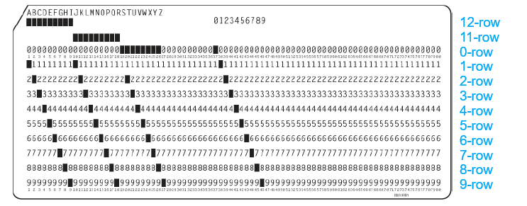

IBM punch card:

- As this picture shows, the character itself is often printed near the top of the card.
- The lower 10 rows are identified by number and are known as the 0-row, the 1-row and so forth through the 9-row.
- The unnumbered row above the 0-row is called the 11-row, and the top row is called the 12-row. There is no 10-row.
- More IBM punch card terminology: Row 0 through 9 are known as the the *digit rows*, or *digit punches*. Row 11 and 12 are known as the *zone rows*, or *zone punches*. (but some IBM punch cards confusion: Sometimes rows 0 and 9 are considered to be zone rows rather than digit rows).


An 8-bit EBCDIC character code is composed of:

1. *a low-order nibble*: (4-bit value)
   - is the BCD code corresponding to the digit punches of the character.
   - (BCD stands for binarycoded decimal -- a 4-bit code for digits 0 through 9).
2. *a high-order nibble*: (4-bit value)
   - is a code corresponding (in a fairly arbitrary way) to  the zone punches of the character.

- For the digits 0 through 9 : 

  there are no zone punches. That lack of punches corresponds to a high-order nibble of `1111`. The low-order nibble is the BCD code of the digit punch.

- For the uppercase letters : 

  a zone punch of just the 12-row is indicated by the nibble `1100`, a zone punch of just the 11-row is indicated by the nibble `1101`, and a zone punch of just the 0-row is indicated by the nibble `1110`.

| Hex Code | EBCDIC Character | Hex Code | EBCDIC Character | Hex Code | EBCDIC Character |
| -------- | ---------------- | -------- | ---------------- | -------- | ---------------- |
| `C1h`    | A                | `D1h`    | J                |          |                  |
| `C2h`    | B                | `D2h`    | K                | `E2h`    | S                |
| `C3h`    | C                | `D3h`    | L                | `E3h`    | T                |
| `C4h`    | D                | `D4h`    | M                | `E4h`    | U                |
| `C5h`    | E                | `D5h`    | N                | `E5h`    | V                |
| `C6h`    | F                | `D6h`    | O                | `E6h`    | W                |
| `C7h`    | G                | `D7h`    | P                | `E7h`    | X                |
| `C8h`    | H                | `D8h`    | Q                | `E8h`    | Y                |
| `C9h`    | I                | `D9h`    | R                | `E9h`    | Z                |

- For the lowercase letters:

  have the same digit punches as the uppercase letters but different zone punches.

  For lowercase letters `a` through `i`, the 12-row and 0-row are punched, corresponding to the code `1000`. For `j` through `r`, the 12-row and 11-row are punched. This is the code `1001`. For the letters `s` through `z`, the 11-row and 0-row are punched—the code `1010`.

Of course, there are other EBCDIC codes for punctuation and control characters, but it's hardly necessary to do a full-blown exploration of this system.


### Extended ASCII character set

Because many computer systems store characters as 8-bit values, it's possible to devise an extended ASCII character set that contains 256 characters rather than just 128. In such a character set, codes `00h` through `7Fh` are defined just as they are in ASCII; codes `80h` through `FFh` can be something else entirely.

Unfortunately, many different extensions of ASCII have been defined over the decades, leading to much confusion and incompatibility.


### Unicode

Whereas ASCII is a 7-bit code, Unicode is a 16-bit code. Each and every character in Unicode requires 2 bytes. That means that Unicode has character codes ranging from `0000h` through `FFFFh` and can represent 65,536 different characters.

>While Unicode may be an obvious improvement over existing character codes, that doesn't guarantee it instant acceptability. ASCII and the myriad flawed extensions of ASCII have become so entrenched in the computing world that it will be difficult to dislodge them.


# Chapter 21. Get on the Bus

The processor is certainly the most important component of a computer, but it's not the only component:

- RAM: A computer also requires random access memory (RAM) that contains machine-code instructions for the processor to execute. 
- I/O: The computer must also include some way for those instructions to get into RAM (an input device) and some way for the results of the program to be observed (an output device). 
- ROM: As you'll also recall, RAM is volatile—it loses its contents when the power is turned off. So another useful component of a computer is a long-term storage device that can retain code and data when the computer is turned off.

All the integrated circuits that make up a complete computer must be mounted on circuit boards. In some smaller machines, all the ICs can fit on a single board. But it's more usual for the various components of the computer to be divided among two or more boards. These boards communicate with each other by means of a *bus*.

**Bus**: A bus is simply *a collection of digital signals* that are provided to every board in a computer. These signals fall into four categories:

- *Address signals*.
  - These are signals generated by the microprocessor and used mostly to address random access memory. But they're also used to address other devices attached to the computer.
- *Data Output signals*.
  - These also are signals provided by the microprocessor. They're used to write data to RAM or to other devices. *Be careful with the terms input and output. A data output signal from the microprocessor becomes a data input signal to RAM and other devices*.
- *Data Input signals*.
  - These are signals that are provided by other parts of the computer and are read by the microprocessor. The data input signals most often originate in RAM output; this is how the microprocessor reads the contents of memory. But other components also provide data input signals to the microprocessor.
- *Control signals*.
  - These are miscellaneous signals that usually correspond to the control signals of the particular microprocessor around which the computer is built.
    Control signals may originate in the microprocessor or from other devices to signal the microprocessor.
  - An example of a control signal is the signal used by the microprocessor to indicate that it needs to write some data output into a particular memory address.
- *Power supply*. 
  - In addition, the bus supplies power to the various boards that the computer comprises.


## Brief History of bus:

#### **S-100 bus**:

- *Basic Hardware Knowledge*:
  - Introduced in 1975, in the MITS Altair.
  - based on 8080, later was adapted to 6800.
  - An S-100 circuit board is 5.3 inches by 10 inches. One edge of the circuit board fits into a socket that has 100 connectors.(hence the name S-100).
  - An S-100 computer contains a larger board called a **motherboard** (or **main board**) that contains a numbers of S-100 sockets wired to one another. 
    - These sockets are sometimes called **expansion slots**. 
    - The S-100 circuit boards fit into these sockets also called **expansion boards**. 
  - The 8080 microprocessor and support chips occupy one S-100 board.
  - Random access memory occupies one or more other boards. 
- *Signals*:
  - it has 16 address signals, 8 data output signals.
    - The 8080 itself combines the data input and data output signals. These signals are divided into separate input and output signals by other chips on the circuit board that contains the 8080.
  - The bus also includes 8 **interrupt signals**.
    - These ar signals generated by other devices when they need immediate attention from the CPU.
    - The board containing the 8080 also generally includes a chip called the Intel 8214 Priority Interrupt Control Unit to handle these interrupts. When an interrupt occurs, the chip generates an interrupt signal to the 8080.
    - When the 8080 acknowledges the interrupt, the chip provides a *RST*(Restart) instruction that causes the microprocessor to save the current program counter and branch to address `0000h`, `0008h`, `0010h`, `0018h`, `0020h`, `0028h`, `0030h` or `0038h` depending on the interrupt.


#### **Original IBM PC** (ISA bus)

**Open architecture** *or* **Closed architecture**:

- Open architecture: 
  - If the specifications of a particular bus are made public, third-party manufacturers can design and sell expansion boards that work with that bus. 
  - Eventually, a bus might be considered an industry-wide standard. Standards have been an important part of the personal computer industry.
- The most open architecture personal computer was the **original IBM PC** introduced in the fall of 1981.
  - IBM published a *Technical Reference* manual for the PC that contained complete circuit diagrams of the entire computer, including all the expansion boards that IBM manufactured for it. 
  - This manual was an essential tool that enabled many manufacturers to make their own expansion boards for the PC and, in fact, to create entire clones of the PC — computers that were nearly identical to IBM's and ran all the same software.
- The Apple Macintosh was originally designed with a closed architecture.
- Whether a somputer system is designed under the principle of open architecture or closed architecture doesn't affect the ability of other companies to write *software* that runs on the computer.


**ISA bus**:

- The bus that IBM designed for the original PC.(1981)
- The expansion boards have 62 connectors. The signals include: 
  - 20 address signals
    - original IBM PC used the 8080 microprocessor, which can address 1 megabyte of memory.
  - 8 combined data input and output signals
  - 6 interrupt requests
  - 3 *direct memory assess(DMA)* requests.

**DMA**:

- Normally, the microprocessor handles all reading from and writing to memory.
- *But using DMA, another device can bypass the microprocessor by taking over the bus and reading from or writing to memory directly.*


*Note*:

In an S-100 system, all components are mounted on expansion boards. 

In the IBM PC, the microprocessor, some support chips, and some RAM are located on what IBM called the system board but which is also often called a motherboard or a mainboard.

#### Personal Computer AT

In 1984, IBM introduced the *Personal Computer AT*, which used the 16-bit Intel 80286 microprocessor that can address 16 megabyte of memory.

IBM retained the existing bus but added another 36-connector socket that included 7 more address signals (although only 4 more were needed), 8 more data input and output signals, 5 more interrupt requests, and 4 more DMA requests.

#### Upgrade of bus

Busses need to be upgraded or replaced when microprocessors outgrow then, either in:

- *data width (from 8 to 16 to 32 to 64 bits)*
- *the number of address signals they output*.
- *achieve faster speeds.*
  - For example, early busses were designed for microprocessors operating at a clock speed of several megahertz rather than several hundred megahertz.
  - When a bus isn't properly designed for high speeds, it can give off radio frequency interference (RFI) that causes static or other noise on nearby radios and television sets.

#### Later busses

- **MCA bus**: In 1987, IBM introduced the Micro Channel Architecture (MCA) bus. Some aspects of this bus had been patented by IBM, so IBM was able to collect licensing fees from other companies that used the bus. Perhaps for this reason, the MCA bus did not become an industry standard. 
- **EISA bus**: in 1988 a consortium of nine companies (not including IBM) countered with the 32-bit EISA (Extended Industry Standard Architecture) bus.
- **PCI bus**: More recently, *the Intel-designed Peripheral Component Interconnect (PCI) bus has become common in PC-compatibles*.


## How components of the computer work

Again, it's helpful to return to that earlier and simpler era of the mid-1970s.

Suppose we design a 8080 computer, we need: 

1. *memory*: some memory for the computer
2. *input*: a keyboard for input
3. *output*: a TV set for output
4. *storage*: Some way to save the contents of memory when we turn off the computer.

*Let's look at the various **interfaces** we can design to add these components to our computer.*

### memory

RAM arrays have:

- address input
- Data input
- Data output
- a signal used to write data into memory.

The number of address inputs indicates the number of separate values that can be stored in the RAM array: $$Number\;of\;values\;in\;RAM\;array = 2^{Number\;of\;address\;inputs}$$

The number of data input and output signals indicates the size of the stored values.

Example: *2102 memory chip*

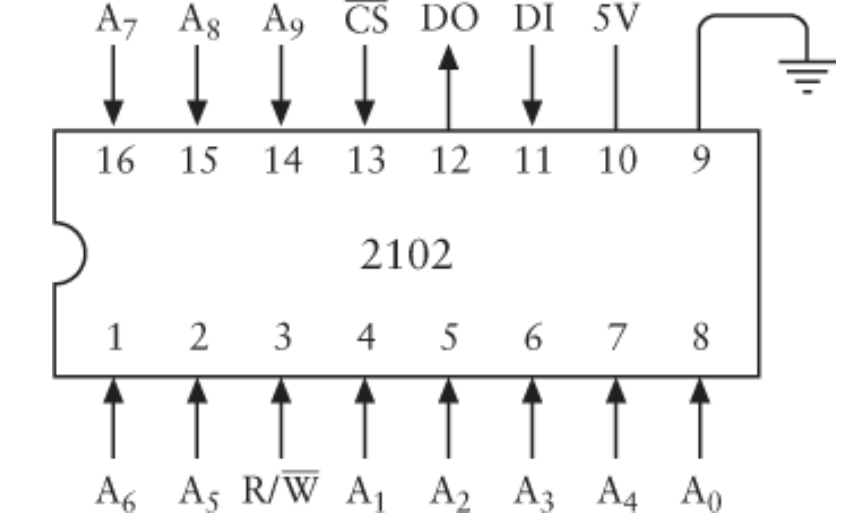

- This chip stores 1024 bits.
- The $R/\overline{W}$ signal is normally `1` when you're reading memory.
  - *Read access time*:the time it takes for the data output to be valid after a particular address has been applied to the chip.
- **$\overline{CS}$** Signal,stands for *chip select*.
  - When this signal is `1`, the chip is deselected, which means that it doesn't respond to the $R/\overline{W}$ signal.


If you want to organize this memory so that it stores 8-bit values rather than 1-bits values. At very least, you'll *need to wire 8 of these 2102 chips together to store entire bytes*.

You can do this by connecting all the corresponding address signals, the $R/\overline{W}$ signals, and the $\overline{CS}$ signals of eight 2102 chips.

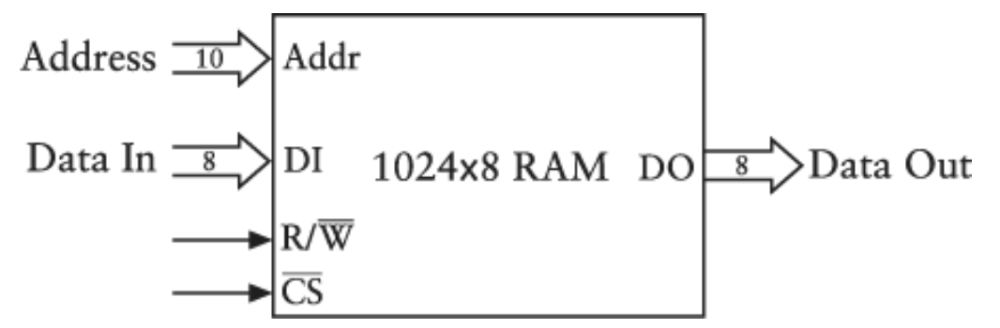

This is a 1024*8 RAM array, or 1 KB of RAM.(known as a **bank**).

You can fit 64 of these chips on a single S-100 board. That will give you 8KB of memory. But let's go for a more modest 4KB useing just 32 chips. A 4KB memory board contains four banks of 8 chips each.

8080 have 16-bit addresses that can address a total of 64KB fo memory. So, *when you wire a 4KB memory board containing four banks of chips, the memory board's 16 address signals perform the following function*:

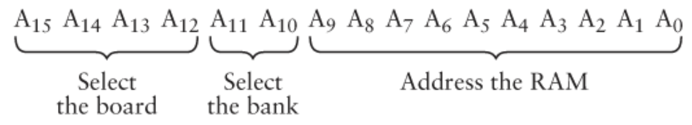

The 4KB memory board we're designing can occupy one of 16 different 4KB ranges in the entire 64KB memory space of the microprocessor. For example, the first bank can represent `0000h` to `0FFFh`, and the second bank can represent `1000h` to `1FFFh`, and so on.

*It's common to wire a 4KB memory board so that you can flexibly specify at a later time what range of addresses is responds to.* To achieve this flexibility, you use something called a **DIP switch**.

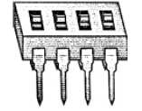

You can wire this switch with the high 4 address bits from the bus in a circuit called a **comparator**.

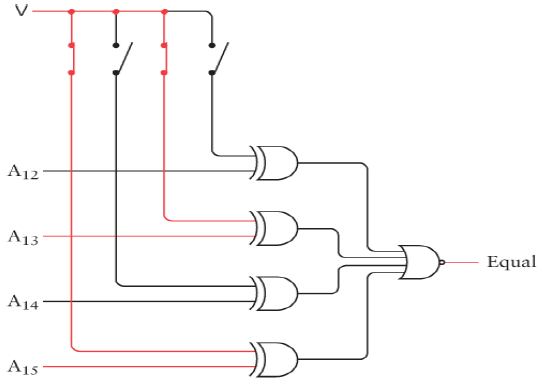

You can then combine that Equal signal with a **2-Line-to-4-Line Decoder** to generate $\overline{CS}$ signals for each of the four banks of memory:

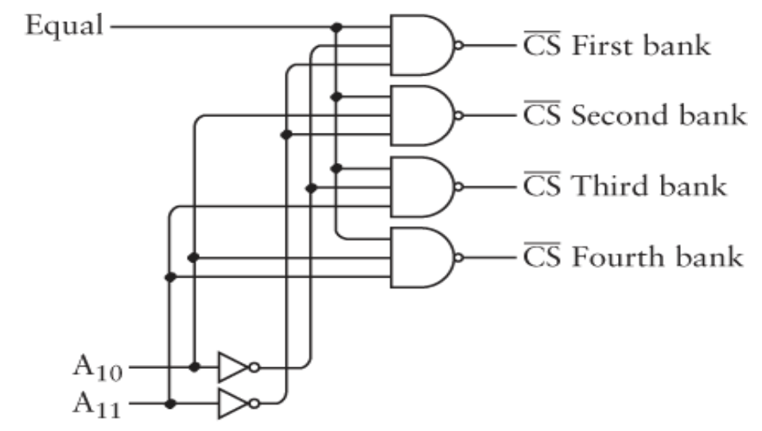

*Note*: 

- You might assume that we also need eight 4-to-1 Selectors to select the correct data output signals from the four banks of memory. But we don't, and  here's why:
- Normally, the output signals of TTL-compatible integrated circuits are either greater than 2.2 volts(for a logical `1`) or less than 0.4 volts(for a logical `0`). But what happens if you try connecting outputs? If one integrated circuit has a `1` output and another has a `0` output, and these two outputs are connected, what will result? You can't really tell, and *that's why outputs of integrated circuits aren't normally connected together.*

##### Tri-state

The data output signal of the 2102 chip is known as a **3-state**, or **tri-state**, output.

- Besides a logical 0 and a logical 1, this data output signal can also be a third state. 
- This state is nothing at all! It's as if nothing is connected to the pin of the chip.
- *The data output signal of the 2102 chip goes into this third state when the $\overline{CS}$ input is 1.*
- *This means that we can connect the corresponding data output signals of all banks and use those eight conbined outputs as the eight data input signals of the bus*.


Tri-state output is essential to the operation of a bus.

- Everything that's connected to the bus uses the data input signals of the bus. 
- *At any time, only one board connected to the bus should be determining what those data input signals are.* *The other boards must be connected to the bus with deselected try-state outputs*.

##### SRAM / DRAM

- **SRAM**: static random access memory
  - SRAM generally requires *4 transistors per bit of memory*.
  - a SRAM chip suchas the 2102 will retain its contents as long as the chip has power. If the power goes off, the chip loses its contents.
- **DRAM**: dynamic random access memory (nowaday standard)
  - Requires only 1 transistor per bit.
  - The drawback of DRAM is that it requires more complex support circuitry.
  - *DRAM also requires that the contents of the memory be periodically accessed, even if the contents aren't needed*. This is called a **refresh cycle**, and it must occur *several hundred times per second*.
  - Despite the hassle of using DRAM, the ever-increasing capacity of DRAM chips over the years has *made DRAM the standard*.
  - Today's computers usually have sockets for memory right on the system board. The sockets take small boards called **single inline memory modules(SIMMs)** or **dual inline memory modules(DIMMs)** taht contain several DRAM chips. 


### Output

Early days, we use **cathode-ray tube(CRT,显像管)** as the video display for a computer.

The electronic components that provide the signal to the video display are usually known as the **video display adapter(视频适配器)**.

Often the video display adapter occupies its own board in the computer, which is know as the **video board(显卡)**.

##### The principle of CRT

While the two-dimensional image of a video display or a television might seem complex, *the image is actually composed of a single continuous beam of light that sweeps across the screen very rapidly*:

The beam begins in the upper left corner and moves across the screen to the right, whereupon it zips back to the left to begin the second line. Each horizontal line is known as a **scan line(扫描行)**. The movement back to the beginning of each of these lines is known as the **horizontal retrace(水平回归)**. When the beam finishes the bottom line, it zips from the lower right corner of the screen to the upper left corner (the **vertical retrace(垂直回归)**) and the process begins again. For American television signals, this happens 60 times a second, which is known as the **field rate(场频)**. It's fast enough so that the image doesn't appear to be flickering.

Television is complicated somewhat by the use of an **interlaced(隔行扫描)** display. Two fields are required to make up a single **frame(帧)**, which is a complete still video image. Each field contributes half the scan lines of the entire frame—the first field has the even scan lines, and the second field has the odd scan lines. The **horizontal scan rate**, which is the rate at which each horizontal scan line is drawn, is 15,750 Hertz. If you divide that number by 60 Hertz, you get 262.5 lines. That's the number of scan lines in one field. An entire frame is double that, or 525 scan lines.

*Regardless of the mechanics of interlaced displays, the continuous beam of light that makes up the video image is controlled by a single continuous signal*.


For black and white television, this video signal is quite straightforward and easy to comprehend.(Color gets a bit messier).

- Sixty times per second, the signal contains a **vertical sync pulse(垂直同步脉冲)** that indicates the beginning of a field. This pulse is 0 volts(ground) for about 400 microseconds.
- A **horizontal sync pulse(水平同步脉冲)** indicates the beginning of each scan line: The video signal is 0 volts for 5 microseconds 15,750 times per second.
- Between the horizontal sync pulses, the signal varies from 0.5 volt for black to 2 volts for white, with voltages between 0.5 volt and 2 volts to indicate shades of gray.

*The image of a television is thus partially digital and partially analog*. The image is divided in to 525 lines vertically, but each scan line is a continuous variation of voltages — an analog of the visual intensity of the image.

But the voltage can't vary indiscriminately. There's an upper limit to how quickly the television set can respond to the varying signal. This is know as the television's **bankwidth(带宽)**.

*Bandwidth is an extremely important concept in communication, and it relates to the amount of information that can be transferred over a particular communication medium*.

##### Video display of computer

###### The size of a primitive video display adapter

If we want to connect a video display to a computer, it's awkward to think of the display as a hybrid analog and digital device. It's easier to treat it as *a completely digital device*. 

From the perspective of a computer, it's most convenient to conceive of the video image as being divided into a rectangular grid of discrete dots known as **pixels**. (The term comes from the phrase picture element.)


​					
*The video bandwidth enforces a limit to the number of pixels that can fit in a horizontal scan line*. (I defined the bandwidth as the speed with which the video signal can change from black to white and back to black again.)

- A bandwidth of 4.2 MHz for television sets allows two pixels 4.2 million times a second, or—dividing 2 x 4,200,000 by the horizontal scan rate of 15,750 — 533 pixels in each horizontal scan line. But about a third of these pixels aren't available because they're hidden from view—either at the far ends of the image or while the light beam is in the horizontal retrace. That leaves about 320 useful pixels horizontally.
- Likewise, we don't get 525 pixels vertically. Instead, some are lost at the top and bottom of the screen and during the vertical retrace. Also, it's most convenient to not rely upon interlace when computers use television sets. A reasonable number of pixels in the vertical dimension is 200.

We can thus say that the resolution of *a primitive video display adapter* attached to a conventional television set is *320 pixels x 200 pixels*.

###### Text on video display

One possible approach is that uses an 8x8 grid (64pixels) for each character:

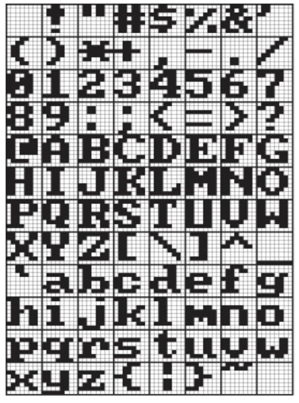

These are the characters corresponding to ASCII codes `20h` through `7Fh`(No visible characters are associated with ASCII codes `00h` through `1Fh`.)

*Each character is identified by a 7-bit ASCII code, but each character is also associated with 64 bits that determine the visual appearance of the character. You can also think of these 64 bits of information as codes.*

​		
Using these character definitions, you can fit 25 lines of 40 characters each on the 320 x 200 video display, which (for example) is enough to fit an entire short poem by Amy Lowell:


###### RAM for display

A video display adapter must contain some RAM to store the contents of the display, and the microprocessor must be able to write data into this RAM to change teh display's appearance. Most conveniently, this RAM is part of the microprocessor's normal memory space.

*How much RAM is required for a display adapter*:for the previous example, the possible size can *range from 1 kilobyte to 192 kilobytes*.

- **Low estimate**: restrict the adapter to text only. The screen can display 1000 characters, the RAM on the video board need only store the 7-bit ASCII codes of those 1000 characters. That is approximately *1 kilobyte*.

  - **Character generator(字符生成器)**: Such a video adapter board must also include a character generator that contains the pixel patterns of all the ASCII characters. This generator is generally read-only memory, or ROM.

  - **ROM**:A ROM is an integrated circuit manufactured so that a particular address always results in a particular data output. Unlike RAM, a ROM doesn't have any data input signals. *You can think of ROM as a circuit that converts one code to another*.

  - A ROM that stores 8x8 pixel patterns of 128 ASCII characters could have *7 address signals* and *64 data output signals*. But 64 data output signals would make the chip quite large.

  - **It's more convenient to have *10 address signals* and *8 output signals*.**

    - Seven of the address signals specify the particular ASCII character.
    - The other 3 address signals indicate the row. For example, address bits `000` indicate the top row and `111` indicate teh bottom row.
    - The 8 output bits are eight pixels of each row.

  - Example: the 10-bit address and the data output signals for a capital `A`:

    |    Address     | Data Output |
    | :------------: | :---------: |
    | `1000001 000`  | `00110000`  |
    | `1000001 001`  | `01111000`  |
    | `1000001 010 ` | `11001100`  |
    | `1000001 011 ` | `11001100`  |
    | `1000001 100`  | `11111100`  |
    | `1000001 101`  | `11001100`  |
    | `1000001 110`  | `11001100`  |
    | `1000001 111`  | `00000000`  |

  - **Cursor**:  

    - A video display adapter that displays text only must also have logic for a cursor.
    - *The character row and column position of the cursor is usually stored in two 8-bit registers on the video board that the microprocessor can write values into*.

- **High estimate**: if the video adapter board is not restricted to text only, it's referred to as a **graphics board(图形显卡)**.

  - graphics video boards require more memory than text-only boards.
  - For the screen which has 64,000 pixels:
    - *Black-and-white*: if each pixel corresponds to one bit of RAM, such a board requires 64,000 bits of RAM, or *8000 bytes*. But this can only show two colors.
    - *Gray-shade*: To display shades of gray from a graphics board, it's common for each pixel to correspond to an entire byte of RAM. A 320-bu-200 video board that displays 256 gray shades requires *64,000 bytes of RAM (64KB)*.
    - *Full-color*: requires 3 bytes per pixel. That means *192,000 bytes of RAM*.

The number of different colors that a video adapter is capable of is related to the number of bits used for each pixel:*$$Number\;of\;Colors = 2^{Number\;of\;bits\;per\;pixel}$$*.

###### More pixels for display

The 320-by-200 resolution is just about the best you can do on a standard television set. That's why monitors made specifically for computers have a much *higher bandwidth* than television sets.

- 1981, The first monitors sold with the IBM Personal Computer could display 25 lines of 80 characters each.
  - 80 characters is the number of characters on an IBM punch card.
  - early days, the CRT displays attached to mainframes were often used for viewing the contents of punch cards.
- 1987, IBM's Personal System/2 series of personal computers and Apple's Macintosh II both introduced video adapters that did 640 pixels horizontally by 480 pixels vertically.
  - This has remained the *minimum-standard video resolution* ever since.


### Input: keyboard

> Note: Although we normally think of the computer display and the keyboard as connected in some way—what you type on the keyboard is displayed on the screen—they're usually physically distinct.

A keyboard attached to a computer must include some hardware that provides a unique code for each key that's pressed.

The code provided by the keyboard hardware is instead referred to as a **scan code**. A short computer program can figure out what ASCII code (if any) corresponds to a particular key being pressed on the keyboard.


Assume we have a keyboard that has 16 keys, the keyboard hardware contains component:

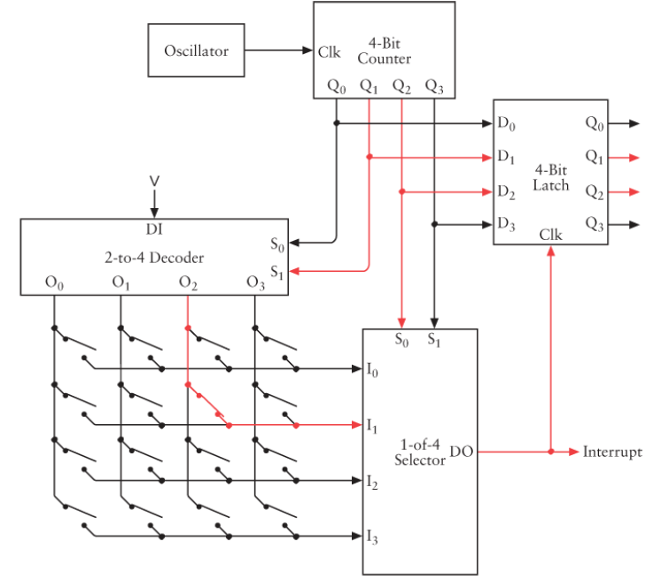

The 16 keys of the keyboard are shown as simple switches in the lower left area of this diagram. 

A 4-bit counter repetitively and very quickly cycles through the 16 codes corresponding to the keys. *It must be fast enough to cycles through all the codes faster than a person can press and release a key.*

When a key is pressed, no other counter output will cause the output of the selector to be 1. Each key has its own code.

If your keyboard has 64 keys, you need a 6-bit scan code. That would involve a 6-bit counter. You could arrange the keys in an 8x8 array, using a 3-to-8 Decoder and a 1-of-8 Selector.


What happens next in this circuit depends on the sophistication of the keyboard interface.

*The keyboard hardware could include 1 bit of RAM for each key.* The RAM would be addressed by the counter, and the contents of the RAM could be `0` if the key is up and `1` if the key is down. This RAM could also be read by the microprocessor to determine the status of each key.

One useful part of a keyboard interface is an *Interrupt signal*: 

- the 8080 has an input signal that allows an external device to interrupt what the microprocessor is doing. 
- The microprocessor responds by reading an instruction from memory. 
- This is usually a RST instruction and causes the microprocessor to branch to a specific area of memory where a program to handle the interrupt is located.


### Long-term Storage device

1. Punch card
2. Magnetic storage
   1. **Magnetic tape**: can't moving quickly to an arbitrary spot on the tape.
   2. **Magnetic disk**
      1. Floppy disks
      2. Hard disks

Magnetic disk:

- The surface of a disk is divided into concentric rings called **tracks(磁道)**.
- Each track is divide like slices of a pie into **sectors(扇区)**.
  - Each sector stores a certain number of bytes, usually 512 bytes.

Interface for disk:

- A floppy disk or hard disk usually comes with its own electrical interface and also requires an additional interface between that and the microprocessor. 
- Several standard interfaces are popular for hard drives:
  - SCSI
  - ESDI
  - IDE
- *All these interfaces make use of direct memory access(DMA) to take over the bus and transfer data directly between random access memory and the disk, bypassing the microprocessor*.
- *These transfers are in increments of the disk sector size, which is usually 512 bytes*.


##### Difference between memory and storage:

- Storage is non-volatile;
- *When the microprocessor outputs an address signal, it's always addressing memory, not storage*.
  - Getting something from disk storage into memory so that it can be accessed by the microprocessor requires extra steps.
  - *It requires that the microprocessor run a short program that accesses the disk drive so that the disk drive transfers data from the disk into memory.*


#  Chapter 22. The Operating System

Now, all teh hardware is in place, what do we miss?

If we turn on this new computer now: 

- the screen displays an array of perfectly formed — but totally random — ASCII characters. Because *semiconductor memory loses its contents when the power is off and begins in a random and unpredictable state when it first gets power.*
- Likewise, all the RAM that we've constructed for the microprocessor contains random bytes.
- *The microprocessor begins executing these random bytes as if they were machine code*. This won't cause anything bad to happen, but it won't be very productive either.

What we're missing here is *software*:

- *When a microprocessor is first turned on or reset, it begins executing machine code at a particular memory address*. In the case of the Intel 8080, that address is `0000h`.
- *In a properly designed computer, that memory address should contain a machine-code instruction when the computer is turned on.*


### **How does that machine-code instruction get there?**

The process of getting software into a newly designed computer is possibly one of the most confusing aspects of the project.

#### First way: control panel

One way to do it is with a control panel, used for writing bytes into RAM:

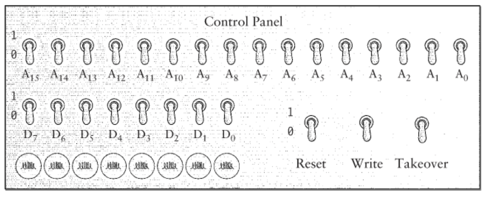

1. **Reset**: This control panel has a switch labeled Reset. The Reset switch is connected to the Reset input of the microprocessor.
   - As long as that switch is on, the microprocessor doesn't do anything.
   - When you turn off the switch, the microprocessor begins executing machine code.
   - To use this control panel, you turn the Reset switch on to reset the microprocessor and to stop it from executing machine code.
2. **Takeover**: turn on the Takeover switch to take over the address signals and data signals on the bus.
   - Now, you can use the swiches labeled $A_{0}$ through $A_{15}$ to specify a 16-bit memory address.
   - The light bulbs labeled $D_0$ through $D_{7}$ show you the 8-bit contents of that memory address.
   - The write a new byte into that address, you set the byte up on switches $D_0$ through $D_7$ and flip the **Write** switch on and then off again.
3. After you're finished inserting bytes into memory, turn the Takeover switch off and the Reset switch off, and the microprocessor will execute the program.

This is how you *enter your first machine-code programs into a computer* that you've just built from scratch.


**Getting program output to the video display**:

Getting program output to the video display isn't as simple as it might first seem.

For example:

- a program that you write does a particular calculation that results in the value `4Bh`, you can't simply write that value to the video display memory. What you'll see in the screen in that case is the letter `K` because that's the letter that corresponds to the ASCII code `4Bh`.
- Instead, you *need to write two ASCII characters to the display*: 
  - `34h`: ASCII code for 4.
  - `42h`: ASCII code for B.
- Each nibble of the 8-bit result is a hexadecimal digit, which must be displayed by the ASCII code for that digit.

Here's one *subroutines in 8080 assembly language that converts a nibble in the accumulator(assumed to be a value between `00h` and `0Fh`) to its ASCII equivalent*:

```
NibbleToAscii:	CPI A,0Ah	;Check if it's a letter or number
				JC Number
				ADD A,37h	;A to F converted to 41h to 46h
				RET
Number:			ADD A,30h	;0 to 9 converted to 30h to 39h
				RET
```

This subroutine calls NibbleToAscii twice to convert a byte in accumulator A to two ASCII digits in registers B and C:

```
ByteToAscii:	PUSH PSW			;Save accumulator
				RRC					;Rotate A right 4 times...
				RRC
				RRC
				RRC					;...to get high-order nibble
				CALL NibbleToAscii	;Convert to ASCII code
				MOV B,A				;Move result to register B
				POP PSW				;Get original A back
				AND A,0Fh			;Get low-order nibble
				CALL NibbleToaAscii	;Convert to ASCII code
				MOV C,A				;Move result to register C
				RET
```

These subroutines now let you display a byte in hexadecimal on the video display. If you want to convert to decimal, it's a bit more work.


Although the control panel doesn't require a lot of hardware, what it also lacks is ease to use. The control panel has to be the absolute worst form of input and output ever devised. 

*We need a keyboard.*


#### Second way: use a keyboard

##### **按执行顺序，简述键盘的准备工作过程：**（个人总结）

1. **Use control panel first** *（在这个阶段，键盘还无法直接使用，还是需要先使用control panel，将初始化代码和键盘处理程序输入到内存中）*
   1. enter initialization code
   2. enter the keyboard handler code (start at address `0008h`)
   3. execute from initialization code
2. **Once you accomplish this, you have keyboard handler. then you can use the keyboard.**
   - Every time a key is pressed, an interrupt to the microprocessor occurs.
   - The interrupt controller chip respond to this interrupt by executing a `RST`(Restart) instruction.
   - This instruction causes the microprocessor to save the current program counter on the stack and to jump to address `0008h`. 
   - Then the keyboard handler will execute.

下方是本小节的笔记：

##### Basic

- Every time a key is pressed, an interrupt to the microprocessor occurs.
- The interrupt controller chip that we've used in our computer causes the microprocessor to respond to this interrupt by executing a `RST`(Restart) instruction. Let's suppose that this is a `RST 1` instruction.
- This instruction causes the microprocessor to save the current program counter on the stack and to jump to address `0008h`.

Beginning at that address, you'll enter some code (*using the control panel*) that we'll call the **keyboard handler(键盘处理程序)**. 

To get this all working right, you'll need some code that's executed when the microprocessor is reset. This is called **initialization code(初始化代码)**. 

##### Initialization code

1. *Stack pointer*: The initialization code first sets the stack pointer so that the stack is located in a valid area of memory.
2. *Display memory*: The code then sets every byte in the video display memory to the hexadecimal value `20h`, which is the ASCII space character. This procedure gets rid of all the random characters on the screen.
3. *Cursor*: The initialization code uses teh `OUT`(Output) instruction to set the position of the cursor to the first column of the first row.
4. *EI* and *HLT*: The next instruction is `EI`(Enable Interrupts) to enable interrupts so that the microprocessor can respond to the keyboard interrupt. That instruction is followed by a `HLT` to halt the microprocessor.

After the initialization code, *the computer will mostly be in a halted state resulting from executing the `HLT` instruction*. *The only event that can nudge the computer from the halted state is a Reset from the control panel or an interrupt from the keyboard*.

##### Keyboard handler

The keyboard handler is much longer than the initialization code. Here's where all the really useful stuff takes place.

1. Whenever a key is pressed on the keyboard, the *interrupt signal* causes the microprocessor to *jump from the `HLT` statement* at the end of the initialization code *to the keyboard handler*. 

2. *The keyboard handler uses the `IN`(Input) instruction to determine the key that has been pressed.* 

3. The keyboard handler then does something based on which key has been pressed and then executes a `RET`(Return) instruction to go back to the `HLT` statement to await another keyboard interrupt.

4. **echoing** the key to the display:
   1. If the pressed key is a letter or a number or a punctuation mark, *the keyboard handler uses the keyboard scan code*, taking into account *whether the Shift key is up or down*, to determine the appropriate ASCII code.
   2. Then, it writes this ASCII code into the video display memory at the cursor position.
   3. The cursor position is then incremented so that the cursor appears in the space after the character just displayed. In this way, someone can type a bunch of characters on the keyboard and they'll be displayed on the screen.
   4. *Backspace*: If the key pressed is the Backspace key (corresponding to ASCII code `08h`), the keyboard handler erases the character that was last written to the video display memory. (Erasing the character is simply a matter of writing ASCII code 20h—the space character—in that memory location.) It then moves the cursor backward one space.

5. **Command**: When the keyboard handler processes the *Return* or *Enter* key (corresponding to ASCII code `0Dh`), *the line of text in the video display memory is interpreted as a command to the computer*, that is, something for the keyboard handler to do).

   - The keyboard handler includes a **command processor** that understand (for example) three commands: `W`, `D` and `R`.

   - `W`: If the line of text begins with a `W`, the command means *Write* some byte into memory. The line you type on the screen looks something like this:

     ```
     W 1020 35 4F 78 23 9B AC 67
     ```

     This command instructs the command processor to write the hexadecimal bytes `35h`, `4Fh`, and so on into the memory addresses beginning at address `1020h`.

     For this job, the keyboard handler *needs to convert ASCII codes to bytes*.

   - `D`: If the line of text begins with a `D`, the command means *Display* some bytes in memory. The line you type on the screen looks like this:

     ```
     D 1030
     ```

     The command processor responds by displaying the 11 bytes stored beginning at location `1030h`.(I say 11 bytes because that's how many will fit on a 40-characterwide display on the same line following the address.) You can use the Display command to examine the contents of memory.

   - `R`: if the line of text begins with an R, the command means *Run*. For example:

     ```
     R 1000
     ```

     This means: Run the program that's stored beginning at address `1000h`.

     The command processor stores `1000h` in the register pair `HL` and then executes the instruction `PCHL`, which loads the program counter from register pair `HL`, effectively jumping to that address.


​	

**Getting this keyboard handler and command processor working is an important milestone.** Once you have it , you no longer need suffer the indignity of the control panel. Typing bytes in from the keyboard is easier, faster and classier.


> **感想**：
>
> Hardware accomplish all basic works.
>
> Software is used to determine an certain order list of basic hardware functions, in order to accomplish something. 
>
> **硬件：一切底层工作均是由硬件完成。**
>
> **软件：软件只负责编排“基础硬件指令”的执行顺序。当硬件的基础指令形成特定序列时，便会产生可以完成特定工作的程序。**


#### Store codes in ROM

Of course, you still have the problem of all the code you've entered disappearing when you turn off the power. 

For that reason, you'll probably want to *store all this new code in read-only memory, or ROM.* 

We assumed our chip was configured with this data during manufacture. You can also program ROM chips in the privacy of your home. 

- Programmable read-only memory (**PROM**) chips are programmable only once. 
- Erasable programmable read-only memory (**EPROM**) chips can be programmed and reprogrammed after being entirely erased by exposure to ultraviolet light.


As you'll recall, we wired our RAM boards with a DIP switch that allows us to specify the starting address of the board.

- If you're working with an 8080 system, initially one of your RAM boards will be set for address `0000h`.
- *After you create a ROM, that ROM will occupy address `0000h` and the RAM board can be switched to a higher address.*


**The creation of the command processor is an important milestone** not only because it provides a faster means to enter bytes into memory but also because the computer is now **interactive**. When you type something on the keyboard, the computer responds by displaying something on the screen.

Once you have the command processor in ROM, you can start experimenting with writing data from memory to the disk drive and reading the data back into memory. *Storing programs and data on the disk is much safer than storing them in RAM and much more flexible than storing them in ROM.*

#### More commands to command processor

Eventually, you might want to add some new commands to the command processor.

For example:

- `S` command stands for Store(*Store memory to storage*):

  ```
  S 2080 2 15 3
  ```

  This command indicates that the block of memory beginning at address `2080h` is to be stored on the disk on side 2, track 15, and sector 3. (The size of this memory block is dependent on the sector size of the disk).

- `L` for Load command:

  ```
  L 2080 2 15 3
  ```

  this load the sector from the disk back into memory.


### File system

Of course, you'll have to keep track of what you're storing where. You'll probably keep a pad and pencil handy for this purpose. 

*Be careful*: You can't just store some code located at one address and then later load it back into memory at another address and expect it to work. All the Jump and Call instructions will be wrong because they indicate the old addresses. 

Also, you might have a program that's longer than the sector size of your disk, so you need to store it in several sectors. Because some sectors on the disk might be occupied by other programs or data and some sectors might be free, the sectors in which you store a long program might not be consecutive on the disk.

Eventually, you could decide that the manual clerical work involved in keeping track of where everything is stored on the disk is just too much. At this point, you're ready for a file system.


A **file system** is a method of disk storage in which data is organized into **files**. 

- *A file is simply a collection of related data that occupies one or more sectors on the disk*.
- Most important, each file is identified by a **name** that helps you remember what the file contains.

### Operating system

A file system is almost always part of a larger collection of software known as an **operating system**.

The keyboard handler and command processor we've been building in this chapter could certainly evolve into an operating system. But instead of trudging through that long evolutionary process, let's take a look instead at a real operating system and get a feel for what it does and how it works.


##### **CP/M**: Control Program for Micros

- Most important operating system for 8-bit microprocessors in history.

- Author: Written in the mid-1970s for the Intel 8080 microprocessor by **Gary Kildall**, who later founded Digital Research Incorporated(DRI).

- *CP/M is stored on a disk.* 

  - In the early days of CP/M, the most common medium for CP/M was a single-sided 8-inch diskette with 77 tracks, 26 sectors per track, and 128 bytes per sector.
  - The first two tracks of the disk contain CP/M itself.
  - The remaining 75 tracks on the CP/M disk are used for storing files.

- *File system:* The CP/M file system is fairly simple, but is *satisfies the two major requirements*:

  1. *each file on the disk is identified by a name.* This name is also stored on the disk; Indeed, all the information that CP/M needs to read these files is stored on the disk along with the files themselves.
  2. *Files don't have to occupy consecutive sectors on a disk*. It often happens that as files of various sizes are created and deleted, free space on the disk becomes fragmented. The ability of a file system to store a large file in nonconsecutive sectors is very useful.

- **Allocation block(分配块)**: 

  - The sectors in the 75 tracks used for storing files are grouped into allocation blocks. 
  - Each allocation block contains 8 sectors, or 1024 bytes.
  - There are 243 allocation blocks on the disk, numbered 0 through 242.

- **directory(目录)**: 

  - The first two allocation blocks (a total of 2048 bytes) are used for the directory. 

  - The directory is the area of the disk that contains the names and some crucial information about every file stored on the disk.

  - Each file stored on the disk requires a **directory entry(目录项)** 32 bytes long. Because the total directory is just 2048 bytes, the diskette is limited to 64 files.

  - *Each 32-byte directory entry contains the following information*:

    |  Bytes  |       Meaning        |
    | :-----: | :------------------: |
    |   `0`   |   Usually set to 0   |
    |  `1-8`  |       Filename       |
    | `9-11`  |      File type       |
    |  `12`   |     File extent      |
    | `13-14` | Reserved (set to 0)  |
    |  `15`   | Sector in last block |
    | `16-31` |       Disk map       |

    - The first byte in the directory entry is used only when the file system can be shared by two or more people at the same time. Under CP/M, this byte is normally set to 0, as bytes 13 and 14.

    - Under CP/M, *each file is identified with a two-part name*:

      1. **filename**: filename can have up to eight characters stored in bytes 1 through 8 of the directory entry.
      2. **file type**: file type can have up to three character stored in bytes 9 through 11. There are several standard file types, for example:
         - TXT: indicates a text file (a file containing only ACSII codes)
         - COM (Command): indicates a file containing 8080 machine-code instructions — a program.

      This file-naming convention has come to be known as 8.3(eight dot three), indicating the maximum eight letters before the period and the three letters after.

    - **Disk map(磁盘存储表)**: The disk map of the directory entry indicates the allocation blocks in which the file is stored.

      - Suppose the first four entries in the disk map are `14h`, `15h`, `07h`, and `23h`, and the rest are zeros. This means that the file occupies four allocatioon blocks, or 4KB of space. The file might actually be a bit shorter. 
      - Byte `15` in the directory entry indicates how many 128-bytes sectors are actually used in the last allocation block.
      - *The disk map is 16 bytes long; That length accommodates a file up to 16,384 bytes.*
      - *A file longer than 16KB must use multiple directory entries, whick are called* **extents**. In that case, byte 12 is set to `0` in the first directory, `1` in the second directory entry, and so forth.

- **Text file** and **binary file**:

  - Text files are also called ASCII files, or text-only files.

  - A text file contains ASCII codes (including carriage return and linefeed codes) that correspond to text readable by human beings.

  - A file that isn't a text file is called a binary file. A CP/M COM file is a binary file because it contains 8080 machine code.

  - *Storing numbers in different type of files*:

    Suppose a file (very small file) must contain three 16-bit numbers — for example, `5A48h`, `78BFh`, and `F510h`.

    - A binary file with these three numbers is just 6 bytes long:

      ```
      48 5A BF 78 10 F5	// Intel format
      5A 48 78 BF F5 10	// Motorola format
      ```

    - An ASCII text file storing these same four 16-bit values contains the bytes:

      ```
      35 41 34 38 68 0D 0A 37 38 42 46 68 0D 0A 46 35 31 30 68 0D 0A
      ```

      These bytes are ASCII codes for numbers and letters, where each number is *terminated by a carriage return(`0Dh`) and a linefeed(`0A`) character*.

      The text file is more conveniently displayed not as string of bytes that happen to be ASII codes, but as the characters themselves:

      ```
      5A48h
      78BFh
      F510h
      ```

      A ASCII text file that stores these three numbers could also contain these bytes:

      ```
      32 33 31 31 32 0D 0A 33 30 39 31 31 0D 0A 36 32 37 33 36 0D 0A
      ```

      These bytes are the ASCII codes for the decimal equivalents of the three numbers:

      ```
      23112
      30911
      62736
      ```

      *Since the intent of using text files is to make the files easier for humans to read, there's really no reason not to use decimal rather than hexadecimal numbers.*

      ​

- **Boorstrap loader(引导程序)**

  CP/M itself is stored on the first two tracks of a disk. *To run, CP/M must be loaded from the disk into memory*.

  - The ROM in a computer that uses CP/M need not be extensive. All the ROM needs to contain is a small piece of code known as a *bootstrap loader*. (Because that code effectively pulls the rest of the operating system up by its bootstraps).
  - **booting the operating system(引导操作系统)**
    1. *The bootstrap loader loads the very first 128-byte sector from the diskette into memory and runs it*.
    2. *This sector contains code to load the rest of CP/M into memory*.

  *Eventually, CP/M arranges itself to occupy the area of RAM with the highest memory addresses*.

  ​

- **CP/M in memory**:

  - The entire organization of memory after CP/M has loaded looks like this:

  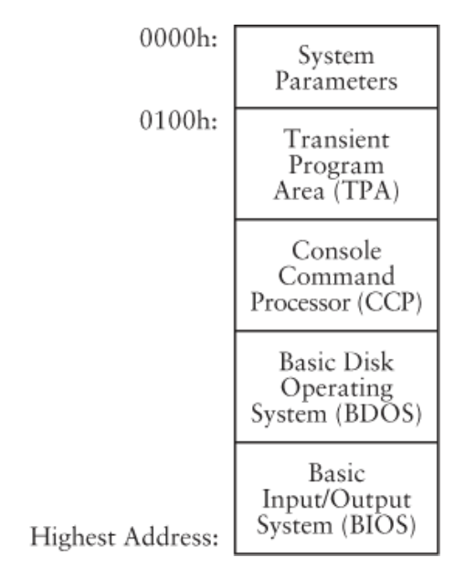

  - This diagram isn't to scale:
    - The three components of CP/M:

      1. the Basic Input/Output System **(BIOS,基本输入输出系统)**
      2. the Basic Disk Operating System **(BDOS,基本磁盘操作系统)**
      3. the Console Command Processor **(CCP,控制台命令处理程序)**

      Only occupy only about 6KB of memory in total.

    - The Transient Program Area **(TPA,临时程序区域)**: about 58KB of memory in a 64KB computer(initially contains nothing).

      ​

- **Console Command Processor, CCP 控制台命令处理程序**:

  - The Console Command Processor is equivalent to the command processor that we were building earlier.

  - The word **console(控制台)** refers to a combination of a keyboard and a display.

  - The CCP displays a **prompt(命令提示符)** on the display, which looks like this:

    ```
    A>
    ```


  - The prompt is your signal to type something in.
  - In computers that have more than one disk drive, the A refers to the first disk drive, the one from which CP/M was loaded.
  - You type in commands following the prompt and press the Enter key.
  - The CCP then executes these commands, which usually produces information displayed on the screen.
  - When the command has finished, the CCP displays the prompt again.


  - *The CPP recognizes just a few commands*:

    - **DIR**: Possibly the most important is this one:

      ```
      DIR
      ```

      Which *displays the directory of the disk* — that is, a list of all the files stored on the disk. _You can use the special character `?` and `*` to limit this list to files of a particular name or type_. For example:

      ```
      DIR *.TXT
      ```

      Displays all text files, while

      ```
      DIR A???B.*
      ```

      displays a list of all files that have a five-character name where the first letter is A and the last letter is B.

    - **ERA**: short for *Erase*. You use this to erase a file from the disk. For example:

      ```
      ERA MYLETTER.TXT
      ```

      erases the file with that name, while:

      ```
      ERA *.TXT
      ```

      Erases all the text files. *Erasing a file means freeing the directory entry and the disk space occupied by the file.*

    - **REN**: short for *Rename*. You use this command to change the name of a file.

    - **TYPE**: display the contents of a text file. Because a text file contains only ASCII codes, this command allows you to read a file right on the screen, like this:

      ```
      TYPE MYLETTER.TXT
      ```

    - **SAVE**: save one or more 256-byte memory blocks located in the Transient Program Area(临时程序区域) to a disk file with a specified name.

  - *If you type in a command that CP/M doesn't recognize, it assumes you're specifying the name of a program that's stored as a file on the disk*:

    - Programs always have the file type COM, which stands for Command.

    - The CCP searches for a file of that name on the disk. If one exists, CP/M loads the file from disk into the Transient Program Area, which *begins at memory address `0100h`.* This is how you run programs that are located on the disk. 

    - For example, if you type:

      ```
      CALC
      ```

      following the CP/M prompt: 

      1. if a file named `CALC.COM` exists on the disk
      2. the CCP loads that file into memory starting at address `0100h`
      3. then executes the program by jumping to the machine-code instruction located at address `0100h`.

    Earlier I explained how you can insert machine-code instructions any-where into memory and execute them, but *in CP/M, programs that are stored in disk files must be designed to be loaded into memory beginning at a specific memory location, which is `0100h`.*

  - *CP/M programs*:

    - PIP (Peripheral Interchange Program外设交换程序): allows you to copy files.
    - ED: a text editor that allows you to create and modify text files.

    Programs such as PIP and ED, which are small and designed to do simple chores, are often known as **utility programs(实用程序)**.

    If you were running a CP/M system, you would probably purchase larger **application programs(应用程序)**, such as word processors or computer spreadsheets. Or you might write such programs yourself. All these programs are also stored in files of the COM type.

  ​

*So far we've seen two function of operating system*:

1. Provides commands and utilities that let you perform refimentary housekeeping regarding files.
2. Loads program files into memory and executes them.

*An operating system also has a third major function:*

**API (application programming interface,应用程序接口)**

- Basic:
  - A program running under CP/M often needs to write some output to the video display. Or the program might need to read something that you've typed on the keyboard. 
  - But in most cases, the CP/M program does *not* write its output directly into video display memory. Likewise, the CP/M program does *not* access the hardware of the keyboard to see what you've typed. And the CP/M program definitely does *not* access the disk drive hard-ware to read and write disk sectors.
  - Instead, **a program running under CP/M make use of a collection of subroutines built into CP/M for performing these common chores**.
  - These subroutines have been specifically designed so that programs can get easy access to all the hardware of the computer — including the video display, keyboard, and disk — without worrying programmers about how these peripherals are actually connected. Most inportant, *a program running under CP/M doesn't need to know about disk sector and tracks. That's CP/M's job.* It can instead store whole files on the disk and later read them.
- **Providing a program with easy access to the hardware of the computer is the third major function of an operating system. This access that the operating system provides is called the application programming interface, or API.**
- Use the API:
  - ​


 


