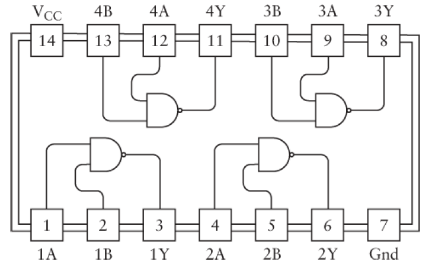
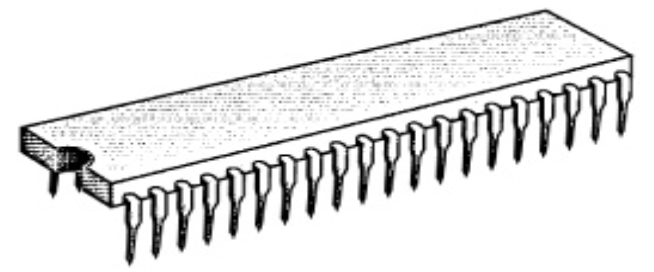
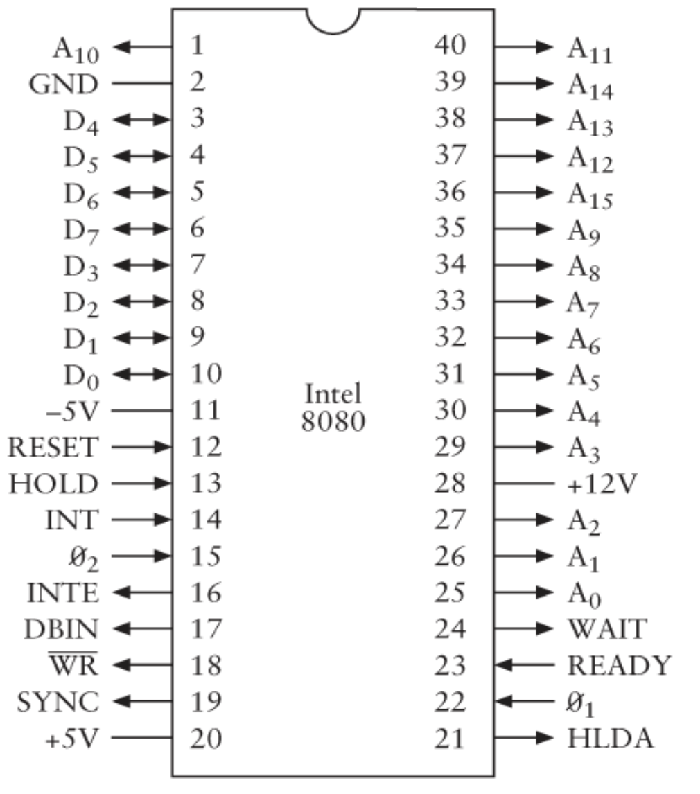

# Chapter 18 From Abaci to Chips


### Mid-1970s

Now, let's pause our time machine in the mid-1970s.

Several different technologies were used to fabricate the components that make up integrated circuits. Each of these technologies is sometimes called a *family* of ICs.

By the mid-1970s, two families were prevalent:

- **TTL** (transistor-transistor logic) 晶体管晶体管逻辑电路 ([tee  tee  ell])
- **CMOS** (Complementary Metal-Oxide-Semiconductor Transistor) 互补金属氧化物半导体 ([see moss])


#### TTL

[*The TTL Data Book for Design Engineers*]:

This is *a complete reference* to the 7400 series of TTL integrated circuits. (*You could actually build the computer in Chapter 17 out of TTL chips*.)

For example, first IC in the 7400 series is number 7400: `Quadruple 2-Input Positive-NAND Gates`, means that this particular integrated circuit contains four 2-input NAND gate, they are called `positive` NAND gates because a voltage corresponds to 1 and no voltage corresponds to 0. This is a 14-pin chip:



- Pin 14 is labeled $V_{cc}$ and is equivalent to the V symbol to indicate a voltage.
- Pin 7 is labeled $GND$ for ground.
- Every integrated circuit that you use in a particular circuit must be connected to a power supply and a common ground.
- For 7400 series TTL, $V_{cc}$ must be between 4.75 and 5.25 volts. Even if you were to find a 5-volt battery, the voltage wouldn't be exact enough to be adequate for these chips. So, TTL usually requires a power supply that you plug into the wall.
- The output of a TTL gate is typically about 0.2V for a logical 0, and 3.4V for a logical 1. Because these voltages can vary somewhat, inputs and outputs to integrated circuits are sometimes referred to as `low` and `high` rather than 0 and 1.
- Moreover, sometimes a low voltage can mean a logical 1 and a high voltage can mean a logical 0. This configuration is referred to as `negative logic`.(7400IC is `positive logic`).


**Propagation time**: 

- the time a particular integrated circuit takes for the change in the inputs to be reflected in the output. (most important fact for an IC)
- generally measured in nanoseconds, abbreviated nsec.
  - For example, the propagation time for the NAND gates in the 7400 chip is guaranteed to be less than 22 nanoseconds.


#### CMOS

[*CMOS Databook*] : This book contains information about the 4000 series of CMOS ICs.

**TTL vs CMOS**:

- The power supply requirement for TTL is 4.75 to 5.25 volts. For CMOS, it's anything
  *from 3 volts to 18 volts*. That's quite a leeway!

- CMOS requires *much less power* than TTL, which makes it feasible to run small CMOS circuits from batteries.

- The drawback of CMOS: *lack of speed*.

- (But today, there are *low-power versions of TTL* and *high-speed versions of CMOS*.)

  ​

#### Microprocessor

By the early 1970s, it became possible to use ICs to create an entire computer processor on a single circuit board.

In November 1971, *Intel 4004*, the *first* *microprocessor* became available. 4004 contained 2300 transistors.

Beside the number of its transistors, there are three other important characteristics of the 4004. These three measures are often used as **standard for comparison among microprocessors**:

1. *Wide of the data paths*
   - the 4004 was a 4-bit microprocessor.
2. *Clock speed*
   - Clock speed is the maximum speed of an oscillator that you can connect to the microprocessor to make it go.
   - the 4004 had a maximum clock speed of 108KHz.
3. *Addressable memory*
   - the addressable memory of the 4004 was 640 bytes.

These three numbers *don't affect the **capability** of a computer*, but *affect the **speed** of a computer*. The speed of a processor ultimately affects the over-all usefulness of a computer system.

And, speed is a big reason why we're using computers to begin with.

These three numbers indicate only roughly how fast the microprocessor operates. These number tell you nothing about the internal architecture of the microprocessor or about the efficiency and capability of the machine-code instructions.


4004 was a start. By April 1972, Intel had released the *8008*—an 8-bit microprocessor running at 200 kHz that could address 16 KB of memory. 

And then, in a five-month period in 1974, both Intel and Motorola came out with microprocessors that were intended to improve on the 8008. These two chips are *8080* and *6800*, and they change the world.


# Chapter 19. Two Classic Microprocessors

The *microprocessor — a consolidation of all the components of a central processing unit (CPU) of a computer on a single chip of silicon* — was born in1971 (Intel 4004).

To obtain the clearest view of what a microprocessor does, let's look at the first *ready-for-prime-time microprocessors*. These microprocessors appeared in 1974:

- **8080**: Intel, April 1974;
  - 8-bit, 6000 transistors, 2MHz clock speed, addresses 64 kilobytes of memory.
- **6800**: Motorola, August 1974;
  - 8-bit, 4000 transistors, 1MHz, addresses 64KB of memory.
  - in 1977 version, clock speed increased to 1.5MHz and 2MHz.

In chapter 17, we learned what inside the microprocessor. In this chapter, Let's focus on *how it interacts with the outside world*.

Both the 8080 and 6800 are 40-pin integrated circuits.



This packaging protects the silicon chip and also provides access to all of the chip's input and output points through pins.

### The function of 40 pins of the 8080



> Arrow signs:
>
> - An arrow from the chip indicates an *output* signal, controlled by the microprocessor that other chips in the computer respond to. 
> - An arrow into the chip indicates an *input* signal. This is a signal that comes from another chip in the computer that the mrcroprocessor respond to.
> - some pins are both inputs and outputs.

1. *Power supply* pins:

   - In this picture, 8080 requires three power supply voltages: pin-20, pin-11, pin-28. (In 1976, Intel release 8085 chip, simplified these power requirement.)

2. *Oscillator signals* pins:

   - The 8080 requires two different synchronized 2-MHz clock inputs labeled *$Ø_1$* and *$Ø_2$* on pins 22 and 15.
   - These signals are most conveniently supplied by another chip made by Intel known as the *8224 Clock Signal Generator*, and you can connect an 18-MHz quartz crystal to this chip, and it basically does the rest.

3. *Address memory* pins:

   - A micorporcessor always has multiple output signals that address memory. The number of signals it has for this purpose is directly related to the amount of memory the microprocessor can address.
   - The 8080 has 16 signals labeled *A~0~* through *A~15~*, which give it the ability to address 2^16^, or 65536 bytes of memory.

4. *8-bit*:

   - The 8080 can reads data from memory and writes data to memory 8 bits at a time. The chip include eight signals labeled *D~0~* through *D~7~*.
   - These singals are the only ones on the chip that are *both inputs and outputs*. 

5. *Control signals* pins: 

   - For Example:
     - $RESET$ : used to reset the microprocessor.
     - $\overline{WR}$ :indicates that the microprocessor needs to write a byte of memory into RAM.


   - Other signals appear on the D~0~ through D~7~ pins at a particular time while the chip reads instructions.
   - 8080 generally use the *8228 System Controller* chip to latch these additional control signals.


After the 8080 chip is reset, it reads the byte located at memory address `0000h` into the microprocessor. It does this by outputing 16 zeros on the address signals A~0~ through A~15~. The byte it reads should be an 8080 instruction, and the processof reading this byte is known as an *instruction fetch*.

In the computer we built in Chapter 17, all instructions(except HLT) were 3 bytes in length, consisting of an *opcode* and a *2-byte address*. In the 8080, instructions can be 1 byte, 2 bytes, or 3 bytes in length.

After processing the first instruction, the 8080 accesses the second instruction in memory, and so forth.

Together, these instructions constitute a computer program that can do something interesting.


When the 8080 is running at its maximum speed of 2MHz, each clock cycle is 500 nanoseconds. The instruction in the Chapter 17 computer all required 4 clock cycles. Each 8080 instruction requires anywhere from 4 to 18 clock cycles. This means that each instruction is exectued in 2 to 9 microseconds.


*Probably the best way to understand what a particular microprocessor is capable of doing is to examine its complete instruction set in a systematic manner.*

### The Instruction Set of 8080

The final computer in Chapter 17 had only 12 instructions. 

An 8-bit microprocessor could easily have as many as 256 instructions, each **opcode** corresponding to particular 8-bit value. (It could actually have more if some instructions have 2-byte opcodes).

The 8080 have 244 opcodes, that might seem like a lot, but all in all, the 8080 doesn't really do all that much more than the computer in Chapter 17. For example, if you need to do multiplication or division using an 8080, you still need to write your own little program to do it.


The Chapter 17 computer had two important instructions that we initially called *Load* and *Store*. Each of these instructions occupied 3 bytes of memory.

- The first byte of a `Load` instruction was the opcode, and the 2 bytes that followed the opcode indicated a 16-bit address. The processor loaded the byte at that address into the accumulator.
- Similarly, the `Store` instruction saved the contents of the accumulator in the address indicated in the instruction.

Later on, we discovered that we could abbreviate these two opcodes using mnemonics:

```
LOD A,[aaaa]
STO [aaaa],A
```

In this example, `A` stands for the accumulator and `aaaa` indicates a 16-bit memory address, usually written as 4 hexadecimal digits. *The 8-bit **accumulator** in the 8080 is also called `A`*. 

And the 8080 includes two instructions that do exactly the same thing as the `Load` and `Store` instructions. 

*The 8080 opcodes for these two instructions are `3Ah` and `32h`, and each opcode is follow by a 16-bit address*. The 8080 mnemonics are  `LDA`( Load Accumulator) and `STA`(stand for Store Accumulator ):

| Opcode |  Instruction   | mnemonics |
| :----: | :------------: | :-------: |
| `3Ah`  | `LDA A,[aaaa]` |   `LDA`   |
| `32h`  | `STA [aaaa],A` |   `STA`   |

In addition to the accumulator, the *8080 contains six **registers** that can also hold 8-bit values inside the microprocessor*. These registers are very similar to the accumulator; indeed, *the accumulator is considered to be a special type of register*. 

Like the accumulator, the other six registers are latches; the processor can move bytes from memory into registers, and from registers back into memory. The other registers, however, aren't as versatile as the accumulator. When you add two 8-bit numbers, for example, the result always goes into the accumulator rather than into one of the other registers.

*The six additional registers in the 8080 are named `B`, `C`, `D`, `E`, `H` and `L`.* 

> Why `H` and `L`?
>
> - very often the 8-bit quantities in `H` and `L` are treated in tandem as a 16-bit register pair name `HL`, *`H` being the high-order byte and `L` being the low-order byte*. 
> - *This 16-bit value is often used to address memory*. 


