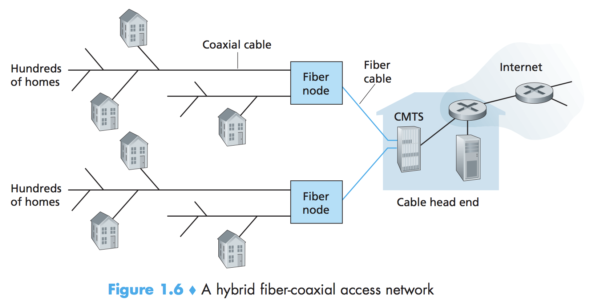
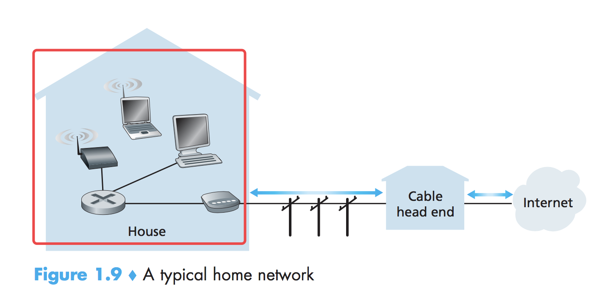

|                    |      |                    |        |
| ------------------ | ---- | ------------------ | ------ |
| end-to-end         | 端对端  | link               | 链路     |
| delay              | 时延   | switch             | 交换机    |
| throughput         | 吞吐量  | queuing delay      | 排队时延   |
| loss               | 丢包   | protocol layering  | 协议分层   |
| quantitative model | 定量模型 | Link-layer switch  | 链路层交换机 |
| host               | 主机   | communication link | 通信链路   |
| end system         | 端系统  | packet switch      | 分组交换机  |
|                    |      |                    |        |
|                    |      |                    |        |

A packet switch takes a packet arriving on one of its incoming communication links and forwards that packet on one of its outgoing communication links.

Most prominent types:

- **routers**.(路由器)
- **Link-layer switche**s.(链路层交换机)

  ​	
  Link-layer switches are typically used in access networks, while routers are typically used in the network core.

**Route/path**: (路径)

The sequence of communication links and packet switches traversed by a packet from the sending end system to the receiving end system is known as a route or path through the network.

Packet-switched networks (which transport packets) are in many ways similar to transportation networks of highways, roads, and intersections (which transport vehicles).

**ISP**s (Internet Service Providers, 因特网服务提供商)

- End systems access the Internet through Internet Service Providers.
- Each ISP is in itself a network of packet switches and communication links.
- The internet is all about connecting end systems to each other, so the ISPs that provide access to end systems must also be interconnected.
- These lower-tier ISPs are interconnected through national and international upper-tier ISPs such as Level 3 Communications, AT&T, Sprint, and NTT.
- An upper-tier ISP consists of high-speed routers interconnected with high-speed **fiber-optic link**s (光纤链路). 
- Each ISP network, whether upper-tier or lower-tier, is managed independently, runs the IP protocol, and conforms to certain naming and address conventions.

**Internet protocols**

End systems, packet switches, and other pieces of the Internet run protocols that control the sending and receiving of information within the Internet.

The **Transmission Control Protocol(TCP)** and the **Internet Protocol(IP)** are two of the most important protocols in the internet.

The Internet's principal protocols are collectively known as **TCP/IP**.

**Internet standards**

Internet standards are developed by the Internet Engineering Task Force (**IETF**).

The IETF standards documents are called **requests for comments (RFCs)**. They define protocols such as TCP, IP, HTTP, and SMTP.

Other bodies also specify standards for network components, most notably for network links. The IEEE 802 LAN/MAN Standards Committee, for example, specifies the Ethernet and wireless WiFi standards.

### 1.1.2 a Services Description

We can also describe the Internet from an entirely different angle —— namely, as an **infrastructure** *that provides services to applications*.

These applications include electronic mail, Web surfing, social networks, instant messaging, Voice-over-IP(VoIP), video streaming, distributed games, peer-to-peer(P2P) file shring, television over the Internet, remote login, and much, much more.

The applications are said to be **distributed applications**, since they involve multiple end systems that exchange data with each other.

Importantly, Internet applications run on end systems—they do not run in the packet switches in the network core. Although packet switches facilitate the exchange of data among end systems, they are not concerned with the application that is the source or sink of data.

​		
End systems attached to the Internet provide an *Application Programming Interface (API)* that specifies how a program running on one end system asks the Internet infrastructure to deliver data to a specific destination program running on another end system.

This **Internet API** is a set of rules that the sending program must follow so that the Internet can deliver the data to the destination program.

We have just given two descriptions of the Internet: one in terms of its hardware and software components, the other terms of an infrastructure for providing services to distributed applications.

​	
All activity in the Internet that involves two or more communicating remote entities is governed by a protocol.

- For example, hardware-implemented protocols in two physically connected computers control the flow of bits on the "wire" between the two network interface cards;
- congestion-control protocols in end systems control the rate at which packets are transmitted between sender and receiver; 
- protocols in routers determine a packet’s path from source to destination.

Protocols are running everywhere in the Internet.

When you type the URL of a Web page into your Web browser:

- First, your computer will send a connection request message to the Web server and wait for a reply. 
- The Web server will eventually receive your connection request message and return a connection reply message. 
- Knowing that it is now OK to request the Web document, your computer then sends the name of the Web page it wants to fetch from that Web server in a GET message. 
- Finally, the Web server returns the Web page (file) to your computer.

**Protocol**:

*A protocol defines the format and the order of messages exchanged between two or more communicating entities, as well as the actions taken on the transmission and/or receipt of a message or other event.*

Different protocols are used to accomplish different communication tasks.

Mastering the field of computer networking is equivalent to understanding the what, why, and how of networking protocols.

## 1.2 The Network Edge

The Internet's end systems include desktop computers, servers, and mobile computers. Furthermore, an increasing number of non-traditional devices are being attached to the Internet as end systems.
​					
**End system**s are also referred to as **host**s(主机) because they host (that is, run) applications programs such as a Web browser program, a Web server program, an e-mail client program, or an e-mail server program.

Hosts are sometimes further divided into two categories: **clients** and **servers**.

​		

### 1.2.1 Access Networks

**access network (接入网)** — the network that physically connects an end system to the first router (also known as the "**edge router(边缘路由器)**") on a path from the end system to any other distant end system.

#### Home Access: DSL, Cable, FTTH, Dial-Up, and Satellite

Two prevalent types of broadband residential access:

1. **digital subscriber line(DSL, 数字用户线)**
   - when DSL is used, a customer's telco is also its ISP.
   - each customer's DSL modem uses the existing telephone line to exchange data with a **digital subscriber line access multiplexer (DSLAM, 多路器)** located in the telco's local central office (CO).
   - The home's DSL modem takes digital data and translates it to high-frequency tones for transmission over telephone wires to the CO. The analog signals from many such houses are translated back into digital format at the DSLAM.
   - *The residential telephone line carries both data and traditional telephone signals simultaneously, which are encoded at different frequencies:*
     - A high-speed downstream channel, in the 50 kHz to 1 MHz band;
     - A medium-speed upstream channel, in the 4 kHz to 50 kHz band;
     - An ordinary two-way telephone channel, in the 0 to 4 kHz band.
   - Engineers have expressly designed DSL for short distances between the home and the CO; generally, if the residence is not located within 5 to 10 miles of the CO, the residence must resort to an alternative form of Internet access.

2. **cable Internet access(电缆因特网接入)**

   - While DSL makes use of the telco’s existing local telephone infrastructure, *cable Internet access makes use of the cable television company’s existing cable television infrastructure*. 

   - A residence obtains cable Internet access from the same company that provides its cable television.

   - Because both fiber and coaxial cable are employed in this system, it is often referred to as hybrid fiber coax (HFC).

     

   - At the cable head end, the cable modem termination system (CMTS) serves a similar function as the DSL network’s DSLAM—turning the analog signal sent from the cable modems in many downstream homes back into digital format.		

   - One important characteristic of cable Internet access is that it is **a shared broadcast medium**(*???need more learning*)

3. **fiber to the home (FTTH, 光纤到户)**
   - The FTTH concept is simple — provide an optical fiber path from the CO directly to the home.
   - competing technologies for optical distribution from the CO to the homes:
     - **Active optical networks (AONs, 主动光纤网络)**
     - **Passive optical networks (PONs, 被动光纤网络)**
   - FTTH can potentially provide Internet access rates in the gigabits per second range.	

> The average downstream speed of US FTTH customers was approximately 20 Mbps in 2011 (*compared with 13 Mbps for cable access networks and less than 5 Mbps for DSL*)*(???why)*

4. **satellite link (卫星链路)**

   In locations where DSL, cable, and FTTH are not available (e.g., in some rural settings), a satellite link can be used to connect a residence to the Internet at speeds of more than 1 Mbps;

   ​	

5. **Dial-up access over traditional phone lines (传统电话线拨号)**

   based on the same model as DSL—a home modem connects over a phone line to a modem in the ISP.
   Compared with DSL and other broadband access networks, dial-up access is excruciatingly slow at 56 kbps.

#### Access in the Enterprise (and the Home): Ethernet and WiFi	

On corporate and university campuses, and increasingly in home settings, a local area network(**LAN**) is used to connect an end system to the edge router.

**Ethernet**:

- Ethernet is by far the most prevalent access technology in corporate, university, and home networks.
- Ethernet user **twisted-pair copper** wire to connect to an **Ethernet switch**. The Ethernet switch, or a network of such interconnected switches, is then in turn connected into the larger Internet.
- With Ethernet assess, users typically have 100 Mbps access to the Ethernet switch, whereas servers may have 1 Gbps or even 10 Gbps access.

**WiFi**:

- In a wireless LAN setting, wireless users transmit/receive packets to/from an access point that is connected into the enterprise’s network (most likely including wired Ethernet), which in turn is connected to the wired Internet. 
- A wireless LAN user must typically be within a few tens of meters of the access point.
- Wireless LAN access based on **IEEE 802.11 technology**, more colloquially known as WiFi.
- As discussed in detail in Chapter 6, 802.11 today provides a shared transmission rate of up to 54 Mbps.

Even though Ethernet and WiFi access networks were initially deployed in enterprise (corporate, university) settings, they have recently become relatively common components of home networks.

*Many homes combine broadband residential access (that is, cable modems or DSL) with these inexpensive wireless LAN technologies to create powerful home networks.*

​			

#### Wide-Area Wireless Access: 3G and LTE

- Increasingly, devices such as iPhones, BlackBerrys, and Android devices are being used to send email, surf the Web, Tweet, and download music while on the run.
- These devices employ the same wireless infrastructure used for cellular telephony to send/receive packets through a base station that is operated by the cellular network provider. 
- Unlike WiFi, a user need only be within a few tens of kilometers (as opposed to a few tens of meters) of the base station.

Telecommunications companies have made enormous investments in so-called third-generation (**3G**) wireless, which provides *packet-switched wide-area wireless Internet access* at speeds in excess of 1 Mbps. 		
But even higher-speed wide-area access technologies—a fourth-generation (**4G**) of wide-area wireless networks—are already being deployed.

**LTE** ( for “Long-Term Evolution”—a candidate for Bad Acronym of the Year Award) has its roots in 3G technology, and can potentially achieve rates in excess of 10 Mbps.

>We’ll cover the basic principles of wireless networks and mobility, as well as WiFi, 3G, and LTE technologies (and more!) in Chapter 6.

### 1.2.2 Physical Media

*Different access technologies related to different physical media.*

Physical media fall into two categories:

- Guided media
  - The waves are guided along a solid medium, such as a fiber-optic cable, a twisted-pair copper wire, or a coaxial cable.
- Unguided media
  - The waves propagate in the atmosphere and in outer space, such as in a wireless LAN or a digital satellite channel.

Cost:

- The actual cost of the physical link (copper wire, fiber-optic cable, and so on) is often relatively minor compared with other networking costs. 
- In particular, the labor cost associated with the installation of the physical link can be orders of magnitude higher than the cost of the material. 
- For this reason, many builders install twisted pair, optical fiber, and coaxial cable in every room in a building. Even if only one medium is initially used, there is a good chance that another medium could be used in the near future, and so money is saved by not having to lay additional wires in the future.

#### Twisted-Pair Copper Wire (双绞铜线)				

- The least expensive and most commonly used guided transmission medium.
  - (used by telephone, more than 99 percent of the wired connections from the telephone handset to the local telephone switch use twisted-pair copper wire.)
- *The wires are twisted together to reduce the electrical interference from similar pairs close by*.
- Typically, a number of pairs are bundled together in a cable by wrapping the pairs in a protective shield. 
- *A wire pair constitutes a single communication link*.
- **Unshielded twisted pair (UTP, 无屏蔽双绞线)** *is commonly used for computer networks within a building, that is, for LANs*. *Data rates for LANs using twisted pair today range from 10 Mbps to 10 Gbps.*
- The data rates that can be achieved *depend on the thickness of the wire and the distance between transmitter and receiver*.		
- When fiber-optic technology emerged in the 1980s, many people disparaged twisted pair because of its relatively low bit rates. 
- But twisted pair did not give up so easily. Modern twisted-pair technology, such as category 6a cable, can achieve data rates of 10 Gbps for distances up to a hundred meters.
- In the end, *twisted pair has emerged as the dominant solution for high-speed LAN networking.*
- As discussed earlier, *twisted pair is also commonly used for residential Internet access*. We saw that dial-up modem technology enables access at rates of up to 56 kbps over twisted pair. We also saw that DSL (digital subscriber line) technology has enabled residential users to access the Internet at tens of Mbps over twisted pair (when users live close to the ISP’s modem).

used for:

1. LAN
2. Residential Internet access

#### Coaxial Cable (同轴电缆)

- Like twisted pair, coaxial cable consists of two copper conductors, but *the two conductors are concentric* rather than parallel. 
- Coaxial cable is quite common in cable television systems. 
- In cable television and cable Internet access, the transmitter shifts the digital signal to a specific frequency band, and the resulting analog signal is sent from the transmitter to one or more receivers.
- Coaxial cable can be used as a guided **shared medium(共享媒体)**. Specifically, a number of end systems can be connected directly to the cable, with each of the end systems receiving whatever is sent by the other end systems.

#### Fiber Optics (光纤)

- An optical fiber is a thin, flexible medium that conducts pulses of light, with each pulse representing a bit.
- *A single optical fiber can support tremendous bit rates, up to tens or even hundreds of gigabits per second.* 
- *They are immune to electromagnetic interference, have very low signal attenuation up to 100 kilometers, and are very hard to tap.* 
- These characteristics have made fiber optics the preferred longhaul guided transmission media, particularly for overseas links. 
- Many of the long-distance telephone networks in the United States and elsewhere now use fiber optics exclusively. *Fiber optics is also prevalent in the backbone of the Internet.* 
- However, the high cost of optical devices—such as transmitters, receivers, and switches—has hindered their deployment for short-haul transport, such as in a LAN or into the home in a residential access network. 
- The Optical Carrier (OC,光载波) standard link speeds range from 51.8 Mbps to 39.8 Gbps; these specifications are often referred to as OC-n, where the link speed equals n × 51.8 Mbps. Standards in use today include OC-1,
  OC-3, OC-12, OC-24, OC-48, OC-96, OC-192, OC-768.

#### Terrestrial Radio Channels (陆地无线电信道)

- Radio channels carry signals in the electromagnetic spectrum. 
- They are an attractive medium because they require no physical wire to be installed, can penetrate walls,provide connectivity to a mobile user, and can potentially carry a signal for long distances. 
- The characteristics of a radio channel depend significantly on the propagation environment and the distance over which a signal is to be carried. *Environmental considerations determine*:
  - path loss and shadow fading (which decrease the signal strengthas the signal travels over a distance and around/through obstructing objects);
  - multi-path fading (due to signal reflection off of interfering objects);
  - interference (dueto other transmissions and electromagnetic signals).
- *Terrestrial radio channels can be broadly classified into three groups*: 
  1. those thatoperate over very short distance (e.g., with one or two meters); (Personal devices such as wire-less headsets, keyboards, and medical devices operate over short distances)
  2. those that operate inlocal areas, typically spanning from ten to a few hundred meters; (thewireless LAN technologies described in Section 1.2.1 use local-area radio channels)
  3. those thatoperate in the wide area, spanning tens of kilometers. (the cellular access technologies use wide-area radio channels)

We’ll discuss radio channels in detail in Chapter 6.	

​				

#### Satellite Radio Channels (卫星无线电信道)