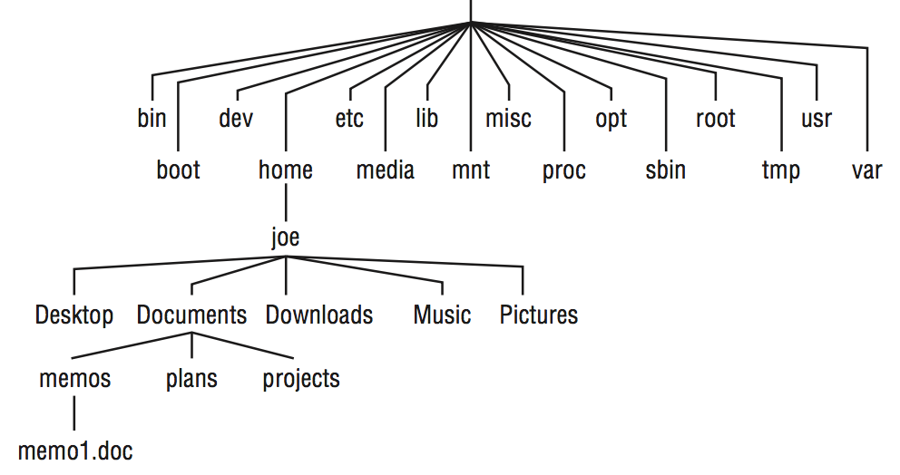

# Chapter 3 Using the Shell

The shell is a command language interpreter.


This chapter is your guide to working with the Linux system commands, processes, and filesystem from the shell. It describes the shell environment and helps you tailor it to your needs.


There are several ways to get to a shell interface in Linux. Three of the most common are:

- shell prompt
- Terminal window
- virtual console

## Running commands

The default prompt for a regular user is a dollar sign: `$`.

The default prompt for the root user is a pound sign (hash mark): `#`

```
$ who am i
justin tty1 2018-03-19 15:04
$ grep justin /etc/passwd
justin:x:1000:1000:Justin Hu,,,:/home/justin:/bin/bash
```

- **`date`**
- **`pwd`**
  - shows your current working directory
- **`hostname`**
  - shows your computer's hostname
- **`ls`**
  - Lists the files and directories in your current directory


### Command syntax:

##### Options 

Options typically consist of a single letter, preceded by a hyphen.

But you also can group single-letter options together or precede each with a hyphen, to use more than one option at a time:

```
$ ls -l -a -t
$ ls -lat
```


Some commands include options that are represented by a whole word. To tell a command to use a whole word as an option, you typically precede it with a double hyphen (`—`). 

```
$ ls --help
```

Without the double hyphen, the letters `h`,`e`,`l`,and `p` would be interpreted as separate options. 

- (There are some commands that don't follow the double hyphen convention, using a single hyphen before a word, but most commands use double hyphens for word options.)


##### arguments

Many commands also accept arguments after certain options are entered or at the end of the entire command line. 

An argument is an extra piece of information, such as a filename, directory, username, device, or other item that tells the command what to act on.

```
cat /etc/passwd
```

Displays the contents of the `etc/passwd` file on your screen.

In this case, `etc/passwd` is the argument.


Sometimes, an argument is associated with an option.

- In that case, the argument must immediately follow the option. 

- With single-letter options, the argument typically follows after a space.

  ```
  $ tar -cvf backup.tar /home/justin
  ```

  In the `tar` example just shown, the options say to create (`c`) a file (`f`) named `backup.tar` that includes all the contents of the `/home/justin` directory and its subdirectories and show verbose messages as the backup is created (`v`). Because `backup.tar` is an argument to the `f` option, `backup.tar` must immediately follow the option.

- For full-word options, the argument often follows an equal sign (`=`). Here are some examples:

  ```
  $ ls --hide=Desktop
  ```

  the --hide option tells the ls command to not display the file or directory named Desktop when listing the contents of the directory. 


```
uname
```

- Print system information

```
$ id
uid=1000(justin) gid=1000(chris) groups=1000(justin), 4(adm) .......
```

```
$ who -uH
NAME  LINE TIME         IDLE PID COMMENT 
justin tty1 Jan 13 20:57 .    2013
```


### Locating commands

To find commands you type, the shell looks in what is referred to as your path. For commands that are not in your path, you can type the complete identity of the location of the command.


*The better way is to have commands stored in well-known directories and then add those directories to your shell's **`$PATH`** environment variable*.

- The path consists of a list of directories that are checked sequentially for the commands you enter. To see your current path, type the following:

- ```
  $ echo $PATH
  /usr/local/bin:/usr/bin:/bin:/usr/local/sbin:/usr/sbin:/sbin:/home/justin/bin
  ```

  - The results show a common default path for a regular Linux user. Directories in the path list are *separated by colons.*

- *Most user commands that come with Linux are stored in the `/bin`, `/usr/bin`, or `/usr/local/bin` directories.*

- The `/sbin` and `/usr/sbin` directories contain administrative commands.

- The last directory shown is the `bin` directory in the user’s `home` directory(`/home/justin/bin`).

- *If you want to add your own commands or shell scripts, place them in the `bin` directory in your home directory (such as `/home/chris/bin` for the user named `chris`).* 

  - This directory is automatically added to your path in some Linux systems, although you may need to create that directory or add it to your PATH on other Linux systems. 
  - So, as long as you add the command to your bin with execute permission, you can begin using it by simply typing the command name at your shell prompt. 

- *To make commands available to all users, add them to `/usr/local/bin`.*


*Linux does not, by default, check the current directory for an executable before search the path.*

- It immediately begins searching the path, and executables in the current directory are run only if they are in the PATH variable or you give their absolute (such as `/home/chris/scriptx.sh`) or relative (for example, `./scriptx.sh`) address.


*The path directory order is important.*


Not all the commands you run are located in directories in your `PATH` variable. 

- Some commands are built into the shell.
- Other commands can be overridden by creating aliases that define any commands and options that you want the command to run.
- There are also ways of defining a function that consists of a stored series of commands.


*Here is the order in which the shell checks for the commands you type:*

1. **Aliases.** 
   - Names set by the `alias` command that represent a particular command and a set of options.
   - alias enable you to define a short name for a long, complicated command.
2. **Shell reserved word.**
   - Words reserved by the shell for special use.
   - Many of these are words that you would use in programming-type functions, such as `do`, `while`, `case`, and `else`. (See chapter 7)
3. **Function.**
   - a set of commands that are executed together within the current shell.
4. **Built-in command.**
   - This is a command built into the shell. 
   - As a result, there is no representation of the command in the filesystem. Some of the most common commands you will use are shell built-in commands, such as:
     - **`cd`** (to change directories), 
     - **`echo`** (to output text to the screen), 
     - **`exit`** (to exit from a shell), 
     - **`fg`** (to bring a command running in the background to the foreground), 
     - **`history`** (to see a list of commands that were previously run), 
     - `pwd` (to list the present working directory), 
     - **`set`** (to set shell options), 
     - **`type`** (to show the location of a command).
5. **Filesystem command**.
   - This command is stored in and executed from the computer's filesystem.
   - These are the commands that are indicated by the value of the `PATH` variable.


If a command resides in several locations, you can add the `-a` option to have all the known locations of the command printed. For example, the command `type -a ls` should show an aliased and filesystem location for the `ls` command.


*If a command is not in your `PATH` variable, you can use the `locate` command to try to find it.*

- *Using **`locate`**, you can search any part of the system that is accessible to you (some files are only accessible to the root user.)*


## Recalling Commands Using Command History


### Command-line editing

You can use the following steps to change the command:

1. Press the up arrow ($\uparrow$) key.
   - Display the most recent command from your shell history.
2. Press Ctrl+A.
   - This moves the cursor to the beginning of the command line.
3. Press Ctrl+F or the right arrow ($\rightarrow$) key.
4. Press Ctrl+D. 
   - Type this command to delete some characters.


Keystroke for Navigating Command Lines

| keystroke | Full Name          | Meaning                                  |
| --------- | ------------------ | ---------------------------------------- |
| Ctrl+F    | Character forward  | go forward one character                 |
| Ctrl+B    | Character backward | Go backward one character                |
| Alt+F     | Word forward       | Go forward one word                      |
| Alt+B     | Word backward      | Go backward one word                     |
| Ctrl+A    | Beginning of line  | Go to the beginning of the current line  |
| Ctrl+E    | End of line        | Go to the end of the line                |
| Ctrl+L    | Clear screen       | Clear screen and leave line at the top of the screen |


Keystrokes for Editing Command Lines

| Keystroke | Full Name                | Meaning                                  |
| --------- | ------------------------ | ---------------------------------------- |
| Ctrl+D    | Delete current           | Delete the current character.            |
| Backspace | Delete previous          | Delete the previous character.           |
| Ctrl+T    | Transpose character      | Switch positions of current and previous characters |
| Alt+T     | Transpose words          | Switch positions of current and previous words |
| Alt+U     | Uppercase word           | Change the current word to uppercase.    |
| Alt+L     | Lowercase word           | Change the current word to lowercase.    |
| Alt+C     | Capitalize word          | Change the current word to an initial capital. |
| Ctrl+V    | Insert special character | Add a special character. For example, to add a Tab character, press Ctrl+V+Tab |


Keystrokes for Cutting and Pasting Text from within Command Lines

| Keystroke | Full Name             | Meaning                                  |
| --------- | --------------------- | ---------------------------------------- |
| Ctrl+K    | Cut end of line       | Cut text to the end of the line          |
| Ctrl+U    | Cut beginning of line | Cut text to the beginning of the line    |
| Ctrl+W    | Cut previous word     | Cut the word located behind the cursor   |
| Alt+D     | Cut next word         | Cut the word following the cursor        |
| Ctrl+Y    | Paste recent text     | Paste most recently cut text             |
| Alt+Y     | Paste earlier text    | Rotate back to previously cut text and paste it. |
| Ctrl+C    | Delete whole line     | Delete the entire line                   |


### Command-line completion

To attempt to complete a value, type the first few characters and press `Tab`.

Here are some of the values you can type partially from a bash shell:

- Command, alias, or funciton
- Variable
  - If the text you type begins with a dollar sign, the shell completes the text with a variable from the current shell.
- Username
  - If the text you type begins with a tilde(`~`), the shell completes the text with a username. As a result, `~username` indicates the home directory of the named user.
- Hostname
  - If the text you type begins with the at symbol(`@`), the shell completes the text with a hostname taken from the `/etc/hosts` file.


Pressing `Tab` twice offers some wonderful possibilities. 


### Command-line recall

After you type a command line, the entire command line is saved in your shell’s history list. The list is stored in the current shell until you exit the shell. After that, it is written to a history file

To view your history list, use the `history` command. Type the command without options or followed by a number to list that many of the most recent commands. 

```
$ history 8
382 date
383 ls /usr/bin | sort -a | more
384 man sort
385 cd /usr/local/bin
386 man more
387 useradd -m /home/chris -u 101 chris 388 passwd chris
389 history 8
```

A number precedes each command line in the list. You can recall one of those commands using an exclamation point (`!`).

- Keep in mind that when using an exclamation point, the command runs blind, without presenting an opportunity to confirm the command you're referencing.


There are several ways to run a command immediately from this list, including the following:

- **`!n`** — Run command number.
  - replace the `n` with the number of the command line and that line is run.
- **`!!`** — *Run previous command.*
- **`!?string?`** — *Run command containing string*.
  - This runs the most recent command that contains a particular string of characters.


**Key Strokes for Using Command History**

| Key(s)                                  | Function Name              | Description                              |
| --------------------------------------- | -------------------------- | ---------------------------------------- |
| Arrow keys($\uparrow$ and $\downarrow$) | step                       | Press the up and down arrow keys to step through each command line in your history list to arrive at the one you want.(Ctrl+P and Ctrl+N do the same functions, respectively.) |
| *Ctrl+R*                                | Reverse incremental search | After you press these keys, you enter a search string to do a reverse search. As you type the string, a matching command line appears that you can run or edit. |
| Ctrl+S                                  | Forward incremental search | This is the same as the preceding function but for forward search. (it may not work in all instances.) |
| *Alt+P*                                 | Reverse search             | After you press these keys, you enter a string to do a reverse search. Type a string and press Enter to see the most recent command line that includes that string. |
| Alt+N                                   | Forward search             | This is the same as the preceding function but for forward search. (It may not work in all instances.) |

​			

Another way to work with your history list is to use the **`fc`** *command:*

-  Type `fc` followed by a history line number, and that command line is opened in a text editor.
  - Make the changes that you want.
-  When you exit the editor, the command runs.
-  You can also give a range of line numbers.
  - All the commands open in your text editor, and then run one after the other when you exit the editor.


​		
After you close your shell, the history list is stored in the `.bash_history` file in your home directory. Up to 1,000 history commands are stored for you by default.


> *NOTE*
>
> Some people disable the history feature for the root user by setting the **`HISTFILE`** to `/dev/null` or simply leaving `HISTSIZE` blank. This prevents information about the root user’s activities from potentially being exploited. 
>
> If you are an administrative user with root privileges, you may want to consider emptying your  file upon exiting as well for the same reasons. 
>
> Also, because shell history is stored permanently when the shell exits properly, you can prevent storing a shell’s history by killing a shell. For example, to kill a shell with process `ID 1234`, type `kill -9 1234` from any shell.
>
>
> ​				
>

## Connecting and expanding commands

A truly powerful feature of the shell is the capability to redirect the input and output of commands to and from other commands and files. 

To allow commands to be strung together, the shell uses *metacharacters*.

- A **metacharacter** is a typed character that has special meaning to the shell for connecting commands or requesting expansion.

- *Metacharacters include:*

  - pipe character **`|`**
  - ampersand **`&`**
  - semicolon **`;`**
  - right parenthesis **`)`**
  - left parenthesis **`(`**
  - Less than sign **`<`**
  - Greater than sign **`>`**

  ​

### Piping between commands

The pipe(**`|`**) metacharacter *connects the output from one command to the input of another command.*

For example:

```
$ cat /etc/passwd | sort | less
```

This command lists the contents of the `/etc/passwd` file and pipes the output to the sort command. The sort command takes the usernames that begin each line of the `/etc/passwd` file, sorts them alphabetically, and pipes the output to the less command (to page through the output).

​			

### Sequential commands

Sometimes, you may want a sequence of commands to run, *with one command completing before the next command begins*. 

You can do this by typing several commands on the same command line and separating them with semicolons (**`;`**):

For example:

- ```
  $ date ; troff -me verylargedocument | lpr ; date
  ```

  In this example, I was formatting a huge document and wanted to know how long it would take. The first command (date) showed the date and time before the formatting started. The troff command formatted the document and then piped the output to the printer. When the formatting was finished, the date and time were printed again (so I knew how long the troff command took to complete).

- Another useful command to add to the end of a long command line is `mail`. You could add the following to the end of a command line.

  ```
  ; mail -s "Finished the long command" justin@example.com
  ```

  then, a mail message is sent to the user you choose after the command completes.


### Background commands

Some commands can take a while to complete.

Sometimes, you may not want to tie up your shell waiting for a command to finish. In those cases, *you can have the commands run in the background by using the ampersand (**`&`**).*


- Text formatting commands (such as `nroff` and `troff`, described earlier) are examples of commands that are often run in the background to format a large document. 
- *You also might want to create your own shell scripts that run in the background to check continuously for certain events to occur, such as the hard disk filling up or particular users logging in.*

For example:

- The following is an example of a command being run in the background:

  ```
  $ troff -me verylargedocument | lpr &
  ```

  See more in Chapter 6.


### Expanding commands

*With command substitution, you can have the output of a command interpreted by the shell instead of by the command itself.* 

In this way, you can have the standard output of a command become an argument for another command.

The two forms of command substitution are **`$(command)`** and **`` `command` ``** (backticks, not single quotes).

For example:

```
$ vi $(find /home | grep xyzzy)
```

- the command substitution is done before the `vi` command is run.
- First, the find command starts at the `/home` directory and prints out all files and directories below that point in the filesystem.
- The output is piped to the `grep` command, which filters out all files except for those that include the string `xyzzy` in the filename. 
- Finally, the vi command opens all filenames for editing (one at a time) that include xyzzy. (If you run this and are not familiar with vi, you can type **`:q!`** to exit the file.)


*This particular example is useful if you want to edit a file for which you know the name but not the location.*

- As long as the string is uncommon, you can find and open every instance
  of a filename existing beneath a point you choose in the filesystem. (In other words, don’t use `grep` from the root filesystem or you’ll match and try to edit several thousand files.)


### Expanding arithmetic expressions

Sometimes, you want to pass arithmetic results to a command.

There are two forms you can use to expand an arithmetic expression and pass it to the shell: 

- **`$[expression]`**
- **`$(expression)`**


For example:

```
$ echo "I am $[2018 - 1988] years old."
I am 30 years old.
```

- The shell interprets the arithmetic expression first, and then passes that information to the `echo` command displays the text, with the results of the arithmetic `30` inserted.

```
$ echo "There are $(ls | wc -w) files in this directory."
There are 14 files in this directory.
```


### Expanding variables

*Variables that store information within the shell can be expanded using the dollar sing(**`$`**) metacharacter.*

When you expand an environment variable on a command line, the value of the variable is printed instead of the variable name itself, as follows:

```
$ ls -l $BASH
```

Using **`$BASH`** as an argument to ls -l causes a long listing of the bash command to be printed.


​		

## Using Shell Variables

The shell itself stores information that may be useful to the user’s shell session in what are called **variables**. 

- *You can see all variables set for your current shell by typing the **`set`** command.*			

A subset of your local variables are referred to as **environment variables**.

- Environment variables are variables that are ecported to any new shells opened from the current shell.
- *Type **`env`** to see environment variables*.


Because there are always multiple ways to do anything in Linux, you can also type **`declare`** to get a list of the current environment variables and their values along with a list of shell functions.


Besides those that you set yourself, system files set variables that store things such as locations of configuration files, mailboxes, and path directories. 

- They can also store values for your shell prompts, the size of your history list, and type of operating system. 

- You can refer to the value of any of those variables by preceding it with a dollar sign (`$`) and placing it anywhere on a command line. For example:

  ```
  $ echo $USER
  justin
  ```


When you start a shell, many environment variables are already set


*Some variables that either are set when you use a bash shell or can be set by you to use with different features：*

| Variable           | Description                              |
| :----------------- | ---------------------------------------- |
| **`BASH`**         | This contains the full pathname of the `bash` command. This is usually `/bin/bash`. |
| **`BASH_VERSION`** | This is a number representing the current version of the `bash` command. |
| **`EUID`**         | This is the effective user ID number of the current user. It is assigned when the shell starts, based on the user's entry in the `etc/passwd` file. |
| **`FCEDIT`**       | If set, this variable indicates the text editor used by the `fc` command to edit `history` commands. |
| **`HISTFILE`**     | This is the location of your history file. It is typically located at `$HOME/.bash_history` |
| `HISTFILESIZE`     | This is the number of history entries that can be stored. |
| `HISTCMD`          | This returns the number of the current command in the `history` list. |
| `HOME`             | This is your home directory. It is your current working directory each time you log in or type the `cd` command with any options. |
| `HOSTTYPE`         | This is a value that describes the computer architecture on which the Linux system is running. For AMD 64-bit machines, the value is x86_64. |
| `MAIL`             | This is the location of your mailbox file. The file is typically your username in the `var/spool/mail` directory. |
| `OLDPWD`           | This is the directory that was the working directory before you changed to the current working directory. |
| `OSTYPE`           | This name identifies the current operating system. |
| `PATH`             | This is the colon-separated list of directories used to find commands that you type. For the root user, the value also includes `/sbin:/usr/sbin:/usr/local/sbin` You need to type the full path or a relatie path to a command you want to run that is not in your `PATH`. |
| `PPID`             | This is the process ID of the command that started the current shell. |
| `PROMPT_COMMAND`   | This can be set to a command name that is run each time before your shell prompt is displayed. Setting `PROMPT_COMMAND=date` lists the current date/time before the prompt appears. |
| **`PS1`**          | This sets the value of your shell prompt. There are many items that you can read into your prompt(date, time, username, hostname, and so on). |
| `PWD`              | This is the directory that is assigned as your current directory. This value changes each time you change directories using the `cd` command. |
| `RANDOM`           | Accessing this variable causes a random number to be generated. |
| `SECONDS`          | This is the number of seconds since the time the shell was started. |
| `SHLVL`            | This is the number of shell levels associated with the current shell session. |
| `TMOUT`            | This can be set to a number representing the number of seconds the shell can be idle without receiving input. After the number of seconds is reached, the shell exits. |


### Creating and using aliases

*You can add and list aliases with the **`alias`** command.*

For example:

```
$ alias p='pwd ; ls -CF'
```

- the letter p is assigned to run the command `pwd`, and then to run `ls -CF` to print the current working directory and list its contents in column form.

```
$ alias rm='rm -i'
```

- Instead of just removing files, you are prompted for each individual file removal. This prevents you from automatically removing all the files in a directory by mistakenly typing something such as `rm *`.


*If you want to remove an alias, type **`unalias`**.*

- (Remember that if the alias is set in a configuration file, it will be set again when you open another shell.)


### Exiting the shell

Type: 

- **`exit`**
- **Ctrl+D**.


## Creating Your Shell Environment

You can tune your shell to help you work more efficiently.

You can set aliases to create shortcuts to your favorite command lines and environment variables to store bits of information.

*By adding those setting to shell configuration files, you can have the settings available every time you open a shell.*


### Configuring your shell

Several configuration files support how your shell behaves.

- Some of the files are executed for every user and every shell, whereas others are specific to the user who creates the configuration file.


The following table shows the files that are of interest to anyone using the bash shell in Linux.(**`~`** in the filenames to indicate that the file is located in each user's home directory.)

| File              | Description                              |
| ----------------- | ---------------------------------------- |
| `/etc/profile`    | This sets up user environment information for every user. It is executed when you first log in. This file provides values for your path, in addition to setting environment variables for such things as the location of your mailbox and the size of your history files. Finally, `/etc/profile` gathers shell settings from configuration files in the `etc/profile.d` directory. |
| `/etc/bashrc`     | This executes for every user who runs the bash shell, each time a bash shell is opened. It sets the default prompt and may add one or more aliases. Values in this file can be overridden by information in each user's `~/.bashrc` file. |
| `~/.bash_profile` | This is used by each user to enter information that is specific to his or her use of the shell. It is executed only once, when the user logs in. By default, it sets a few environment variables and executes the user's `.bashrc` file. This is a good place to add environment variables because, once set, they are inherited by future shells. |
| `~/.bashrc`       | This contains the information that is specific to your bash shells. *It is read when you log in and also each time you open a new bash shell. This is the best location to add aliases so that your shell picks them up.* |
| `~/.bash_logout`  | This executes each time you log out (exit the last bash shell). By default, it simply clears your screen. |

- *To change the `/etc/profile` or `etc/bashrc` files, you must be the root user.*
- *Users can change the information in the `$HOME/.bash_profile`, `$HOME/.bashrc` and `$HOME/.bash_logout` files in their own home directories.*
- ​

Until you learn to use the `vi` editor, you can use a simple editor called **`nano`** to edit plain-text files.

For example:

- ```
  $ nano $HOME/.bashrc
  ```

  *With the file open in `nano`, move the cursor down to the bottom of the file. Type the line you want (for example, you could type alias `d='date +%D'`).*

  To save the file, press **Ctrl+O** (the letter O); to quit, press **Ctrl+X**. The next time you log in or open a new shell, you can use the new alias (in this case, just type `d`). 

- *To have the new information you just added to the file available from the current shell, type the following:*

  ```
  $ source $HOME/.bashrc
  ```


The following sections provide ideas about items configuration files.

*In most cases, you add these values to the `.bashrc` file in your home directory.*

*However, if you administer a system, you may want to set some of these values as defaults for all your Linux system's users.*


### Setting your prompt

Your prompt consists of a set of characters that appear each time the shell is ready to accept a command.

- *If you are setting your prompt temporarily by typing at the shell, you should put the value of `PS1` in quotes.* 
  - For example, you could type export `PS1="[\t \w]\$ "` to see a prompt that looks like this: `[20:26:32 /var/spool]$`.

- *To make a change to your prompt permanent, add the value of **`PS1`** to your `.bashrc` file in your home directory.*

  - There may already be a `PS1` value in that file that you can modify. Refer to the Bash Prompt HOWTO (http://www.tldp.org/HOWTO/Bash-Prompt-HOWTO) for information on changing colors, commands, and other features of your bash shell prompt.

    ​

**Characters to Add Information to bash Prompt**:

| Special Character | Description                              |
| ----------------- | ---------------------------------------- |
| `\!`              | This shows the current command history number. This includes all previous commands stored for your username. |
| `\#`              | This shows the command number of the current command. This includes only the commands for the active shell. |
| `\$`              | This shows the user prompt (`$`) or root prompt (`#`), depending on which user you are. |
| `\W`              | This shows only the current working directory base name. For example, if the current working directory was `/var/spool/mail`, this value simple appears as `mail`. |
| `\[`              | This precedes a sequence of nonprinting characters.  This can be used to add aterminal control sequence into the prompt for such things as changing colors, add-ing blink effects, or making characters bold. (Your terminal determines the exactsequences available.) |
| `\]`              | This follows a sequence of nonprinting characters. |
| `\\`              | This shows a backslash.                  |
| `\d`              | This displays the day name, month, and day number of the current date—for exam-ple, Sat Jan 23. |
| `\h`              | This shows the hostname of the computer running the shell. |
| `\n`              | This causes a newline to occur.          |
| `\nnn`            | This shows the character that relates to the octal number replacing `nnn`. |
| `\s`              | This displays the current shell name. For the bash shell, the value would be bash. |
| `\t`              | This prints the current time in hours, minutes, and seconds—for example, 10:14:39. |
| `\u`              | This prints your current username.       |
| `\w`              | This displays the full path to the current working directory. |


### Adding environment variables

*You might want to consider adding a few environment variables to your `$HOME/.bashrc` file.* These can help make working with the shell more efficient and effective:

- **`TMOUT`**

- **`PATH`**

  - If you often use directories of commands that are not in your path, you can permanently add them. 

    To do this, add a `PATH` variable to your `.bashrc` file. 

    For example, to add a directory called `/getstuff/bin`, add the following:

    ```
    PATH=$PATH:/getstuff/bin ; export PATH
    ```

    *(直接添加在`.bashrc`文件里)*This example first reads all the current path directories into the new PATH (`$PATH`), adds the /getstuff/bin directory, and then exports the new PATH.

    >CAUTION:*
    >
    >Some people add the current directory to their PATH by adding a directory identified simply as a dot (`.`) as follows:
    >
    >```
    >PATH=.:$PATH ; export PATH
    >```
    >
    >This enables you to run commands in your current directory before evaluating any other command in the path (which people may be used to if they have used DOS). However, the security risk with this procedure is that you could be in adirectory that contains a command that you don’t intend to run from that directory. For example, a malicious personcould put an ls command in a directory that, instead of listing the content of your directory, does something devious. Because of this, the practice of adding the dot to your path is highly discouraged.

- Whatever:

  - You can create your own environment variables to provide shortcuts in your work.

  - Choose any name that is not being used and assign a useful value to it.

  - For example, if you do lots of work with files in the `/work/time/files/info/memos` directory, you could set the following variable:

    ```
    M=/work/time/files/info/memos ; export M
    ```

    You could make that your current directory by typing `cd $M`. You could run a program from that directory called hotdog by typing `$M/hotdog`. 

    You could edit a filefrom there called bun by typing `vi $M/bun`.


## Getting Information about Commands


- Check the PATH.

  - Type `echo $PATH`
    - You see a list of the directories containing commands that are immediately accessible to you.
  - *Then, you can use `ls` to list the contents of those directories, you will see most standard Linux commands.*
    - For example: `ls /bin`.

- Use the `help` command.

  - Some commands are built into the shell, so they do not appear in a directory.

    The `help` command lists those commands and shows options available with each of them.

  - For help with a particular built-in command, type `help command`, replacing `command` with the name that interests you.

- Use `--help` with the command.

- Use the `info` command.

  - Not all commands have information available in the info database, but sometimes more information can be found there than on a man page.

- Use the `man` command.


Man pages are the most common means of getting information about commands, as well as other basic components of a linux system.

**Manual Page Sections:** 

| Section Number | Section Name                            | Description                              |
| -------------- | --------------------------------------- | ---------------------------------------- |
| 1              | User Commands                           | Commands that can be run from the shell by a regular user (typically no administrative privilege is needed) |
| 2              | System Calls                            | Programming functions used within an application to make calls to the kernel |
| 3              | C Library Functions                     | Programming functions that provide interfaces to specific programming libraries (such as those for certain graphical interfaces or other libraries that operate in user space.) |
| 4              | Devices and Special Files               | Filesystem nodes that represent hardware devices (such as terminals or CD drives) or software devices (such as random number generators) |
| 5              | File Formats and Conventions            | Types of files (such as a graphics or word processing file) or specific configuration files (such as the `passwd` or `group` file). |
| 6              | Games                                   | Games available on the system            |
| 7              | Miscellaneous                           | Overviews of topics such as protocols, filesystems, character set standards, and so on. |
| 8              | System Administration Tools and Daemons | Commands that require root or other administrative privileges to use |


Options to the `man` command enable you to search the man page database or display man pages on the screen.

For example:

```
$ man -k passwd 
...
passwd(1)
passwd(5)
$ man passwd
$ man 5 passwd
```

- *Using the `-k` option, you can search the name and summary sections  of all man pages installed on the system.*
- If you type `man -k passwd`, you will see a list of name contains `passwd`.
  - *`passwd(1)`  is `passwd` command in section 1 of the man pages;*
  - *`passwd(5)` is `passwd` file in section 5.*
- *If you want to explicitly request the section 5 man page, you can type `man 5 passwd`.*
- While you are displaying a man page, *you can press the forward slash `/` and type a term to search the document for that term.*
  - *Press `n` to repeat the search forward;*
  - *Press `N` to repeat the search backward.*
  - Type `q` to quit the man page.


# Chapter 4 Moving around the Filesystem

One of the defining properties of UNIX systems on which Linux is based is that :

- nearly everything you need to identify on your system (data, commands, symbolic links, devices, and directories) is represented by items in the filesystems. 

Knowing where things are and understanding how to get around the filesystem from the shell are critical skills in Linux.


In Linux, files are organized within a hierarchy of directories. 

- Each directory can contain files, as well as other directories. 
- You can refer to any file or directory using either a full path or a relative path.


**Root directory**, represented by a single slash (**`/`**).

The Linux  lesystem is organized as a hierarchy of directories:



**Some of these Linux directories may interest you:**

- `/bin`—Contains common Linux user commands, such as `ls`, `sort`, `date`, and `chmod`.
- `/boot`—Has the bootable Linux kernel and boot loader configuration files (GRUB).
- `/dev`—Contains files representing access points to devices on your systems. 
  - These include:
    - terminal devices (`tty*`), 
    - floppy disks (`fd*`), 
    - hard disks (`hd*` or `sd*`), 
    - RAM(`ram*`)
    - CD-ROM (`cd*`) 
  - Users can access these devices directly through these device files; however, applications often hide the actual device names from end users.
- `/etc`—Contains administrative configuration files. 
  - Most of these files are plaintext files that can be edited with any text editor if the user has proper permission.
- `/home`—Contains directories assigned to each regular user with a login account.
  - (The root user is an exception, using `/root` as his or her home directory.)
- `/media`—Provides a standard location for automounting devices (removable media in particular). 
  - If the medium has a volume name, that name is typically used as the mount point. For example, a USB drive with a volume name of `myusb` would be mounted on `/media/myusb`.
- `/lib`—Contains shared libraries needed by applications in `/bin` and `/sbin` to boot the system.
- `/mnt`—A common mount point for many devices before it was supplanted by the standard `/media` directory. 
  - Some bootable Linux systems still use this directory to mount hard disk partitions and remote filesystems. 
  - Many people still use this directory to temporarily mount local or remote filesystems that are not mounted permanently.
- `/misc`—A directory sometimes used to automount filesystems upon request.
- `/opt`—Directory structure available to store add-on application software.
- `/proc`—Contains information about system resources.
- `/root`—Represents the root user's home directory. 
  - The home directory for root does not reside beneath `/home` *for security reasons.*
- `/sbin`—Contains administrative commands and daemon processes.
- `/tmp`—Contains temporary files used by applications.
- `/usr`—Contains user documentation, games, graphical files (X11), libraries (lib),and a variety of other commands and files that are not needed during the bootprocess. 
  - The `/usr` directory is meant for files that don't change after installation(in theory, `/usr` could be mounted read-only).
- `/var`—Contains directories of data used by various applications. 
  - In particular, this is where you would place files that you share as an FTP server (`/var/ftp`) or a
    web server (`/var/www`). 
  - It also contains all system log files (`/var/log`) and spool files in `/var/spool` (such as `mail`, `cups`, and `news`). 
  - *The `/var` directory contains directories and files that are meant to change often.* 
  - *On server computers, it is common to create the `/var` directory as a separate filesystem, using a filesystem type that can be easily expanded.*

    ​

> Linux Filesystems versus Windows-Based Filesystems
>
> ■ In MS-DOS and Windows filesystems, drive letters represent different storage devices (forexample, A: is a  oppy drive and C: is a hard disk). *In Linux, all storage devices are connected to the filesystem hierarchy.* So the fact that all of `/usr` may be on a separate hard disk or that `/mnt/remote1` is a filesystem from another computer is invisible to the user.
>
> ■ *Slashes*, rather than backslashes, are used to separate directory names in Linux. So `C:\home\joe` in a Microsoft system is `/home/joe` in a Linux system.
>
> ■ Filenames almost always have suffixes in DOS (such as `.txt` for text files or `.doc` forword-processing files). Although at times you can use that convention in Linux, three-character suffixes have no required meaning in Linux. They can be useful for identifying a file type. Many Linux applications and desktop environments use  le suf xes to determine the contents of a file. In Linux, however, DOS command extensions such as `.com`, `.exe`, and `.bat` don’tnecessarily signify an executable. (*Permission flags make Linux files executable.*)
>
> ■ Every file and directory in a Linux system has permissions and ownership associated with it.

​				

## Using Basic Filesystem Commands

When you log in to a Linux system and open a shell, you are placed in your home directory. In Linux, most of the files you save and work with will probably be in that directory or subdirectories that you create.


**Commands to Create and Use Files**

| Command     | Result                                   |
| ----------- | ---------------------------------------- |
| `cd`        | Changes to another direcotry             |
| `pwd`       | Prints the name of the current working directory |
| **`mkdir`** | Creates a directory                      |
| **`chmod`** | *Changes the permission on a file or directory* |
| `ls`        | List the contents of a directory         |

- Return your home directory:

  ```
  $ cd
  $ cd ~
  ```

  - Tilde **`~`** can represent your home directory. So you can:

    ```
    $ cd ~/Music
    $ pwd
    /home/justin/Music
    ```

- Use **`..`** to go to a directory above the current directory.


## Using Metacharacters and Operators

Whether you are listing, moving, copying, removing, or otherwise acting on files in your Linux system, metacharacters and operators help you to work with files more efficiently.

- Metacharacters can help you match one or more files without completely typing each file name.
- Operators enable you to direct information from one command or file to another command or file.

### Using file-matching metacharacters

- **`*`** — Matches any number of characters
- **`?`** — Matches any one character.
- **`[...]`** — Matches any one of the characters between the brackets, which can include a hyphen-separated range of letters or numbers.

For example:

- First, let's create some empty files:

  ```
  $ touch apple banana grape grapefruit watermelon
  ```

  *The **`touch`** command creates empty files.*

- Now, let's try to use some metacharacters:

  ```
  $ ls a*
  apple
  $ ls g*
  grape grapefruit 
  $ ls g*t 
  grapefruit
  $ ls *e*
  apple grape grapefruit watermelon 
  $ ls *n*
  banana watermelon
  $ ls ????e
  apple grape
  $ ls g???e* 
  grape grapefruit
  $ ls [abw]*
  apple banana watermelon 
  $ ls [agw]*[ne]
  apple grape watermelon
  $ ls [a-g]*
  apple banana grape grapefruit
  ```

  ​

### *Using file-redirection metacharacters*

- **`<`** — Directs the contents of a file to the command.
  - In most cases, this is the default action expected by te command and the use of the character is optional;
  - Using `less bigfile` is the same as `less < bigfile`.
- **`>`** — Directs the standard output of a command to a file.
  - If the file exists, the content of that file is overwritten.
- **`2>`** — Directs standard error (error messages) to the file.
- **`&>`** — Directs both standard output and standard error to the file.
- **`>>`** — Directs the output of a command to a file
  - adding the output to the end of the existing file.

For example:

```
$ mail root < ~/.bashrc
$ man chmod | col -b > /tmp/chmod
$ echo "I finished the project on $(date)" >> ~/projects
```


Another type of redirection, referred to as **here text** (also called a *here document*), enables you to type text that can be used as standard input for a command.

- *Here documents involve entering two less-than characters (**`<<`**) after a command, followed by a word.*

- *All typing following that word is taken as user input until the word is repeated on a line by itself.*

- Example:

  ```
  $mail root cnegus rjones bdecker <<thetext
  > I want to tell everyone that there will be a 10 a.m.
  > meeting in conference room B. Everyone should attend.
  >
  > -- James
  > thetext
  $
  ```

- This example sends a mail message to root, census, rjones, and bdecker usernames. The text entered between `<<thetext` and `thetext` becomes the content of the message.

- A common use of here text is to use it with a text editor to create or add to a file from within a script:

  ```
  /bin/ed /etc/resolv.conf <<resendit 
  a
  nameserver 100.100.100.100
  .
  w
  q 
  resendit
  ```

  With these lines added to a script run by the root user, the `ed` text editor adds the IP address of a DNS server to the `/etc/resolv.conf` file.

### Using brace expansions characters

By using curly braces(**`{}`**), you can expand out a set of characters 


…..

…….


# Chapter 5 Working with Text Files

## Editing Files with vim

Two main operating mode:

- command
- input

vi editor starts in command mode.


*Adding text:*

- `a`
  - add command. 
  - input text that starts to the right of the cursor.
- `A`
  - Add at end command. 
  - Input text starting at the end of the current line.
- `i`
  - Insert command.
  - Input text that starts to the left of the cursor.
- `I`
  - Insert at beginning command.
  - Input text that starts at the beginning of the current line.
- `o`
  - open below command.
  - Open a line below the current line and put you in insert mode.
- `O`
  - Open above command.
  - Open a line above the current line and imputs you in insert mode.


*Moving around in the text:*

- Arrow keys / `h`,`l`,`j`,`k`;
- `w`
  - to the beginning of the next word (delimited by the spaces, tabs or punctuation).
- `W`
  - to the beginning of the next word (delimited by the spaces, tabs).
- `b`
  - to the beginning of the previous word (delimited by the spaces, tabs or punctuation).
- `B`
  - to the beginning of the previous word (delimited by the spaces, tabs).
- `0`(zero)
  - to the beginning of teh current line.
- `$`
  - to the end of the current line.
- `H`
  - to the Upper-left corner of the screen
- `M`
  - to the first character of the middle line on the screen.
- `L`
  - to the lower-left corner of the screen.


*Deleting, copying, and changing text:*

- `x`
  - Deletes the character under the cursor.
- `X`
  - Deletes the character directly before the cursor.
- `d<?>`
  - Deletes come text.
- `c<?>`
  - Changes come text.
- `y<?>`
  - Yanks (copies) come text.

`<?>` *after each letter in the preceding list identifies the place where you can use a movement command to choose what you are deleting, changing, or yanking.*

For example:

- `dw`
  - Delete a word after the current cursor position.
- `db`
  - Delete a word before the current cursor position.
- `dd`
  - Delete the entire current line.
- `c$`
  - *Erase from the current character to the end of the current line (`$`) and goes into input mode.*
- `c0`
  - *Erase from te previous character to the beginning of the current line.*
- `cl`
  - Erase the current letter and goes into input mode.
- `cc`
  - Erase the line and goes intto input mode.
- `yy`
  - Copy(`y`) the current line(`y`) into the buffer.
- `y)`
  - Copy the current sentence(`)`) to the right of the cursor, into the buffer.
- `y}`
  - Copy the current paragraph, to the right of the cursor, into the buffer.


*Any of the commands just shown can be further modified using numbers, as you can see in the following examples:*

- `3dd`
  - Deletes(`d`) three(`3`) line(`d`), beginning at the current line.
- `3dw`
  - Deletes(`d`) the next three(`3`) words(`w`).
- `5cl`
  - Changes(`c`) the next five(`5`) letters(`l`).*(that is, removes the letters and enters input mode)*.
- `12j`
  - Moves down(`j`) 12 lines(`12`).
- `5cw`
  - Erases(`c`) the next five (`5`) words(`w`) and goes into input mode.
- `4y)`
  - Copies(`y`) the next four(`4`) sentences(`)`).


*Pasting (putting) text*

- `P`
  - Puts the copied text to the left of the cursor if the text consists of letters or words.
  - Puts the copied text above the current line if the copied text contains lines of text.
- `p`
  - Puts the copied text to the right of the cursor if the text consists of letters or words.
  - Puts the copied text below the current line if the copied text contains lines of text.


*Repeating commands*

- `.`


*Exiting vi*

- `ZZ`
  - Saves the current changes to the file and exits from `vi`.
- `:w`
  - Saves the current file but doesn't exit from `vi`.
- `:wq`
  - Works the same as `ZZ`.
- `:q`
  - Quits the current file.
  - This works only if you don't have any unsaved changes.
- `:q!`
  - Quits the current file and doesn't save the changes you just made to the file.


*The following tips to smooth out your first trials with `vi`:*

- `Esc`
  - Back to command mode.
- `u`
  - *Undo the previous change.*
- `Ctrl+R`
  - *Redo, undoes your undo.*
- `:!command`
  - *Run a shell command while you are in `vi` using `:!` followed by a shell command name.*
- `Ctrl+G`
  - Display some messages.


*Skipping around in the file:*

- `Ctrl+f`
  - One page ahead
- `Ctrl+b`
  - One page back
- `Ctrl+d`
  - One-half page ahead
- `Ctrl+u`
  - One-half page back
- `G`
  - to the last line of the file.
- `1G`
  - to the first line of the file.
- `35G`
  - to any line number.


*Search for text:*

- `/hello`
  - Search forward for the word `hello`.
- `?goodbye`
  - Search backward for the word `goodbye`.
- `/The.*foot`
  - Searches forward for a line that has the word `The` in it and also, after that at some point, the word `foot`.
- `?[pP]rint`
  - Searches backward for either `print` or `Print`. 
  - *Remember that casematters in Linux, so make use of brackets to search for words that could have different capitalization.*

*After you have entered a search term, simply type `n` or `N` to search again* in the same direction(`n`) or the opposite direction (`N`) for the term.


*Using ex mode:*

When you type a colon and the cursor goes to the bottom of the screen, you are essentially in `ex` mode.

- `:g/Local`
  - search for the word `Local`, and prints every occurrence of that lie from the file.
- `:s/Local/Remote`
  - Substitute `Remote` for the first occurrence of the word `Local` on the current line.
- `:s/Local/s//Remote`
  - Substitute `Remote` for the first occurrence of the word `Local` on every line.
- `:s/Local/s//Remote/g`
  - Substitute `Remote` for the every occurrence of the word `Local` in the entire file.
- `:s/Local/s//Remote/gp`
  - Substitutes every occurrence of the word `Local` withthe word `Remote` in the entire file, and then prints each line so you can see thechanges (piping it through less if output fills more than one page).


*Learning more about vim: **vimtutor**.*


## Finding Files

- `locate` — find commands by name;
- `find` — find files based on lots of different attributes;
- `grep` — search within text files to find line in files that contain search text.


#### Using `locate` to find files by name

On most Linux systems, the `updatedb` command runs once per day to gather the names of files throughout your Linux system into a database.

By running the `locate` command, you can search that database to find the location of files stored in that database.


- faster
- `locate` cannot find any files added to the system since the previous time the database was created.
  - Not every file in your filesystem is stored in the database. The contents of the `/etc/updatedb.conf` file limit which filenames are collected by pruning out select mount types, filesystem types, file types, and mount points.
  - ​


