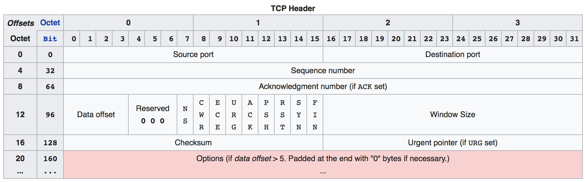
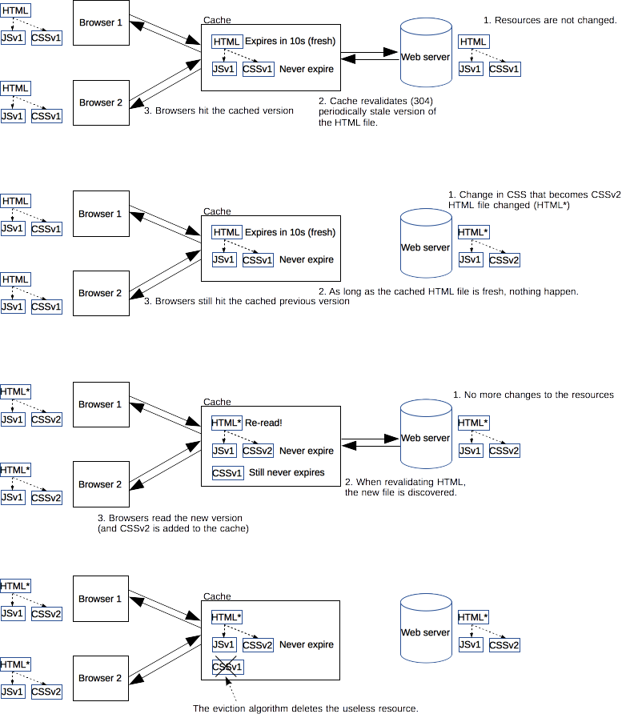

# TCP

The Transmission Control Protocol (TCP) is one of the main protocols of the internet protocol suite. 

- It originated in the initial network implementation in which it complemented the Internet Protocol(IP).
  - Therefore, the entire suite is commonly referred to as [TCP/IP](https://en.wikipedia.org/wiki/TCP/IP).


*TCP provides [reliable](https://en.wikipedia.org/wiki/Reliability_(computer_networking)), ordered, and [error-checked](https://en.wikipedia.org/wiki/Error_detection_and_correction) delivery of a stream of [octets](https://en.wikipedia.org/wiki/Octet_(computing)) (bytes) between applications running on hosts communicating via an IP network*.

- Major internet applications such as the [World Wide Web](https://en.wikipedia.org/wiki/World_Wide_Web), [email](https://en.wikipedia.org/wiki/Email), [remote administration](https://en.wikipedia.org/wiki/Remote_administration), and [file transfer](https://en.wikipedia.org/wiki/File_transfer) rely on TCP.
- Applications that do not require reliable data stream service may use the [User Datagram Protocol](https://en.wikipedia.org/wiki/User_Datagram_Protocol) (UDP), which provides a [connectionless](https://en.wikipedia.org/wiki/Connectionless_communication) [datagram](https://en.wikipedia.org/wiki/Datagram) service that emphasizes reduced [latency](https://en.wikipedia.org/wiki/Latency_(engineering)) over reliability.

#### function

The Transmission Control Protocol provides a communication service at an intermediate level between an application program and the Internet Protocol. 

- It provides host-to-host connectivity at the [Transport Layer](https://en.wikipedia.org/wiki/Transport_Layer) of the Internet model. 
- An application does not need to know the particular mechanisms for sending data via a link to another host, such as the required packet fragmentation on the transmission medium. 
- At the transport layer, the protocol handles all handshaking and transmission details and presents an abstraction of the network connection to the application.

At the lower levels of the protocol stack, due to network congestion, traffic load balancing, or other unpredictable network behaviour, IP packets may be [lost](https://en.wikipedia.org/wiki/Packet_loss), duplicated, or [delivered out of order](https://en.wikipedia.org/wiki/Out-of-order_delivery). TCP detects these problems, requests [re-transmission](https://en.wikipedia.org/wiki/Retransmission_(data_networks)) of lost data, rearranges out-of-order data and even helps minimize network congestion to reduce the occurrence of the other problems. If the data still remains undelivered, the source is notified of this failure.

Once the TCP receiver has reassembled the sequence of octets originally transmitted, it passes them to the receiving application.

Thus, TCP abstracts the application's communication from the underlying networking details.


Applications:

- TCP is used extensively by many applications available by internet, including the [World Wide Web](https://en.wikipedia.org/wiki/World_Wide_Web) (WWW), [E-mail](https://en.wikipedia.org/wiki/E-mail), [File Transfer Protocol](https://en.wikipedia.org/wiki/File_Transfer_Protocol), [Secure Shell](https://en.wikipedia.org/wiki/Secure_Shell), [peer-to-peer](https://en.wikipedia.org/wiki/Peer-to-peer) [file sharing](https://en.wikipedia.org/wiki/File_sharing), and [streaming media](https://en.wikipedia.org/wiki/Streaming_media) applications.

Delays:

- TCP is optimized for accurate delivery rather than timely delivery and can incur relatively long delays (on the order of seconds) while waiting for out-of-order messages or re-transmissions of lost messages.
- Therefore, it is not particularly suitable for real-time applications such as [Voice over IP](https://en.wikipedia.org/wiki/Voice_over_IP).
- For such applications, protocols like the [Real-time Transport Protocol](https://en.wikipedia.org/wiki/Real-time_Transport_Protocol) (RTP) operating over the [User Datagram Protocol](https://en.wikipedia.org/wiki/User_Datagram_Protocol) (UDP) are usually recommended instead.


Positive acknowledgement with re-transmission:

- TCP is a reliable stream delivery service which guarantees that all bytes received will be identical with bytes sent and in the correct order. Since packet transfer by many networks is not reliable, a technique known as *positive acknowledgement with re-transmission* is used to guarantee reliability. 
- This fundamental technique requires the receiver to respond with an acknowledgement message as it receives the data. The sender keeps a record of each packet it sends and maintains a timer from when the packet was sent. The sender re-transmits a packet if the timer expires before receiving the message acknowledgement. The timer is needed in case a packet gets lost or corrupted.


*Segments:*

- While IP handles actual delivery of the data, TCP keeps track of 'segments' - the individual units of data transmission that a message is divided into for efficient routing through the network. 
- For example, when an HTML file is sent from a web server, the TCP software layer of that server divides the sequence of file octets into segments and forwards them individually to the IP software layer ([Internet Layer](https://en.wikipedia.org/wiki/Internet_Layer)). 
- The Internet Layer encapsulates each TCP segment into an IP packet by adding a header that includes (among other data) the destination [IP address](https://en.wikipedia.org/wiki/IP_address). 
- When the client program on the destination computer receives them, the TCP layer ([Transport Layer](https://en.wikipedia.org/wiki/Transport_Layer)) re-assembles the individual segments and ensures they are correctly ordered and error-free as it streams them to an application.


#### TCP segment structure

*Transmission Control Protocol accepts data from a data stream, divides it into chunks, and adds a TCP header creating a TCP segment.* The TCP segment is then [encapsulated](https://en.wikipedia.org/wiki/Encapsulation_(networking)) into an Internet Protocol (IP) datagram, and exchanged with peers.

The term *TCP packet* appears in both informal and formal usage, whereas in more precise terminology *segment* refers to the TCP [protocol data unit](https://en.wikipedia.org/wiki/Protocol_data_unit) (PDU), *datagram*[[5\]](https://en.wikipedia.org/wiki/Transmission_Control_Protocol#cite_note-5) to the IP PDU, and *frame* to the data link layer PDU:

- Processes transmit data by calling on the TCP and passing buffers of data as arguments. The TCP packages the data from these buffers into segments and calls on the internet module [e.g. IP] to transmit each segment to the destination TCP.


A TCP segment consists of a segment *header* and a *data* section.

- The TCP header contains 10 mandatory fields, and an optional extension field (*Options*, pink background in table).
- The data section follows the header. Its contents are the payload data carried for the application. 
- The length of the data section is not specified in the TCP segment header. It can be calculated by subtracting the combined length of the TCP header and the encapsulating IP header from the total IP datagram length (specified in the IP header).



TCP Header:

- Source port (16 bits)

- Destination port (16 bits)

- *Sequence number* (32 bits)

  Has a dual role:

  - If the `SYN` flag is set (1), then this is the initial sequence number. 
    - The sequence number of the actual first data byte and the acknowledged number in the corresponding ACK are then this sequence number plus 1.
  - If the `SYN` flag is clear (0), then this is the accumulated sequence number of the first data byte of this segment for the current session.

- *Acknowledgment number* (32 bits)

  - If the ACK flag is set then the value of this field is the next sequence number that the sender of the ACK is expecting. This acknowledges receipt of all prior bytes (if any). The first ACK sent by each end acknowledges the other end's initial sequence number itself, but no data.

- *Data offset* (4 bits)

  - Specifies the size of the TCP header in 32-bit words. 
  - The minimum size header is 5 words and the maximum is 15 words thus giving the minimum size of 20 bytes and maximum of 60 bytes, allowing for up to 40 bytes of options in the header. 
  - This field gets its name from the fact that it is also the offset from the start of the TCP segment to the actual data.

- *Reserved* (3 bits)

  - For future use and should be set to zero.

- *Flags* (9 bits) (aka Control bits)

  Contains 9 1-bit flags

  - `NS` (1 bit): ECN-nonce - concealment protection (experimental: see [RFC 3540](https://tools.ietf.org/html/rfc3540)).
  - `CWR` (1 bit): Congestion Window Reduced (CWR) flag is set by the sending host to indicate that it received a TCP segment with the `ECE` flag set and had responded in congestion control mechanism (added to header by [RFC 3168](https://tools.ietf.org/html/rfc3168)).
  - `ECE` (1 bit): ECN-Echo has a dual role, depending on the value of the SYN flag. It indicates:
    - If the `SYN` flag is set (1), that the TCP peer is [ECN](https://en.wikipedia.org/wiki/Explicit_Congestion_Notification) capable.
    - If the `SYN` flag is clear (0), that a packet with Congestion Experienced flag set (ECN=11) in the IP header was received during normal transmission (added to header by [RFC 3168](https://tools.ietf.org/html/rfc3168)). This serves as an indication of network congestion (or impending congestion) to the TCP sender.
  - `URG` (1 bit): indicates that the Urgent pointer field is significant
  - **`ACK`** (1 bit): *indicates that the Acknowledgment field is significant*. All packets after the initial `SYN` packet sent by the client should have this flag set.
  - `PSH` (1 bit): Push function. Asks to push the buffered data to the receiving application.
  - `RST` (1 bit): Reset the connection
  - **`SYN`** (1 bit): *Synchronize sequence numbers.* Only the first packet sent from each end should have this flag set. 
    - Some other flags and fields change meaning based on this flag, and some are only valid when it is set, and others when it is clear.
  - **`FIN`** (1 bit): *Last packet* from sender.

- *Window size* (16 bits)

  - The size of the *receive window*, which specifies the number of window size units (by default, bytes) (beyond the segment identified by the sequence number in the acknowledgment field) that the sender of this segment is currently willing to receive (see Flow control and Window Scaling).

- *Checksum* (16 bits)

  - The 16-bit [checksum](https://en.wikipedia.org/wiki/Checksum) field is used for *error-checking of the header, the Payload and a Pseudo-Header.* 
  - The Pseudo-Header consists of the [Source IP Address](https://en.wikipedia.org/wiki/IPv4#Source_address), the [Destination IP Address](https://en.wikipedia.org/wiki/IPv4#Destination_address), the [protocol number](https://en.wikipedia.org/wiki/List_of_IP_protocol_numbers) for the TCP-Protocol (0x0006) and the length of the TCP-Headers including Payload (in Bytes).

- *Urgent pointer* (16 bits)

  - if the `URG` flag is set, then this 16-bit field is an offset from the sequence number indicating the last urgent data byte.

- *Options* (Variable 0-320 bits, divisible by 32)

  - The length of this field is determined by the data offset field.
  - Options have up to three fields:
    - Option-Kind (1 byte)
    - Option-Length (1 byte)
    - Option-Data (variable)
  - The Option-Kind field indicates the type of option, and is the only field that is not optional. Depending on what kind of option we are dealing with, the next two fields may be set: the Option-Length field indicates the total length of the option, and the Option-Data field contains the value of the option, if applicable.

- *Padding* 

  - The TCP header padding is used to ensure that the TCP header ends, and data begins, on a 32 bit boundary. The padding is composed of zeros.


#### The Three-Way Handshake

TCP utilizes a number of flags, or 1-bit boolean fields, in its header to control the state of a connection. The three we're most interested in here are:

- **SYN** - (Synchronize) Initiates a connection
- **FIN** - (Final) Cleanly terminates a connection
- **ACK** - Acknowledges received data

???


#### Sequence and Acknowledgment Numbers

The client on either side of a TCP session maintains a 32-bit *sequence number* it uses to keep track of how much data it has sent.

- This sequence number is included on each transmitted packet, and acknowledged by the opposite host as an *acknowledgment number* to inform the sending host that the transmitted data was received successfully.

When a host initiates a TCP session, its initial sequence number is effectively random; it may be any value between 0 and 4,294,967,295, inclusive. 

- However, protocol analyzers like Wireshark will typically display *relative*sequence and acknowledgement numbers in place of the actual values. 
- These numbers are relative to the initial sequence number of that stream. This is handy, as it is much easier to keep track of relatively small, predictable numbers rather than the actual numbers sent on the wire.


For more, see http://packetlife.net/blog/2010/jun/7/understanding-tcp-sequence-acknowledgment-numbers/


#### Protocol operation

TCP protocol operations may be divided into three phases. 

- Connections must be properly established in a multi-step handshake process (*connection establishment*) before entering the *data transfer* phase. 
- After data transmission is completed, the *connection termination* closes established virtual circuits and releases all allocated resources.

###### Connection establishment

To establish a connection, TCP uses a three-way [handshake](https://en.wikipedia.org/wiki/Handshaking). Before a client attempts to connect with a server, the server must first bind to and listen at a port to open it up for connections: this is called a passive open. Once the passive open is established, a client may initiate an active open. To establish a connection, the three-way (or 3-step) handshake occurs:

1. **SYN**: The active open is performed by the client sending a SYN to the server. The client sets the segment's sequence number to a random value A.
2. **SYN-ACK**: In response, the server replies with a SYN-ACK. The acknowledgment number is set to one more than the received sequence number i.e. A+1, and the sequence number that the server chooses for the packet is another random number, B.
3. **ACK**: Finally, the client sends an ACK back to the server. The sequence number is set to the received acknowledgement value i.e. A+1, and the acknowledgement number is set to one more than the received sequence number i.e. B+1.

###### Connection termination

The connection termination phase uses a *four-way handshake*, with each side of the connection terminating independently.


When an endpoint wishes to stop its half of the connection, it transmits a FIN packet, which the other end acknowledges with an ACK. Therefore, a typical tear-down requires a pair of FIN and ACK segments from each TCP endpoint. After the side that sent the first FIN has responded with the final ACK, it waits for a timeout before finally closing the connection, during which time the local port is unavailable for new connections; this prevents confusion due to delayed packets being delivered during subsequent connections.

A connection can be ["half-open"](https://en.wikipedia.org/wiki/TCP_half-open), in which case one side has terminated its end, but the other has not. The side that has terminated can no longer send any data into the connection, but the other side can. The terminating side should continue reading the data until the other side terminates as well.

It is also possible to terminate the connection by a 3-way handshake, when host A sends a FIN and host B replies with a FIN & ACK (merely combines 2 steps into one) and host A replies with an ACK.[[14\]](https://en.wikipedia.org/wiki/Transmission_Control_Protocol#cite_note-14)

Some host TCP stacks may implement a half-duplex close sequence, as [Linux](https://en.wikipedia.org/wiki/Linux) or [HP-UX](https://en.wikipedia.org/wiki/HP-UX) do. If such a host actively closes a connection but still has not read all the incoming data the stack already received from the link, this host sends a RST instead of a FIN (Section 4.2.2.13 in [RFC 1122](https://tools.ietf.org/html/rfc1122)). This allows a TCP application to be sure the remote application has read all the data the former sent—waiting the FIN from the remote side, when it actively closes the connection. But the remote TCP stack cannot distinguish between a *Connection Aborting RST* and *Data Loss RST*. Both cause the remote stack to lose all the data received.

Some application protocols using the TCP open/close handshaking for the application protocol open/close handshaking may find the RST problem on active close. As an example:

```
s = connect(remote);
send(s, data);
close(s);

```

For a program flow like above, a TCP/IP stack like that described above does not guarantee that all the data arrives to the other application if unread data has arrived at this end.


###### Resource usage

Most implementations allocate an entry in a table that maps a session to a running operating system process. Because TCP packets do not include a session identifier, both endpoints identify the session using the client's address and port. Whenever a packet is received, the TCP implementation must perform a lookup on this table to find the destination process. Each entry in the table is known as a Transmission Control Block or TCB. It contains information about the endpoints (IP and port), status of the connection, running data about the packets that are being exchanged and buffers for sending and receiving data.

The number of sessions in the server side is limited only by memory and can grow as new connections arrive, but the client must allocate a random port before sending the first SYN to the server. This port remains allocated during the whole conversation, and effectively limits the number of outgoing connections from each of the client's IP addresses. If an application fails to properly close unrequired connections, a client can run out of resources and become unable to establish new TCP connections, even from other applications.

Both endpoints must also allocate space for unacknowledged packets and received (but unread) data.

###### Data transfer

There are a few key features that set TCP apart from [User Datagram Protocol](https://en.wikipedia.org/wiki/User_Datagram_Protocol):

- Ordered data transfer: *the destination host rearranges according to sequence number*[[3\]](https://en.wikipedia.org/wiki/Transmission_Control_Protocol#cite_note-comer-3)
- Retransmission of lost packets: any cumulative stream not acknowledged is retransmitted[[3\]](https://en.wikipedia.org/wiki/Transmission_Control_Protocol#cite_note-comer-3)
- Error-free data transfer[[15\]](https://en.wikipedia.org/wiki/Transmission_Control_Protocol#cite_note-15)
- Flow control: limits the rate a sender transfers data to guarantee reliable delivery. The receiver continually hints the sender on how much data can be received (controlled by the sliding window). When the receiving host's buffer fills, the next acknowledgment contains a 0 in the window size, to stop transfer and allow the data in the buffer to be processed.[[3\]](https://en.wikipedia.org/wiki/Transmission_Control_Protocol#cite_note-comer-3)
- Congestion control[[3\]](https://en.wikipedia.org/wiki/Transmission_Control_Protocol#cite_note-comer-3)

*Reliable transmission*:

- TCP uses a *sequence number* to identify each byte of data. 


- The sequence number identifies the order of the bytes sent from each computer so that the data can be reconstructed in order, regardless of any [packet reordering](https://en.wikipedia.org/wiki/Packet_reordering), or [packet loss](https://en.wikipedia.org/wiki/Packet_loss) that may occur during transmission. 
- The sequence number of the first byte is chosen by the transmitter for the first packet, which is flagged SYN. This number can be *arbitrary*, and should in fact be unpredictable to defend against [TCP sequence prediction attacks](https://en.wikipedia.org/wiki/TCP_sequence_prediction_attack).
- Acknowledgements (Acks) are sent with a sequence number by the receiver of data to tell the sender that data has been received to the specified byte. Acks do not imply that the data has been delivered to the application. They merely signify that it is now the receiver's responsibility to deliver the data.
- Reliability is achieved by the sender detecting lost data and retransmitting it. TCP uses two primary techniques to identify loss. Retransmission timeout (abbreviated as RTO) and duplicate cumulative acknowledgements (DupAcks).

*Dupack-based retransmission*:

- If a single packet (say packet 100) in a stream is lost, then the receiver cannot acknowledge packets above 100 because it uses cumulative acks. Hence the receiver acknowledges packet 99 again on the receipt of another data packet. This duplicate acknowledgement is used as a signal for packet loss. 
- That is, *if the sender receives three duplicate acknowledgements, it retransmits the last unacknowledged packet*. 
- A threshold of three is used because the network may reorder packets causing duplicate acknowledgements. This threshold has been demonstrated to avoid spurious retransmissions due to reordering.[[16\]](https://en.wikipedia.org/wiki/Transmission_Control_Protocol#cite_note-16) 
- Sometimes [selective acknowledgements](https://en.wikipedia.org/wiki/Selective_acknowledgement) (SACKs) are used to give more explicit feedback on which packets have been received. This greatly improves TCP's ability to retransmit the right packets.

*Timeout-based retransmission*:

- Whenever a packet is sent, the sender sets a timer that is a conservative estimate of when that packet will be acked. If the sender does not receive an ack by then, it transmits that packet again. 
- The timer is reset every time the sender receives an acknowledgement. This means that the retransmit timer fires only when the sender has received *no*acknowledgement for a long time. 
- Typically the timer value is set to smoothed RTT+max(G,4×RTT variation) where $G$ is the clock granularity.[[17\]](https://en.wikipedia.org/wiki/Transmission_Control_Protocol#cite_note-17) 
- Further, in case a retransmit timer has fired and still no acknowledgement is received, the next timer is set to twice the previous value (up to a certain threshold). Among other things, this helps defend against a [man-in-the-middle](https://en.wikipedia.org/wiki/Man-in-the-middle_attack) [denial of service attack](https://en.wikipedia.org/wiki/Denial_of_service_attack)that tries to fool the sender into making so many retransmissions that the receiver is overwhelmed.

If the sender infers that data has been lost in the network using one of the two techniques described above, it [retransmits](https://en.wikipedia.org/wiki/Retransmission_(data_networks)) the data.

*Error detection*:

- Sequence numbers allow receivers to discard duplicate packets and properly sequence reordered packets. Acknowledgments allow senders to determine when to retransmit lost packets.
- To assure correctness a *checksum* field is included; see [checksum computation](https://en.wikipedia.org/wiki/Transmission_Control_Protocol#Checksum_computation) section for details on checksumming. 
- The TCP checksum is *a weak check* by modern standards.
- Data Link Layers with high bit error rates may require additional link error correction/detection capabilities. 
- The weak checksum is partially compensated for by the common use of a [CRC](https://en.wikipedia.org/wiki/Cyclic_redundancy_check) or better integrity check at [layer 2](https://en.wikipedia.org/wiki/Layer_2), below both TCP and IP, such as is used in [PPP](https://en.wikipedia.org/wiki/Point-to-Point_Protocol) or the [Ethernet](https://en.wikipedia.org/wiki/Ethernet) frame. 
- However, this does not mean that the 16-bit TCP checksum is redundant: remarkably, introduction of errors in packets between CRC-protected hops is common, but the [end-to-end](https://en.wikipedia.org/wiki/End-to-end_principle) 16-bit TCP checksum catches most of these simple errors.[[18\]](https://en.wikipedia.org/wiki/Transmission_Control_Protocol#cite_note-18) This is the [end-to-end principle](https://en.wikipedia.org/wiki/End-to-end_principle) at work.

*Flow control*:

- TCP uses an end-to-end [flow control](https://en.wikipedia.org/wiki/Flow_control_(data)) protocol to avoid having the sender send data too fast for the TCP receiver to receive and process it reliably.
  - *Having a mechanism for flow control is essential in an environment where machines of diverse network speeds communicate.*
  - For example, if a PC sends data to a smartphone that is slowly processing received data, the smartphone must regulate the data flow so as not to be overwhelmed.

- TCP uses a [sliding window](https://en.wikipedia.org/wiki/Sliding_Window_Protocol) flow control protocol. 
  - In each TCP segment, the receiver specifies in the *receive window*field the amount of additionally received data (in bytes) that it is willing to buffer for the connection. 
  - The sending host can send only up to that amount of data before it must wait for an acknowledgement and window update from the receiving host.

- When a receiver advertises a window size of 0, the sender stops sending data and starts the *persist timer*. 
  - The persist timer is used to protect TCP from a [deadlock](https://en.wikipedia.org/wiki/Deadlock) situation that could arise if a subsequent window size update from the receiver is lost, and the sender cannot send more data until receiving a new window size update from the receiver. 
  - When the persist timer expires, the TCP sender attempts recovery by sending a small packet so that the receiver responds by sending another acknowledgement containing the new window size.

- If a receiver is processing incoming data in small increments, it may repeatedly advertise a small receive window. This is referred to as the [silly window syndrome](https://en.wikipedia.org/wiki/Silly_window_syndrome), since it is inefficient to send only a few bytes of data in a TCP segment, given the relatively large overhead of the TCP header.

- *TCP sequence numbers and receive windows behave very much like a clock. The receive window shifts each time the receiver receives and acknowledges a new segment of data. Once it runs out of sequence numbers, the sequence number loops back to `0`*.

  

*Congestion control*:

- The final main aspect of TCP is [congestion control](https://en.wikipedia.org/wiki/Congestion_control). TCP uses a number of mechanisms to achieve high performance and avoid [congestion collapse](https://en.wikipedia.org/wiki/Congestive_collapse), where network performance can fall by several orders of magnitude. These mechanisms control the rate of data entering the network, keeping the data flow below a rate that would trigger collapse. They also yield an approximately [max-min fair](https://en.wikipedia.org/wiki/Max-min_fairness) allocation between flows.
- Acknowledgments for data sent, or lack of acknowledgments, are used by senders to infer network conditions between the TCP sender and receiver. Coupled with timers, TCP senders and receivers can alter the behavior of the flow of data. This is more generally referred to as congestion control and/or network congestion avoidance.
- *Modern implementations of TCP contain four intertwined algorithms: [slow-start](https://en.wikipedia.org/wiki/Slow-start), [congestion avoidance](https://en.wikipedia.org/wiki/TCP_congestion_avoidance_algorithm), [fast retransmit](https://en.wikipedia.org/wiki/Fast_retransmit), and [fast recovery](https://en.wikipedia.org/wiki/TCP_congestion_control#Fast_recovery_(Reno_only))* ([RFC 5681](https://tools.ietf.org/html/rfc5681)).
- In addition, senders employ a *retransmission timeout* (RTO) that is based on the estimated [round-trip time](https://en.wikipedia.org/wiki/Round-trip_time) (or RTT) between the sender and receiver, as well as the variance in this round trip time. The behavior of this timer is specified in [RFC 6298](https://tools.ietf.org/html/rfc6298). There are subtleties in the estimation of RTT. For example, senders must be careful when calculating RTT samples for retransmitted packets; typically they use [Karn's Algorithm](https://en.wikipedia.org/wiki/Karn%27s_Algorithm) or TCP timestamps (see [RFC 1323](https://tools.ietf.org/html/rfc1323)). These individual RTT samples are then averaged over time to create a Smoothed Round Trip Time (SRTT) using [Jacobson](https://en.wikipedia.org/wiki/Van_Jacobson)'s algorithm. This SRTT value is what is finally used as the round-trip time estimate.
- Enhancing TCP to reliably handle loss, minimize errors, manage congestion and go fast in very high-speed environments are ongoing areas of research and standards development. As a result, there are a number of [TCP congestion avoidance algorithm](https://en.wikipedia.org/wiki/TCP_congestion_avoidance_algorithm) variations。


###### Maximum segment size

The [maximum segment size](https://en.wikipedia.org/wiki/Maximum_segment_size) (MSS) is the largest amount of data, specified in bytes, that TCP is willing to receive in a single segment. 

*For best performance, the MSS should be set small enough to avoid [IP fragmentation](https://en.wikipedia.org/wiki/IP_fragmentation), which can lead to packet loss and excessive retransmissions*.

-  To try to accomplish this, typically the MSS is announced by each side using the MSS option when the TCP connection is established, in which case it is derived from the [maximum transmission unit](https://en.wikipedia.org/wiki/MTU_(networking)) (MTU) size of the [data link layer](https://en.wikipedia.org/wiki/Data_link_layer) of the networks to which the sender and receiver are directly attached.
-  Furthermore, TCP senders can use [path MTU discovery](https://en.wikipedia.org/wiki/Path_MTU_discovery) to infer the minimum MTU along the network path between the sender and receiver, and use this to dynamically adjust the MSS to avoid IP fragmentation within the network.

MSS announcement is also often called "MSS negotiation". 

- Strictly speaking, the MSS is not "negotiated" between the originator and the receiver, because that would imply that both originator and receiver will negotiate and agree upon a single, unified MSS that applies to all communication in both directions of the connection. 
- *In fact, two completely independent values of MSS are permitted for the two directions of data flow in a TCP connection*.[[19\]](https://en.wikipedia.org/wiki/Transmission_Control_Protocol#cite_note-19) This situation may arise, for example, if one of the devices participating in a connection has an extremely limited amount of memory reserved (perhaps even smaller than the overall discovered Path MTU) for processing incoming TCP segments.


###### Selective acknowledgments

Relying purely on the cumulative acknowledgment scheme employed by the original TCP protocol can lead to inefficiencies when packets are lost.

- For example, suppose 10,000 bytes are sent in 10 different TCP packets, and the first packet is lost during transmission. In a pure cumulative acknowledgment protocol, the receiver cannot say that it received bytes 1,000 to 9,999 successfully, but failed to receive the first packet, containing bytes 0 to 999. Thus the sender may then have to resend all 10,000 bytes.

To alleviate this issue TCP employs the *selective acknowledgment (SACK)* option, defined in [RFC 2018](https://tools.ietf.org/html/rfc2018), which **allows the receiver to acknowledge discontinuous blocks of packets which were received correctly**, in addition to the sequence number of the last contiguous byte received successively, as in the basic TCP acknowledgment. The acknowledgement can specify a number of *SACK blocks*, where each SACK block is conveyed by the starting and ending sequence numbers of a contiguous range that the receiver correctly received. 

- In the example above, the receiver would send SACK with sequence numbers 1000 and 9999. The sender would accordingly retransmit only the first packet (bytes 0 to 999).

A TCP sender can interpret an out-of-order packet delivery as a lost packet. 

- If it does so, the TCP sender will retransmit the packet previous to the out-of-order packet and slow its data delivery rate for that connection. The duplicate-SACK option, an extension to the SACK option that was defined in [RFC 2883](https://tools.ietf.org/html/rfc2883), solves this problem. The TCP receiver sends a D-ACK to indicate that no packets were lost, and the TCP sender can then reinstate the higher transmission-rate.
- The SACK option is not mandatory, and comes into operation only if both parties support it. This is negotiated when a connection is established. SACK uses the optional part of the TCP header (see [TCP segment structure](https://en.wikipedia.org/wiki/Transmission_Control_Protocol#TCP_segment_structure) for details). The use of SACK has become widespread—all popular TCP stacks support it. Selective acknowledgment is also used in [Stream Control Transmission Protocol](https://en.wikipedia.org/wiki/Stream_Control_Transmission_Protocol) (SCTP).

###### Window scaling

For more efficient use of high-bandwidth networks, a larger TCP window size may be used. 

- The TCP window size field controls the flow of data and its value is limited to between `2` and `65,535` bytes.
- Since the size field cannot be expanded, a scaling factor is used. The [TCP window scale option](https://en.wikipedia.org/wiki/TCP_window_scale_option), as defined in [RFC 1323](https://tools.ietf.org/html/rfc1323), is an option used to increase the maximum window size from 65,535 bytes to 1 gigabyte. 
- Scaling up to larger window sizes is a part of what is necessary for [TCP tuning](https://en.wikipedia.org/wiki/TCP_tuning).

The window scale option is used only during the TCP 3-way handshake.

- The window scale value represents the number of bits to left-shift the 16-bit window size field. 
- The window scale value can be set from 0 (no shift) to 14 for each direction independently. 
- Both sides must send the option in their SYN segments to enable window scaling in either direction.

Some routers and packet firewalls rewrite the window scaling factor during a transmission.

- This causes sending and receiving sides to assume different TCP window sizes. 
- The result is non-stable traffic that may be very slow. The problem is visible on some sites behind a defective router.[[20\]](https://en.wikipedia.org/wiki/Transmission_Control_Protocol#cite_note-20)

###### TCP timestamps

TCP timestamps, defined in [RFC 1323](https://tools.ietf.org/html/rfc1323), can help TCP determine in which order packets were sent.

???

###### Out-of-band data

It is possible to interrupt or abort the queued stream instead of waiting for the stream to finish. 

- This is done by specifying the data as *urgent*. This tells the receiving program to process it immediately, along with the rest of the urgent data. 
- When finished, TCP informs the application and resumes back to the stream queue.
- An example is when TCP is used for a remote login session, the user can send a keyboard sequence that interrupts or aborts the program at the other end. These signals are most often needed when a program on the remote machine fails to operate correctly. The signals must be sent without waiting for the program to finish its current transfer.

TCP OOB data was not designed for the modern Internet. The *urgent* pointer only alters the processing on the remote host and doesn't expedite any processing on the network itself. 

- When it gets to the remote host there are two slightly different interpretations of the protocol, which means only single bytes of OOB data are reliable. This is assuming it is reliable at all as it is one of the least commonly used protocol elements and tends to be poorly implemented. 

###### Forcing data delivery

*Normally, TCP waits for 200 ms for a full packet of data to send* ([Nagle's Algorithm](https://en.wikipedia.org/wiki/Nagle%27s_Algorithm) tries to group small messages into a single packet). 

- This wait creates small, but potentially serious delays if repeated constantly during a file transfer.
- For example, a typical send block would be 4 KB, a typical MSS is 1460, so 2 packets go out on a 10 Mbit/s ethernet taking ~1.2 ms each followed by a third carrying the remaining 1176 after a 197 ms pause because TCP is waiting for a full buffer.???
- In the case of telnet, each user keystroke is echoed back by the server before the user can see it on the screen. This delay would become very annoying.
- Setting the [socket](https://en.wikipedia.org/wiki/Network_socket) option `TCP_NODELAY` overrides the default 200 ms send delay. Application programs use this socket option to force output to be sent after writing a character or line of characters.
- The RFC defines the `PSH` push bit as "a message to the receiving TCP stack to send this data immediately up to the receiving application".[[3\]](https://en.wikipedia.org/wiki/Transmission_Control_Protocol#cite_note-comer-3) There is no way to indicate or control it in [user space](https://en.wikipedia.org/wiki/User_space) using [Berkeley sockets](https://en.wikipedia.org/wiki/Berkeley_sockets) and it is controlled by [protocol stack](https://en.wikipedia.org/wiki/Protocol_stack) only.[[24\]](https://en.wikipedia.org/wiki/Transmission_Control_Protocol#cite_note-Stevens2006-24)


#### Vulnerabilities

TCP may be attacked in a variety of ways. The results of a thorough security assessment of TCP, along with possible mitigations for the identified issues, were published in 2009,[[25\]](https://en.wikipedia.org/wiki/Transmission_Control_Protocol#cite_note-25) and is currently being pursued within the [IETF](https://en.wikipedia.org/wiki/IETF).[[26\]](https://en.wikipedia.org/wiki/Transmission_Control_Protocol#cite_note-26)

1. *Denial of service*:

   - By using a [spoofed IP](https://en.wikipedia.org/wiki/IP_address_spoofing) address and repeatedly sending [purposely assembled](https://en.wikipedia.org/wiki/Mangled_packet) SYN packets, followed by many ACK packets, attackers can cause the server to consume large amounts of resources keeping track of the bogus connections. 

     - This is known as a [SYN flood](https://en.wikipedia.org/wiki/SYN_flood) attack.
     - Proposed solutions to this problem include [SYN cookies](https://en.wikipedia.org/wiki/SYN_cookies) and cryptographic puzzles, though SYN cookies come with their own set of vulnerabilities.

   - [Sockstress](https://en.wikipedia.org/wiki/Sockstress) is a similar attack, that might be mitigated with system resource management.[[28\]](https://en.wikipedia.org/wiki/Transmission_Control_Protocol#cite_note-28) An advanced DoS attack involving the exploitation of the TCP Persist Timer was analyzed in [Phrack](https://en.wikipedia.org/wiki/Phrack) #66.[[29\]](https://en.wikipedia.org/wiki/Transmission_Control_Protocol#cite_note-29) [PUSH and ACK floods](https://en.wikipedia.org/wiki/PUSH_and_ACK_floods) are other variants.[[30\]](https://en.wikipedia.org/wiki/Transmission_Control_Protocol#cite_note-30)

     ​

2. *Connection hijacking*:

   - An attacker who is able to eavesdrop a TCP session and redirect packets can hijack a TCP connection.
   - To do so, the attacker learns the sequence number from the ongoing communication and forges a false segment that looks like the next segment in the stream. Such a simple hijack can result in one packet being erroneously accepted at one end. 
   - When the receiving host acknowledges the extra segment to the other side of the connection, synchronization is lost. 
   - Hijacking might be combined with Address Resolution Protocol ([ARP](https://en.wikipedia.org/wiki/Address_Resolution_Protocol)) or routing attacks that allow taking control of the packet flow, so as to get permanent control of the hijacked TCP connection.
   - Impersonating a different IP address was not difficult prior to [RFC 1948](https://tools.ietf.org/html/rfc1948), when the initial *sequence number* was easily guessable. That allowed an attacker to blindly send a sequence of packets that the receiver would believe to come from a different IP address, without the need to deploy ARP or routing attacks: it is enough to ensure that the legitimate host of the impersonated IP address is down, or bring it to that condition using [denial-of-service attacks](https://en.wikipedia.org/wiki/Denial-of-service_attack). This is why the initial sequence number is now chosen at random.

3. *TCP veto*:

   - An attacker who can eavesdrop and predict the size of the next packet to be sent can cause the receiver to accept a malicious payload without disrupting the existing connection. The attacker injects a malicious packet with the sequence number and a payload size of the next expected packet. When the legitimate packet is ultimately received, it is found to have the same sequence number and length as a packet already received and is silently dropped as a normal duplicate packet—the legitimate packet is "vetoed" by the malicious packet. Unlike in connection hijacking, the connection is never desynchronized and communication continues as normal after the malicious payload is accepted. TCP veto gives the attacker less control over the communication, but makes the attack particularly resistant to detection. The large increase in network traffic from the ACK storm is avoided. The only evidence to the receiver that something is amiss is a single duplicate packet, a normal occurrence in an IP network. The sender of the vetoed packet never sees any evidence of an attack.[[32\]](https://en.wikipedia.org/wiki/Transmission_Control_Protocol#cite_note-32)
   - Another vulnerability is [TCP reset attack](https://en.wikipedia.org/wiki/TCP_reset_attack).


#### TCP ports

TCP and UDP use [port numbers](https://en.wikipedia.org/wiki/Port_(computer_networking)) to identify sending and receiving application end-points on a host, often called [Internet sockets](https://en.wikipedia.org/wiki/Internet_socket). 

- Each side of a TCP connection has an associated 16-bit unsigned port number (0-65535) reserved by the sending or receiving application. 
- Arriving TCP packets are identified as belonging to a specific TCP connection by its sockets, that is, the combination of source host address, source port, destination host address, and destination port. 
- This means that a server computer can provide several clients with several services simultaneously, as long as a client takes care of initiating any simultaneous connections to one destination port from different source ports.

Port numbers are categorized into three basic categories: well-known, registered, and dynamic/private. 

- The well-known ports are assigned by the [Internet Assigned Numbers Authority](https://en.wikipedia.org/wiki/Internet_Assigned_Numbers_Authority) (IANA) and are typically used by system-level or root processes. Well-known applications running as servers and passively listening for connections typically use these ports. Some examples include: [FTP](https://en.wikipedia.org/wiki/File_Transfer_Protocol) (20 and 21), [SSH](https://en.wikipedia.org/wiki/Secure_Shell) (22), [TELNET](https://en.wikipedia.org/wiki/TELNET) (23), [SMTP](https://en.wikipedia.org/wiki/SMTP) (25), [HTTP over SSL/TLS](https://en.wikipedia.org/wiki/HTTPS) (443), and [HTTP](https://en.wikipedia.org/wiki/HTTP) (80). 
- Registered ports are typically used by end user applications as [ephemeral](https://en.wikipedia.org/wiki/Ephemeral_port) source ports when contacting servers, but they can also identify named services that have been registered by a third party. 
- Dynamic/private ports can also be used by end user applications, but are less commonly so. Dynamic/private ports do not contain any meaning outside of any particular TCP connection.

[Network Address Translation](https://en.wikipedia.org/wiki/Network_Address_Translation) (NAT), typically uses dynamic port numbers, on the ("Internet-facing") public side, to [disambiguate](https://en.wikipedia.org/wiki/Disambiguation) the flow of traffic that is passing between a public network and a private [subnetwork](https://en.wikipedia.org/wiki/Subnetwork), thereby allowing many IP addresses (and their ports) on the subnet to be serviced by a single public-facing address.


#### TCP over wireless networks

TCP was originally designed for wired networks. Packet loss is considered to be the result of [network congestion](https://en.wikipedia.org/wiki/Network_congestion) and the congestion window size is reduced dramatically as a precaution. However, wireless links are known to experience sporadic and usually temporary losses due to fading, shadowing, hand off, [interference](https://en.wikipedia.org/wiki/Interference_(communication)), and other radio effects, that are not strictly congestion. After the (erroneous) back-off of the congestion window size, due to wireless packet loss, there may be a congestion avoidance phase with a conservative decrease in window size. This causes the radio link to be underutilized. Extensive research on combating these harmful effects has been conducted. Suggested solutions can be categorized as end-to-end solutions, which require modifications at the client or server,[[44\]](https://en.wikipedia.org/wiki/Transmission_Control_Protocol#cite_note-Microsoft_Academic_Research-44) link layer solutions, such as Radio Link Protocol ([RLP](https://en.wikipedia.org/wiki/Radio_Link_Protocol)) in cellular networks, or proxy-based solutions which require some changes in the network without modifying end nodes.

A number of alternative congestion control algorithms, such as [Vegas](https://en.wikipedia.org/wiki/TCP_Vegas), [Westwood](https://en.wikipedia.org/wiki/TCP_Westwood), Veno, and Santa Cruz, have been proposed to help solve the wireless problem.

???


# IP

*The Internet Protocol is responsible for addressing hosts, encapsulating data into datagrams (including fragmentation and reassembly) and routing datagrams from a source host to a destination host across one or more IP networks.*

For these purposes, the Internet Protocol defines the format of packets and provides an addressing system.

- *encapsulation (封装)*:
  - Each datagram has two components:
    - a header
      - IP header includes source IP address, destination IP address, and other metadata needed to route and deliver th datagram.
    - a payload
      - the data that is transported.
  - This method of nesting the data payload in a packet with a header is called encapsulation.
- *addressing system:*
  - IP addressing entails the assignment of IP addresses and associated parameters to host interfaces. 
    - The address space is divided into subnetworks, involving the designation of network prefixes.
  - IP routing is performed by all hosts, as well as routers, whose main function is to transport packets across network boundaries.
    - Routers communicate with one another via specially designed [routing protocols](https://en.wikipedia.org/wiki/Routing_protocol), either [interior gateway protocols](https://en.wikipedia.org/wiki/Interior_gateway_protocol) or [exterior gateway protocols](https://en.wikipedia.org/wiki/Exterior_gateway_protocol), as needed for the topology of the network.


#### Reliability

The design of the Internet protocol suite adheres to the [end-to-end principle](https://en.wikipedia.org/wiki/End-to-end_principle), a concept adapted from the [CYCLADES](https://en.wikipedia.org/wiki/CYCLADES) project. 

- Under the end-to-end principle, the network infrastructure is considered inherently *unreliable at any single network element or transmission medium* and is *dynamic in terms of availability of links and nodes*. 
- No central monitoring or performance measurement facility exists that tracks or maintains the state of the network. For the benefit of reducing [network complexity](https://en.wikipedia.org/wiki/Network_complexity), the intelligence in the network is purposely located in the [end nodes](https://en.wikipedia.org/wiki/End_node).

As a consequence of this design, the Internet Protocol only provides [best-effort delivery](https://en.wikipedia.org/wiki/Best-effort_delivery) and its service is characterized as [unreliable](https://en.wikipedia.org/wiki/Reliability_(computer_networking)). In network architectural language, it is a [connectionless protocol](https://en.wikipedia.org/wiki/Connectionless_protocol), in contrast to [connection-oriented communication](https://en.wikipedia.org/wiki/Connection-oriented_communication). 

- Various error conditions may occur, such as [data corruption](https://en.wikipedia.org/wiki/Data_corruption), [packet loss](https://en.wikipedia.org/wiki/Packet_loss) and duplication. 
- Because routing is dynamic, meaning every packet is treated independently, and because the network maintains no state based on the path of prior packets, different packets may be routed to the same destination via different paths, resulting in [out-of-order delivery](https://en.wikipedia.org/wiki/Out-of-order_delivery) to the receiver.

All error conditions in the network must be detected and compensated by the participating end nodes.

- The [upper layer protocols](https://en.wikipedia.org/wiki/Upper_layer_protocol) of the Internet protocol suite are responsible for resolving reliability issues. 
- For example, a host may [buffer](https://en.wikipedia.org/wiki/Data_buffer) network data to ensure correct ordering before the data is delivered to an application.

IPv4 provides safeguards to ensure that the IP packet header is error-free. A routing node calculates a [checksum](https://en.wikipedia.org/wiki/Checksum) for a packet. If the checksum is bad, the routing node discards the packet. Although the [Internet Control Message Protocol](https://en.wikipedia.org/wiki/Internet_Control_Message_Protocol) (ICMP) allows such notification, the routing node is not required to notify either end node of these errors. By contrast, in order to increase performance, and since current [link layer](https://en.wikipedia.org/wiki/Link_layer) technology is assumed to provide sufficient error detection,[[8\]](https://en.wikipedia.org/wiki/#cite_note-8) the IPv6 header has no [checksum](https://en.wikipedia.org/wiki/Checksum) to protect it.[[9\]](https://en.wikipedia.org/wiki/#cite_note-9)


#### Link capacity and capability

The dynamic nature of the Internet and the diversity of its components provide no guarantee that any particular path is actually capable of, or suitable for, performing the data transmission requested. 

- One of the technical constraints is the size of data packets allowed on a given link.  Facilities exist to examine the [maximum transmission unit](https://en.wikipedia.org/wiki/Maximum_transmission_unit) (MTU) size of the local link and [Path MTU Discovery](https://en.wikipedia.org/wiki/Path_MTU_Discovery) can be used for the entire intended path to the destination.
- The IPv4 internetworking layer has the ability to automatically [fragment](https://en.wikipedia.org/wiki/IP_fragmentation) the original datagram into smaller units for transmission. In this case, IP provides re-ordering of fragments delivered out of order.[[10\]](https://en.wikipedia.org/wiki/#cite_note-10) 
- An IPv6 network does not perform fragmentation or reassembly, and as per the [end-to-end principle](https://en.wikipedia.org/wiki/End-to-end_principle), requires end stations and higher-layer protocols to avoid exceeding the network's MTU.
- The *TCP* is an example of a protocol that adjusts its segment size to be smaller than the MTU.
- The *UDP* and *ICMP* disregard MTU size, thereby forcing IP to fragment oversized datagrams.

#### Security

During the design phase of the ARPANET and the early Internet, the security aspects and needs of a public, international network could not be adequately anticipated. Consequently, many Internet protocols exhibited vulnerabilities highlighted by network attacks and later security assessments. In 2008, a thorough security assessment and proposed mitigation of problems was published.[[13\]](https://en.wikipedia.org/wiki/#cite_note-13) The IETF has been pursuing further studies.[[14\]](https://en.wikipedia.org/wiki/#cite_note-RFC_6274-14)


## See also

- [List of IP protocol numbers](https://en.wikipedia.org/wiki/List_of_IP_protocol_numbers)
- [Next-generation network](https://en.wikipedia.org/wiki/Next-generation_network)
- [IP forwarding algorithm](https://en.wikipedia.org/wiki/IP_forwarding_algorithm)


# HTTP

The **Hypertext Transfer Protocol** (**HTTP**) is an [application protocol](https://en.wikipedia.org/wiki/Application_protocol) for distributed, collaborative, and [hypermedia](https://en.wikipedia.org/wiki/Hypermedia) information systems.[[1\]](https://en.wikipedia.org/wiki/Hypertext_Transfer_Protocol#cite_note-ietf2616-1) HTTP is the foundation of data communication for the [World Wide Web](https://en.wikipedia.org/wiki/World_Wide_Web).

- [Hypertext](https://en.wikipedia.org/wiki/Hypertext) is structured text that uses logical links ([hyperlinks](https://en.wikipedia.org/wiki/Hyperlinks)) between [nodes](https://en.wikipedia.org/wiki/Node_(networking)) containing text. 
- *HTTP is the protocol to exchange or transfer hypertext.*

HTTP functions as a [request–response](https://en.wikipedia.org/wiki/Request%E2%80%93response) protocol in the client–server computing model.

- A [web browser](https://en.wikipedia.org/wiki/Web_browser), for example, may be the *client* and an application running on a computer [hosting](https://en.wikipedia.org/wiki/Host_(network)) a [website](https://en.wikipedia.org/wiki/Website) may be the *server*. 
- The client submits an HTTP *request* message to the server. The server, which provides *resources* such as [HTML](https://en.wikipedia.org/wiki/HTML) files and other content, or performs other functions on behalf of the client, returns a *response* message to the client. 
- The response contains completion status information about the request and may also contain requested content in its message body.


A web browser is an example of a *user agent* (UA). Other types of user agent include the indexing software used by search providers ([web crawlers](https://en.wikipedia.org/wiki/Web_crawler)), [voice browsers](https://en.wikipedia.org/wiki/Voice_browser), [mobile app](https://en.wikipedia.org/wiki/Mobile_app)s, and other [software](https://en.wikipedia.org/wiki/Software) that accesses, consumes, or displays web content.

In reality, there are more computers between a browser and the server handling the request: there are routers, modems, and more. 

- Thanks to the layered design of the Web, these are hidden in the network and transport layers. HTTP is on top at the application layer. Although important to diagnose network problems, the underlying layers are mostly irrelevant to the description of HTTP.


HTTP is designed to permit intermediate network elements to improve or enable communications between clients and servers. 

- High-traffic websites often benefit from [web cache](https://en.wikipedia.org/wiki/Web_cache) servers that deliver content on behalf of [upstream servers](https://en.wikipedia.org/wiki/Upstream_server) to improve response time. Web browsers cache previously accessed web resources and reuse them when possible to reduce network traffic. 
- HTTP [proxy servers](https://en.wikipedia.org/wiki/Proxy_server) at [private network](https://en.wikipedia.org/wiki/Private_network) boundaries can facilitate communication for clients without a globally routable address, by relaying messages with external servers.


HTTP is an [application layer](https://en.wikipedia.org/wiki/Application_layer) protocol designed within the framework of the [Internet protocol suite](https://en.wikipedia.org/wiki/Internet_protocol_suite). Its definition presumes an underlying and reliable [transport layer](https://en.wikipedia.org/wiki/Transport_layer) protocol,[[4\]](https://en.wikipedia.org/wiki/Hypertext_Transfer_Protocol#cite_note-4) and [Transmission Control Protocol](https://en.wikipedia.org/wiki/Transmission_Control_Protocol) (TCP) is commonly used. However HTTP can be adapted to use unreliable protocols such as the [User Datagram Protocol](https://en.wikipedia.org/wiki/User_Datagram_Protocol)(UDP), for example in [HTTPU](https://en.wikipedia.org/wiki/Universal_Plug_and_Play#Protocol) and [Simple Service Discovery Protocol](https://en.wikipedia.org/wiki/Simple_Service_Discovery_Protocol) (SSDP).


[HTTP resources](https://en.wikipedia.org/wiki/Web_resource) are identified and located on the network by [Uniform Resource Locators](https://en.wikipedia.org/wiki/Uniform_Resource_Locator) (URLs), using the [Uniform Resource Identifiers](https://en.wikipedia.org/wiki/Uniform_Resource_Identifier) (URI's) schemes *http* and *https*. URIs and [hyperlinks](https://en.wikipedia.org/wiki/Hyperlink) in [HTML](https://en.wikipedia.org/wiki/HTML) documents form inter-linked [hypertext](https://en.wikipedia.org/wiki/Hypertext) documents.


HTTP/1.1 is a revision of the original HTTP (HTTP/1.0). 

- *In HTTP/1.0 a separate [connection](https://en.wikipedia.org/wiki/Connection-oriented_communication) to the same server is made for every resource request. **HTTP/1.1** can reuse a connection multiple times to download images, [scripts](https://en.wikipedia.org/wiki/Client-side_scripting), [stylesheets](https://en.wikipedia.org/wiki/Cascading_Style_Sheets), etc after the page has been delivered.* 
- HTTP/1.1 communications therefore experience less [latency](https://en.wikipedia.org/wiki/Latency_(engineering)) as the establishment of TCP connections presents considerable overhead.


## HTTP session

An HTTP session is a sequence of network request-response transactions.

- An HTTP client initiates a request by establishing a [Transmission Control Protocol](https://en.wikipedia.org/wiki/Transmission_Control_Protocol) (TCP) connection to a particular [port](https://en.wikipedia.org/wiki/TCP_and_UDP_port) on a server (typically port 80, occasionally port 8080; see [List of TCP and UDP port numbers](https://en.wikipedia.org/wiki/List_of_TCP_and_UDP_port_numbers)). 
- An HTTP server listening on that port waits for a client's request message.
- Upon receiving the request, the server sends back a status line, such as "HTTP/1.1 200 OK", and a message of its own. The body of this message is typically the requested resource, although an error message or other information may also be returned.


## HTTP authentication

HTTP provides multiple authentication schemes such as [basic access authentication](https://en.wikipedia.org/wiki/Basic_access_authentication) and [digest access authentication](https://en.wikipedia.org/wiki/Digest_access_authentication) which operate via a challenge-response mechanism whereby the server identifies and issues a challenge before serving the requested content.

> **Basic access authentication**: 
>
> - a method for an [HTTP user agent](https://en.wikipedia.org/wiki/User_agent) (e.g. a web browser) to provide a [user name](https://en.wikipedia.org/wiki/User_name) and [password](https://en.wikipedia.org/wiki/Password) when making a request.
>
>
> - HTTP Basic authentication (BA) implementation is the simplest technique for enforcing [access controls](https://en.wikipedia.org/wiki/Access_controls) to web resources because it does not require [cookies](https://en.wikipedia.org/wiki/HTTP_cookie), session identifiers, or login pages; rather, HTTP Basic authentication uses standard fields in the [HTTP header](https://en.wikipedia.org/wiki/HTTP_header), removing the need for [handshakes](https://en.wikipedia.org/wiki/Handshake_(computing)).
>
> **Digest access authentication**: 
>
> - one of the agreed-upon methods a [web server](https://en.wikipedia.org/wiki/Web_server) can use to negotiate credentials, such as username or password, with a user's [web browser](https://en.wikipedia.org/wiki/Web_browser). 
>
>
> - This can be used to confirm the identity of a user before sending sensitive information, such as online banking transaction history. 
> - It applies a [hash function](https://en.wikipedia.org/wiki/Hash_function) to the username and [password](https://en.wikipedia.org/wiki/Password) before sending them over the network. 
> - In contrast, [basic access authentication](https://en.wikipedia.org/wiki/Basic_access_authentication) uses the easily reversible [Base64](https://en.wikipedia.org/wiki/Base64) encoding instead of encryption, making it non-secure unless used in conjunction with [TLS](https://en.wikipedia.org/wiki/Transport_Layer_Security).
> - Technically, digest authentication is an application of [MD5](https://en.wikipedia.org/wiki/MD5) [cryptographic hashing](https://en.wikipedia.org/wiki/Cryptographic_hash) with usage of [nonce](https://en.wikipedia.org/wiki/Cryptographic_nonce) values to prevent [replay attacks](https://en.wikipedia.org/wiki/Replay_attack). It uses the [HTTP](https://en.wikipedia.org/wiki/Hypertext_Transfer_Protocol) protocol.
>
> **hash function** : 
>
> - *a hash function is any function that can be used to map data of arbitrary size to data of a fixed size*.
> - The values returned by a hash function are called **hash values**, **hash codes**, **digests**, or simply **hashes**. 
> - Hash functions are often used in combination with a [hash table](https://en.wikipedia.org/wiki/Hash_table), a common data structure used in computer software for rapid data lookup. 
> - Hash functions accelerate table or database lookup by detecting duplicated records in a large file.
>   - One such application is finding similar stretches in DNA sequences.
>   - They are also useful in [cryptography](https://en.wikipedia.org/wiki/Cryptography). A [cryptographic hash function](https://en.wikipedia.org/wiki/Cryptographic_hash_function) allows one to easily verify that some input data maps to a given hash value, but if the input data is unknown, it is deliberately difficult to reconstruct it (or any equivalent alternatives) by knowing the stored hash value.
>   - This is used for assuring [integrity](https://en.wikipedia.org/wiki/Data_integrity) of transmitted data, and is the building block for [HMACs](https://en.wikipedia.org/wiki/Hash-based_message_authentication_code), which provide [message authentication](https://en.wikipedia.org/wiki/Message_authentication).
>
> **cryptographic hashing** :
>
> - a special class of [hash function](https://en.wikipedia.org/wiki/Hash_function) that has certain properties which make it suitable for use in [cryptography](https://en.wikipedia.org/wiki/Cryptography).
> - It is a mathematical [algorithm](https://en.wikipedia.org/wiki/Algorithm) that [maps](https://en.wikipedia.org/wiki/Map_(mathematics)) data of arbitrary size to a [bit string](https://en.wikipedia.org/wiki/Bit_string) of a fixed size (a hash) and is designed to be a [one-way function](https://en.wikipedia.org/wiki/One-way_function), that is, a function which is [infeasible](https://en.wikipedia.org/wiki/Computational_complexity_theory#Intractability) to invert.
> - The only way to recreate the input data from an ideal cryptographic hash function's output is to attempt a [brute-force search](https://en.wikipedia.org/wiki/Brute-force_search) of possible inputs to see if they produce a match, or use a [rainbow table](https://en.wikipedia.org/wiki/Rainbow_table) of matched hashes.
>
> **Rainbow table**:
>
> - A **rainbow table** is a [precomputed](https://en.wikipedia.org/wiki/Precomputed) [table](https://en.wikipedia.org/wiki/Lookup_table) for reversing [cryptographic hash functions](https://en.wikipedia.org/wiki/Cryptographic_hash_function), usually for cracking password hashes. Tables are usually used in recovering a [password](https://en.wikipedia.org/wiki/Password) (or credit card numbers, etc.) up to a certain length consisting of a limited set of characters. It is a practical example of a [space–time tradeoff](https://en.wikipedia.org/wiki/Space%E2%80%93time_tradeoff), using less computer processing time and more storage than a [brute-force attack](https://en.wikipedia.org/wiki/Brute-force_attack) which calculates a hash on every attempt, but more processing time and less storage than a simple [lookup table](https://en.wikipedia.org/wiki/Lookup_table) with one entry per hash. 
> - Use of a [key derivation function](https://en.wikipedia.org/wiki/Key_derivation_function)that employs a [salt](https://en.wikipedia.org/wiki/Salt_(cryptography)) makes this attack infeasible.
>
> **Hash table** :
>
> - a **hash table** (**hash map**) is a [data structure](https://en.wikipedia.org/wiki/Data_structure) which implements an [associative array](https://en.wikipedia.org/wiki/Associative_array) [abstract data type](https://en.wikipedia.org/wiki/Abstract_data_type), a structure that can map [keys](https://en.wikipedia.org/wiki/Unique_key) to [values](https://en.wikipedia.org/wiki/Value_(computer_science)). A hash table uses a [hash function](https://en.wikipedia.org/wiki/Hash_function) to compute an *index* into an array of *buckets* or *slots*, from which the desired value can be found.
>
> **HMACs**:  
>
> - a specific type of [message authentication code](https://en.wikipedia.org/wiki/Message_authentication_code) (MAC) involving a [cryptographic hash function](https://en.wikipedia.org/wiki/Cryptographic_hash_function) and a secret [cryptographic key](https://en.wikipedia.org/wiki/Cryptographic_key).  It may be used to simultaneously verify both the *data integrity* and the *authentication* of a [message](https://en.wikipedia.org/wiki/Cleartext), as with any MAC. 
> - Any cryptographic hash function, such as [MD5](https://en.wikipedia.org/wiki/MD5) or [SHA-1](https://en.wikipedia.org/wiki/SHA-1), may be used in the calculation of an HMAC;
>
> **TLS** :
>
> - **Transport Layer Security** (**TLS**) – and its predecessor, **Secure Sockets Layer** (**SSL**), which is now deprecated by the [Internet Engineering Task Force](https://en.wikipedia.org/wiki/Internet_Engineering_Task_Force) [[1\]](https://en.wikipedia.org/wiki/Transport_Layer_Security#cite_note-1) (IETF) – are [cryptographic protocols](https://en.wikipedia.org/wiki/Cryptographic_protocol) that provide [communications security](https://en.wikipedia.org/wiki/Communications_security) over a [computer network](https://en.wikipedia.org/wiki/Computer_network).[[2\]](https://en.wikipedia.org/wiki/Transport_Layer_Security#cite_note-RFC5246-2) 
> - Several versions of the protocols find widespread use in applications such as [web browsing](https://en.wikipedia.org/wiki/Web_navigation), [email](https://en.wikipedia.org/wiki/Email), [instant messaging](https://en.wikipedia.org/wiki/Instant_messaging), and [voice over IP](https://en.wikipedia.org/wiki/Voice_over_IP) (VoIP). [Websites](https://en.wikipedia.org/wiki/Website)are able to use TLS to secure all communications between their [servers](https://en.wikipedia.org/wiki/Server_(computing)) and [web browsers](https://en.wikipedia.org/wiki/Web_browser).
>
> **MD5**:
>
> - The **MD5 algorithm** is a widely used [hash function](https://en.wikipedia.org/wiki/Hash_function) producing a 128-[bit](https://en.wikipedia.org/wiki/Bit) hash value. Although MD5 was initially designed to be used as a [cryptographic hash function](https://en.wikipedia.org/wiki/Cryptographic_hash_function), it has been found to suffer from extensive vulnerabilities. It can still be used as a [checksum](https://en.wikipedia.org/wiki/Checksum) to verify [data integrity](https://en.wikipedia.org/wiki/Data_integrity), but only against unintentional corruption.
>
> **SHA-1** :
>
> -  **SHA-1** (**Secure Hash Algorithm 1**) is a [cryptographic hash function](https://en.wikipedia.org/wiki/Cryptographic_hash_function) which takes an input and produces a 160-[bit](https://en.wikipedia.org/wiki/Bit) (20-[byte](https://en.wikipedia.org/wiki/Byte)) hash value known as a [message digest](https://en.wikipedia.org/wiki/Message_digest) - typically rendered as a [hexadecimal](https://en.wikipedia.org/wiki/Hexadecimal) number, 40 digits long. 
> -  Since 2005 SHA-1 has not been considered secure against well-funded opponents,[[4\]](https://en.wikipedia.org/wiki/SHA-1#cite_note-4) and since 2010 many organizations have recommended its replacement by [SHA-2](https://en.wikipedia.org/wiki/SHA-2) or [SHA-3](https://en.wikipedia.org/wiki/SHA-3).[[5\]](https://en.wikipedia.org/wiki/SHA-1#cite_note-5)[[6\]](https://en.wikipedia.org/wiki/SHA-1#cite_note-shappening-6)[[7\]](https://en.wikipedia.org/wiki/SHA-1#cite_note-7) [Microsoft](https://en.wikipedia.org/wiki/Microsoft), [Google](https://en.wikipedia.org/wiki/Google), [Apple](https://en.wikipedia.org/wiki/Apple_Inc.)and [Mozilla](https://en.wikipedia.org/wiki/Mozilla) have all announced that their respective browsers will stop accepting SHA-1 [SSL certificates](https://en.wikipedia.org/wiki/SSL_certificate) by 2017.
>
> **nonce**:
>
> - In [cryptography](https://en.wikipedia.org/wiki/Cryptography), a **nonce** is an arbitrary number that can be used just once.
> - It is similar in spirit to a [nonce word](https://en.wikipedia.org/wiki/Nonce_word), hence the name. It is often a [random](https://en.wikipedia.org/wiki/Randomness) or [pseudo-random](https://en.wikipedia.org/wiki/Pseudo-random) number issued in an [authentication protocol](https://en.wikipedia.org/wiki/Authentication_protocol) to ensure that old communications cannot be reused in [replay attacks](https://en.wikipedia.org/wiki/Replay_attack). They can also be useful as [initialization vectors](https://en.wikipedia.org/wiki/Initialization_vector) and in [cryptographic hash functions](https://en.wikipedia.org/wiki/Cryptographic_hash_functions).
>
> **replay attacks**: a form of [network](https://en.wikipedia.org/wiki/Computer_network) attack in which a valid data transmission is maliciously or fraudulently repeated or delayed. 

HTTP provides a general framework for access control and authentication, via an extensible set of challenge-response authentication schemes, which can be used by a server to challenge a client request and by a client to provide authentication information.

???

## Request methods

HTTP defines methods (sometimes referred to as *verbs*) to indicate the desired action to be performed on the identified resource.

- What this resource represents, whether pre-existing data or data that is generated dynamically, depends on the implementation of the server.
- Often, the resource corresponds to a file or the output of an executable residing on the server. 

The HTTP/1.0 specification[[13\]](https://en.wikipedia.org/wiki/Hypertext_Transfer_Protocol#cite_note-13) defined the `GET`, `POST` and `HEAD` methods and the HTTP/1.1 specification[[14\]](https://en.wikipedia.org/wiki/Hypertext_Transfer_Protocol#cite_note-14) added 5 new methods: `OPTIONS`, `PUT`, `DELETE`, `TRACE` and `CONNECT`.

- `GET`

  - The GET method requests a representation of the specified resource. 
  - Requests using GET should only [retrieve data](https://en.wikipedia.org/wiki/Data_retrieval) and should have no other effect.
  - As part of a GET request, some data can be passed within the URL's [query string](https://en.wikipedia.org/wiki/Query_string), specifying (for example) search terms, date ranges, or other information that defines the query.

- `HEAD`

  - The HEAD method asks for a response identical to that of a GET request, but without the response body. 
  - This is useful for *retrieving meta-information* written in response headers, without having to transport the entire content.

- `POST`

  - the POST request method requests that a [web server](https://en.wikipedia.org/wiki/Web_server) accepts the data enclosed in the body of the request message, most likely for storing it.[[1\]](https://en.wikipedia.org/wiki/POST_(HTTP)#cite_note-RFC_def-1) 

  - It is often used when uploading a file or when submitting a completed [web form](https://en.wikipedia.org/wiki/Form_(HTML)).

  - As part of a POST request, an arbitrary amount of data of any type can be sent to the server in the body of the request message. A [header field](https://en.wikipedia.org/wiki/List_of_HTTP_header_fields) in the POST request usually indicates the message body's [Internet media type](https://en.wikipedia.org/wiki/Internet_media_type).

    > **Media type** (MIME type):  a two-part identifier for file formats and format contents transmitted on the [Internet](https://en.wikipedia.org/wiki/Internet).
    >
    > - A media type consists of a *type* and a *subtype*, which is further structured into a *tree*. A media type can optionally define a *suffix* and *parameters*:
    >
    >
    >   The currently registered types are: `application`, `audio`, `example`, `font`, `image`, `message`, `model`, `multipart`, `text` and `video`.
    >
    >   As an example, an [HTML](https://en.wikipedia.org/wiki/HTML) file might be designated `text/html; charset=UTF-8`. In this example, `text` is the type, `html` is the subtype, and `charset=UTF-8` is an optional parameter indicating the [character encoding](https://en.wikipedia.org/wiki/Character_encoding).

- `PUT`

  - The PUT method requests that the enclosed entity be stored under the supplied [URI](https://en.wikipedia.org/wiki/URI). If the URI refers to an already existing resource, it is modified; if the URI does not point to an existing resource, then the server can create the resource with that URI.

- `DELETE`

  - The DELETE method deletes the specified resource.

- `TRACE`

  - The TRACE method echoes the received request so that a client can see what (if any) changes or additions have been made by intermediate servers.

- `OPTIONS`

  - The OPTIONS method returns the HTTP methods that the server supports for the specified URL. This can be used to check the functionality of a web server by requesting '*' instead of a specific resource.

- `CONNECT`

  - The CONNECT method converts the request connection to a transparent [TCP/IP tunnel](https://en.wikipedia.org/wiki/Tunneling_protocol), usually to facilitate [SSL](https://en.wikipedia.org/wiki/Transport_Layer_Security)-encrypted communication ([HTTPS](https://en.wikipedia.org/wiki/HTTP_Secure)) through an unencrypted [HTTP proxy](https://en.wikipedia.org/wiki/HTTP_proxy).[[19\]](https://en.wikipedia.org/wiki/Hypertext_Transfer_Protocol#cite_note-19)[[20\]](https://en.wikipedia.org/wiki/Hypertext_Transfer_Protocol#cite_note-20) See [HTTP CONNECT tunneling](https://en.wikipedia.org/wiki/HTTP_tunnel#HTTP_CONNECT_tunneling).

- `PATCH`

  - The PATCH method applies partial modifications to a resource.

All general-purpose HTTP servers are required to implement at least the GET and HEAD methods, and all other methods are considered optional by the specification.

######  Safe methods

Some of the methods (for example, HEAD, GET, OPTIONS and TRACE) are, by convention, defined as *safe*, which means they are intended only for information retrieval and should not change the state of the server.

- In other words, they should not have [side effects](https://en.wikipedia.org/wiki/Side_effect_(computer_science)), beyond relatively harmless effects such as [logging](https://en.wikipedia.org/wiki/Server_log), [caching](https://en.wikipedia.org/wiki/Web_cache), the serving of [banner advertisements](https://en.wikipedia.org/wiki/Web_banner) or incrementing a [web counter](https://en.wikipedia.org/wiki/Web_counter). 
- However, this is not mandated by the standard, and it is explicitly acknowledged that it cannot be guaranteed.


By contrast, methods such as POST, PUT, DELETE and PATCH are intended for actions that may cause side effects either on the server, or external side effects such as [financial transactions](https://en.wikipedia.org/wiki/ECommerce) or transmission of [email](https://en.wikipedia.org/wiki/Email). Such methods are therefore not usually used by conforming [web robots](https://en.wikipedia.org/wiki/Internet_bot) or [web crawlers](https://en.wikipedia.org/wiki/Web_crawler); some that do not conform tend to make requests without regard to context or consequences.


Despite the prescribed safety of *GET* requests, in practice their handling by the server is not technically limited in any way. Therefore, careless or deliberate programming can cause non-trivial changes on the server. 

- This is discouraged, because it can cause problems for [web caching](https://en.wikipedia.org/wiki/Web_caching), [search engines](https://en.wikipedia.org/wiki/Search_engines) and other automated agents, which can make unintended changes on the server. For example, a website might allow deletion of a resource through a URL such as *http://example.com/article/1234/delete*, which, if arbitrarily fetched, even using *GET*, would simply delete the article.
- One example of this occurring in practice was during the short-lived [Google Web Accelerator](https://en.wikipedia.org/wiki/Google_Web_Accelerator) beta, which prefetched arbitrary URLs on the page a user was viewing, causing records to be automatically altered or deleted en masse. The beta was suspended only weeks after its first release, following widespread criticism.

###### *Idempotent methods* and web applications

Methods PUT and DELETE are defined to be [idempotent](https://en.wikipedia.org/wiki/Idempotent#Computer_science_meaning), meaning that *multiple identical requests should have the same effect as a single request*.

Methods GET, HEAD, OPTIONS and TRACE, being prescribed as safe, should also be idempotent, as HTTP is a [stateless protocol](https://en.wikipedia.org/wiki/Stateless_protocol).

In contrast, the POST method is not necessarily idempotent, and therefore sending an identical POST request multiple times may further affect state or cause further side effects (such as [financial transactions](https://en.wikipedia.org/wiki/Ecommerce)). In some cases this may be desirable, but in other cases this could be due to an accident, such as when a user does not realize that their action will result in sending another request, or they did not receive adequate feedback that their first request was successful. While [web browsers](https://en.wikipedia.org/wiki/Web_browser) may show [alert dialog boxes](https://en.wikipedia.org/wiki/Alert_dialog_box) to warn users in some cases where reloading a page may re-submit a POST request, it is generally up to the web application to handle cases where a POST request should not be submitted more than once.

Note that whether a method is idempotent is not enforced by the protocol or web server. It is perfectly possible to write a web application in which (for example) a database insert or other non-idempotent action is triggered by a GET or other request. Ignoring this recommendation, however, may result in undesirable consequences, if a [user agent](https://en.wikipedia.org/wiki/User_agent)assumes that repeating the same request is safe when it isn't.


###### Security

The TRACE method can be used as part of a class of attacks known as [cross-site tracing](https://en.wikipedia.org/wiki/Cross-site_tracing); for that reason, common security advice is for it to be disabled in the server configuration.[[25\]](https://en.wikipedia.org/wiki/Hypertext_Transfer_Protocol#cite_note-OWASP-XST-25) 

- >  **cross-site tracing**:a [network security](https://en.wikipedia.org/wiki/Network_security) vulnerability exploiting the [HTTP](https://en.wikipedia.org/wiki/HTTP)TRACE method.
  >
  >  - XST scripts exploit [ActiveX](https://en.wikipedia.org/wiki/ActiveX), [Flash](https://en.wikipedia.org/wiki/Adobe_Flash), or any other controls that allow executing an HTTP TRACE request. The HTTP TRACE response includes all the HTTP [headers](https://en.wikipedia.org/wiki/Header_(computing)) including [authentication data](https://en.wikipedia.org/wiki/Authentication) and [HTTP cookie](https://en.wikipedia.org/wiki/HTTP_cookie) contents, which are then available to the script. 
  >  - In combination with cross domain access flaws in [web browsers](https://en.wikipedia.org/wiki/Web_browser), the exploit is able to collect the cached [credentials](https://en.wikipedia.org/wiki/Credentials) of any web site, including those utilizing [SSL](https://en.wikipedia.org/wiki/Transport_Layer_Security). ???


- Microsoft [IIS](https://en.wikipedia.org/wiki/Internet_Information_Services) supports a proprietary "TRACK" method, which behaves similarly, and which is likewise recommended to be disabled.


###### Summary table

| HTTP Method | RFC                                      | Request Has Body | Response Has Body | Safe | Idempotent | Cacheable |
| ----------- | ---------------------------------------- | ---------------- | ----------------- | ---- | ---------- | --------- |
| `GET`       | [RFC](https://en.wikipedia.org/wiki/Request_for_Comments_(identifier)) [7231](https://tools.ietf.org/html/rfc7231) | Optional         | Yes               | Yes  | Yes        | Yes       |
| `HEAD`      | [RFC](https://en.wikipedia.org/wiki/Request_for_Comments_(identifier)) [7231](https://tools.ietf.org/html/rfc7231) | No               | No                | Yes  | Yes        | Yes       |
| `POST`      | [RFC](https://en.wikipedia.org/wiki/Request_for_Comments_(identifier)) [7231](https://tools.ietf.org/html/rfc7231) | Yes              | Yes               | No   | No         | Yes       |
| `PUT`       | [RFC](https://en.wikipedia.org/wiki/Request_for_Comments_(identifier)) [7231](https://tools.ietf.org/html/rfc7231) | Yes              | Yes               | No   | Yes        | No        |
| `DELETE`    | [RFC](https://en.wikipedia.org/wiki/Request_for_Comments_(identifier)) [7231](https://tools.ietf.org/html/rfc7231) | No               | Yes               | No   | Yes        | No        |
| `CONNECT`   | [RFC](https://en.wikipedia.org/wiki/Request_for_Comments_(identifier)) [7231](https://tools.ietf.org/html/rfc7231) | Yes              | Yes               | No   | No         | No        |
| `OPTIONS`   | [RFC](https://en.wikipedia.org/wiki/Request_for_Comments_(identifier)) [7231](https://tools.ietf.org/html/rfc7231) | Optional         | Yes               | Yes  | Yes        | No        |
| `TRACE`     | [RFC](https://en.wikipedia.org/wiki/Request_for_Comments_(identifier)) [7231](https://tools.ietf.org/html/rfc7231) | No               | Yes               | Yes  | Yes        | No        |
| `PATCH`     | [RFC](https://en.wikipedia.org/wiki/Request_for_Comments_(identifier)) [5789](https://tools.ietf.org/html/rfc5789) | Yes              | Yes               | No   | No         | No        |


## Status codes

In HTTP/1.0 and since, the first line of the HTTP response is called the *status line* and includes a numeric *status code*(such as "[404](https://en.wikipedia.org/wiki/HTTP_404)") and a textual *reason phrase* (such as "Not Found"). 

- The way the [user agent](https://en.wikipedia.org/wiki/User_agent) handles the response primarily depends on the code and secondarily on the other [response header fields](https://en.wikipedia.org/wiki/HTTP_response_header_field).
- Custom status codes can be used since, if the user agent encounters a code it does not recognize, it can use the first digit of the code to determine the general class of the response.

The standard *reason phrases* are only recommendations and can be replaced with "local equivalents" at the [web developer](https://en.wikipedia.org/wiki/Web_developer)'s discretion. If the status code indicated a problem, the user agent might display the *reason phrase* to the user to provide further information about the nature of the problem. 

HTTP status code is primarily divided into five groups for better explanation of request and responses between client and server as named:

- Informational `1XX`
- Successful `2XX`
- Redirection `3XX`
- Client Error `4XX`
- Server Error `5XX`

## Persistent connections

In HTTP/0.9 and 1.0, the connection is closed after a single request/response pair.

In HTTP/1.1 a keep-alive-mechanism was introduced, where a connection could be reused for more than one request.

- Such *persistent connections* reduce request [latency](https://en.wikipedia.org/wiki/Latency_(engineering)) perceptibly, because the client does not need to re-negotiate the TCP 3-Way-Handshake connection after the first request has been sent.
- Another positive side effect is that in general the connection becomes faster with time due to TCP's [slow-start](https://en.wikipedia.org/wiki/Slow-start)-mechanism.

Version 1.1 of the protocol also made bandwidth optimization improvements to HTTP/1.0. 

- For example, HTTP/1.1 introduced [chunked transfer encoding](https://en.wikipedia.org/wiki/Chunked_transfer_encoding) to allow content on persistent connections to be streamed rather than buffered. [HTTP pipelining](https://en.wikipedia.org/wiki/HTTP_pipelining) further reduces lag time, allowing clients to send multiple requests before waiting for each response. 
- Another addition to the protocol was [byte serving](https://en.wikipedia.org/wiki/Byte_serving)???, where a server transmits just the portion of a resource explicitly requested by a client.

## HTTP session state

HTTP is a [stateless protocol](https://en.wikipedia.org/wiki/Stateless_protocol). A stateless protocol does not require the [HTTP server](https://en.wikipedia.org/wiki/HTTP_server) to retain information or status about each user for the duration of multiple requests. 

However, some [web applications](https://en.wikipedia.org/wiki/Web_application) implement states or [server side sessions](https://en.wikipedia.org/wiki/Session_(computer_science)) using for instance [HTTP cookies](https://en.wikipedia.org/wiki/HTTP_cookie) or hidden [variables](https://en.wikipedia.org/wiki/Variable_(computer_science)) within [web forms](https://en.wikipedia.org/wiki/Form_(web)).

> **session**:
>
> - a **session** is a semi-permanent interactive information interchange between two or more communicating devices, or between a computer and user (see [login session](https://en.wikipedia.org/wiki/Login_session)). A session is established at a certain point in time, and then torn down at some later point. An established communication session may involve more than one message in each direction. A session is typically [stateful](https://en.wikipedia.org/wiki/Stateful), meaning that at least one of the communicating parts needs to save information about the session history in order to be able to communicate, as opposed to [stateless](https://en.wikipedia.org/wiki/Stateless_server) communication, where the communication consists of independent requests with responses.
>
> **HTTP cookies**:
>
> - a small piece of data sent from a website and stored on the user's computer by the user's [web browser](https://en.wikipedia.org/wiki/Web_browser) while the user is browsing. 
> - Cookies were designed to be a reliable mechanism for websites to remember [stateful](https://en.wikipedia.org/wiki/Program_state) information (such as items added in the shopping cart in an online store) or to record the user's browsing activity (including clicking particular buttons, [logging in](https://en.wikipedia.org/wiki/Access_control), or recording which pages were visited in the past).
> - They can also be used to remember arbitrary pieces of information that the user previously entered into form fields such as names, addresses, passwords, and credit card numbers.
> - Other kinds of cookies perform essential functions in the modern web. 
>   - Perhaps most importantly, **authentication cookies** are the most common method used by web servers to know whether the user is logged in or not, and which account they are logged in with.
>   - Without such a mechanism, the site would not know whether to send a page containing sensitive information, or require the user to authenticate themselves by logging in.
>   - The security of an authentication cookie generally depends on the security of the issuing website and the user's [web browser](https://en.wikipedia.org/wiki/Comparison_of_web_browsers#Vulnerabilities), and on whether the cookie data is encrypted.
>   - *Security vulnerabilities may allow a cookie's data to be read by a [hacker](https://en.wikipedia.org/wiki/Hacker_(computer_security)), used to gain access to user data, or used to gain access (with the user's credentials) to the website to which the cookie belongs* (see [cross-site scripting](https://en.wikipedia.org/wiki/Cross-site_scripting) and [cross-site request forgery](https://en.wikipedia.org/wiki/Cross-site_request_forgery) for examples).[[1\]](https://en.wikipedia.org/wiki/#cite_note-1) 
> - The tracking cookies, and especially [third-party tracking cookies](https://en.wikipedia.org/wiki/#Third-party_cookie), are commonly used as ways to compile long-term records of individuals' browsing histories – a potential [privacy concern](https://en.wikipedia.org/wiki/Internet_privacy#HTTP_cookies) that prompted European[[2\]](https://en.wikipedia.org/wiki/#cite_note-2) and U.S. lawmakers to take action in 2011.
>   - European law requires that all websites targeting [European Union](https://en.wikipedia.org/wiki/European_Union) member states gain "informed consent" from users before storing non-essential cookies on their device.
> - Google [Project Zero](https://en.wikipedia.org/wiki/Project_Zero_(Google)) researcher Jann Horn describes ways cookies can be read by [intermediaries](https://en.wikipedia.org/wiki/Man-in-the-middle_attack), like [Wi-Fi](https://en.wikipedia.org/wiki/Wi-Fi) hostspot providers. He recommends to use the browser in incognito mode in such circumstances.
>
>
> - ​
>
> **cross-site request forgery** :


**cross-site scripting** : 

- a type of computer security vulnerability typically found in web applications.


- *XSS enables attackers to [inject](https://en.wikipedia.org/wiki/Code_injection) [client-side scripts](https://en.wikipedia.org/wiki/Client-side_script) into [web pages](https://en.wikipedia.org/wiki/Web_page) viewed by other users.*

- A cross-site scripting vulnerability may be used by attackers to bypass [access controls](https://en.wikipedia.org/wiki/Access_control) such as the [same-origin policy](https://en.wikipedia.org/wiki/Same-origin_policy).

  - **same-origin policy** : 
    - an important concept in the [web application](https://en.wikipedia.org/wiki/Web_application) [security model](https://en.wikipedia.org/wiki/Computer_security_model). 
    - Under the policy, a [web browser](https://en.wikipedia.org/wiki/Web_browser_engine) permits scripts contained in a first web page to access data in a second web page, but only if both web pages have the same *origin*.
    - *An origin is defined as a combination of [URI scheme](https://en.wikipedia.org/wiki/Uniform_Resource_Identifier), [host name](https://en.wikipedia.org/wiki/Hostname), and [port number](https://en.wikipedia.org/wiki/Port_(computer_networking)).* 
    - This policy prevents a malicious script on one page from obtaining access to sensitive data on another web page through that page's [Document Object Model](https://en.wikipedia.org/wiki/Document_Object_Model).

- Cross-site scripting carried out on websites accounted for roughly 84% of all security vulnerabilities documented by [Symantec](https://en.wikipedia.org/wiki/Symantec) as of 2007. Bug bounty company [HackerOne](https://en.wikipedia.org/wiki/HackerOne) in 2017 reported that XSS is still a major threat vector.

- *Types*

  There is no single, standardized classification of cross-site scripting flaws, but most experts distinguish between at least two primary flavors of XSS flaws: *non-persistent* and *persistent*. Some sources further divide these two groups into *traditional* (caused by server-side code flaws) and *DOM-based* (in client-side code).

  - *Reflected (non-persistent)*
    - The *non-persistent* (or *reflected*) cross-site scripting vulnerability is by far the most basic type of web vulnerability.
    - These holes show up when the data provided by a web client, most commonly in HTTP query parameters (e.g. HTML form submission), is used immediately by server-side scripts to parse and display a page of results for and to that user, without properly [sanitizing](https://en.wikipedia.org/wiki/HTML_sanitization) the request.
  - *Persistent (or stored)*
    - The *persistent* (or *stored*) XSS vulnerability is a more devastating variant of a cross-site scripting flaw: it occurs when the data provided by the attacker is saved by the server, and then permanently displayed on "normal" pages returned to other users in the course of regular browsing, without proper HTML escaping.
    - A classic example of this is with online message boards where users are allowed to post HTML formatted messages for other users to read.
  - *Server-side versus DOM-based vulnerabilities*
    - Historically XSS vulnerabilities were first found in applications that performed all data processing on the server side.
    - User input (including an XSS vector) would be sent to the server, and then sent back to the user as a web page. The need for an improved user experience resulted in popularity of applications that had a majority of the presentation logic (maybe written in [JavaScript](https://en.wikipedia.org/wiki/JavaScript)) working on the client-side that pulled data, on-demand, from the server using [AJAX](https://en.wikipedia.org/wiki/AJAX).
  - *Self-XSS*
    - [Self-XSS](https://en.wikipedia.org/wiki/Self-XSS) is a form of XSS vulnerability which relies on Social Engineering in order to trick the victim into executing malicious JavaScript code into their browser. 
    - Although it is technically not a true XSS vulnerability due to the fact it relies on socially engineering a user into executing code rather than a flaw in the affected website allowing an attacker to do so, it still poses the same risks as a regular XSS vulnerability if properly executed.
  - *Mutated XSS (mXSS)*
    - Mutated XSS happens, when the attacker injects something that is seemingly safe, but rewritten and modified by the browser, while parsing the markup.
    - This makes it extremely hard to detect or sanitize within the websites application logic. An example is rebalancing unclosed quotation marks or even adding quotation marks to unquoted parameters on parameters to CSS font-family.


## Encrypted connections

The most popular way of establishing an encrypted HTTP connection  is [HTTPS](https://en.wikipedia.org/wiki/HTTPS). 

Two other methods for establishing an encrypted HTTP connection also exist:  [Secure Hypertext Transfer Protocol](https://en.wikipedia.org/wiki/Secure_Hypertext_Transfer_Protocol), and using the [HTTP/1.1 Upgrade header](https://en.wikipedia.org/wiki/HTTP/1.1_Upgrade_header) to specify an upgrade to TLS. Browser support for these two is, however, nearly non-existent.


## Message format

*The client and server communicate by sending plain-text ([ASCII](https://en.wikipedia.org/wiki/ASCII)) messages.* 

- The client sends **requests** to the server and the server sends **responses**.

#### Request message

*The request message consists of the following:*

- A request line (e.g., *GET /images/logo.png HTTP/1.1*, which requests a resource called `/images/logo.png` from the server).
- [Request header fields](https://en.wikipedia.org/wiki/HTTP_request_header_field) (e.g., *Accept-Language: en*).
- An empty line.
- An optional [message body](https://en.wikipedia.org/wiki/HTTP_message_body).

The request line and other header fields must each end with <CR><LF> (that is, a [carriage return](https://en.wikipedia.org/wiki/Carriage_return) character followed by a [line feed](https://en.wikipedia.org/wiki/Line_feed) character). The empty line must consist of only <CR><LF> and no other [whitespace](https://en.wikipedia.org/wiki/Whitespace_(computer_science)).[[31\]](https://en.wikipedia.org/wiki/#cite_note-ietf2616sec4-31) In the HTTP/1.1 protocol, all header fields except *Host* are optional.

A request line containing only the path name is accepted by servers to maintain compatibility with HTTP clients before the HTTP/1.0 specification in [RFC](https://en.wikipedia.org/wiki/Request_for_Comments_(identifier)) [1945](https://tools.ietf.org/html/rfc1945)

#### Response message

*The response message consists of the following:*

- A status line which includes the [status code](https://en.wikipedia.org/wiki/List_of_HTTP_status_codes) and reason message (e.g., *HTTP/1.1 200 OK*, which indicates that the client's request succeeded).
- [Response header fields](https://en.wikipedia.org/wiki/HTTP_response_header_field) (e.g., *Content-Type: text/html*).
- An empty line.
- An optional [message body](https://en.wikipedia.org/wiki/HTTP_message_body).

The status line and other header fields must all end with <CR><LF>. The empty line must consist of only <CR><LF> and no other [whitespace](https://en.wikipedia.org/wiki/Whitespace_(computer_science)).[[31\]](https://en.wikipedia.org/wiki/#cite_note-ietf2616sec4-31) This strict requirement for <CR><LF> is relaxed somewhat within message bodies for consistent use of other system linebreaks such as <CR> or <LF> alone.[[33\]](https://en.wikipedia.org/wiki/#cite_note-33)

#### Example session

Below is a sample conversation between an HTTP client and an HTTP server running on [www.example.com](https://en.wikipedia.org/wiki/Example.com), port 80. As mentioned in the previous sections, all the data is sent in a plain-text ([ASCII](https://en.wikipedia.org/wiki/ASCII)) encoding, using a [two-byte CR LF](https://en.wikipedia.org/wiki/Newline) ('\r\n') line ending at the end of each line.

###### Client request

```http
GET /index.html HTTP/1.1
Host: www.example.com 
```

A client request (consisting in this case of the request line and only one header field) is followed by a blank line, so that the request ends with a double newline, each in the form of a [carriage return](https://en.wikipedia.org/wiki/Carriage_return) followed by a [line feed](https://en.wikipedia.org/wiki/Line_feed). 

The "Host" field distinguishes between various *DNS* names sharing a single IP address, allowing name-based *virtual hosting*. While optional in HTTP/1.0, it is mandatory in HTTP/1.1.

> **DNS**: Domain Name System
>
> - a hierarchical decentralized naming system for computers, services, or other resources connected to the Internet or a private network.
> - An often-used analogy to explain the Domain Name System is that it serves as the phone book for the Internet by translating human-friendly computer hostnames into IP addresses. For example, the domain name www.example.com translates to the addresses 93.184.216.119 (IPv4) and 2606:2800:220:6d:26bf:1447:1097:aa7 (IPv6). 
> - Unlike a phone book, DNS can be quickly updated, allowing a service's location on the network to change without affecting the end users, who continue to use the same hostname. Users take advantage of this when they use meaningful Uniform Resource Locators (URLs), and e-mail addresses) without having to know how the computer actually locates the services.
>
> **Domain Name**: 
>
> - domain name is an identification string that defines a realm of administrative autonomy, authority or control within the Internet.
>   - Domain names are formed by the rules and procedures of the DNS.
>   - Any name registered in the DNS is a domain name.
>   - Domain names are used in various networking contexts and for application-specific naming and addressing purposes.
>   - In general, a domain name represents an IP resource, such as a personal computer used to access the Internet, a server computer hosting a web site, or the web site itself or any other service communicated via the Internet.
> - Domain names are organized in subordinate levels (subdomains) of the *DNS root* domain, which is nameless.
> - The first-level set of domain names are the *Top-level domains (TLDs)*, including:
>   - the generic top-level domains (gTLDs), such as the prominent domains `com`, `info`, `net`, `edu`, and `org`;
>   - the cointry code top-level domains (ccTLDs).
> - Below these top-level domains in the DNS hierarchy are the second-level and third-level domain names that are typically open for reservation by end-users who wish to connect local area networks to the Internet, create other publicly accessible Internet resources or run web sites.
> - The registration of these domain names is usually administered by *domain name registrars* who sell their services to the public.
> - A *fully qualified domain name (FQDN)* is a domain name that is completely specified with all labels in the hierarchy of the DNS, having no parts omitted.
> - Labels in the Domain Name System are *case-insensitive*.
> - ???
>
> **Hostname**: 
>
> - a label that is assigned to a device connected to a computer network and that is used to identify the device in various forms of electornic communication, such as the World Wide Web.
> - On the Internet, hostnames may have appended the name of a DNS domain, separated from the host-specific label by a period("dot").
> - In the latter form, a hostname is also called a domain name.
> - If the domain name is completely specified, including a top-level domain of the Internet, then the hostname is said to be *fully qualified domain name (FQDN)*.
> - Hostnames that include DNS domains are often stored in the Domain Name System together with the IP addresses of the host they represent for the purpose of mapping the hostname to an address, or the reverse process.
> - Example: see wiki.
>
> **virtual hosting** : 
>
> - a method for hosting multiple domain names (with separate handling of each name) on a single server (or pool of servers).
>
> **server**:
>
> - a *computer program* or a *device* that provides functionality for other programs or devices, called "clients". This architecture is called the client-server model, and a single overall computation is distributed across multiple processes or devices.
> - A client process may run on the same device or may connect over a network to a server on a different device.
> - Typical servers are [database servers](https://en.wikipedia.org/wiki/Database_server), [file servers](https://en.wikipedia.org/wiki/File_server), [mail servers](https://en.wikipedia.org/wiki/Mail_server), [print servers](https://en.wikipedia.org/wiki/Print_server), [web servers](https://en.wikipedia.org/wiki/Web_server), [game servers](https://en.wikipedia.org/wiki/Game_server), and [application servers](https://en.wikipedia.org/wiki/Application_server).
> - see wiki.

###### Server response

```http
HTTP/1.1 200 OK
Date: Mon, 23 May 2005 22:38:34 GMT
Content-Type: text/html; charset=UTF-8
Content-Length: 138
Last-Modified: Wed, 08 Jan 2003 23:11:55 GMT
Server: Apache/1.3.3.7 (Unix) (Red-Hat/Linux)
ETag: "3f80f-1b6-3e1cb03b"
Accept-Ranges: bytes
Connection: close

<html>
<head>
  <title>An Example Page</title>
</head>
<body>
  Hello World, this is a very simple HTML document.
</body>
</html>
```

- The [ETag](https://en.wikipedia.org/wiki/HTTP_ETag) (entity tag) header field is used to determine if a cached version of the requested resource is identical to the current version of the resource on the server. 
- *Content-Type* specifies the [Internet media type](https://en.wikipedia.org/wiki/Internet_media_type) of the data conveyed by the HTTP message
- *Content-Length*indicates its length in bytes.
- `Accept-Ranges` 
  - response HTTP header is a marker used by the server to advertise its support of partial requests. The value of this field indicates the unit that can be used to define a range.
  - In presence of an `Accept-Ranges` header, the browser may try to *resume*an interrupted download, rather than to start it from the start again.
- When *Connection: close* is sent, it means that the [web server](https://en.wikipedia.org/wiki/Web_server) will close the [TCP](https://en.wikipedia.org/wiki/Transmission_Control_Protocol) connection immediately after the transfer of this response.

Most of the header lines are optional. When *Content-Length* is missing the length is determined in other ways. Chunked transfer encoding uses a chunk size of 0 to mark the end of the content. *Identity* encoding without *Content-Length* reads content until the socket is closed.

A *Content-Encoding* like *gzip* can be used to compress the transmitted data.


#### Client: the user-agent

The *user-agent* is any tool that acts on the behalf of the user. This role is primarily performed by the Web browser; a few exceptions being programs used by engineers, and Web developers to debug their applications.

The browser is **always** the entity initiating the request. It is never the server (though some mechanisms have been added over the years to simulate server-initiated messages).

To present a Web page, the browser sends an original request to fetch the HTML document from the page. It then parses this file, fetching additional requests corresponding to execution scripts, layout information (CSS) to display, and sub-resources contained within the page (usually images and videos). The Web browser then mixes these resources to present to the user a complete document, the Web page. Scripts executed by the browser can fetch more resources in later phases and the browser updates the Web page accordingly.

A Web page is a hypertext document. This means some parts of displayed text are links which can be activated (usually by a click of the mouse) to fetch a new Web page, allowing the user to direct their user-agent and navigate through the Web. The browser translates these directions in HTTP requests, and further interprets the HTTP responses to present the user with a clear response.

#### The Web server

On the opposite side of the communication channel, is the server which *serves* the document as requested by the client. A server presents only as a single machine virtually: this is because it may actually be a collection of servers, sharing the load (load balancing) or a complex piece of software interrogating other computers (like cache, a DB server, e-commerce servers, …), totally or partially generating the document on demand.

A server is not necessarily a single machine, but several servers can be hosted on the same machine. With HTTP/1.1 and the [`Host`](https://developer.mozilla.org/en-US/docs/Web/HTTP/Headers/Host) header, they may even share the same IP address.

#### Proxies

Between the Web browser and the server, numerous computers and machines relay the HTTP messages. Due to the layered structure of the Web stack, most of these operate at either the transport, network or physical levels, becoming transparent at the HTTP layer and potentially making a significant impact on performance. Those operating at the application layers are generally called **proxies**. These can be transparent, or not (changing requests not going through them), and may perform numerous functions:

- caching (the cache can be public or private, like the browser cache)
- filtering (like an antivirus scan, parental controls, …)
- load balancing (to allow multiple servers to serve the different requests)
- authentication (to control access to different resources)
- logging (allowing the storage of historical information)

## Basic aspects of HTTP

#### HTTP is simple

Even with more complexity, introduced in HTTP/2 by encapsulating HTTP messages into frames, HTTP is generally designed to be simple and human readable. HTTP messages can be read and understood by humans, providing easier developer testing, and reduced complexity for new-comers.

#### HTTP is extensible

Introduced in HTTP/1.0, [HTTP headers](https://developer.mozilla.org/en-US/docs/Web/HTTP/Headers) made this protocol easy to extend and experiment with. New functionality can even be introduced by a simple agreement between a client and a server about a new header's semantics.

#### HTTP is stateless, but not sessionless

HTTP is stateless: there is no link between two requests being successively carried out on the same connection. This immediately has the prospect of being problematic for users attempting to interact with certain pages coherently, for example, using e-commerce shopping baskets. 

But while the core of HTTP itself is stateless, HTTP cookies allow the use of stateful sessions. Using header extensibility, HTTP Cookies are added to the workflow, allowing session creation on each HTTP request to share the same context, or the same state.

####  HTTP and connections

A connection is controlled at the transport layer, and therefore fundamentally out of scope for HTTP. Though HTTP doesn't require the underlying transport protocol to be connection-based; only requiring it to be *reliable*, or not lose messages (so at minimum presenting an error). Among the two most common transport protocols on the Internet, TCP is reliable and UDP isn't. HTTP subsequently relies on the TCP standard, which is connection-based, even though a connection is not always required.

HTTP/1.0 opened a TCP connection for each request/response exchange, introducing two major flaws: 

- opening a connection needs several round-trips of messages and therefore slow, but becomes more efficient when several messages are sent, and regularly sent: *warm* connections are more efficient than *cold* ones.

In order to mitigate these flaws, HTTP/1.1 introduced pipelining (which proved difficult to implement) and persistent connections: the underlying TCP connection can be partially controlled using the [`Connection`](https://developer.mozilla.org/en-US/docs/Web/HTTP/Headers/Connection) header. *HTTP/2 went a step further by multiplexing messages over a single connection, helping keep the connection warm, and more efficient*.

Experiments are in progress to design a better transport protocol more suited to HTTP. For example, Google is experimenting with [QUIC](https://en.wikipedia.org/wiki/QUIC) which builds on UDP to provide a more reliable and efficient transport protocol.

## What can be controlled by HTTP

This extensible nature of HTTP has, over time, allowed for more control and functionality of the Web. 

- Cache or authentication methods were functions handled early in HTTP history. 
- The ability to relax the *origin constraint*, by contrast, has only been added in the 2010s.


Here is a list of common features controllable with HTTP.

- *Cache*
  How documents are cached can be controlled by HTTP. The server can instruct proxies, and clients, what to cache and for how long. The client can instruct intermediate cache proxies to ignore the stored document.
- *Relaxing the origin constraint*
  To prevent snooping and other privacy invasions, Web browsers enforce strict separation between Web sites. Only pages from the **same origin** can access all the information of a Web page. Though such constraint is a burden to the server, HTTP headers can relax this strict separation server-side, allowing a document to become a patchwork of information sourced from different domains (there could even be security-related reasons to do so).
- *Authentication*
  Some pages may be protected so only specific users can access it. Basic authentication may be provided by HTTP, either using the [`WWW-Authenticate`](https://developer.mozilla.org/en-US/docs/Web/HTTP/Headers/WWW-Authenticate)and similar headers, or by setting a specific session using [HTTP cookies](https://developer.mozilla.org/en-US/docs/Web/HTTP/Cookies).
- *Proxy and tunneling*
  Servers and/or clients are often located on intranets and hide their true IP address to others. HTTP requests then go through proxies to cross this network barrier. Not all proxies are HTTP proxies. The SOCKS protocol, for example, operates at a lower level. Others, like ftp, can be handled by these proxies.
- *Sessions*
  Using HTTP cookies allows you to link requests with the state of the server. This creates sessions, despite basic HTTP being a state-less protocol. This is useful not only for e-commerce shopping baskets, but also for any site allowing user configuration of the output.

## HTTP flow

When the client wants to communicate with a server, either being the final server or an intermediate proxy, it performs the following steps:

1. Open a TCP connection: The TCP connection will be used to send a request, or several, and receive an answer. The client may open a new connection, reuse an existing connection, or open several TCP connections to the servers.

2. Send an HTTP message: HTTP messages (before HTTP/2) are human-readable. With HTTP/2, these simple messages are encapsulated in frames, making them impossible to read directly, but the principle remains the same.

   ```http
   GET / HTTP/1.1
   Host: developer.mozilla.org
   Accept-Language: fr
   ```

3. Read the response sent by the server:

   ```http
   HTTP/1.1 200 OK
   Date: Sat, 09 Oct 2010 14:28:02 GMT
   Server: Apache
   Last-Modified: Tue, 01 Dec 2009 20:18:22 GMT
   ETag: "51142bc1-7449-479b075b2891b"
   Accept-Ranges: bytes
   Content-Length: 29769
   Content-Type: text/html

   <!DOCTYPE html... (here comes the 29769 bytes of the requested web page)
   ```

4. Close or reuse the connection for further requests.

If HTTP pipelining is activated, several requests can be sent without waiting for the first response to be fully received. HTTP pipelining has proven difficult to implement in existing networks, where old pieces of software coexist with modern versions. H*TTP pipelining has been superseded in HTTP/2 with more robust multiplexing requests within a frame.*

## HTTP Messages

HTTP/1.1 and earlier HTTP messages are human-readable. In HTTP/2, these messages are embedded into a new binary structure, a frame, allowing optimizations like compression of headers and multiplexing. Even if only part of the original HTTP message is sent in this version of HTTP, the semantics of each message is unchanged and the client reconstitutes (virtually) the original HTTP/1.1 request. It is therefore useful to comprehend HTTP/2 messages in the HTTP/1.1 format.

There are two types of HTTP messages, requests and responses, each with its own format.

#### Requests

An example HTTP request:


Requests consists of the following elements:

- An HTTP [method](https://developer.mozilla.org/en-US/docs/Web/HTTP/Methods), usually a verb like [`GET`](https://developer.mozilla.org/en-US/docs/Web/HTTP/Methods/GET), [`POST`](https://developer.mozilla.org/en-US/docs/Web/HTTP/Methods/POST) or a noun like [`OPTIONS`](https://developer.mozilla.org/en-US/docs/Web/HTTP/Methods/OPTIONS) or [`HEAD`](https://developer.mozilla.org/en-US/docs/Web/HTTP/Methods/HEAD)that defines the operation the client wants to perform. Typically, a client wants to fetch a resource (using `GET`) or post the value of an [HTML form](https://developer.mozilla.org/en-US/docs/Web/Guide/HTML/Forms) (using `POST`), though more operations may be needed in other cases.
- The path of the resource to fetch; the URL of the resource stripped from elements that are obvious from the context, for example without the [protocol](https://developer.mozilla.org/en-US/docs/Glossary/protocol)(`http://`), the [domain](https://developer.mozilla.org/en-US/docs/Glossary/domain) (here `developer.mozilla.org`), or the TCP [port](https://developer.mozilla.org/en-US/docs/Glossary/port) (here `80`).
- The version of the HTTP protocol.
- Optional [headers](https://developer.mozilla.org/en-US/docs/Web/HTTP/Headers) that convey additional information for the servers.
- Or a body, for some methods like `POST`, similar to those in responses, which contain the resource sent.

###### Host

The `Host` request header specifies the domain name of the server (for virtual hosting), and (optionally) the TCP port number on which the server is listening.

If no port is given, the default port for the service requested (e.g., "80" for an HTTP URL) is implied.

*A `Host` header field must be sent in all HTTP/1.1 request messages. A [`400`](https://developer.mozilla.org/en-US/docs/Web/HTTP/Status/400) (Bad Request) status code will be sent to any HTTP/1.1 request message that lacks a `Host`header field or contains more than one.*

Syntax: `Host: <host>:<port>`

- `<host>`: the domain name of the server (for virtual hosting).
- `<port>` (optional): TCP port number on which the server is listening.

Example: `Host: developer.cdn.mozilla.net`


#### Responses

An example responses:


Responses consist of the following elements:

- The version of the HTTP protocol they follow.
- A [status code](https://developer.mozilla.org/en-US/docs/Web/HTTP/Status), indicating if the request has been successful, or not, and why.
- A status message, a non-authoritative short description of the status code.
- HTTP [headers](https://developer.mozilla.org/en-US/docs/Web/HTTP/Headers), like those for requests.
- Optionally, a body containing the fetched resource.

## APIs based on HTTP

The most commonly used API based on top of HTTP is the **[`XMLHttpRequest`](https://developer.mozilla.org/en-US/docs/Web/API/XMLHttpRequest)** API, which can be used to exchange data between a [user agent](https://developer.mozilla.org/en-US/docs/Glossary/user_agent) and a server.

Another API, [server-sent events](https://developer.mozilla.org/en-US/docs/Web/API/Server-sent_events), is a one-way service that allows a server to send events to the client, using HTTP as a transport mechanism. Using the [`EventSource`](https://developer.mozilla.org/en-US/docs/Web/API/EventSource)interface, the client opens a connection and establishes event handlers. The client browser automatically converts the messages that arrive on the HTTP stream into appropriate [`Event`](https://developer.mozilla.org/en-US/docs/Web/API/Event) objects, delivering them to the event handlers that have been registered for the events' [`type`](https://developer.mozilla.org/en-US/docs/Web/API/Event/type) if known, or to the [`onmessage`](https://developer.mozilla.org/en-US/docs/Web/API/EventSource/onmessage) event handler if no type-specific event handler was established.???

## Conclusion

HTTP is an extensible protocol that is easy to use. The client-server structure, combined with the ability to simply add headers, allows HTTP to advance along with the extended capabilities of the Web.

Though HTTP/2 adds some complexity, by embedding HTTP messages in frames to improve performance, the basic structure of messages has stayed the same since HTTP/1.0. Session flow remains simple, allowing it to be investigated, and debugged with a simple [HTTP message monitor](https://developer.mozilla.org/en-US/docs/Tools/Network_Monitor).

## HTTP headers

https://developer.mozilla.org/en-US/docs/Web/HTTP/Headers

???

## HTTP caching

Caching is a technique that stores a copy of a given resource and serves it back when requested. When a web cache has a requested resource in its store, it intercepts the request and returns its copy instead of re-downloading from the originating server. 

This achieves several goals: 

- it eases the load of the server that doesn't need to serve all clients itself, and it improves performance by being closer to the client, i.e., it takes less time to transmit the resource back. For a web site, it is a major component in achieving high performance. 
- On the other side, it has to be configured properly as not all resources stay identical forever: it is important to cache a resource only until it changes, not longer.

#### Different kinds of caches

There are several kinds of caches, these can be grouped into two main categories: *private* or *shared* caches.

- A *shared cache* is a cache that stores responses for reuse by more than one user.
- A *private cache* is dedicated to a single user.

 This page will mostly talk about *browser and proxy caches*, but there are also *gateway caches*, *CDN*, *reverse proxy caches* and *load balancers* that are deployed on web servers for better reliability, performance and scaling of web sites and web applications.


###### Private browser caches

A private cache is dedicated to a single user. You might have seen "caching" in your browser's settings already. A browser cache holds all documents downloaded via [HTTP](https://developer.mozilla.org/en-US/docs/Web/HTTP)by the user. This cache is used to make visited documents available for back/forward navigation, saving, viewing-as-source, etc. without requiring an additional trip to the server. It likewise improves offline browsing of cached content.

###### Shared proxy caches

A shared cache is a cache that stores responses to be reused by more than one user. For example, an ISP or your company might have set up a web proxy as part of its local network infrastructure to serve many users so that popular resources are reused a number of times, reducing network traffic and latency.

#### Targets of caching operations

HTTP caching is optional, but reusing a cached resource is usually desirable. However, common HTTP caches are typically limited to caching responses to [`GET`](https://developer.mozilla.org/en-US/docs/Web/HTTP/Methods/GET) and may decline other methods. The primary cache key consists of the request method and target URI (oftentimes only the URI is used as only GET requests are caching targets). Common forms of caching entries are:

- Successful results of a retrieval request: a [`200`](https://developer.mozilla.org/en-US/docs/Web/HTTP/Status/200) (OK) response to a [`GET`](https://developer.mozilla.org/en-US/docs/Web/HTTP/Methods/GET) request containing a resource like HTML documents, images or files.
- Permanent redirects: a [`301`](https://developer.mozilla.org/en-US/docs/Web/HTTP/Status/301) (Moved Permanently) response.
- Error responses: a [`404`](https://developer.mozilla.org/en-US/docs/Web/HTTP/Status/404) (Not Found) result page.
- Incomplete results: a [`206`](https://developer.mozilla.org/en-US/docs/Web/HTTP/Status/206) (Partial Content) response.
- Responses other than [`GET`](https://developer.mozilla.org/en-US/docs/Web/HTTP/Methods/GET) if something suitable for use as a cache key is defined.

A cache entry might also consist of multiple stored responses differentiated by a secondary key, if the request is target of content negotiation. For more details see the information about the [`Vary`](https://developer.mozilla.org/en-US/docs/Web/HTTP/Headers/Vary) header below.

#### Controlling caching

###### The `Cache-control` header

The [`Cache-Control`](https://developer.mozilla.org/en-US/docs/Web/HTTP/Headers/Cache-Control) HTTP/1.1 general-header field is used to specify directives for caching mechanisms in both requests and responses. Use this header to define your caching policies with the variety of directives it provides.

- No cache storage at all: 

  - The cache should not store anything about the client request or server response. A request is sent to the server and a full response is downloaded each and every time.

  ```
  Cache-Control: no-store
  Cache-Control: no-cache, no-store, must-revalidate
  ```

- No caching:

  - A cache will send the request to the origin server for validation before releasing a cached copy.

  ```
  Cache-Control: no-cache
  ```

- Private and public caches:

  ```
  Cache-Control: private
  Cache-Control: public
  ```

- Expiration:

  - The most important directive here is "`max-age=<seconds>`" which is the maximum amount of time a resource will be considered fresh. 
  - Contrary to [`Expires`](https://developer.mozilla.org/en-US/docs/Web/HTTP/Headers/Expires), this directive is relative to the time of the request. For the files in the application that will not change, you can usually add aggressive caching. This includes static files such as images, CSS files and JavaScript files, for example.

  ```
  Cache-Control: max-age=31536000
  ```

- Validation:

  - When using the "`must-revalidate`" directive, the cache must verify the status of the stale resources before using it and expired ones should not be used. For more details, see the [Validation](https://developer.mozilla.org/en-US/docs/Web/HTTP/Caching#Cache_validation) section below.

  ```
  Cache-Control: must-revalidate
  ```

#### Freshness

Once a resource is stored in a cache, it could theoretically be served by the cache forever. 

Caches have finite storage so items are periodically removed from storage. This process is called *cache eviction*. 

On the other side, some resources may change on the server so the cache should be updated. 

As HTTP is a client-server protocol, servers can't contact caches and clients when a resource changes; they have to communicate an expiration time for the resource. 

- Before this expiration time, the resource is *fresh*; after the expiration time, the resource is *stale*. 
- Eviction algorithms often privilege fresh resources over stale resources. 
- Note that a stale resource is not evicted or ignored; when the cache receives a request for a stale resource, it forwards this request with a [`If-None-Match`](https://developer.mozilla.org/en-US/docs/Web/HTTP/Headers/If-None-Match) to check if it is in fact still fresh. If so, the server returns a [`304`](https://developer.mozilla.org/en-US/docs/Web/HTTP/Status/304) (Not Modified) header without sending the body of the requested resource, saving some bandwidth.

Here is an example of this process with a shared cache proxy:


*The freshness lifetime is calculated based on several headers:*

- If a "`Cache-control: max-age=N`" header is specified, then the freshness lifetime is equal to N.
- If this header is not present, which is very often the case, it is checked if an [`Expires`](https://developer.mozilla.org/en-US/docs/Web/HTTP/Headers/Expires) header is present. If an `Expires` header exists, then its value minus the value of the [`Date`](https://developer.mozilla.org/en-US/docs/Web/HTTP/Headers/Date)header determines the freshness lifetime.
- Finally, if neither header is present, look for a [`Last-Modified`](https://developer.mozilla.org/en-US/docs/Web/HTTP/Headers/Last-Modified) header. If this header is present, then the cache's freshness lifetime is equal to the value of the `Date` header minus the value of the `Last-modified` header divided by 10.

The expiration time is computed as follows:

```
expirationTime = responseTime + freshnessLifetime - currentAge
```

where `responseTime` is the time at which the response was received according to the browser.

###### Revved resources

The more we use cached resources, the better the responsiveness and the performance of a Web site will be. To optimize this, *good practices recommend to set expiration times as far in the future as possible*. 

- This is possible on resources that are regularly updated, or often, but *is problematic for resources that are rarely and infrequently updated*.
- They are the resources that would benefit the most from caching resources, yet this makes them very difficult to update. This is typical of the technical resources included and linked from each Web pages: JavaScript and CSS files change infrequently, but when they change you want them to be updated quickly.

Web developers invented a technique that Steve Souders called *revving*:

- Infrequently updated files are named in specific way: in their URL, usually in the filename, *a revision (or version) number is added*.
- That way each new revision of this resource is considered as a resource on its own that *never* changes and that can have an expiration time very far in the future, usually one year or even more.
- In order to have the new versions, all the links to them must be changed, that is the *drawback* of this method: additional complexity that is usually taken care of by the tool chain used by Web developers. 
- When the infrequently variable resources change they induce an additional change to often variable resources. When these are read, the new versions of the others are also read.

This technique has *an additional benefit*: updating two cached resources at the same time will not lead to the situation where the out-dated version of one resource is used in combination with the new version of the other one. 

This is very important when web sites have CSS stylesheets or JS scripts that have mutual dependencies, i.e., they depend on each other because they refer to the same HTML elements.



The revision version added to revved resources doesn't need to be a classical revision string like 1.1.3, or even a monotonously growing suite of number. *It can be anything that prevent collisions, like a hash or a date.*


#### Cache validation

Revalidation is triggered when the user presses the reload button. It is also triggered under normal browsing if the cached response includes the "`Cache-control: must-revalidate`" header. Another factor is the cache validation preferences in the `Advanced->Cache` preferences panel. There is an option to force a validation each time a document is loaded.

When a cached document's expiration time has been reached, it is either validated or fetched again. Validation can only occur if the server provided either a *strong validator*or a *weak validator*.

###### ETags

The [`ETag`](https://developer.mozilla.org/en-US/docs/Web/HTTP/Headers/ETag) response header is an *opaque-to-the-useragent* value that can be used as a strong validator. 

- That means that a HTTP user-agent, such as the browser, does not know what this string represents and can't predict what its value would be. 
- If the `ETag`header was part of the response for a resource, the client can issue an [`If-None-Match`](https://developer.mozilla.org/en-US/docs/Web/HTTP/Headers/If-None-Match) in the header of future requests – in order to validate the cached resource.

The [`Last-Modified`](https://developer.mozilla.org/en-US/docs/Web/HTTP/Headers/Last-Modified) response header can be used as a weak validator. 

- It is considered weak because it only has 1-second resolution. 
- If the `Last-Modified`header is present in a response, then the client can issue an [`If-Modified-Since`](https://developer.mozilla.org/en-US/docs/Web/HTTP/Headers/If-Modified-Since)request header to validate the cached document.

When a validation request is made, the server can either ignore the validation request and response with a normal [`200`](https://developer.mozilla.org/en-US/docs/Web/HTTP/Status/200) `OK`, or it can return [`304`](https://developer.mozilla.org/en-US/docs/Web/HTTP/Status/304) `Not Modified` (with an empty body) to instruct the browser to use its cached copy. The latter response can also include headers that update the expiration time of the cached document.

#### Varying responses

The [`Vary`](https://developer.mozilla.org/en-US/docs/Web/HTTP/Headers/Vary) HTTP response header determines how to match future request headers to decide whether a cached response can be used rather than requesting a fresh one from the origin server.

When a cache receives a request that can be satisfied by a cached response that has a `Vary` header field, it must not use that cached response unless all header fields as nominated by the `Vary` header match in both the original (cached) request and the new request.


This can be useful for serving content dynamically, for example. When using the `Vary: User-Agent` header, caching servers should consider the user agent when deciding whether to serve the page from cache. If you are serving different content to mobile users, it can help you to avoid that a cache may mistakenly serve a desktop version of your site to your mobile users. In addition, it can help Google and other search engines to discover the mobile version of a page, and might also tell them that no [Cloaking](https://en.wikipedia.org/wiki/Cloaking) is intended.

```
Vary: User-Agent
```

*Because the [`User-Agent`](https://developer.mozilla.org/en-US/docs/Web/HTTP/Headers/User-Agent) header value is different ("varies") for mobile and desktop clients, caches will not be used to serve mobile content mistakenly to desktop users or vice versa.*


## HTTP cookies

An HTTP cookie (web cookie, browser cookie) is *a small piece of data that a server sends to the user's web browser*.

- The browser may store it and send it back with the next request to the same server.
- Typically, it's used to tell if two requests came from the same browser — keeping a user logged-in, for example. 
- *It remembers stateful information for the [stateless](https://developer.mozilla.org/en-US/docs/Web/HTTP/Overview#HTTP_is_stateless_but_not_sessionless) HTTP protocol.*

Cookies are mainly *used for three purposes:*

- Session management
  - Logins, shopping carts, game scores, or anything else the server should remember
- Personalization
  - User preferences, themes, and other settings
- Tracking
  - Recording and analyzing user behavior

Cookies were once used for general client-side storage. While this was legitimate when they were the only way to store data on the client, it is recommended nowadays to prefer *modern storage APIs*. 

- *Cookies are sent with every request, so they can worsen performance (especially for mobile data connections).* 
- *Modern APIs for client storage are the [Web storage API](https://developer.mozilla.org/en-US/docs/Web/API/Web_Storage_API) (`localStorage` and `sessionStorage`) and [IndexedDB](https://developer.mozilla.org/en-US/docs/Web/API/IndexedDB_API).*

More about cookies : see https://developer.mozilla.org/en-US/docs/Web/HTTP/Cookies ???


## Web Storage API

The **Web Storage API** provides mechanisms by which browsers can *store key/value pairs*, in a much more intuitive fashion than using cookies.

#### Concepts and useage

The two mechanisms within Web Storage are as follows:

- **`sessionStorage`** maintains a separate storage area for each given origin that's available for the duration of the page session (as long as the browser is open, including page reloads and restores)
- **`localStorage`** does the same thing, but persists even when the browser is closed and reopened.

These mechanisms are available via the [`Window.sessionStorage`](https://developer.mozilla.org/en-US/docs/Web/API/Window/sessionStorage) and [`Window.localStorage`](https://developer.mozilla.org/en-US/docs/Web/API/Window/localStorage) properties (to be more precise, in supporting browsers the `Window` object implements the `WindowLocalStorage` and `WindowSessionStorage`objects, which the `localStorage` and `sessionStorage` properties hang off) — invoking one of these will create an instance of the [`Storage`](https://developer.mozilla.org/en-US/docs/Web/API/Storage) object, through which data items can be set, retrieved and removed. A different Storage object is used for the `sessionStorage` and `localStorage` for each origin — they function and are controlled separately.

#### *Using the Web Storage API*

Storage objects are simple key-value stores, similar to objects, but they stay intact through page loads. The keys and the values are always strings (note that integer keys will be automatically converted to strings, just like what objects do). You can access these values like an object, or with the [`Storage.getItem()`](https://developer.mozilla.org/en-US/docs/Web/API/Storage/getItem) and [`Storage.setItem()`](https://developer.mozilla.org/en-US/docs/Web/API/Storage/setItem) methods. These three lines all set the colorSetting entry in the same way:

```javascript
localStorage.colorSetting = '#a4509b';
localStorage['colorSetting'] = '#a4509b';
localStorage.setItem('colorSetting', '#a4509b');
```

> **Note**: It's recommended to use the Web Storage API (`setItem`, `getItem`, `removeItem`, `key`, `length`) to prevent the [pitfalls](http://www.2ality.com/2012/01/objects-as-maps.html) associated with using plain objects as key-value stores.

###### Feature-detecting localStorage


https://developer.mozilla.org/en-US/docs/Web/API/Web_Storage_API/Using_the_Web_Storage_API

**Need learn more, and write an example???**


## Proxy servers and tunneling


???

# HTTPS

**HTTP Secure** (**HTTPS**) is an extension of the [Hypertext Transfer Protocol](https://en.wikipedia.org/wiki/Hypertext_Transfer_Protocol) (HTTP) for [secure communication](https://en.wikipedia.org/wiki/Secure_communications) over a [computer network](https://en.wikipedia.org/wiki/Network_operating_system), and is widely used on the [Internet](https://en.wikipedia.org/wiki/Internet).

In HTTPS, the [communication protocol](https://en.wikipedia.org/wiki/Communication_protocol) is [encrypted](https://en.wikipedia.org/wiki/Encrypted) using [Transport Layer Security](https://en.wikipedia.org/wiki/Transport_Layer_Security)(TLS), or formerly, its predecessor, Secure Sockets Layer (SSL). The protocol is therefore also often referred to as **HTTP over TLS**,[[3\]](https://en.wikipedia.org/wiki/#cite_note-HTTP_Over_TLS-3) or **HTTP over SSL**.

The principal motivation for HTTPS is *authentication of the accessed website and protection of the privacy and integrity of the exchanged data while in transit*.

- It protects against *man-in-the middle attacks*. The bidirectional encryption of communications between a client and server protects against eavesdropping and tampering of the communication.
- In practice, this provides a reasonable assurance that one is communicating without interference by attackers with the website that one intended to communicate with, as opposed to an impostor.

Historically, HTTPS connections were primarily used for payment transactions on the [World Wide Web](https://en.wikipedia.org/wiki/World_Wide_Web), e-mail and for sensitive transactions in corporate information systems.

- Since 2018, HTTPS is used more often by webusers than the original non-secure HTTP, primarily to protect page authenticity on all types of websites; secure accounts; and keep user communications, identity, and web browsing private.


> **Transport Layer Security (TLS)** : are [cryptographic protocols](https://en.wikipedia.org/wiki/Cryptographic_protocol) that provide [communications security](https://en.wikipedia.org/wiki/Communications_security) over a [computer network](https://en.wikipedia.org/wiki/Computer_network).
>
> - Several versions of the protocols find widespread use in applications such as [web browsing](https://en.wikipedia.org/wiki/Web_navigation), [email](https://en.wikipedia.org/wiki/Email), [instant messaging](https://en.wikipedia.org/wiki/Instant_messaging), and [voice over IP](https://en.wikipedia.org/wiki/Voice_over_IP) (VoIP). [Websites](https://en.wikipedia.org/wiki/Website) are able to use TLS to secure all communications between their [servers](https://en.wikipedia.org/wiki/Server_(computing)) and [web browsers](https://en.wikipedia.org/wiki/Web_browser).
> - The TLS protocol aims primarily to provide [privacy](https://en.wikipedia.org/wiki/Privacy) and [data integrity](https://en.wikipedia.org/wiki/Data_integrity) between two or more communicating computer applications.
> - When secured by TLS, connections between a client (e.g., a web browser) and a server (e.g., wikipedia.org) have one or more of the following properties:
>   - The identity of the communicating parties can be *authenticated* using [public-key cryptography](https://en.wikipedia.org/wiki/Public-key_cryptography). This authentication can be made optional, but is generally required for at least one of the parties (typically the server).
>   - The connection is *private* (or *secure*) because [symmetric cryptography](https://en.wikipedia.org/wiki/Symmetric-key_algorithm) is used to [encrypt](https://en.wikipedia.org/wiki/Encryption) the data transmitted.
>   - The connection is *reliable* because each message transmitted includes a message integrity check using a [message authentication code](https://en.wikipedia.org/wiki/Message_authentication_code) to prevent undetected loss or alteration of the data during [transmission](https://en.wikipedia.org/wiki/Data_transmission).
>   - In addition to the properties above, careful [configuration](https://en.wikipedia.org/wiki/Computer_configuration) of TLS can provide additional privacy-related properties such as [forward secrecy](https://en.wikipedia.org/wiki/Forward_secrecy), ensuring that any future disclosure of encryption keys cannot be used to decrypt any TLS communications recorded in the past.
>
> **MAC (message authentication code)**:
>
> - In [cryptography](https://en.wikipedia.org/wiki/Cryptography), a **message authentication code** (**MAC**), sometimes known as a *tag*, is a short piece of information used to [authenticate a message](https://en.wikipedia.org/wiki/Message_authentication)—in other words, to confirm that the message came from the stated sender (its authenticity) and has not been changed. 
> - The MAC value protects both a message's [data integrity](https://en.wikipedia.org/wiki/Data_integrity) as well as its [authenticity](https://en.wikipedia.org/wiki/Message_authentication), by allowing verifiers (who also possess the secret key) to detect any changes to the message content.


# HTTP/2

HTTP/2 is a major revision of the HTTP network protocol used by the World Wide Web.

- It was derived from the earlier experimental [SPDY](https://en.wikipedia.org/wiki/SPDY) protocol, originally developed by [Google](https://en.wikipedia.org/wiki/Google).
- HTTP/2 was developed by the Hypertext Transfer Protocol working group httpbis of the *Internet Engineering Task Force*.

## Goals

- Create a negotiation mechanism that allows clients and servers to elect to use HTTP 1.1, 2.0, or potentially other non-HTTP protocols.
- Maintain high-level compatibility with HTTP 1.1 (for example with [methods](https://en.wikipedia.org/wiki/HTTP_method), [status codes](https://en.wikipedia.org/wiki/HTTP_status_code), [URIs](https://en.wikipedia.org/wiki/URI), and most [header fields](https://en.wikipedia.org/wiki/List_of_HTTP_header_fields)).
- Decrease latency to improve page load speed in web browsers by considering:
  - [Data compression](https://en.wikipedia.org/wiki/Data_compression) of [HTTP headers](https://en.wikipedia.org/wiki/HTTP_header)
  - [HTTP/2 Server Push](https://en.wikipedia.org/wiki/HTTP/2_Server_Push)
  - [Pipelining](https://en.wikipedia.org/wiki/HTTP_pipelining) of requests
  - Fixing the [head-of-line blocking](https://en.wikipedia.org/wiki/Head-of-line_blocking) problem in HTTP 1.x
  - [Multiplexing](https://en.wikipedia.org/wiki/Multiplexing) multiple requests over a single [TCP](https://en.wikipedia.org/wiki/Transmission_Control_Protocol) connection
- Support common existing use cases of HTTP, such as desktop web browsers, mobile web browsers, web APIs, [web servers](https://en.wikipedia.org/wiki/Web_server) at various scales, [proxy servers](https://en.wikipedia.org/wiki/Proxy_server), [reverse proxy](https://en.wikipedia.org/wiki/Reverse_proxy) servers, [firewalls](https://en.wikipedia.org/wiki/Firewall_(computing)), and [content delivery networks](https://en.wikipedia.org/wiki/Content_delivery_network). 

## Differences from HTTP 1.1

The proposed changes do not require any changes to how existing web applications work, but new applications can take advantage of new features for increased speed.

HTTP/2 leaves most of HTTP 1.1's high-level syntax, such as [methods](https://en.wikipedia.org/wiki/HTTP_method), [status codes](https://en.wikipedia.org/wiki/HTTP_status_code), [header fields](https://en.wikipedia.org/wiki/List_of_HTTP_header_fields), and [URIs](https://en.wikipedia.org/wiki/URI), the same. What is new is *how the data is framed and transported between the client and the server*.

- Websites that are efficient minimize the number of requests required to render an entire page by [minifying](https://en.wikipedia.org/wiki/Minify) (reducing the amount of code and packing smaller pieces of code into bundles, without reducing its ability to function) resources such as images and scripts. However, minification is not necessarily convenient nor efficient and may still require separate HTTP connections to get the page and the minified resources. *HTTP/2 allows the server to "push" content*, that is, to respond with data for more queries than the client requested. This allows the server to supply data it knows a web browser will need to render a web page, without waiting for the browser to examine the first response, and without the overhead of an additional request cycle.
- Additional performance improvements in the first draft of HTTP/2 (which was a copy of SPDY) come from *[multiplexing](https://en.wikipedia.org/wiki/Multiplexing) of requests and responses to avoid the [head-of-line blocking](https://en.wikipedia.org/wiki/Head-of-line_blocking) problem in HTTP 1* (even when [HTTP pipelining](https://en.wikipedia.org/wiki/HTTP_pipelining) is used), header [compression](https://en.wikipedia.org/wiki/Data_compression), and prioritization of requests.[[15\]](https://en.wikipedia.org/wiki/HTTP/2#cite_note-15) HTTP/2 no longer supports HTTP 1.1's [chunked transfer encoding](https://en.wikipedia.org/wiki/Chunked_transfer_encoding) mechanism, as it provides its own, more efficient, mechanisms for data streaming.

# Checksum

???


# Terminology

- **ARPANET**: (Advanced Research Projects Agency Network)
  - an early [packet switching](https://en.wikipedia.org/wiki/Packet_switching) network and the first network to implement the protocol suite [TCP/IP](https://en.wikipedia.org/wiki/TCP/IP). Both technologies became the technical foundation of the [Internet](https://en.wikipedia.org/wiki/Internet).
  - ???


- **CYCLADES** ([siklad])

  - The CYCLADES computer network was a French research network created in the early 1970s.
  - It was one of the pioneering networks experimenting with the concept of [packet switching](https://en.wikipedia.org/wiki/Packet_switching), and was developed to explore alternatives to the [ARPANET](https://en.wikipedia.org/wiki/ARPANET) design. The network supported general local network research.
  - *The CYCLADES network was the first to make the [hosts](https://en.wikipedia.org/wiki/Host_(network)) responsible for the reliable delivery of data*, rather than this being a centralized service of the network itself.
  - [Datagrams](https://en.wikipedia.org/wiki/Datagrams) were exchanged on the network using transport protocols that do not guarantee reliable delivery, but only attempt best-effort. 
  - To empower the network leaves, the hosts, to perform error-correction, the network ensured end-to-end protocol transparency, a concept later to be known as the [end-to-end principle](https://en.wikipedia.org/wiki/End-to-end_principle). This simplified network design, reduced network latency, and reduced the opportunities for single point failures.
  - The experience with these concepts led to the design of key features of the [Internet protocol](https://en.wikipedia.org/wiki/Internet_protocol) in the ARPANET project.

- **Datagram**: (数据报)

  - A datagram is a basic transfer unit associated with a [packet-switched network](https://en.wikipedia.org/wiki/Packet-switched_network). 
  - Datagrams are typically structured in [header](https://en.wikipedia.org/wiki/Header_(computing))and [payload](https://en.wikipedia.org/wiki/Payload_(computing)) sections. The header contains all the information sufficient for routing from the originating equipment to the destination without relying on prior exchanges between the equipment and the network. Headers may include source and destination addresses as well as a type field. The payload is the data to be transported. This process of nesting data payloads in a tagged header is called [encapsulation](https://en.wikipedia.org/wiki/Encapsulation_(networking)).
  - Datagrams provide a [connectionless communication](https://en.wikipedia.org/wiki/Connectionless_communication) service across a packet-switched network. The delivery, arrival time, and order of arrival of datagrams need not be guaranteed by the network.

- **End-to-end Principle**

  - The end-to-end principle is a design framework in [computer networking](https://en.wikipedia.org/wiki/Computer_network). In [networks designed](https://en.wikipedia.org/wiki/Network_planning_and_design) according to this principle, application-specific features reside in the communicating [end nodes](https://en.wikipedia.org/wiki/End_node) of the network, rather than in intermediary nodes, such as [gateways](https://en.wikipedia.org/wiki/Gateway_(telecommunications)) and [routers](https://en.wikipedia.org/wiki/Router_(computing)), that exist to establish the network.

- **Packet switching** (分组交换)

  - Packet switching is a method of grouping data which is transmitted over a digital network into *packets* which are made of a [header](https://en.wikipedia.org/wiki/Header_(computing)) and a [payload](https://en.wikipedia.org/wiki/Payload_(computing)).
  - Data in the header is used by networking hardware to direct the packet to its destination where the payload is extracted and used by [application software](https://en.wikipedia.org/wiki/Application_software). 
  - Packet switching is the primary basis for data communications in [computer networks](https://en.wikipedia.org/wiki/Computer_networks) worldwide.

- **Reliability** (computer networking)

  - In computer networking, a *reliable* protocol provides notifications to the sender as to the delivery of transmitted data, as opposed to an *unreliable* protocol, which does not provide assurance of the delivery of [data](https://en.wikipedia.org/wiki/Data) to the intended recipient(s). 
  - Reliable protocols typically incur more overhead than unreliable protocols, and as a result, function more slowly and with less scalability. This often is not an issue for [unicast](https://en.wikipedia.org/wiki/Unicast) protocols, but it may become a problem for [reliable multicast](https://en.wikipedia.org/wiki/Reliable_multicast) protocols.
  - Example:
    - [TCP](https://en.wikipedia.org/wiki/Transmission_Control_Protocol), the main protocol used on the [Internet](https://en.wikipedia.org/wiki/Internet), is a reliable unicast protocol. 
    - [UDP](https://en.wikipedia.org/wiki/User_Datagram_Protocol), often used in [computer games](https://en.wikipedia.org/wiki/Computer_games) or in other situations where speed is an issue and the loss of a little data is not as important because of the transitory nature of the data, is an unreliable protocol.
  - Often, a reliable unicast protocol is also [connection-oriented](https://en.wikipedia.org/wiki/Connection-oriented). For example, TCP is connection-oriented, with the [virtual-circuit](https://en.wikipedia.org/wiki/Virtual_circuit)ID consisting of source and destination [IP addresses](https://en.wikipedia.org/wiki/IP_address) and port numbers.

- **unicast**

  - unicast refers to a one-to-one transmission from one point in the network to another point; that is, one sender and one receiver, each identified by a [network address](https://en.wikipedia.org/wiki/Network_address).

- **Addressing methods**

  The [Internet Protocol](https://en.wikipedia.org/wiki/Internet_Protocol) and other network addressing systems recognize five main addressing methods:

  - **Unicast** addressing uses a *one-to-one* association between a sender and destination: each destination address uniquely identifies a single receiver endpoint.
  - [Broadcast](https://en.wikipedia.org/wiki/Broadcast_(networking)) uses a *one-to-all* association; a single datagram from one sender is routed to all of the possibly multiple endpoints associated with the broadcast address. The network automatically replicates datagrams as needed to reach all the recipients within the scope of the broadcast, which is generally an entire network subnet.
  - [Multicast](https://en.wikipedia.org/wiki/Multicast) addressing uses a *one-to-many-of-many* or *many-to-many-of-many* association; datagrams are routed simultaneously in a single transmission to many recipients. It differs from broadcast in that the destination address designates a subset, not necessarily all, of the accessible nodes.
  - [Anycast](https://en.wikipedia.org/wiki/Anycast) addressing is a *one-to-one-of-many* association where datagrams are routed to any single member of a group of potential receivers that are all identified by the same destination address. The routing algorithm selects the single receiver from the group based on which is the nearest according to some distance measure.
  - [Geocast](https://en.wikipedia.org/wiki/Geocast) refers to the delivery of information to a group of destinations in a network identified by their geographical locations. It is a specialized form of multicast addressing used by some routing protocols for mobile ad hoc networks.

  ​

- **Connection-oriented communication**

  - a network communication mode in telecommunications and computer networking, where a *communication session*(会话) or a semi-permanent connection is established before any useful data can be transferred, and where a stream of data is delivered in the same order as it was sent.
  - The alternative to connection-oriented transmission is [connectionless communication](https://en.wikipedia.org/wiki/Connectionless_communication), for example the [datagram](https://en.wikipedia.org/wiki/Datagram) mode communication used by the IP and UDP protocols, where data may be delivered out of order, since different packets are routed independently, and may be delivered over different paths.
  - Connection-oriented communication may be a [circuit switched](https://en.wikipedia.org/wiki/Circuit_switched) connection, or a packet-mode [virtual circuit](https://en.wikipedia.org/wiki/Virtual_circuit) connection.
    - In the latter case, it may use either a transport layer [virtual circuit](https://en.wikipedia.org/wiki/Virtual_circuit) protocol such as the [TCP](https://en.wikipedia.org/wiki/Transmission_Control_Protocol) protocol, allowing data to be delivered in order although the lower layer switching is connectionless, or it may be a [data link layer](https://en.wikipedia.org/wiki/Data_link_layer) or [network layer](https://en.wikipedia.org/wiki/Network_layer) switching mode, where all data packets belonging to the same traffic stream are delivered over the same path, and traffic flows are identified by some *connection identifier* rather than by complete routing information, allowing fast hardware based switching
  - Connection-oriented protocol services are often, but not always, *reliable* network services, that provide acknowledgment after successful delivery, and [automatic repeat request](https://en.wikipedia.org/wiki/Automatic_repeat_request) functions in case of missing data or detected bit-errors.
    - [ATM](https://en.wikipedia.org/wiki/Asynchronous_Transfer_Mode), [Frame Relay](https://en.wikipedia.org/wiki/Frame_Relay)and [MPLS](https://en.wikipedia.org/wiki/Multiprotocol_Label_Switching) are examples of a connection-oriented, [unreliable](https://en.wikipedia.org/wiki/Reliability_(computer_networking)) protocol.

- **Communication session**

  - In computer science, in particular networking, a session is a semi-permanent interactive information interchange between two or more communicating devices, or between a computer and user  (see [login session](https://en.wikipedia.org/wiki/Login_session)). 
  - An established communication session may involve more than one message in each direction. A session is typically [stateful](https://en.wikipedia.org/wiki/Stateful), meaning that at least one of the communicating parts needs to save information about the session history in order to be able to communicate, as opposed to [stateless](https://en.wikipedia.org/wiki/Stateless_server) communication, where the communication consists of independent requests with responses.

- **Connectionless communication**

  - often referred to as **CL-mode** communication, is a data [transmission](https://en.wikipedia.org/wiki/Transmission_(telecommunications)) method used in [packet switching](https://en.wikipedia.org/wiki/Packet_switching) networks in which each data unit is individually addressed and routed based on information carried in each unit, rather than in the setup information of a prearranged, fixed data channel as in [connection-oriented communication](https://en.wikipedia.org/wiki/Connection-oriented_communication).
  - Under connectionless communication between two network end points, a message can be sent from one end point to another without prior arrangement. The device at one end of the communication transmits data addressed to the other, without first ensuring that the recipient is available and ready to receive the data. Some protocols allow for error correction by requested retransmission.
  - *[Internet Protocol](https://en.wikipedia.org/wiki/Internet_Protocol) (IP) and [User Datagram Protocol](https://en.wikipedia.org/wiki/User_Datagram_Protocol) (UDP) are connectionless protocols.*
  - A packet transmitted in a connectionless mode is frequently called a [datagram](https://en.wikipedia.org/wiki/Datagram).
  - Connectionless protocols are usually described as [stateless protocols](https://en.wikipedia.org/wiki/Stateless_protocol) because the end points have no protocol-defined way to remember where they are in a "conversation" of message exchanges.
  - A connectionless communication has an advantage over a [connection-oriented communication](https://en.wikipedia.org/wiki/Connection-oriented_communication), in that it has low [overhead](https://en.wikipedia.org/wiki/Overhead_information). It also allows for [multicast](https://en.wikipedia.org/wiki/Multicast) and [broadcast](https://en.wikipedia.org/wiki/Broadcasting_(computing)) operations in which the same data are transmitted to several recipients in a single transmission.
  - In connectionless transmissions the service provider usually cannot guarantee that there will be no loss, [error](https://en.wikipedia.org/wiki/Error) insertion, misdelivery, duplication, or out-of-[sequence](https://en.wikipedia.org/wiki/Sequence) delivery of the packet. However, *the effect of errors may be reduced by implementing error correction within an application protocol*.

- **OSI model**

  - The Open Systems Interconnection model (OSI model) is a conceptual model that characterizes and standardizes the communication functions of a telecommunication or computing system without regard to its underlying internal structure and technology.

    - Its goal is the interoperability of diverse communication systems with standard protocols.
    - The model partitions a communication system into [abstraction layers](https://en.wikipedia.org/wiki/Abstraction_layer). The original version of the model defined seven layers.
    - A layer serves the layer above it and is served by the layer below it.
    - The model is a product of the [Open Systems Interconnection](https://en.wikipedia.org/wiki/Open_Systems_Interconnection) project at the [International Organization for Standardization](https://en.wikipedia.org/wiki/International_Organization_for_Standardization)(ISO), maintained by the identification ISO/IEC 7498-1.

  - Description of OSI layers

    

  - ???


- *Separation of concerns(SoC)*
  - a design principle for separating a [computer program](https://en.wikipedia.org/wiki/Computer_program) into distinct sections, such that each section addresses a separate [concern](https://en.wikipedia.org/wiki/Concern_(computer_science)).
  - A program that embodies SoC well is called a [modular](https://en.wikipedia.org/wiki/Modularity_(programming))[[1\]](https://en.wikipedia.org/wiki/Separation_of_concerns#cite_note-laplante-1) program. Modularity, and hence separation of concerns, is achieved by [encapsulating](https://en.wikipedia.org/wiki/Encapsulation_(computer_science)) information inside a section of code that has a well-defined interface.
- **ECN** : Explicit Congestion Notification
  - an extension to the [Internet Protocol](https://en.wikipedia.org/wiki/Internet_Protocol) and to the [Transmission Control Protocol](https://en.wikipedia.org/wiki/Transmission_Control_Protocol) and is defined in [RFC 3168](https://tools.ietf.org/html/rfc3168) (2001). 
  - ECN allows end-to-end notification of [network congestion](https://en.wikipedia.org/wiki/Network_congestion) without dropping packets. 
  - ECN is an optional feature that may be used between two ECN-enabled endpoints when the underlying network infrastructure also supports it.
- **PDU (Protocol data unit)**
  - Physical layer PDU is the bit/symbol/stream.
  - Data link layer PDU is the *frame*.
  - Network layer PDU is the *packet*.
  - Transport layer PDU is the *segment* for TCP or the *datagram* for UDP.


- **Port**:


- Port is an endpoint of communication in an operating system, which identifies a specific process or a type of network service running on that system.

- A port is always associated with an IP address of a host and the protocol type of the communication.

  - to transfer a file to a remote computer, one must specify the computer itself by an [IP address](https://en.wikipedia.org/wiki/IP_address), the information type by the [correct protocol](https://en.wikipedia.org/wiki/File_transfer_protocol), and the software or service on that computer by the correct *port*.

- Ports are defined by 16-bit unsigned numbers, commonly known as the **port number**. 

  - Specific port numbers are commonly reserved to identify specific services - in the example above, the file 	transfer software will usually be "listening" for connections coming through the port number traditionally reserved for such services. 
  - The lowest numbered 1024 port numbers are called the [well-known port numbers](https://en.wikipedia.org/wiki/Well-known_port_numbers), and identify the historically most commonly used services.

- In modern networks, ports provide a [multiplexing](https://en.wikipedia.org/wiki/Multiplexing) service, so that multiple simultaneous communication sessions may be initiated through each port. After an initial service request connects to the well-known port number, the port is freed by switching the servicing of the request to a dedicated, connection-specific port number. The protocols that primarily use ports are the [transport layer](https://en.wikipedia.org/wiki/Transport_layer) protocols, such as the [Transmission Control Protocol](https://en.wikipedia.org/wiki/Transmission_Control_Protocol) (TCP) and the [User Datagram Protocol](https://en.wikipedia.org/wiki/User_Datagram_Protocol) (UDP).

- [Transport layer](https://en.wikipedia.org/wiki/Transport_layer) protocols, such as the [Transmission Control Protocol](https://en.wikipedia.org/wiki/Transmission_Control_Protocol) (TCP) and the [User Datagram Protocol](https://en.wikipedia.org/wiki/User_Datagram_Protocol) (UDP), transfer data using [protocol data units](https://en.wikipedia.org/wiki/Protocol_data_unit) (PDUs). For TCP, the PDU is a [segment](https://en.wikipedia.org/wiki/Transmission_Control_Protocol#TCP_segment_structure), and a [datagram](https://en.wikipedia.org/wiki/Datagram) for UDP. Both protocols use a [header](https://en.wikipedia.org/wiki/Header_(computing)) field for recording the source and destination port number.

  - A port number is a 16-bit unsigned integer, thus ranging from 0 to 65535.
    - For TCP, port number 0 is reserved and cannot be used, while for UDP, the source port is optional and a value of zero means no port.
  - A [process](https://en.wikipedia.org/wiki/Process_(computing)) associates its input or output channels via an [Internet socket](https://en.wikipedia.org/wiki/Internet_socket), which is a type of [file descriptor](https://en.wikipedia.org/wiki/File_descriptor), with a [transport protocol](https://en.wikipedia.org/wiki/Transport_protocol), an [IP address](https://en.wikipedia.org/wiki/IP_address), and a port number.
    - This is known as *binding*, and enables the process to send and receive data via the network.
  - The operating system's networking software has the task of transmitting outgoing data from all application ports onto the network, and forwarding arriving [network packets](https://en.wikipedia.org/wiki/Network_packet) to processes by matching the packet's IP address and port number.
    - For TCP, only one process may bind to a specific IP address and port combination. 
    - Common application failures, sometimes called *port conflicts*, occur when multiple programs attempt to use to the same port numbers on the same IP address with the same protocol.
  - Applications implementing common services often use specifically reserved [well-known port numbers](https://en.wikipedia.org/wiki/Well-known_port_numbers) for receiving service requests from clients. 
    - This process is known as *listening*, and involves the receipt of a request on the well-known port and establishing a one-to-one server-client dialog, using the same local port number.
    - Other clients may continue to connect to the listening port; this works because a TCP connection is identified by a tuple consisting of the local address, the local port, the remote address, and the remote port.
  - The well-known ports are defined by convention overseen by the [Internet Assigned Numbers Authority](https://en.wikipedia.org/wiki/Internet_Assigned_Numbers_Authority) (IANA). 
    - The core network services, such as the [World-Wide Web](https://en.wikipedia.org/wiki/World-Wide_Web), typically use well-known port numbers. 
    - In many operating systems special privileges are required for applications to bind to these ports, because these are often deemed critical to the operation of IP networks. 
    - Conversely, the client end of a connection typically uses a high port number allocated for short term use, therefore called an [ephemeral port](https://en.wikipedia.org/wiki/Ephemeral_port).
  - The port numbers are encoded in the transport protocol [packet header](https://en.wikipedia.org/wiki/Packet_header), and they can be readily interpreted not only by the sending and receiving computers, but also by other components of the networking infrastructure.
    - In particular, [firewalls](https://en.wikipedia.org/wiki/Firewall_(networking)) are commonly configured to differentiate between packets based on their source or destination port numbers. [Port forwarding](https://en.wikipedia.org/wiki/Port_forwarding) is an example application of this.
  - The practice of attempting to connect to a range of ports in sequence on a single computer is commonly known as [port scanning](https://en.wikipedia.org/wiki/Port_scanning).
    - This is usually associated either with malicious [cracking](https://en.wikipedia.org/wiki/Security_cracking) attempts or with network administrators looking for possible vulnerabilities to help prevent such attacks.
    - Port connection attempts are frequently monitored and logged by computers. 
    - The technique of [port knocking](https://en.wikipedia.org/wiki/Port_knocking) uses a series of port connections (knocks) from a client computer to enable a server connection.

- *Example*: An example for the use of ports is the [Internet mail system](https://en.wikipedia.org/wiki/E-mail). 

  - A server used for sending and receiving email generally needs two services. 
    - The first service is used to transport email to and from other servers. This is accomplished with the [Simple Mail Transfer Protocol](https://en.wikipedia.org/wiki/Simple_Mail_Transfer_Protocol) (SMTP). The SMTP service application usually listens on TCP port 25 for incoming requests.
    - The second service is usually either the [Post Office Protocol](https://en.wikipedia.org/wiki/Post_Office_Protocol)(POP) or the [Internet Message Access Protocol](https://en.wikipedia.org/wiki/Internet_Message_Access_Protocol) (IMAP) which is used by [e-mail client](https://en.wikipedia.org/wiki/E-mail_client) applications on users' personal computers to fetch email messages from the server.  The POP service listens on TCP port number 110.
  - Both services may be running on the same host computer, in which case the port number distinguishes the service that was requested by a remote computer, be it a user's computer or another mail server.
  - While the listening port number of a server is well defined ([IANA](https://en.wikipedia.org/wiki/Internet_Assigned_Numbers_Authority) calls these the well-known ports), the client's port number is often chosen from the dynamic port range (see below). 
  - In some applications, the clients and the server each use specific port numbers assigned by the IANA. A good example of this is [DHCP](https://en.wikipedia.org/wiki/DHCP) in which the client always uses UDP port 68 and the server always uses UDP port 67.

- *Use in URLs*

  - Port numbers are sometimes seen in web or other [uniform resource locators](https://en.wikipedia.org/wiki/Uniform_resource_locator) (URLs). 
  - By default, HTTP uses port 80 and HTTPS uses port 443, but a URL like `http://www.example.com:8080/path/` specifies that the [web browser](https://en.wikipedia.org/wiki/Web_browser) connects instead to port 8080 of the HTTP server.

- *Common port numbers*

  - The [Internet Assigned Numbers Authority](https://en.wikipedia.org/wiki/Internet_Assigned_Numbers_Authority) (IANA) is responsible for the global coordination of the DNS Root, IP addressing, and other Internet protocol resources. This includes the registration of commonly used port numbers for well-known Internet services.

  - The port numbers are divided into three ranges: the *well-known ports*, the *registered ports*, and the *dynamic* or *private ports*.

    - *The well-known ports (also known as system ports) are those from `0` through `1023`.* The requirements for new assignments in this range are stricter than for other registrations,[[2\]](https://en.wikipedia.org/wiki/Port_(computer_networking)#cite_note-2) examples include:

      - `20`: [File Transfer Protocol](https://en.wikipedia.org/wiki/File_Transfer_Protocol) (FTP) Data Transfer
      - `21`: [File Transfer Protocol](https://en.wikipedia.org/wiki/File_Transfer_Protocol) (FTP) Command Control
      - `22`: [Secure Shell](https://en.wikipedia.org/wiki/Secure_Shell) (SSH) Secure Login
      - `23`: [Telnet](https://en.wikipedia.org/wiki/Telnet) remote login service, unencrypted text messages
      - `25`: [Simple Mail Transfer Protocol](https://en.wikipedia.org/wiki/Simple_Mail_Transfer_Protocol) (SMTP) E-mail routing
      - `53`: [Domain Name System](https://en.wikipedia.org/wiki/Domain_Name_System) (DNS) service
      - `80`: [Hypertext Transfer Protocol](https://en.wikipedia.org/wiki/Hypertext_Transfer_Protocol) (HTTP) used in the [World Wide Web](https://en.wikipedia.org/wiki/World_Wide_Web)
      - `110`: [Post Office Protocol](https://en.wikipedia.org/wiki/Post_Office_Protocol) (POP3)
      - `119`: [Network News Transfer Protocol](https://en.wikipedia.org/wiki/Network_News_Transfer_Protocol) (NNTP)
      - `123`: [Network Time Protocol](https://en.wikipedia.org/wiki/Network_Time_Protocol) (NTP)
      - `143`: [Internet Message Access Protocol](https://en.wikipedia.org/wiki/Internet_Message_Access_Protocol) (IMAP) Management of digital mail
      - `161`: [Simple Network Management Protocol](https://en.wikipedia.org/wiki/Simple_Network_Management_Protocol) (SNMP)
      - `194`: [Internet Relay Chat](https://en.wikipedia.org/wiki/Internet_Relay_Chat) (IRC)
      - `443`: [HTTP Secure](https://en.wikipedia.org/wiki/HTTP_Secure) (HTTPS) HTTP over TLS/SSL

    - *The registered ports are those from `1024` through `49151`.* IANA maintains the official list of well-known and registered ranges.

    - *The dynamic or private ports are those from `49152` through `65535`.* One common use for this range is for [ephemeral ports](https://en.wikipedia.org/wiki/Ephemeral_port).

      ​

- **Port forwarding** (端口映射)

  - **port forwarding** or **port mapping** is an application of [network address translation](https://en.wikipedia.org/wiki/Network_address_translation) (NAT) that redirects a communication request from one [address](https://en.wikipedia.org/wiki/IP_address) and [port number](https://en.wikipedia.org/wiki/Port_number) combination to another while the [packets](https://en.wikipedia.org/wiki/Network_packet) are traversing a network gateway, such as a [router](https://en.wikipedia.org/wiki/Router_(computing)) or [firewall](https://en.wikipedia.org/wiki/Firewall_(computing)). 
  - ???

- **Network socket** :

  - ???

- **DHCP** (Dynamic Host Configuration Protocol)

  - a [network management protocol](https://en.wikipedia.org/wiki/Network_protocol)
  - A DHCP server enables computers to request IP addresses and networking parameters automatically from the [Internet service provider](https://en.wikipedia.org/wiki/Internet_service_provider) (ISP), reducing the need for a [network administrator](https://en.wikipedia.org/wiki/Network_administrator) or a user to manually assign IP addresses to all network devices.
  - In the absence of a DHCP server, a computer or other device on the network needs to be manually assigned an IP address, or to assign itself an APIPA address, which will not enable it to communicate outside its local subnet.

- **Proxy server**:

  - In [computer networks](https://en.wikipedia.org/wiki/Computer_network), a **proxy server** is a [server](https://en.wikipedia.org/wiki/Server_(computing)) (a computer system or an application) that acts as an [intermediary](https://en.wikipedia.org/wiki/Intermediary) for requests from [clients](https://en.wikipedia.org/wiki/Client_(computing)) seeking resources from other servers.
  - Today, most proxies are **web proxies**, facilitating access to content on the [World Wide Web](https://en.wikipedia.org/wiki/World_Wide_Web), providing anonymity and may be used to bypass [IP address blocking](https://en.wikipedia.org/wiki/IP_address_blocking).

- **RFC** (Request for Comments)

  - a **Request for Comments** (**RFC**) is a type of publication from the technology community. RFCs may come from many bodies including from the [Internet Engineering Task Force](https://en.wikipedia.org/wiki/Internet_Engineering_Task_Force)(IETF), the [Internet Research Task Force](https://en.wikipedia.org/wiki/Internet_Research_Task_Force) (IRTF), the [Internet Architecture Board](https://en.wikipedia.org/wiki/Internet_Architecture_Board) (IAB) or from independent authors.[*citation needed*] The RFC system is supported by the [Internet Society](https://en.wikipedia.org/wiki/Internet_Society) (ISOC).


 