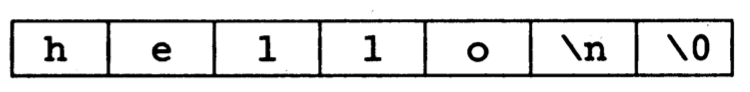

# Introduction

C is a general-purpose programming language.


Many of the important ideas of C stem from the language BCPL, the influence of BCPL on C proceeded indirectly through the language B.

### Type

BCPL and B are "typeless" languages. By contrast, C provides a variety of data types:

- The fundamental types are characters, integers and floating-point numbers of several sizes
- In addition, there is a hierarchy of derived data types created with `pointers`, `arrays`, `structures`, and `unions`.
- Expressions are formed from operators and operands; any expression, including an assignment or a function call, can be a statement. 
  - Pointers provide for machine-independent address arithmetic.	

### Control-flow 

C provides the fundamental control-flow constructions required for well-structured programs:

- statement grouping
- decision making (if-else)
- selecting one of a set of possible cases (switch)
- looping with the termination test at the top (while, for) or at the bottom (do)
- early loop exit (break).

### Function 

Functions may return values of basic types, structures, unions, or pointers.

Any function may be called recursively. 

Local variables are typically "automatic," or created anew with each invocation. 

*Function definitions may not be nested but variables may be declared in a block-structured fashion.???*

The functions of a C program may exist in separate source files that are compiled separately. 

Variables may be: 

- internal to a function
- external but known only within a single source file
- visible to the entire program

  ​		

### Preprocessing

A preprocessing step performs macro substitution on program text, inclusion of other source files, and conditional compilation.

​		
​		

### Relatively "Low level"	

C is a relatively "low level" language. This characterization is not pejorative; it simply means that C deals with the same sort of objects that most computers do, namely characters, numbers, and addresses. These may be combined an moved about with the arithmetic and logical operators implemented by real machines.


- C provides no operations to deal directly with composite objects such as character strings, sets, lists or arrays.


- There are no operations that manipulate an entire `array` or `string`, although `structures` may be copied as a unit.
- The languages does not define any storage allocation facility other than **static definition** and the **stack discipline** provided by the local variables of functions;
- There is no **heap** or **garbage collection**.
- C itself provides no input/output facilities. There are no `READ` or `WRITE` statements, and no built-in file access methods.


*All of these higher-level mechanisms must be provided by* **explicitly-called functions (显示调用的函数).**

Most C implementations have included a reasonably standard collection of such functions.

##### Single-thread control flow

Similarly, C offers only straightforward, single-thread control flow: tests, loops, grouping, and subprograms, but not **multiprogramming (多道程序设计)**, **parallel operations (并行操作)**, **synchronization (同步)**, or **coroutines (协同例程)**.


### benefits for small

*Although the absence of some of these features may seem like a grave deficiency* ("You mean I have to call a function to compare two character strings?"), *keeping the language down to modest size has real benefits.*

- Since C is relatively small, it can be described in a small space, and learned quickly. A programmer can reasonably expect to know and understand and indeed regularly use the entire language.

  ​


# 1. A Totorial Introduction

### 1.1 Getting Started

```c
#include <stdio.h>
int main()
{
    printf("hello, world\n");
}	
```

```c
#include <stdio.h> //tells the compiler to include information about the standard input/output library; This line arrpears at the beginning of many C source files.
int main() //define a function named main, receives no arguments. see Note-001.
{ //the statements fo a function are enclosed in braces {}.
    printf("hello, world\n"); // calls library function printf to print this sequence of character; "\n" represents the newline character. see Note-002.
}
```

> Note-001:
>
> Normally you are at liberty to give functions whatever names you like, but `main` is special — your *program begins executing at the beginning of `main`.* This means that every program must have a `main` some-where.
>
> `main` will usually call other functions to help perform its job, some that you wrote, and others from libraries that are provided for you.

> Note-002:
>
> - A function is called by naming it, followed by a parenthesized list of arguments, so this calls the function `printf` with the argument `"hello, world\n"`. `printf` is a library function that prints output, in this case the string of characters between the quotes.
>
> - A sequence of characters in double quotes, like "hello, world\n", is called a character string or **string constant**.
>
> - `\n`:
>
>   - The sequence `\n` in the string is C notation for the newline character, which when printed advances the output to the left margin on the next line.
>
>   - If you leave out the `\n`, you will find that there is no line advance after the output is printed.
>
>   - You must use `\n` to include a newline character in the printf argument; if you try something like:
>
>     ```C
>     printf("hello, world
>            ");
>     ```
>
>     the C compiler will produce an *error* message.
>
>   - *`printf` never supplies a newline automatically, so several calls may be used to build up an output line in stages.* Our first program could just as well have been written:
>
>     ```C
>     #include <stdio.h>
>     int main()
>     {
>       printf("hello, ");
>       printf("world");
>       printf("\n");
>     }			
>     ```
>
>   - Notice that *`\n` represents only a single character.*
>
>     An **escape sequence (转义序列)** like `\n` provides a general and extensible mechanism for representing hard-to-typeor invisible characters. Among the others that C provides are `\t` for tab, `\b` for backspace, `\n` for the double quote, and `\\` for the backslash itself. Thereis a complete list in Section 2.3.

​			

### 1.2 Variables and Arithmetic Expressions		

The next program is a temperature conversion, uses the formula $^{\circ}C=(5/9)(^{\circ}F-32)$

```c
#include <stdio.h>

/* print Fahrenheit-Celsius table
for fahr = 0, 20, ..., 300 */
int main()
{
	int fahr, celsius;
	int lower, upper, step;

	lower = 0;
	upper = 300;
	step = 20;

	fahr = lower;
	while (fahr <= upper) {
		celsius = 5 * (fahr - 32) / 9;
		printf("%d\t%d\n", fahr, celsius);
		fahr = fahr + step;
	}
}
```

```c
#include <stdio.h>

/* print Fahrenheit-Celsius table
for fahr = 0, 20, ..., 300 */  // this two line are a comment.
int main()
{
	int fahr, celsius;  // In C, all variables must be declared before they are used, usually at the beginning of the function before any executable statements.
	int lower, upper, step; // int means that the variable listed are integers, by contrast with float, which means floating point. See Note-003.

	lower = 0;  // assignment statements, set the variables to their initial values. Individual statements are terminated by semicolons.
	upper = 300;
	step = 20;
	fahr = lower;
  
	while (fahr <= upper) { // while loop, see Note-004.
		celsius = 5 * (fahr - 32) / 9; // see Note-005.
		printf("%d\t%d\n", fahr, celsius);  // see Note-006.
		fahr = fahr + step;
	}
}
```

> Note-003: 
>
> - The range of both `int` and `float` depends on the machine you are using.
>
>   - 16-bit ints, which lie between -32768 and +32767
>   - A float number is typically a 32-bit quantity, with at least six significant digits and magnitude generally between about 10^-38^ and 10^38^.
>
> - C provides several other basic **data types** besides `int` and `float`, including:
>
>   - `char`: character -- a single byte
>   - `short`: short integer
>   - `long`: long integer
>   - `double`: double-precision floating point
>
>   The **size** of these objects are also machine-dependent.
>
>   There are also `arrays`, `structures` and `unions` of these basic types, `pointers` to them, and `functions` that return them, all of which we will meet in due course.

> Note-004
>
> - The body of a `while` can be one or more statements enclosed in braces, as in the temperature converter, or a single statement without braces:
>
>   ```C
>   while (i < j)
>     i = 2*i;
>   ```
>
>   In either case, we will always indent the statements controlled by the `while` by one tab stop so you can see at a glance which statements are inside the loop.

> Note-005
>
> ```C
> celsius = 5 * (fahr - 32) / 9;
> ```
>
> The reason for multiplying by 5 and then dividing by 9 instead of just multiplying by 5/9 is that in C, as in many languages, *integer division* **truncates** *: any fractional part is discarded*.
>
> *Since 5 and 9 are integers, 5/9 would be truncated to zero* and so all the Celsius temperatures would be reported as zero.

> Note-006
>
> `printf` is a general-purpose output formatting function.
>
> - Its first argument is a string of characters to be printed, with *each `%` indicating where one of the other (second, third, ...) arguments is to be substituted, and in what form it is to be printed*. 
> - Each `%` construction and the corresponding argument must match up properly by number and type.
>
> `printf` is not part of the C language; there is no input or output defined in C itself. `printf` is just a useful function from the standard library of functions that are normally accessible to C programs. (ANSI standard)

There are a couple of problems with the temperature conversion program. 

- the output isn't very pretty because the numbers are not *right-justified*. That's easy to fix; if we augment each `%d` in the `printf` statement *with a width*, the numbers printed will be right-justified in their fields. For example:

  ```C
  printf("%3d %6d\n", fahr, celsius);
  ```

- Because we have used integer arithmetic, the Celsius temperatures are not very accurate.

  - *To get more accurate answers, we should use floating-point arithmetic instead of integer.* This requires some changes in the program:

    ```C
    #include <stdio.h>

    /* print Fahrenheit-Celsius table
    for fahr = 0, 20, ..., 300; floating-point version */
    int main()
    {
    	float fahr, celsius;
    	int lower, upper, step;

    	lower = 0;
    	upper = 300;
    	step = 20;

    	fahr = lower;
    	while (fahr <= upper) {
    		celsius = (5.0/9.0) * (fahr - 32.0);
    		printf("%3.0f %6.1f\n", fahr, celsius);
    		fahr = fahr + step;
    	}
    }
    ```

  - In this version, `fahr` and `celsius` are declared to be `float`, and the formula for conversion is written in a more natural way.

  - A decimal point in a constant indicates that it is floating point, *so 5.0/9.0 is not truncated because it is the ratio of two floating-point values.*

    - If an arithmetic operator has integer operands, an integer operation is performed.
    - If an arithmetic operator has one floating-point operand and one integer operand, *the integer will be converted to floating point before the operation is done*. So in this example, we can write `fahr - 32` and the result is still a float-point.
    - Nevertheless, writing floating-point constants with explicit decimal points even when they have integral values emphasizes their floating-point nature for human readers.
    - The detailed rules for when integers are converted to floating point are in Chapter 2, *for now, notice that the assignment `fahr = lower;` and the test `while (fair <= upper)` also convert int to float before the operation is done in this example.*

  - The `printf` conversion specification :

    - *`%3.0f` says that a floating-point number is to be printed at least three characters wide, with no decimal point and no fraction digits*. 
    - *`%6.1f` describes another number that is to be printed at least six characters wide, with 1 digit after the decimal point.*

    *Width and precision may be omitted from a specification*: 

    - *`%6f` says that the number is to be at least six characters wide, but the precision is not constrained.*
    - *`%.2f` specifies two characters after the decimal point, but the width is not constrained.* 
    - `%f` merely says to print the number as floating point.
    - `%o` for octal
    - `%x` for hexadecimal
    - `%c` for character
    - `%s` for character string
    - `%%` for `%` itself.

      ​
      ​


### 1.3 The For statement


```C
#include <stdio.h>

/* print Fahrenheit-Celsius table */
int main()
{
    int fahr;
  	for(fahr = 0; fahr <= 300; fahr = fahr + 20)
      printf("%3d %6.1f\n", fahr, (5.0/9.0)*(fahr-32));
}
```

```C
#include <stdio.h>

/* print Fahrenheit-Celsius table */
int main()
{
    int fahr;
  	for(fahr = 0; fahr <= 300; fahr = fahr + 20)  // See Note-008
      printf("%3d %6.1f\n", fahr, (5.0/9.0)*(fahr-32));  // See Note-007
}
```

> Note-007
>
> **A general rule** — *in any context where it is permissible to use the value of a variable of some type, you can use a more complicated expression of that type*.
>
> - Since the third argument of `printf` must be a floating-point value to match the `%6.1f`, any floating-point expression can occur there.

> Note-008
>
> `for` loop, as with the `while`, the body of the loop can be a single statement, or a group of statements enclosed in braces. The initialization, condition, and increment can be any expressions.
>
> The choice between `while` and `for` is arbitrary, based on which seems clearer.
>
> ​			

### 1.4 Symbolic Constants		

*It's bad practice to bury "magic numbers" like `300` and `20` in a program:* 

- they *convey little information* to someone who might have to read the program later.
- and they are *hard to change* in a systematic way.

*One way to deal with magic numbers is to give them meaningful names*:

##### #define

A **`#define`** line defines a **symbolic name(符号名)** or **symbolic constant(符号常量)** to be a particular string of characters:

```C
#define   name   replacement text
```

Thereafter, any occurrence of `name` will be replaced by the corresponding `replacement text`.

- The `name` has the same form as a variable name; a sequence of letters and digits that begins with a letter.
- The `replacement text` can be any sequence of characters; it is not limited to numbers.

```C
#include <stdio.h>

#define LOWER 0
#define UPPER 300
#define STEP 20

/* print Fahrenheit-Celsius table */
int main()
{
  int fahr;
  
  for (fahr = LOWER; fahr <= UPPER; fahr = fahr + STEP)
    printf("%3d %6.1f\n", fahr, (5.0/9.0)*(fahr-32));
}
```

The quantities `LOWER`, `UPPER` and `STEP` are symbolic constant, not variables, so they do not appear in declarations.

*Symbolic constant names are conventionally written in upper case* so they can be readily distinguished from lower case variable names.

Notice that there is *no semicolon at the end of a `#define` line*.


### 1.5 Character Input and Output

Text input or output, is dealt with as streams of characters.

A **text stream (文本流)** is a sequence of characters divided into lines; each line consists of zero or more characters followed by a newline character.

- It is the responsibility of the library to make each input or output stream conform to this model. The C programmer using the library need not worry about how lines are represented outside the program.


The standard library provides several functions for reading or writing one character at a time, of which **`getchar`** and **`putchar`** are the simplest. 

- Each time it is called, `getchar` reads the next input character from a text stream and returns that as its value. That is, *after*

  ```C
  c = getchar()
  ```

  *the variable `c` contains the next character of input.* The characters normally come from the keyboard; input from files is discussed in Chapter 7.

- The function `putchar` prints a character each time it is called:

  ```C
  int c = 90;
  putchar(c);  // output "Z"
  ```

  *Prints the contents of the **integer variable** `c` as a character usually on the screen*.

  Calls to `putchar` and `printf` may be interleaved; the output will appear in the order in which the call are made.

Given `getchar` and `putchar`, you can write a surprising amount of useful code without knowing anything more about input and output.

##### 1.5.1 File Copying

The simplest example is a program that copies its input to its output one character at a time:

```
read a character
while (character is not end-of-file indicator)
	output the character just read
	read a character
```

Converting this into C gives:

```c
#include <stdio.h>

/* copy input to output; 1st version */
int main()
{
  int c; // 
  
  c = getchar();
  while (c != EOF){ 
    putchar(c);
    c = getchar();
  }
}
```

*What appears to be a character on the keyboard or screen is of course, like everything else, stored internally just as a bit pattern.*

The type `char` is specifically meant for storing such character data, but any integer type can be used. We used `int` for a subtle but important reason:

- *The problem is distinguishing the end of the input from valid data.*
- The solution is that `getchar` returns a distinctive value when there is no more input; a value that cannot be confused with any real character.
- This value is called `EOF`, for "end of file".
- We must declare `c` to be a type big enough to hold any value that `getchar` returns.
- *We can't use `char` since `c` must be big enough to hold `EOF` in addition to any possible `char`. Therefore we use `int`.*
- `EOF` is an integer defined in `<stdio.h>`, but the specific numeric value doesn't matter as long as it is not the same as any `char` value.
- *By using the symbolic constant, we are assured that nothing in the program depends on the specific numeric value.*


​		
The program for copying would be written *more concisely* by experienced C programmers. In C, any assignment, such as

```C
c = getchar();
```

*is an expression and has a value, which is the value of the left hand side after the assignment*.

**This means that an assignment can appear as part of a larger expression**. If the assignment of a character to `c` is put inside the test part of a `while` loop, the copy program can be written this way:

```c
#include <stdio.h>

/* copy input to output; 2nd version */
int main()
{
  int c;
  
  while ((c = getchar()) != EOF)  // assignment will execute, then the value of c will compare with EOF, see Note-009
    putchar(c);
}
```

*The `while` gets a character, assigns it to `c`, and then tests whether the character was the end-of-file signal.*

- if it was not, the body of the `while` is executed, printing the character. The `while` then repeats. When the end of the input is finally reached, the `while` terminates and so does `main`.

This version centralizes the input -- there is now only one reference to `getchar` -- and shrinks the program. The resulting program is more compact, and, once the idiom is mastered, easier to read. You'll see this style often. (It's possible to get carried away and create impenetrable code, however, a tendency that we will try to curb).

> Note-009:
>
> *The parentheses around the assignment within the condition are necessary:*
>
> - *Because the precedence of `!=` is higher than that of `=`.*


##### 1.5.2 Character Counting

```c
#include <stdio.h>
/* count characters in input; 1st version */
int main()
{
  long nc;  // long integers are at least 32bits.
  nc = 0;
  while (getchar() != EOF)
    ++nc; // ++, means increment by one. See Note-010
  printf("%ld\n", nc); // The conversion specification %ld tells printf that the corrsponding argument is a long integer.
}
```

> Note-010:
>
> - Instead write `nc=nc+1`, `++nc` is more concise and often more efficient.
> - There is a corresponding operator `--` to decrement by `1`.
> - The operators `++` and `--` can be either prefix(`++nc`) operators or postfix(`nc++`);
>   - These two forms have different value in expressions
>   - but they both increment `nc`.


It may be possible to cope with even bigger numbers by using a `double`. We will also use a `for` statement instead of a `while`, to illustrate another way to write a loop.

```c
#include <stdio.h>
/* count characters in input; 2nd version */
int main()
{
  double nc;
  for (nc = 0; getchar() != EOF; ++nc)
    ;  // see Note-011
  printf("%.0f\n", nc);  // printf uses %f for both float and double. %.0f suppresses printing of the decimal point and the fraction part, which is zero
}
```

> Note-011:
>
> - The body of this for loop is empty, because all of the work is done in the test and increment parts. 
> - But the grammatical rules of C require that a `for` statement have a body. The isolated semicolon, called a **null statement (空语句)**, is there to satisfy that requirement.
> - We put it on a separate line to make it visible.


Observe that if the input contains no characters, the while or for test fails on the very first call to `getchar`, and the program produces `0`, the right answer. This is important. One of the nice things about `while` and `for` is that they test at the top of the loop, before proceeding with the body. If there is nothing to do, nothing is done, even if that means never going through the loop body. 

Programs should act intelligently when given zero-length input. The `while` and `for` statements help ensure that programs *do reasonable things with boundary conditions*.


##### 1.5.3 Line Counting

```c
#include <stdio.h>
/* count lines in input */
int main()
{
  int c, nl;
  nl = 0;
  while ((c=getchar()) != EOF)
    if (c=='\n')  // see Note-012
      ++nl;
  printf("%d\n", nl);
}
```

> Note-012
>
> - `if` statement tests the parenthesized condition, and if the condition is true, executes the statement (or group of statements in braces) that follows.
> - double equal sign `==` is the C notation for "is equal to". This symbol is used to distinguish the equality test from the single `=` that C uses for assignment.
> - **A character written between single quotes represents an integer value equal to the numerical value of the character in the machine's character set.** This is called a **character constant (字符常量)**, although it is just another way to write a small integer. 
>   - for example: 'A' is a character constant; in the ASCII character set its value is 65, the internal representation of the character A. Of course 'A' is to be preferred over 65: its meaning is obvious, and it is independent of a particular character set.
> - The escape sequences used in string constants are also legal in character constants, so '\n' stands for the value of the newline character, which is 10 in ASCII.
>   - note carefully that '\n' is a single character, and in expressions is just an integer.
>   - On the other hand, '\n' is a string constant that happens to contain only one character.

##### 1.5.4 Word Counting

```c
#include <stdio.h>
#define IN 1 /* inside a word */
#define OUT 0 /* outside a word */

/* count lines, words, and characters in input */
int main()
{
  int c, nl, nw, nc, state;
  
  state = OUT;
  nl = nw = nc = 0;  // sets all three variables to zero
  while ((c=getchar()) != EOF){
    ++nc;
    if(c=='\n'){
        ++nl;
    }
    if(c==' ' || c=='\n' || c=='\t') // see Note-013
      state = OUT;
    else if (state == OUT) {
      state = IN;
      ++nw;
    }
  }
  printf("%d %d %d\n", nl, nw, nc);
}
```

> Note-013
>
> - operator `||` means OR.
>   - It is guaranteed that evaluation will stop as soon as the truth or falsehood is known.
> - and there is a corresponding operator `&&` for AND.
> - Precedence: *`&&` is higher than `||`.*


Exercise 1-12: *练习题初期答案和标准答案之间的对比：*

not optimized:

```C
#include <stdio.h>
#define IN 1 /* inside a word */
#define OUT 0 /* outside a word */
/* prints its input one word per line (not optimized) */
int main()
{
    int c, state, count;
    state = IN;
    count = 0;

    while ((c=getchar()) != EOF){
        if(c==' ' || c=='\t'){
            if(count == 0){
            }else{
             state = OUT;
            }
        }
        else if(c=='\n' && state==IN){
            putchar('\n');
            count = 0;
        }
        else if (state == OUT) {
            state = IN;
            putchar('\n');
            if(c != '\n'){
             putchar(c);
            } else{
             count = 0;
            }  
        }else if(state == IN){
            if(count == 0) {
                count++;
            }
            putchar(c);
        }
    }
}
```

**Optimized**:

```C
#include <stdio.h>
#define IN 1 /* inside a word */
#define OUT 0 /* outside a word */

/* prints its input one word per line (optimized) */
int main()
{
    int c, state;
    state = OUT;
  
    while ((c=getchar()) != EOF){
        if(c==' ' || c=='\t' || c=='\n'){
            if(state==IN){
                putchar('\n');
                state = OUT;
            }
        }
        else if (state == OUT) {
            state = IN;
            putchar(c);
        }else if(state == IN){
            putchar(c);
        }
    }
}
```

*预先的逻辑架构要清晰，才可以得出较为优化的判定结构。*


### 1.6 Arrays

```C
#include <stdio.h>
/* count digits, white space, others */
int main()
{
  int c, i, nwhite, nother;
  int ndigit[10];
  
  nwhite = nother = 0;
  for (i = 0; i < 10; ++i)
    ndigit[i] = 0;
  
  while ((c = getchar()) != EOF)
    if (c >= '0' && c <= '9')
      ++ndigit[c-'0'];
    else if (c == ' ' || c == '\n' || c == '\t')
      ++nwhite;
  	else
      ++nother;
  
  printf("digits = ");
  for (i = 0; i < 10; ++i)
    printf("%d", ndigit[i]);
  printf(", white space = %d, other = %d\n", nwhite, nother);
}
```

```C
#include <stdio.h>
/* count digits, white space, others */
int main()
{
  int c, i, nwhite, nother;
  int ndigit[10];  // declares `ndigit` to be an array of 10 integers. See Note-014
  
  nwhite = nother = 0;
  for (i = 0; i < 10; ++i)
    ndigit[i] = 0;
  
  while ((c = getchar()) != EOF)
    if (c >= '0' && c <= '9')  // See Note-015
      ++ndigit[c-'0'];
    else if (c == ' ' || c == '\n' || c == '\t')
      ++nwhite;
  	else
      ++nother;
  
  printf("digits = ");
  for (i = 0; i < 10; ++i)
    printf("%d", ndigit[i]);
  printf(", white space = %d, other = %d\n", nwhite, nother);
}
```


> Note-014
>
> A subscript can be any integer expression, which includes integer variables like `i`, and integer constants.

> Note-015
>
> This particular program relies on the properties of the character representation of the digits. For example, the test:
>
> ```c
> if (c >= '0' && c <= '9')...
> ```
>
> determines whether the character in `c` is a digit. If it is, the numeric value of that digit is: `c-'0'`.
>
> This works only if '0', '1', …, '9' have consecutive increasing values. Fortunately, this is true for all character sets.

*By definition, `char`s are just small integers, so `char` variables and constants are identical to `int`s in arithmetic expressions*.

This is natural and convenient; for example, `c-'0'` is an integer expression with a value between 0 and 9 corresponding to the character '0' to '9' stored in `c`, and is thus a valid subscript for the array `ndigit`.


*Note: Exercise 1-14 is still not write.???*


### 1.7 Functions

With properly designed functions, it is possible to ignore how a job is done, knowing what is done is sufficient.

For illustration, let's see an example:

```C
#include <stdio.h>

int power(int m, int n);

/* test power function */
int main(){
  int i;
  for (i = 0; i < 10; ++i)
  	printf("%d %d %d\n", i, power(2,i), power(-3,i));
  return 0; 
}
/* power: raise base to n-th power; n>=0 */
int power(int base, int n)
{
  int i,p;
  
  p = 1;
  for (i = 1; i <= n; ++i)
    p = p * base;
  return p;
}
```

A function definition has this form:

```
return-type function-name(parameter declarations, if any)
{
  declarations
  statements
}
```

*Function definitions can appear in any order, and in one source file or several, although no function can be split between files.*

- If the source program appears in several files, you may have to say more to compile and load it than if it all appears in one, but that is an operating system matter, not a language attribute.

For the moment, we will assume that both functions are in the same file, so whatever you have learned about running C programs will still work.


```C
#include <stdio.h>

int power(int m, int n);  // a function prototype, See Note-020

/* test power function */
int main(){
  int i;
  for (i = 0; i < 10; ++i)
  	printf("%d %d %d\n", i, power(2,i), power(-3,i));  // See Note-016
  return 0; // See Note-019
}
/* power: raise base to n-th power; n>=0 */
int power(int base, int n)  // See Note-017
{
  int i,p;
  
  p = 1;
  for (i = 1; i <= n; ++i)
    p = p * base;
  return p; // See Note-018
}
```

> Note-016
>
> Each call passes two arguments to `power`, which each time returns an integer to be formatted and printed.

> Note-017
>
> This line declares the parameter types and names, and the type of the result that the function returns.
>
> The names used by `power` for its parameters are local to `power`, and are not visible to any other function: other routines can use the same names without conflict. This is also true of the variables `i` and `p`: the `i` in `power` is unrelated to the `i` in `main`.
>
> We will generally use **parameter** for a variable named in the parenthesized list in a function definition, and **argument** for the value used in a call of the function. The terms **formal argument** and **actual argument** are sometimes used for the same distinction.

> Note-018
>
> The value that `power` computes is returned to `main` by the `return` statement.
>
> Any expression may follow `return`:
>
> ```
> return expression;
> ```
>
> - A function need not return a value;
>
> - A `return` statement with no expression causes control, but no useful value, to be returned to the caller, as does "falling off the end" of a function by reaching the terminating right brace.
>
>   And the calling function can ignore a value returned by a function.

> Note-019
>
> Since `main` is a function like any other, it may return a value to its caller, which is in effect the environment in which the program was executed.
>
> - *Typically, a return value of zero implies normal termination;*
> - *Non-zero values signal unusual or erroneous termination conditions.*

> Note-020
>
> **Function prototype (函数原型)**:
>
> - the prototype need to *agree with the definition and uses of the same function name*. Otherwise it is an error.
>
> - *Parameter names need not agree*. Indeed, parameter names are *optional* in a function prototype, so for prototype we could have written:
>
>   ```c
>   int power(int, int);
>   ```
>
>   However, *well-chosen names are good documentation, so we will often use them*.
>
> *This (relatively) new syntax of function prototypes makes it much easier for a compiler to detect errors in the number of arguments or their types.*
>
> 

### 1.8 Arguments — *Call by Value*

In C, all function arguments are passed "by value".

- This means that the called function is given the values of its arguments in temporary variables rather than the originals.
- This leads to some different properties than are seen with "call by reference" languages.
- It usually leads to more compact programs with fewer extraneous variables, because parameters can be treated as conveniently initialized local variables in the called routine.
- When necessary, it is possible to arrange for a function to modify a variable in a calling routine. (the argument's value is a *"pointer"*).
- The story is different for arrays. When the name of an array is used as an argument, the value passed to the function is the location or address of the beginning of the array — there is no copying of array elements. By subscripting this value, the function can access and alter any element of the array. (*Same as pointer???*)


### 1.9 Character Arrays

The most common type of array in C is the array of characters.

Example: reads a set of text lines and prints the longest:

```
while (there's another line)
	if (it's longer than the previous longest)
		save it
		save its length
print longest line
```


```C
#include <stdio.h>
#define MAXLINE 1000 /* maximum input line size */

int get_line(char line[], int maxline);
void copy(char to[], char from[]);

/* print longest input line */
int main()
{
  int len;	/* current line length */
  int max;	/* maximum length seen so far */
  char line[MAXLINE];	/* current input line */
  char longest[MAXLINE];	/* longest line saved here */
  
  max = 0;
  while((len=get_line(line, MAXLINE)) > 0)
    if (len > max) { 
      max = len;
      copy(longest, line); //
    }
  if(max > 0)
    printf("%s", longest);
  return 0;  
}

/* get_line: read a line to s, return length */
int get_line(char s[], int lim)
{
  int c, i;
  
  for (i=0; i<lim-1 && (c=getchar())!=EOF && c!='\n'; ++i)
    s[i] = c;
  if (c == '\n'){
    s[i] = c;
    ++i;
  }
  s[i] = '\0';
  return i;
}

/* copy: copy 'from' into 'to'; assume to is big enough */
void copy(char to[], char from[])
{
  int i;
  
  i = 0;
  while((to[i] = from[i]) != '\0')
    ++i;
}
```


```C
#include <stdio.h>
#define MAXLINE 1000 /* maximum input line size */

int get_line(char line[], int maxline); // See Note-021
void copy(char to[], char from[]);

/* print longest input line */
int main()
{
  int len;	/* current line length */
  int max;	/* maximum length seen so far */
  char line[MAXLINE];	/* current input line */
  char longest[MAXLINE];	/* longest line saved here */
  
  max = 0;
  while((len=get_line(line, MAXLINE)) > 0) /* 获取此行长度，如果文件还没结束，执行下述代码 */
    if (len > max) { 
      max = len;
      copy(longest, line); //
    }
  if(max > 0) //已经获取完最大长度的行，如果此行长度大于0，则将其内容打印
    printf("%s", longest); // See Note-022
  return 0;  
}

/* get_line: read a line to s, return length */
int get_line(char s[], int lim) // See Note-021
{
  int c, i;
  
  for (i=0; i<lim-1 && (c=getchar())!=EOF && c!='\n'; ++i)
    s[i] = c;  // put the input character line into s.
  if (c == '\n'){
    s[i] = c;
    ++i;
  }
  s[i] = '\0';  // See Note-022
  return i;
}

/* copy: copy 'from' into 'to'; assume to is big enough */
void copy(char to[], char from[])  // the return type void, which states explicitly that no value is returned.
{
  int i;
  
  i = 0;
  while((to[i] = from[i]) != '\0')
    ++i;
}
```

> Note-021
>
> - the first argument, `s`, is an array.
>   - The purpose of supplying the size of an array in a declaration is to set aside storage.
>   - *The length of the array `s` is not necessary in `getline` since its size is set in `main`.*
> - the second argument, `lim`, is an integer.
> - `getline` uses `return` to send a value back to the caller, just as the function `power` did.
> - this line also declares that `getline` returns an `int`;

>Note-022
>
>`getline` puts the character `'\0'` (the **null** character, whose value is zero) at the end of the array it is creating, to *mark the end of the string of characters*.
>
>**This convention is also used by the C language**:
>
>- *When a string constant like `"hello\n"` appears in a C program, it is stored as an array of character containing the characters of the string and terminated with a `'\0'` to mark the end.*
>
>  
>
>- The `%s` format specification in `printf` expects the corresponding argument to be a string represented in this form.
>
>- `copy` also relies on the fact that its input argument is terminated by `'\0'`, and it copies this character into the output argument. (All of this implies that `'\0'` is not a part of normal text.)

It is worth mentioning in passing that even a program as small as this one presents some sticky design problems.

- For example, what should `main` do if it encounters a line which is bigger than its limit?
- `getline` works safely, in that it stops collecting when the array is full, even if no newline has been seen. By testing the length and the last character returned, `main` can determine whether the line was too long, and the cope as it wishes. In the interests of brevity, we have ignored the issue.
- There is no way for a user of `getline` to know in advance how long an input line might be, so `getline` checks for overflow. On the other hand, the user of `copy` already knows (or can find out) how big the strings are, so we have chosen not to add error checking to it.


### 1.10 External variables and Scope


**External variable:**

- Must be defined exactly once, outside of any function; *this sets aside storage for it.*
- The variable must also be declared in each function that wants to access it; 
  - *this states the type of the variable.*
  - *The declaration may be an explicit `extern` statement or may be implicit from context.*

Example: let us rewrite the longest-line program with `line`, `longest`, and `max` as external variables:

```c
#include <stdio.h>
#define MAXLINE 1000 

int max;
char line[MAXLINE];
char longest[MAXLINE];

int get_line(void);  // void is used for compatibility with older C programs
void copy(void);

/* print longest input line; specialized version */
int main()
{
  int len;
  extern int max;  // See Note-023
  extern char longest[];  // See Note-023
  
  max = 0;
  while((len=get_line()) > 0)
    if (len > max) { 
      max = len;
      copy();
    }
  if(max > 0)
    printf("%s", longest);
  return 0;
}

/* get_line: specialized version */
int get_line(void)
{
  int c, i;
  extern char line[];  // See Note-023
  
  for (i=0; i<MAXLINE-1 && (c=getchar())!=EOF && c!='\n'; ++i)
    line[i] = c;
  if (c == '\n'){
    line[i] = c;
    ++i;
  }
  line[i] = '\0';
  return i;
}

/* copy: specialized version */
void copy(void)
{
  int i;
  extern char line[], longest[];  // See Note-023
  
  i = 0;
  while((longest[i] = line[i]) != '\0')
    ++i;
}
```

> Note-023
>
> - The external variables in `main`, `getline`, and `copy` are defined by the first lines of the example above, which *state their type* and *cause storage to be allocated for them*.
> - *Before a function can use an external variable, the name of the variable must be made known to the function*.
>   - One way to do this is to write an `extern` declaration in the function; the declaration is the same as before except for the added keyword `extern`.
> - *In certain circumstances, the `extern` declaration can be omitted.*
>   - *If the definition of an external variable occurs in the source file before its use in a particular function,* then there is no need for an `extern` declaration in the function.
>   - *So, the `extern` declarations in `main`, `getline` and `copy` are thus redundant.*
>   - *In fact, common practice is to place definitions of all external variables at the beginning og the source file, and then omit all `extern` declarations.*
> - **If the program is in several file**, and a variable is defined in `file1` and used in `file2` and `file3`, **then `extern` declarations are needed** in `file2` and `file3` to connect the occurrences of the variable.
>   - *The usual practice is to collect `extern` declarations of variables and functions in a separate file, historically called a **header**, that is included by `#include` at the front of each source file.* 
>   - *The suffix `.h` is conventional for header names. The functions of the standard library, for example, are declared in headers like `<stdio.h>`.* (discussed at length in Chapter 4).

You should note that we are using the words Definition and declaration carefully when we refer to external variables in this section:

- **Definition**: refers to the place where the variable is created or assigned storage;
- **Declaration**: refers to places where the nature of the variable is stated but no storage is allocated.


# Chapter 2: Types, Operators, and Expressions


### 2.1 Variable Names

Restrictions on the names of variables and symbolic constants:

- Made up of letters and digits.


- the first character must be a letter.
- The underscore `_` counts as a letter;
  - it is sometimes useful for improving the readability fo long variable names.
  - Don't begin variable names with underscore (library routines often use such names.)
- Upper case and lower case are distinct.
- At least the first 31 characters of an internal name are signigicant. 
- For function names and external variables, the number may be less than 31, because external names may be used by assemblers and loaders over which the language has no control.
  - For external names, the standard guarantees uniqueness only for 6 characters and a single case.
- keywords like `if`, `else`, `int`, `float`, etc., are reserved.

It is wise to choose variable names that are related to the purpose of the variable.

### 2.2 Data Types and Sizes

There are only a few basic data types in C:

- `char`: a single byte, capable of holding one character in the local character set.
- `int`: an integer, typically reflecting the natural size of integers on the host machine.
- `float`: single-precision floating point.
- `double`:  double-precision floating point.

In addition, there are a number of qualifiers that can be applied to these basic types: 

- `short` and `long` apply to integers:

  ```C
  short int sh;
  long int counter;
  ```

  The word `int` can be omitted in such declarations, and typically is.

  Each compiler is free to choose appropriate sizes for its own hardware, subject only to the restriction that `short`s and `int`s are at least 16 bits, `long`s are at least 32 bits, and `short` is no longer than `int`, which is no longer than `long`.


- *`signed` or `unsigned` may be applied to `char` or any integer*.
  - `unsigned` numbers are always positive or zero, and obey the laws of arithmetic modulo $2^n$, where `n` is the number of bits in the type.
  - For instance, if `chars` are 8 bits, `unsigned char` variables have values between 0 and 255, while `signed char`s have values between -128 and 127 (in a two's complement machine).
  - Whether plain `char`s are signed or unsigned is machine-dependent, but *printable character are always positive*.
- The type `long double` specifies extended-precision floating point. As with integers, the sizes of floating-point objects are implementation-defined; `float`, `double` and `long double` could represent one, two or three distinct sizes.


*The standard headers `<limits.h>` and `<float.h>` contain symbolic constants for all of these sizes, along with other properties of the machine and compiler.???*

*Exercise 2-1 unfinished???*


### 2.3 Constants

- Int / Long / Unsigned

  - Example: `1234`, `12345L`, `12345l`, `234U`, `234u`

- Floating-point

  - Contain a decimal point: `123.4`

  - Contain exponent: `1e-2`

  - Or both: `1.2e6`

    Type is `double`, unless suffixed.

- hexadecimal / octal

  - Hexadecimal: `0x12`, `0X1d`, `0X1F`, `0XFUL`
  - Octal: `012`

- *Character constant*

  - an integer, written as one character within single quotes, such as `'x'`.


  - *Character constants participate in numeric operations just as any other integers, although they are most often used in comparisons with other character.*

  - Escape sequences:

    These sequences look like two or more characters, but represent only one.

    |      |                        |        |                    |
    | ---- | ---------------------- | ------ | ------------------ |
    | `\a` | Alert (bell) character | `\\`   | Backslash          |
    | `\b` | Backspace              | `\?`   | Question mark      |
    | `\f` | Formfeed               | `\'`   | Single quote       |
    | `\n` | Newline                | `\"`   | double quote       |
    | `\r` | Carriage return        | `\ooo` | Octal number       |
    | `\t` | Horizontal tab         | `\xhh` | Hexadecimal number |
    | `\v` | Vertical tab           | `\0`   | `null`             |

    *The character constant `'\0'` represents the character with value zero, the `null` character.*

    *`'\0'` is often written instead of `0` to emphasize the character nature of some expression, but the numeric value is just `0`.*

- Constant expression

  - an expression  that involves only constants.
  - Such expressions may be evaluated during compilation rather than run-time, and  accordingly may be used in any place that a constant can occur.

- *String constant/ string literal* （字符串常量／字面值）

  - a sequence of zero or more characters surrounded by double quotes: 

    - `"I am a string"`
    - `""` (the empty string)

  - The quotes are not part of the string, but serve only to delimit it. String constants can be concatenated at compile time:

    - `"hello, " "world"` is equivalent to `"hello, world"`

  - *a string constant is an array of characters*.

    - *The intermal representation of a string has a null character `'\0'` at the end*, so the physical storage required is one more than the number of characters written between the quotes.

    - this representation means that there is no limit to how long a string can be, but programs must scan a string completely to determine its length.

    - The standard library function `strlen(s)` returns the length of its character string argument `s`, excluding the terminal `'\0'`:

      ```C
      /* strlen: return length of s */
      int strlen(char s[]){
        int i;
        i = 0;
        while (s[i] != '\0')
          ++i;
        return i;
      }
      ```

      *`strlen` and other string functions are declared in the standard header `<string.h>`.*

  - **Distinguish between a character constant and a string that contains a single character:**

    - `'x'` is not the same as `"x"`.
    - The former is *an integer*;
    - the latter is *an array of characters* that contains on character (the letter `x`) and a `'\0'`.

- **Enumeration constant (枚举常量)**

  - a list of constant integer values:

    ```C
    enum boolean {NO, YES}
    ```

  - the first name in an `enum` has value `0`, the next `1`, and so on, unless explicit values are specified.

  - if not all values are specified, unspecified values continue the progression from the last specified value, as in the second of these examples:

    ```c
    enum escapes {BELL = '\a', BACKSPACE='\b', TAB = '\t', NEWLINE = '\n', VTAB='\v', RETURN = '\r'};
    enum months {JAN = 1, FEB, MAR, APR, MAY, JUN, JUL, AUG, SEP, OCT, NOV, DEC};
    ```

  - *Names in different enumerations must be distinct*. 

  - Enumerations provide a convenient way to associate constant values with names, an alternative to `#define` with the advantage that the values can be generated for you.

    In addition, a debugger may be able to print values of enumeration variables in their symbolic form.

### 2.4 Declarations

- All variables must be declared before use.

- A declaration specifies a type, and contains a list of one or more variables of that type:

  ```C
  int lower, upper, step;
  char c, line[1000];
  ```

- A variable may also be initialized in its declaration:

  ```C
  char esc = '\\';
  int i = 0;
  int limit = MAXLINE+1;
  float eps = 1.0e-5;
  ```

- If the variable is not automatic, the initialization is done once only,  conceptually before the program starts executing, and the *initializer must be a constant expression*.

- An explicitly initialized automatic variable is initialized each time the function or block is entered; the initializer may be any expression.

- if variables are not initialized:

  - External and static variables are *initialized to zero by default*.
  - Automatic variables for which there is no explicit initializer *have undefined values*.

- `const`: can be applied to the declaration of any variable to specify that its value will not be changed.

  - *For an array, the `const` qualifier says that the elements will not be altered*:

    ```c
    const double e = 2.71828182845905;
    const char msg[] = "warning: "
    ```

  - The `const` declaration can also be used with array arguments, to indicate that the function does not change that array:

    ```c
    int strlen(const char[]);
    ```

    The result is *implementation-defined* if an attempt is made to change a `const`.

### 2.5 Arithmetic Operators

- `+`, `-`, `*`, `/`, `%`
- The `%` operator cannot be applied to `float` or `double`.
- *The direction of truncation for `/` and the sign of the result for `%` are machine-dependent for negative operands, as is the action taken on overflow or underflow.*
- Precedence :
  - The binary `+` and `-` operators ahve the same precedence, which is lower than teh precedence of `*`, `/`, and `%`, which is in turn lower than unary `+` and `-`.

### 2.6 Relational and Logical Operators

- Relational operators: `>`, `>=`, `<`, `<=`, `==`, `!=`

  - Have lower precedence than arithmetic operators

- Logical operators: `&&`, `||`

  - Expressions connected by `&&` or `||` are evaluated left to right, and evaluation stops as soon as the truth or falsehood of the result is known. Most C programs rely on these properties.

  - The precedence of `&&` is higher than that of `||`, and both are lower than relational and equality operators, 

  - for example:

    ```C
    i<lim-1 && (c=getchar()) != '\n' && c!= EOF
    ```

    Since the precedence of `!=` is higher than assignment, parentheses are needed.

- *By definition, the numeric value of a relational or logical expression is `1` if the relation is true, and `0` if the relation is false.*

- **The unary negation operator `!` Converts a non-zero operand into `0`, and a zero operand into `1`.** 

  - A common use of `!` is in constructions like:

    ```C
    if(!valid)
    ```

    Rather than

    ```C
    if(valid==0)
    ```

    It's hard to generalize about which form is better.


Exercise 2-2:

```C
for (i=0; testBl != false; ++i){
  s[i]=c;
  testBl = false;
  if(i<lim-1)
      if((c=getchar())!='\n')
        if(c!=EOF)
          testBl = true;
}
```


### 2.7 Type Conversions

When an operator has operands of different types, they are converted to a common type according to a small number of rules:

- In general, the only automatic conversions are those that *convert a "narrower" operand into a "wider" one with out losing information*, such as converting an integer to floating point in an expression like `f + i`.

- Expressions that don't make sense, like using a `float` as a subscript, are disallowed.

- Expression that might lose information, like assigning a longer integer type to a shorter, or a floating-point type to an integer, may draw a warning, but they are not illegal.

- A `char` is just a small integer, so `char` may be freely used in arithmetic expressions. This permits considerable flexibility in certain kinds of character transformations.

  ```C
  /* atoi: convert s to integer */
  int atoi(char s[]){
    int i, n;
    n=0;
    for (i=0; s[i] >= '0' && s[i] <= '9'; i++){
        n=10*n + (s[i]-'0');
    }
    return n;
  }
  /* lower: convert c to lower case; ASCII only*/
  int lower(int c){
      if(c >= 'A' && c<='Z'){
          return c+'a'-'A';
      }else{
          return c;
      }
  }
  ```

  ​

- **The standard header `<ctype.h>`, defines a family of functions that provide tests and conversions that are independent of character set.**

  - `tolower(c)` returns the lower case value of `c` if `c` is upper case, so `tolower` is a portable replacement for the function `lower` shown above.
  - Similarly, `atoi` function can be replaced by `isdigit(c)`.
  - **We will use the `<ctype.h>` functions from now on.** 

- There is one subtle point about the conversion of characters to integers. The language does not specify whether variables of type `char` are signed or unsigned quantities. When a char is converted to an int, can it ever produce a negative integer? *The answer varies from machine to machine, reflecting differences in architecture.*

  - *The definition of C guarantees that any character in the machine's standard printing character set will never be negative, so these characters will always be positive quantities in expressions.* *But arbitrary bit patterns stored in character variables may appear to be negative on some machines, yet positive on others.* **For portability, specify `signed` or `unsigned` if non-character data is to be stored in `char` variables.**

- Relational expressions like `i > j` and logical expressions connected by `&&` and `||` are defined to have value `1` if true, and `0` if false.

  - However, functions like `isdigit` may return any non-zero value for true.
  - In the set part of `if`, `while`, `for`, etc., `true` just means "non-zero", so this makes no difference.

- Implicit arithmetic conversion:

  - In general, if an operator like `+` or `*` that takes two operands (a binary operator) has operands of different types, the "lower" type is promoted to the "higher" type before the operation proceeds. The result is of the higher type. *Section 6 of Appendix A states the conversion rules precisely*.
  - If there are no `unsigned` operands, the following informal set of rules will suffice:
    - If either operand is `long double`, convert the other to `long double`.
    - Otherwise, if either operand is `double`, convert the other to `double`.
    - Otherwise, if either operand is `float`, convert the other to `float`.
    - Otherwise, convert `char` and `short` to `int`.
    - Then, if either operand is `long`, convert the other to `long`.
  - *Notice that `float`s in an expression are not automatically converted to `double`.* This is a change from the original definition.
    - In general, mathematical functions like those in `<math.h>` will be use double precision.
    - The main reason for using `float` is to save storage in large arrays, or, less often, to save time on machines where double-precision arithmetic is particularly expensive.
  - When `unsigned` operands are involved, conversion rules are more complicated:
    - The problem is that comparisons between signed and unsigned values are machine-dependent, because they depend on the sizes of the various integer types.
    - For example, suppose that `int` is 16 bits and `long` is 32 bits. Then `-1L < 1U`, because `1U`, which is an `int`, is promoted to a `signed long`. But `-1L > 1UL`, because `-1L` is promoted to `unsigned long` and thus appears ot be a large positive number. 

- Conversions take place across assignments; the value of the right side is converted to the type of the left, which is the type of the result.

- A character is converted to an integer, either by sign extension or not.

- Longer integers are converted to shorter ones or to `char`s by dropping the excess high-order bits.

- if `x` is `float`, and `i` is `int`, then `x=i` and `i=x` both cause conversions; `float` to `int` causes truncation of any fractional part.

- When `double` is converted to `float`, whether the value is rounded or truncated is implementation-dependent.

- Since an argument of a function call is an expression, type conversions also take place when arguments are passed to functions.

  - In the absence of a function prototype, `char` and `short` become `int`, and `float` becomes `double`. *This is why we have declared function arguments to be `int` and `double` even when the function is called with `char` and `float`.* 

  - Finally, explicit type conversions can be forced in any expression, with a unary operator called a **cast**(强制类型转换). In the construction:

    ```
    (type-name) expression
    ```

    the `expression` is converted to the named type by the conversion rules above.

    For example:

    ```c
    sqrt((double) n);
    ```

    This will convert the value of `n` to `double` before passing it to `sqrt`.

    The precise meaning of a cast is as if the expression were assigned to a variable of the specified type, which is then used in place of the whole construction.

  - If arguments are declared by a function prototype, as they normally should be, the declaration causes automatic coercion of any arguments when the function is called.

    Thus, given a function prototype for `sqrt`:

    ```C
    double sqrt(double);
    ```

    the call

    ```c
    root2 = sqrt(2);
    ```

    Coerces the integer 2 into the `double` value `2.0` without any need for a cast.

  - The standard library includes a portable implementation of a pseudo-random number generator and a function for initializing the seed; the former illustrates a cast:

    ```C
    unsigned long int next = 1;
    /* rand: return pseudo-random integer on 0-32767 */
    int rand(void){
      next = next * 1103515245 + 12345;
      return (unsigned int)(next/65536)%32768;
    }

    /* srand: set seed for rand() */
    void srand(unsigned int seed)
    {
      next = seed;
    }
    ```

- ​


  			
  	
  	


