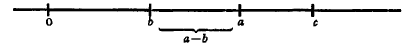
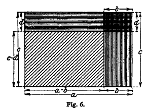

# Arithmetic

## I. Calculating with Natural Numbers

### 1.1 fundamental laws of reckoning

**Five fundamental laws of addition**:

1. $a+b$ is always again a number

   (Addition is always possible, in contrast to subtraction, which is not always possible in the domain of positive integers.)

2.  $a+b$ is one-valued.

3. The associative law: $(a+b)+c=a+(b+c)$

4. the commutative law: $a+b=b+a$

5. The monotonic law: $if\; b>c,\;then\;a+b>a+c$

**Five laws of multiplication**:

1. $a\cdot b$ is always a number.
2. $a\cdot b$ is one-valued.
3. Assciative law: $a \cdot (b \cdot c) = (a \cdot b) \cdot c$ 
4. Commutative law: $a \cdot b = b \cdot a$
5. Monotonic law: $if\; b>c,\;then\;a \cdot b>a \cdot c$

Multiplication together with addition obeys also the **Distributive law**:

$a \cdot (b+c) = a \cdot b + a \cdot c$

All elementary reckoning can be based upon these eleven laws.

*Ordinary reckoning with integers consists in repeated use of the eleven fundamental laws together with the memorized results of the addition and multiplication.*

### 2.1 Logical Foundations of Operations with Integers

How does one justify the above-mentioned fundamental laws, how does one account for the notion of number at all?

So far as the notion of number is concerned, it is very difficult to discover its origin.

##### 2.1.1 Intuitive(直觉) view:

**Theorem of mathematical induction**: If a theorem holds for small numbers, and if an assumption of its validity for a number n always insures its validity for n+1, then it holds generally for every number.

This theorem is an *intuitive* truth, carries us over the boundary where sense perception fails.

If we would realize teh significance of this question as the the source of the validity of our eleven fundamental rules of reckoning, we should remember that, mathematics as a whole rests ultimately upon them.

*The security of entire structure of mathmatics rests upon intuition, where this word is to be understood in its most general sense.*

##### 2.1.2 Point Set(点集) view:

*The properties of integers and of operations with them are to be deduced from the general properties and abstract relations of point sets.*

##### 2.1.3 Purely formal theory of numbers(数的纯形式理论) view:

Once one has the eleven fundamental rules of reckoning, one can operate with the letters a, b, c, …, be things devoid of meaning, or things of whose meaning we know nothing; let us agree only that one may combine them according to those eleven rules, but that these combinations need not have any real known meaning.

Only the question arises here:

*Whether these operations could lead one to contradictions?*

## II. The First Extension of the Notion of Number

Extension of the number concept:

- Introduction of **fractions** and operations with fractions.
- Treatment of **negative numbers**
- More or less complete presentation of the notion of **irrational numbers** by examples that arise upon different occasions, which leads to the notion of the **continuum of real numbers (实数连续统)**.

### 2.1 Negative Numbers

The creation of negative numbers is motivated by the demand that:

- *the operation of subtraction shall be possible in all cases.*

Here, for the first time, we meet the transition from concrete to formal mathematics.

When negative numbers are introduced:

- *addition and subtraction coalesce*.

  The new operation of addition (including subtraction) in the domain of positive and negative numbers the five formal laws stated before hold without change. 

- The chief point in the multiplication of positive and negative numbers is the *rule of signs*:

  *The absolute value of a product is equal to the product of the absolute values of the factors; its sign is positive or negative according as an even or an odd number of factors is negative.*

  With this convention, multiplication in the domain of positive and negative numbers has again the following properties:

  1. Always possible.
  2. Unique.
  3. Associative.
  4. Commutative.
  5. Distributive with respect to addition.???

  There is a change only in the monotonic law:

  6. If $a>b$ then:
     - if $c>0$, then $a \cdot c > b \cdot c$;
     - if $c<0$, then $a \cdot c<b \cdot c$;

*Again, whether these laws, considered again purely formally, are consistent?*

- A purely logical proof of consistency is as yet much less possible here than it is in the case of integers.

- Only a reduction is possible, in the sense that the present laws are consistent if the laws for integers are consistent.

- But until this had been completed by a logical consistency proof for integers, one will have to hold that *the consistency of our laws is based solely on the fact that there are intuitive things, with intuitive relations, which obey these laws.*

- From the present point of view, we have the so called **parenthesis rules** for operations with positive numbers, which are, of course, contained in our fundamental formulas, provided one includes the corresponding laws for subtraction. In order to show the possibility of extremely simple intuitive proofs for them, let see two examples:

  1. Given $a>b$ and $c>a$, where a, b, c are positive. Then $a-b$ is a positive number and is smaller than c, that is, $c-(a-b)$ must exist as a positive number.

     Now, You can easily use axis of abscissas to prove that $c-(a-b)=c-a+b$ `[1]`:

     

  2. Given $a>b$ and $c>d$; then $a-b$ and $c-d$ are positive integers. We wish to examine the product $(a-b) \cdot (c-d)$; for that purpose, draw the rectangle with sides $a-b$ and $c-d$ whose area is the number sought, $(a-b) \cdot (c-d)$, and which is part of the rectangle with sides a and c.

     Then, we also can easily prove that: $(a-b)(c-d)=ac-ad-bc+bd$ `[2]`.

     

  **We are involuntarily inclined to employ rules under circumstances more general than are warranted by the special cases under which the rules were derived and have validity.**

  - For the particular case of transition to negative numbers, the above principle would declare that *one desired to forget, in formulas like `[1]` and `[2]` the expressed assumptions as to the relative magnitude of `a` and `b` and to employ them in other cases*. 
  - If one applies `[2]`, for example, to $a=c=0$, *for which the formulas were not proved at all*, one obtains $(-b) \cdot (-c)=+bd$, **the sign rule for multiplication of negative numbers**. *（这个符号法则的得出，并没有严格遵守前述公式的前提条件，因此并没有得到证明）*
  - In this manner we may derive, in fact almost unconsciously, all the rules, which we must now designate, following the same line of thought, as almost necessary assumptions, necessary insofar as one would have validity of the old rules for the new concepts.
  - *负数的性质（符号法则），是通过某种一般性假设得出的，无法严谨得到证明。目前看来，与其说需要证明，不如说需要保证其与前述自然数法则的逻辑相容性(即逻辑上是否允许这个法则)。* 
  - **the rule of signs is not susceptible of proof; one can only be concerned with recognizing the logical permissibility of the rule**，at the same time, that it is arbitrary, and regulated by considerations of expedience, such as the principle of permanence.
  - *The function of pure logic, when it comes to setting up new concepts, is only to regulate and never to act as the sole guiding principle; for there will always be many other conceptual systems which satisfy the single demand of logic, namely, freedom from contradiction.*
  - 个人感想：*有些基础公式，无法得到直接证明，是一种约定俗成（假设），在这种约定的形成中，最重要的是整个数学体系的逻辑一致性和实用性。*
  - These formal conventions, suggested by the principle of permanence, are appropriate in that they yield a uniformly convenient algorithm, whereas every other convention would always compel the consideration of numerous special cases.

### 2.2 Fractions

We have passed from the *number* of things to their *measure*, from the consideration of *countable things to measureable things*.

- Weber-Wellstein: 
  - The fraction $a/b$ is a symbol, a "number-pair" with which one can operate according to certain rules.
- Burkhardt:
  - Fraction $a/b$ is a sequence of two operations in the domain of integers; a multiplication by `a` and a division by `b`, 

### 2.3 Irrational Numbers

Historically, the origin of the concept of irrational numbers lies certainly in geometric intuition and in the requirements of geometry.

The set of rational points is *dense* on the axis of abscissas, but there are *still other points on it*.

Irrational number: can't be expressed by the ratio of two whole numbers.

The general idea of the irrational number appeared first at the end of the sixteenth century as a consequence of the introduction of *decimal fractions(十进制小数)*, the use of which became established at that time in connection with the appearance of logarithmic tables(对数表).

- if we transform a rational number into a decimal, we may obtain infinite decimals, as well as finite decimals, but they will always be periodic.
- Now there is nothing to prevent our thinking of a aperiodic decimal whose digits proceed according to any definite law whatever, and anyone would instinctively consider it as a definite, and hence a non-rational, number.
- By this means the general notion of irrational number is established.
- It arose to a certain extent automatically, by the consideration of decimal fractions.
- Thus, historically, the same thing happened with negative numbers. *Calculation forced the introduction of the new concepts*, and without being concerned much as to their nature or their motivation, one operated with them, the more particularly since they often proved to be extremely useful. 

It was not until the sixth decade of the nineteenth century that the need was felt for a more precise arithmetic formulation of the foundations of irrational numbers.

- If `r` is any rational number, it separates the totality of rational numbers into two parts `A` and `B` such that every number in A is smaller than any number in B, and every rational number belongs to one of these two calsses.
  - A is the totality of all rational numbers which are smaller than `r`, B those that are larger, whereby `r` itself may be thought of indifferently as belonging to the one or to the other.
  - Besides these "proper cuts" there are also "improper cuts", these being separations of all rational numbers into two classes having the same properties except that they are not brought about by a rational number, separations such that there is neither a smallest rational number in B nor a largest in A. For example: $\sqrt{2}=1.414…$ . 

*A cut in the domain of rational numbers is called a rational number or an irrational number according as the cut is proper or improper.*

A definition of equality follows from this at once: Two numbers are said to be equal if they yield the same cut in the domain of rational numbers.

- From this definition we can immediately prove for example: that $\frac{1}{3}$ is equal to the infinite decimal 0.3333….

*Two numbers are called equal if they differ by less than any preassigned constant, however small.* (So 0.9999… is equal to 1).

After establishing arithmetic theory for irrational numbers, how can we pass to the applications in other fields.

- This applies in particular, to analytic geometry, which to the naive perception appears to be the source of irrational numbers.

- If we think of the axis of abscissa, with the origin and also the rational points marked on it. Then, these applications depend upon the following fundamental principle:

  **Corresponding to every rational or irrational number there is a point which has this number as abscissa and , conversely, corresponding to every point on the line there is a rational or an irrational number.**

- Such a fundamental principle, which stands at the head of a branch of knowledge, and from which all that follows is logically deduced, *while itself cannot be logically proved*, may properly be called an **axiom (公理)**. 

- Such an axiom will appear intuitively obvious or will be accepted as a more or less arbitrary convention, by each person according to his gifts.

**Mathematics of approximation** vs **Mathematics of precision**

- Explain the difference by an interpretation of the equation $f(x)=0$: 
  - In the mathematics of approximation, just as in our empirical space perception, one is not concerned that $f(x)$ should be exactly zero, but *merely that its absolute value $|f(x)|$ should remain below the attainable threshold of exactness `ε`. The symbol $f(x)=0$ is merely an abbreviation for the inequality $|f(x)|<ε$ ,* with which one is really concerned.
  - *It is only in the mathematics of percision that one insists that the equation $f(x)=0$ be exactly satisfied*.
- Since mathematics of approximation alone plays a role in applications, one might say, somewhat crassly, that one needs only this branch of mathematics, whereas the mathematics of precision exists only for the intellectual pleasure of those who busy themselves with it, and to give valuable and indeed indispensable support for the development of mathematics of approximation.

*Concept of irrational number belongs certainly only to mathematics of precision*. 

## III. Concerning Special Properties of Integers

This chapter devoted ot the actual theory of integers, to the theory of numbers, or arithmetic in its narrower sense.

1. The first problem of the theory of numbers is that of **divisibility**: Is one number divisible by another or not?

2. Simple rules can be given which enable us easily to decide as to the divisibility of any given number by smaller numbers, such as 2, 3, 4, 5, 9, 11, etc.

3. There are infinitely many prime numbers, that is, numbers which have no integral divisors except one and themselves: 2, 3, 4, 5, 9, 11, etc.

4. *We are in control of all of the properties of given integers if we know their decomposition into prime factors*.

5. In *the transformation of rational fractions into decimal fractions* **the theory of numbers (数论)** plays an important role; It shows why the decimal fraction must be periodic and how large the period is.

6. **Continued fractions (连分数)**.

7. **Diophantine equations (丢番图方程)**.

8. **The problem of dividing the circle into equal parts (圆的等份问题)** is closely related to the theory of numbers.

9. The higher theory of numbers is touched, when **π** is calculated, during the study of the quadrature of the circle.

   - We usually determine the first decimal places for π, by some method or other

   - *The modern proof of the transcendence of π which sets at rest the old problem of the quadrature of the circle with ruler and compasses.*

   - *The number π does not satisfy any algebraic equation with integral coefficients:*

     $$aπ^{n}+aπ^{n-1}+…+kπ + 1=0$$.

     It is especially important that the codfficients be integers, and it is for this reason that the problem belongs to the theory of numbers.

   - Of course here, again, one is concerned solely with a problem of the mathematics of precision, because it is only in this sense that the number-theoretic character of π has any significance. (The mathematics of approximation is satisfied with the determination of the first few decimals, which permit us to effect the quadrature of the circle with any desired degree of exactness).

The theory of numbers would be made more accessible, and would awaken more general interest, if it were presented in connection with graphical elements and appropriate figures.

**proof of the existence of infinitely many prime numbers**:

- Assuming that the sequence of prime numbers is finite, let it be 1, 2, 3, 5, … , p;
- then the number $N=(1\cdot2\cdot3\cdot5…p)-1$ is not divisible by any of the numbers $2, 3, 5, …, p$ since there is always the remainder $1$.
- Hence $N$ must either itself be a prime number or there are prime numbers larger than $p$.
- Either of these alternatives contradicts the hypothesis, and the proof is complete.

For the fifth point — the transformation of ordinary fractions into decimal fractions:

- Let us consider the fraction $\frac{1}{p}$, where $p$ is a prime number different from $2$ and $5$. We shall show that:

  - $\frac{1}{p}$ is equal to an infinite periodic decimal, and that the number $δ$ of places in the period is the smallest exponent of which $10^{δ}$ , when divided by $p$, leaves $1$ as a remainder, or that, in the language of number theory, $δ$ is the smallest exponent which satisfies the "congruence":

    $$10^δ\equiv1(modp)$$.

- Proof:

  - The proof requires, in the first place, the knowledge that this congruence always has a solution.

  - This is supplied by the **theorem of Fermat (费马定理)**, which states that for every prime number $p$ except $2$ and $5$:

    $$10^{p-1}\equiv1(modp)$$.

  - ​

