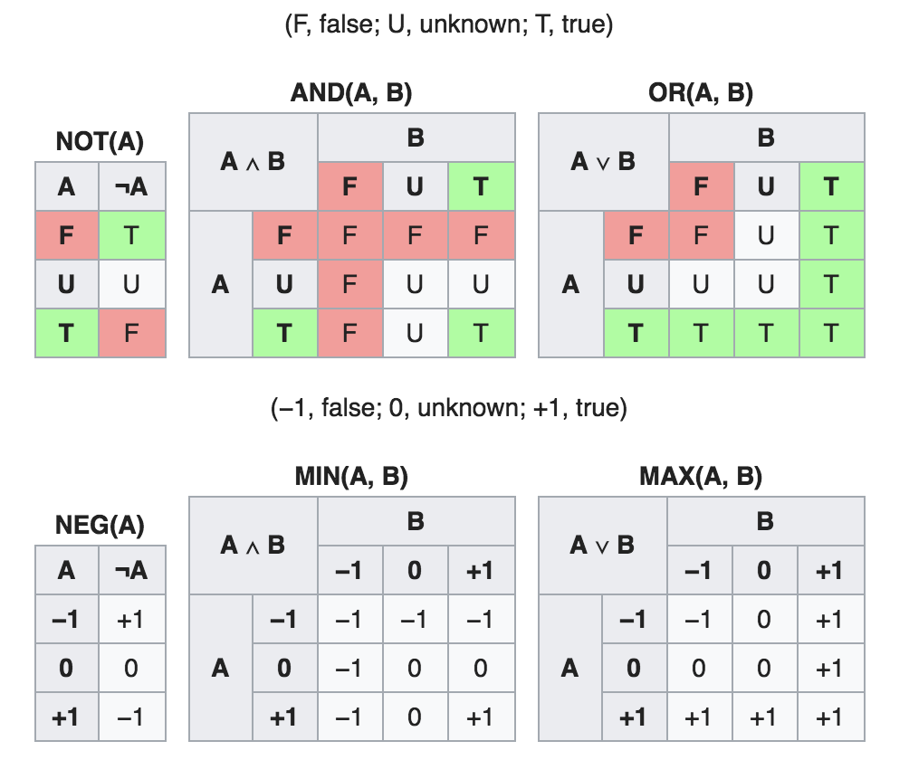

### 0的作用

- 占位：在按位计数法中，0可以起占位的作用。

- 简化规则：0在一些情况下可以简化规则，这个作用很重要。

  - 表示指数时，我们使用$10^0$来表示1，因此将按位计数法的各个位数表示统一成了$10^n$，而不必单独处理$1$这个数字：

    $$a_n\times10^n+a_{n-1}\times10^{n-1}+…+a_2\times10^2+a_1\times10^1+a_0\times10^0$$

    通过用0表示“没有”，而将规则简单化、规律化，有助于创造更简洁的解决方案。这种简化思路，在平时解决问题中有很多应用。

### 将大问题分解为小的单元

人类的直观理解能力有限，很多时候无法直接解决过于复杂的问题。借助方法工具，可以提升认知能力。

**因为不擅长，催生出了智慧。**

1. 通过找出更好的方法，我们可以将问题简化，让问题更容易理解。例如：
   - 按位计数法的发明，让人们可以理解和运算更大的数字。如果没有发明这种巧妙的表达形式，以我们的对数字的直观认知能力，很难进行大数的复杂运算。
   - 在现代社会，实际应用的数字大到了一定程度，以至于按位计数法也难以满足需求。比如，1000000000000和10000000000000这两个数，我们很难一眼看出谁大谁小。但由于我们有了指数表达法，$10^{12}$和$10^{13}$，我们就可以立即分辨出大小。这种更巧妙的表示方式，提高了我们解决数字问题的能力。
2. 此外，还可以通过对问题进行抽象化分层，而将问题分解成小的单元，从而逐一解决。这个想法也很重要，利于解决复杂工程问题。

### 逻辑

- 对边界值的判断，需要仔细对待。注意完整性和排他性。

- **德·摩根定律 (De Morgan's laws)**： 

  - ${\displaystyle \neg \left(p\wedge q\right)\equiv \left(\neg p\right)\vee \left(\neg q\right)}$
  - ${\displaystyle \neg \left(p\vee q\right)\equiv \left(\neg p\right)\wedge \left(\neg q\right)}$

- **卡诺图 (Karnaugh Map)**: 用于简化逻辑表达式，设计逻辑电路。

- **三值逻辑**：

  - 真值表：

    

  - 三值逻辑也符合德·摩根定律。

### 余数 — 分组

- **余数的周期性和分组**效果，可以简化许多问题的计算。
  - 例如，$10^{100}$天后是星期几？
- **奇偶校验**
  - 例：七桥问题

> 当问题的数字比较复杂时，我们可以从较小的数字开始尝试，找到其中的规律。

### 数学归纳法 — 两个步骤证明无穷

- **数学归纳法**
- **循环不变式**：数学归纳法在编程中的应用实例。

### 排列组合

- **容斥原理 The Principle of Inclusion and Exclusion**
- **阶乘**
- **置换**
  - $P^n_n = n \times (n-1) \times (n-2) \times … \times 1 = n!$
- **排列**
  - $P^k_n = n \times (n-1) \times (n-2) \times … \times (n-k+1) = \frac {n!}{n-k!}$
- **组合**
  - $C^k_n = \frac {P^k_n}{P^k_k}= \frac {n!}{(n-k!)k!}$

### 递归

- 递归和归纳，都是将复杂问题简单化的方法。

- **汉诺塔**

- **斐波那契数列**

- **帕斯卡三角形**

  - 与组合数相关。由此可以得出**组合数的递归定义**：

    - $C^k_n = C^{k-1}_{n-1} + C^{k}_{n-1}$ (if $0 < k < n$.) 

    - $C^k_n = 1$ (if $k = 0$ or $k=n$.) 

      > (这个定义包含的含义，需要理解) 第n张牌作为特定牌a，$C^k_n$ 可以分为包含a的选择和不包含a的选择。包含a的情况下，组合数为$ C^{k-1}_{n-1}$ ； 不包含a的情况下：组合数为$C^{k}_{n-1}$. 因此，$C^k_n = C^{k-1}_{n-1} + C^{k}_{n-1}$

- **谢尔平斯基三角形**

- **分形图**

### 指数爆炸

- **二分法查找（binary search）**
- **对数**： 处理庞大数字的工具
  - 用对数图表来应对表示指数爆炸的情况
- **密码**：利用指数爆炸来加密
- 处理指数爆炸的问题：
  - 极力求解
  - 变相求解
  - 近似求解
  - 概率求解
- 指数爆炸的问题，解决起来非常有难度。同时，也可以利用指数爆炸的性质，巧妙解决一些复杂问题。

### 不可解问题

- **反证法**

- **可数**

  - **可数集合**，其元素可按一定规律，既无“遗漏”也无“重复”地数出来。（可以理解为，元素可以与1以上的整数一一对应的集合）。
    - 有限集合
    - 0以上所有偶数的集合
    - 所有有理数的集合
    - *所有程序的集合*：编写程序所用的字符种类有限，可以按照一定规律排列。
  - **不可数集合**
    - 所有“整数数列”的集合
    - 所有实数的集合
    - *所有函数的集合*

- **对角论证法**：可以用于论证不可数集合。

  ​

- **不可解问题**：原则上不能用程序来解决的问题。

  - *存在不可解问题： 所有函数的集合是不可数集合，而所有程序的集合是可数集合，无法形成一一对应关系，因此存在程序所表达不了的函数。*
  - **停机问题(Halting Problem)**: 判断“程序在给定数据下，是否会在有限时间内结束运行”的问题。

